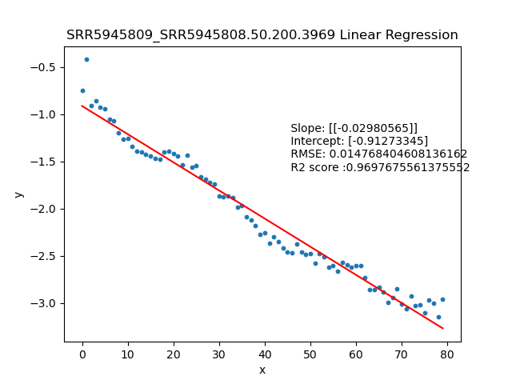

====================================================
**A case study: SRR5945809 over SRR5945808** 
===================================================

.. image:: SRR5945809_SRR5945808.50.0.14732.LR.png 
   :width: 20%

.. image:: SRR5945809_SRR5945808.50.100.4740.LR.png  
   :width: 20% 

.. image:: SRR5945809_SRR5945808.50.100.4740.LR.png 
   :width: 20%

.. image:: SRR5945809_SRR5945808.50.150.4311.LR.png  
   :width: 20%

.. raw:: html
    

