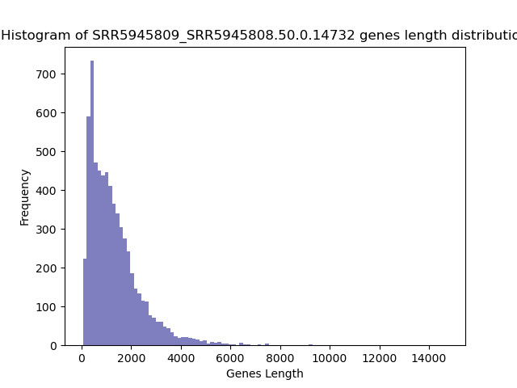
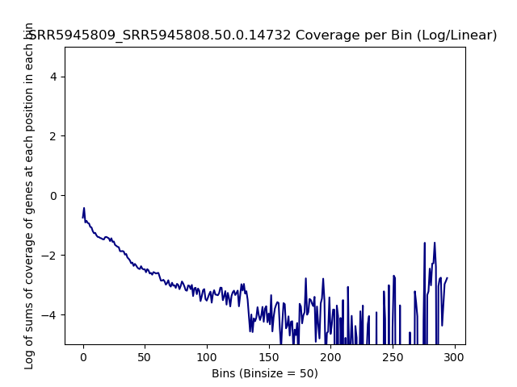
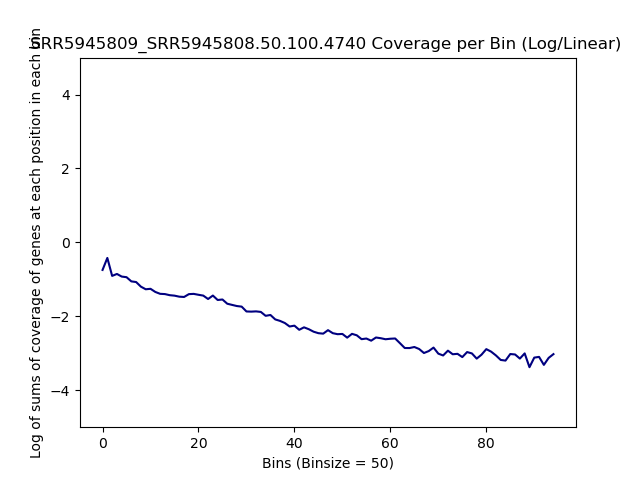
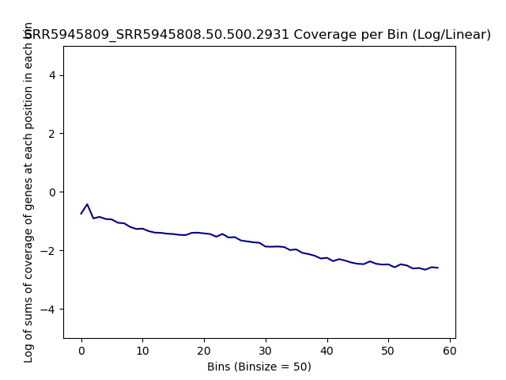
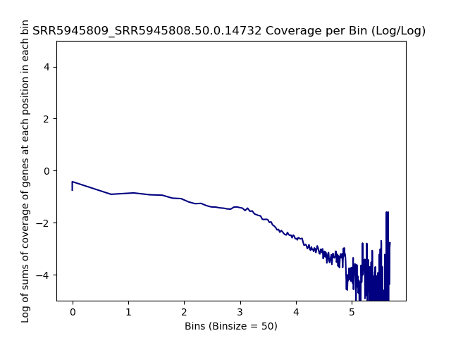
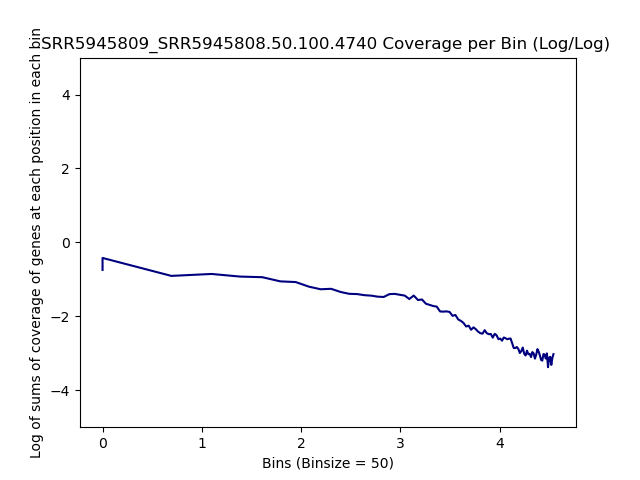
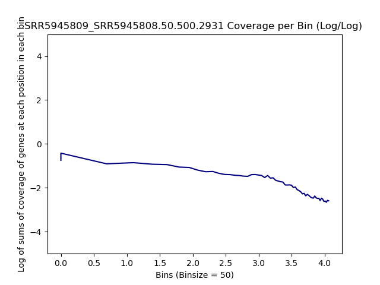
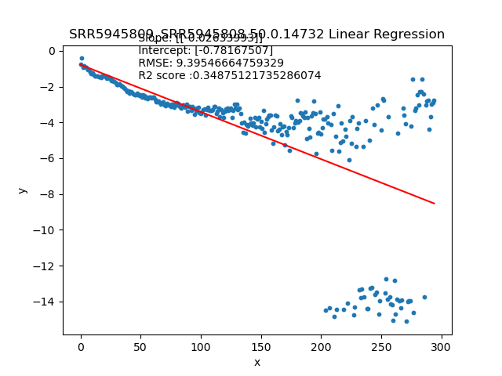
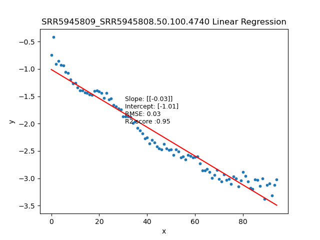
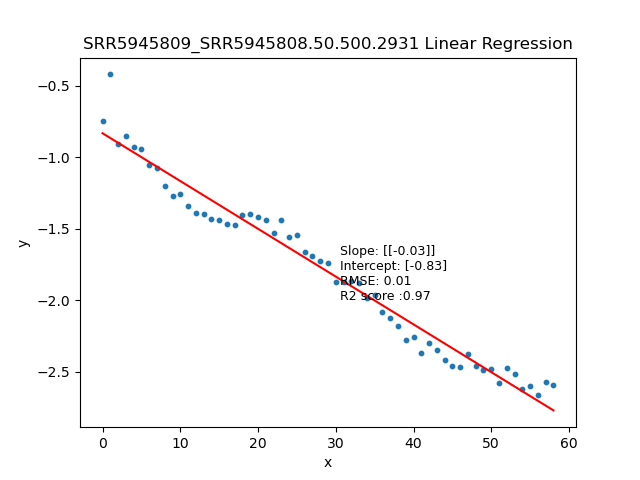

====================================================
**SRR5945809 over SRR5945808** 
===================================================

Histogram of Genes' Length 
###############################

.. raw:: html
    

Log Linear Plots 
###################

.. raw:: html
    

Log Log Plots 
###################

.. raw:: html
    

Linear Regression 
###################

.. raw:: html
    

