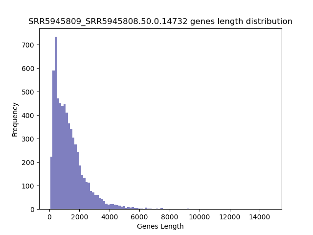

====================================================
**Case Studies**
===================================================

SRR5945809 over SRR5945808 
-------------------------------

Histogram of Genes' Length 
###############################

.. raw:: html
    

Log Linear Plots 
###################

.. image:: SRR5945809_SRR5945808.50.0.14732.LogLinear.png 
   :width: 33.3%
   :alt: Cutoff = 0 

.. image:: SRR5945809_SRR5945808.50.100.4740.LogLinear.png  
   :width: 33.3% 
   :alt: Cutoff =100 

.. image:: SRR5945809_SRR5945808.50.500.2931.LogLinear.png
   :width: 33.3%
   :alt: Cutoff = 500 
.. raw:: html
    

Log Log Plots 
###################

.. image:: SRR5945809_SRR5945808.50.100.4740.LogLog.png  
   :width: 33.3%  
   :alt: Cutoff = 100

.. image:: SRR5945809_SRR5945808.50.500.2931.LogLog.png
   :width: 33.3%
   :alt: Cutoff = 500

.. raw:: html
    

Linear Regression 
###################

.. image:: SRR5945809_SRR5945808.50.0.14732.LR.png 
   :width: 33.3%
   :alt: Cutoff = 0 

.. image:: SRR5945809_SRR5945808.50.500.2931.LR.png
   :width: 33.3%
   :alt: Cutoff = 500 

.. raw:: html
    

