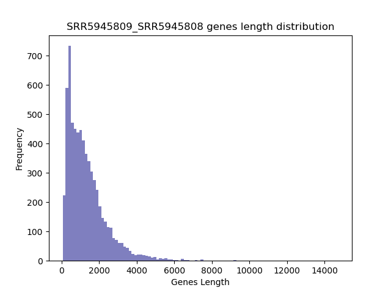
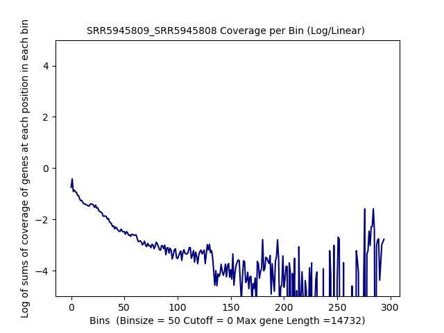
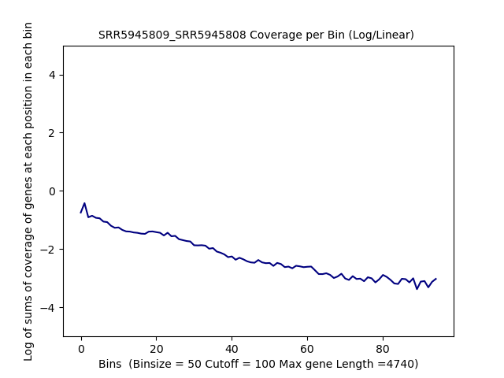
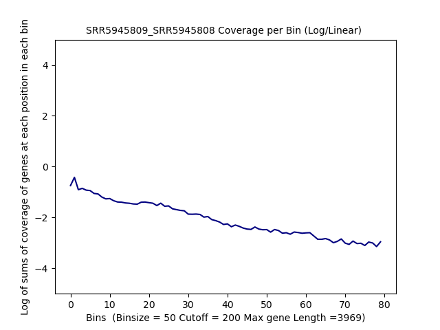
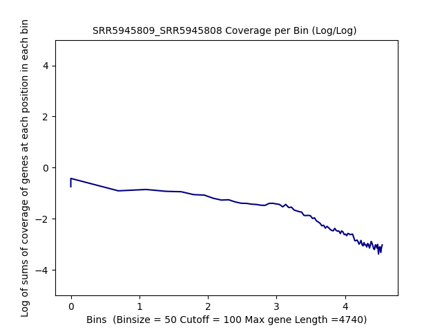
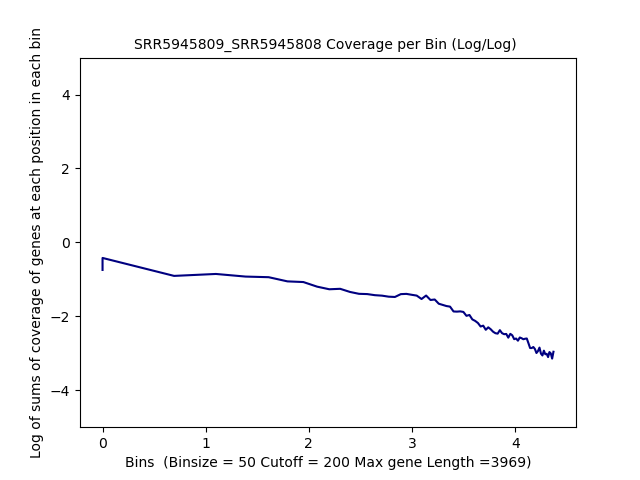
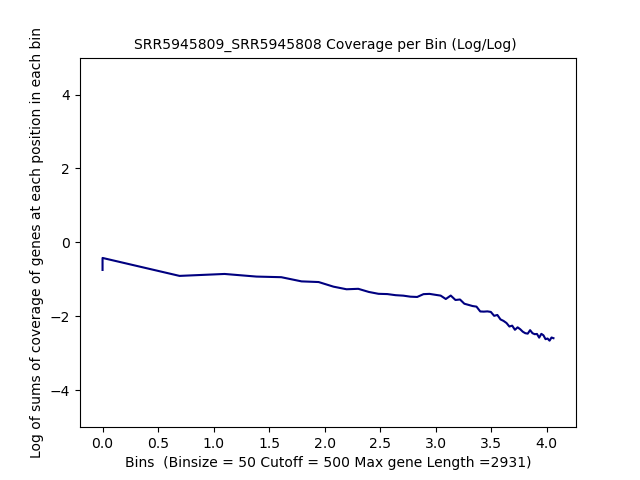
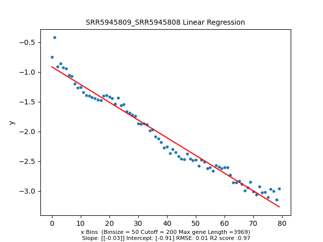
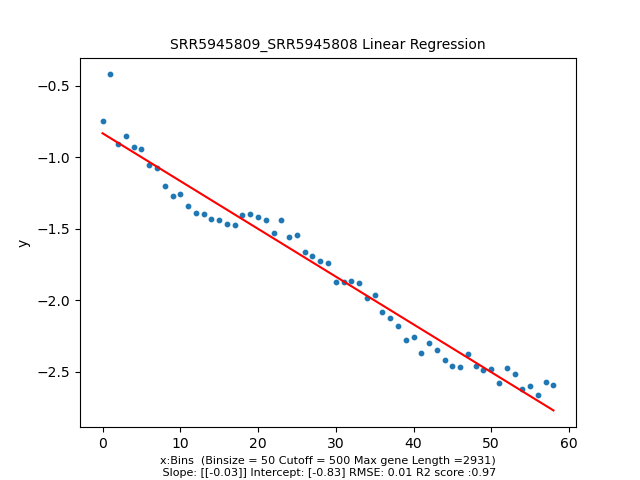

====================================================
**Case Studies**
===================================================

SRR5945809/SRR5945808 
-------------------------------

Histogram of Genes' Length 
###############################

.. raw:: html
    

Log Linear Plots 
###################

Where cutoff is the minimum no. of genes to support a position to be considered in bins. Max gene length is the longest gene considered corresponding to this cutoff. 

.. image:: SRR5945809_SRR5945808_50_500.LogLinear.png
   :width: 25%
.. raw:: html
    

Log Log Plots 
###################

.. raw:: html
    

Linear Regression 
###################

.. image:: SRR5945809_SRR5945808_50_0.LR.png 
   :width: 25%

.. image:: SRR5945809_SRR5945808_50_100.LR.png  
   :width: 25% 

.. raw:: html
    

