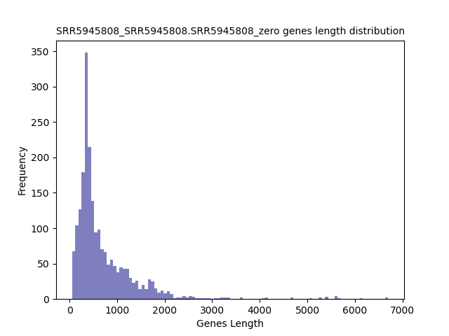
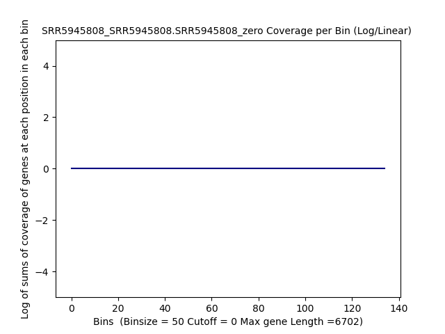
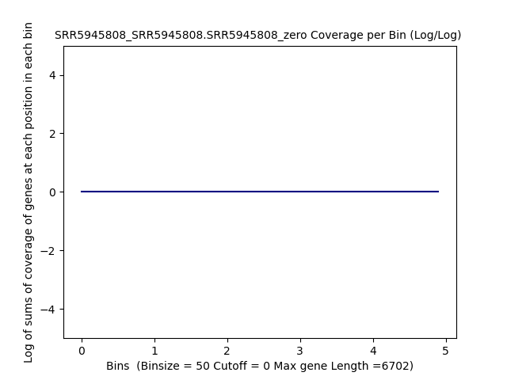
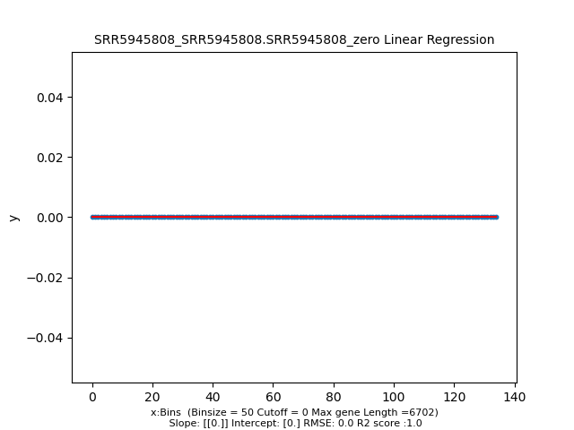
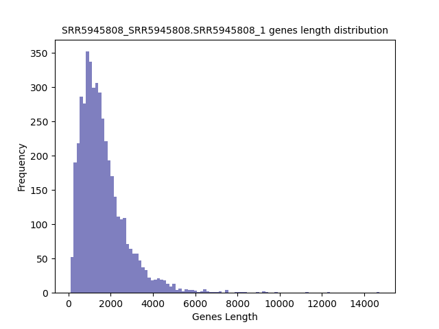
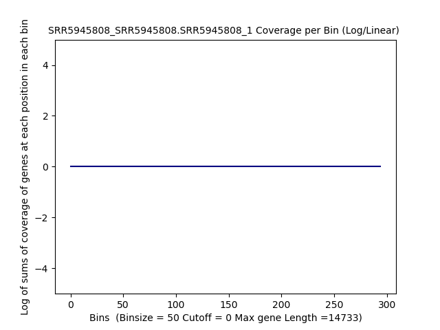
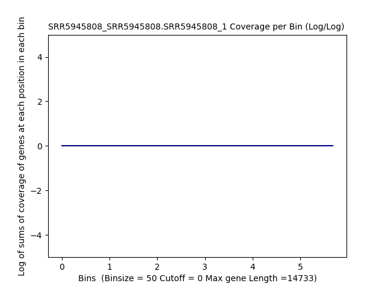
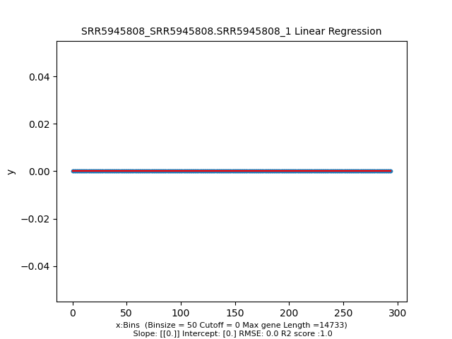

====================================================
**SNPs** 
====================================================

Genes with Zero SNPs
----------------------------

Histogram of Genes' Length 
###############################

.. raw:: html
    

Log Linear Plots 
###################

Where cutoff is the minimum no. of genes to support a position to be considered in bins. Max gene length is the longest gene considered corresponding to this cutoff. 

.. raw:: html
    

Log Log Plots 
###################

.. raw:: html
    

Linear Regression 
###################

.. raw:: html
    

Genes with at least one SNP
------------------------------------------

Histogram of Genes' Length 
###############################

.. raw:: html
    

Log Linear Plots 
###################

Where cutoff is the minimum no. of genes to support a position to be considered in bins. Max gene length is the longest gene considered corresponding to this cutoff. 

.. raw:: html
    

Log Log Plots 
###################

.. raw:: html
    

Linear Regression 
###################

.. raw:: html
    

