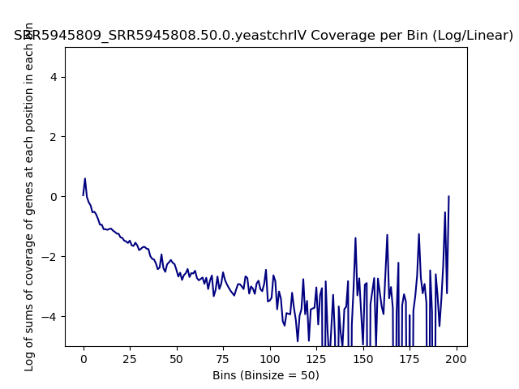
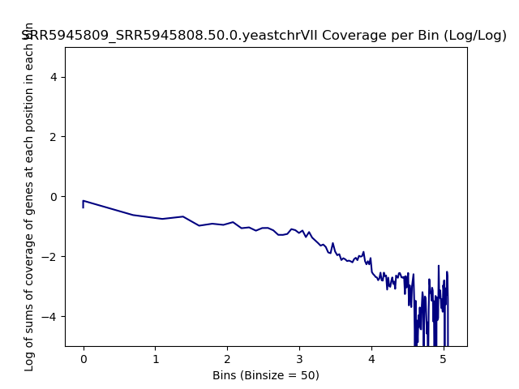
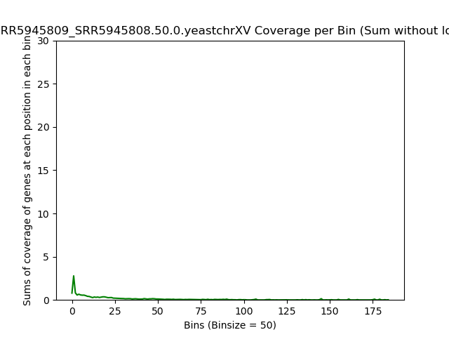
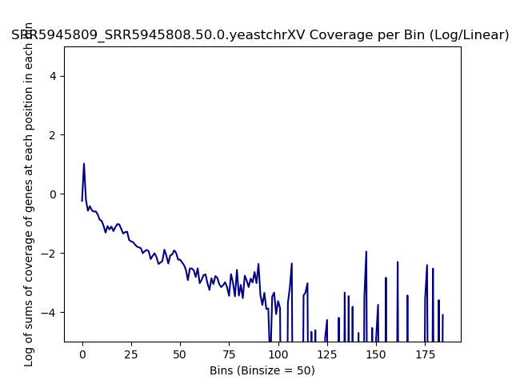

====================================================
**Chromosomes Plots**
====================================================

WT_FP over WT_RNA
#####################

Chr I 
---------------------------

.. literalinclude:: WT_FP_WT_RNA.50..yeastchrI.summary.txt 
.. raw:: html 
    

.. image:: WT_FP_WT_RNA.50..yeastchrI.Length.Histogram.png
   :width: 400 
   :alt:  WT_FP_WT_RNA.50..yeastchrI.histogram 
.. raw:: html 
    

.. image:: WT_FP_WT_RNA.50..yeastchrI.NoLog.png
   :width: 400
   :alt:  WT_FP_WT_RNA.50..yeastchrI.nolog
.. raw:: html 
    

.. image:: WT_FP_WT_RNA.50..yeastchrI.LogLinear.png
   :width: 400 
   :alt:  WT_FP_WT_RNA.50..yeastchrI.loglinear
.. raw:: html 
    

.. image:: WT_FP_WT_RNA.50..yeastchrI.LogLog.png
   :width: 400
   :alt:  WT_FP_WT_RNA.50..yeastchrI.loglog
.. raw:: html 
    

.. image:: WT_FP_WT_RNA.50..yeastchrI.Pregression.png
   :width: 400
   :alt:  WT_FP_WT_RNA.50..yeastchrI.pregression
.. raw:: html 
    
.. image:: WT_FP_WT_RNA.50..yeastchrI.regression.png
   :width: 400
   :alt:  WT_FP_WT_RNA.50..yeastchrI.regression

Chr II
-----------------

.. literalinclude:: WT_FP_WT_RNA.50..yeastchrII.summary.txt
.. raw:: html
    

.. image:: WT_FP_WT_RNA.50..yeastchrII.Length.Histogram.png
   :width: 400
   :alt:  WT_FP_WT_RNA.50..yeastchrII.histogram
.. raw:: html
    

.. image:: WT_FP_WT_RNA.50..yeastchrII.NoLog.png
   :width: 400
   :alt:  WT_FP_WT_RNA.50..yeastchrII.nolog
.. raw:: html
    

.. image:: WT_FP_WT_RNA.50..yeastchrII.LogLinear.png
   :width: 400
   :alt:  WT_FP_WT_RNA.50..yeastchrII.loglinear
.. raw:: html
    

.. image:: WT_FP_WT_RNA.50..yeastchrII.LogLog.png
   :width: 400
   :alt:  WT_FP_WT_RNA.50..yeastchrII.loglog
.. raw:: html
    

.. image:: WT_FP_WT_RNA.50..yeastchrII.Pregression.png
   :width: 400
   :alt:  WT_FP_WT_RNA.50..yeastchrII.pregression
.. raw:: html
    
.. image:: WT_FP_WT_RNA.50..yeastchrII.regression.png
   :width: 400
   :alt:  WT_FP_WT_RNA.50..yeastchrII.regression

Chr III
-----------------

.. literalinclude:: WT_FP_WT_RNA.50..yeastchrIII.summary.txt
.. raw:: html
    

.. image:: WT_FP_WT_RNA.50..yeastchrIII.Length.Histogram.png
   :width: 400
   :alt:  WT_FP_WT_RNA.50..yeastchrIII.histogram
.. raw:: html
    

.. image:: WT_FP_WT_RNA.50..yeastchrIII.NoLog.png
   :width: 400
   :alt:  WT_FP_WT_RNA.50..yeastchrIII.nolog
.. raw:: html
    

.. image:: WT_FP_WT_RNA.50..yeastchrIII.LogLinear.png
   :width: 400
   :alt:  WT_FP_WT_RNA.50..yeastchrIII.loglinear
.. raw:: html
    

.. image:: WT_FP_WT_RNA.50..yeastchrIII.LogLog.png
   :width: 400
   :alt:  WT_FP_WT_RNA.50..yeastchrIII.loglog
.. raw:: html
    

.. image:: WT_FP_WT_RNA.50..yeastchrIII.Pregression.png
   :width: 400
   :alt:  WT_FP_WT_RNA.50..yeastchrIII.pregression
.. raw:: html
    

.. image:: WT_FP_WT_RNA.50..yeastchrIII.regression.png
   :width: 400
   :alt:  WT_FP_WT_RNA.50..yeastchrIII.regression 
.. raw:: html
    
   

Chr IV
---------

.. literalinclude:: WT_FP_WT_RNA.50..yeastchrIV.summary.txt
.. raw:: html
    

.. image:: WT_FP_WT_RNA.50..yeastchrIV.Length.Histogram.png
   :width: 400
   :alt:  WT_FP_WT_RNA.50..yeastchrIV.histogram
.. raw:: html
    

.. image:: WT_FP_WT_RNA.50..yeastchrIV.NoLog.png
   :width: 400
   :alt:  WT_FP_WT_RNA.50..yeastchrIV.nolog
.. raw:: html
    

.. image:: WT_FP_WT_RNA.50..yeastchrIV.LogLinear.png
   :width: 400
   :alt:  WT_FP_WT_RNA.50..yeastchrIV.loglinear
.. raw:: html
    

.. image:: WT_FP_WT_RNA.50..yeastchrIV.LogLog.png
   :width: 400
   :alt:  WT_FP_WT_RNA.50..yeastchrIV.loglog
.. raw:: html
    

.. image:: WT_FP_WT_RNA.50..yeastchrIV.Pregression.png
   :width: 400
   :alt:  WT_FP_WT_RNA.50..yeastchrIV.pregression
.. raw:: html
    
.. image:: WT_FP_WT_RNA.50..yeastchrIV.regression.png
   :width: 400
   :alt:  WT_FP_WT_RNA.50..yeastchrIV.regression

Chr IX 
-------

.. literalinclude:: WT_FP_WT_RNA.50..yeastchrIX.summary.txt
.. raw:: html
    

.. image:: WT_FP_WT_RNA.50..yeastchrIX.Length.Histogram.png
   :width: 400
   :alt:  WT_FP_WT_RNA.50..yeastchrIX.histogram
.. raw:: html
    

.. image:: WT_FP_WT_RNA.50..yeastchrIX.NoLog.png
   :width: 400
   :alt:  WT_FP_WT_RNA.50..yeastchrIX.nolog
.. raw:: html
    

.. image:: WT_FP_WT_RNA.50..yeastchrIX.LogLinear.png
   :width: 400
   :alt:  WT_FP_WT_RNA.50..yeastchrIX.loglinear
.. raw:: html
    

.. image:: WT_FP_WT_RNA.50..yeastchrIX.LogLog.png
   :width: 400
   :alt:  WT_FP_WT_RNA.50..yeastchrIX.loglog
.. raw:: html
    

.. image:: WT_FP_WT_RNA.50..yeastchrIX.Pregression.png
   :width: 400
   :alt:  WT_FP_WT_RNA.50..yeastchrIX.pregression
.. raw:: html
    
.. image:: WT_FP_WT_RNA.50..yeastchrIX.regression.png
   :width: 400
   :alt:  WT_FP_WT_RNA.50..yeastchrIX.regression

Chr V 
--------

.. literalinclude:: WT_FP_WT_RNA.50..yeastchrV.summary.txt
.. raw:: html
    

.. image:: WT_FP_WT_RNA.50..yeastchrV.Length.Histogram.png
   :width: 400
   :alt:  WT_FP_WT_RNA.50..yeastchrV.histogram
.. raw:: html
    

.. image:: WT_FP_WT_RNA.50..yeastchrV.NoLog.png
   :width: 400
   :alt:  WT_FP_WT_RNA.50..yeastchrV.nolog
.. raw:: html
    

.. image:: WT_FP_WT_RNA.50..yeastchrV.LogLinear.png
   :width: 400
   :alt:  WT_FP_WT_RNA.50..yeastchrV.loglinear
.. raw:: html
    

.. image:: WT_FP_WT_RNA.50..yeastchrV.LogLog.png
   :width: 400
   :alt:  WT_FP_WT_RNA.50..yeastchrV.loglog
.. raw:: html
    

.. image:: WT_FP_WT_RNA.50..yeastchrV.Pregression.png
   :width: 400
   :alt:  WT_FP_WT_RNA.50..yeastchrV.pregression
.. raw:: html
    
.. image:: WT_FP_WT_RNA.50..yeastchrV.regression.png
   :width: 400
   :alt:  WT_FP_WT_RNA.50..yeastchrV.regression

Chr VI
--------

.. literalinclude:: WT_FP_WT_RNA.50..yeastchrVI.summary.txt
.. raw:: html
    

.. image:: WT_FP_WT_RNA.50..yeastchrVI.Length.Histogram.png
   :width: 400
   :alt:  WT_FP_WT_RNA.50..yeastchrVI.histogram
.. raw:: html
    

.. image:: WT_FP_WT_RNA.50..yeastchrVI.NoLog.png
   :width: 400
   :alt:  WT_FP_WT_RNA.50..yeastchrVI.nolog
.. raw:: html
    

.. image:: WT_FP_WT_RNA.50..yeastchrVI.LogLinear.png
   :width: 400
   :alt:  WT_FP_WT_RNA.50..yeastchrVI.loglinear
.. raw:: html
    

.. image:: WT_FP_WT_RNA.50..yeastchrVI.LogLog.png
   :width: 400
   :alt:  WT_FP_WT_RNA.50..yeastchrVI.loglog
.. raw:: html
    

.. image:: WT_FP_WT_RNA.50..yeastchrVI.Pregression.png
   :width: 400
   :alt:  WT_FP_WT_RNA.50..yeastchrVI.pregression
.. raw:: html
    
.. image:: WT_FP_WT_RNA.50..yeastchrVI.regression.png
   :width: 400
   :alt:  WT_FP_WT_RNA.50..yeastchrVI.regression

Chr VII
----------

.. literalinclude:: WT_FP_WT_RNA.50..yeastchrVII.summary.txt
.. raw:: html
    

.. image:: WT_FP_WT_RNA.50..yeastchrVII.Length.Histogram.png
   :width: 400
   :alt:  WT_FP_WT_RNA.50..yeastchrVII.histogram
.. raw:: html
    

.. image:: WT_FP_WT_RNA.50..yeastchrVII.NoLog.png
   :width: 400
   :alt:  WT_FP_WT_RNA.50..yeastchrVII.nolog
.. raw:: html
    

.. image:: WT_FP_WT_RNA.50..yeastchrVII.LogLinear.png
   :width: 400
   :alt:  WT_FP_WT_RNA.50..yeastchrVII.loglinear
.. raw:: html
    

.. image:: WT_FP_WT_RNA.50..yeastchrVII.LogLog.png
   :width: 400
   :alt:  WT_FP_WT_RNA.50..yeastchrVII.loglog
.. raw:: html
    

.. image:: WT_FP_WT_RNA.50..yeastchrVII.Pregression.png
   :width: 400
   :alt:  WT_FP_WT_RNA.50..yeastchrVII.pregression
.. raw:: html
    
.. image:: WT_FP_WT_RNA.50..yeastchrVII.regression.png
   :width: 400
   :alt:  WT_FP_WT_RNA.50..yeastchrVII.regression

Chr VIII
----------

.. literalinclude:: WT_FP_WT_RNA.50..yeastchrVIII.summary.txt
.. raw:: html
    

.. image:: WT_FP_WT_RNA.50..yeastchrVIII.Length.Histogram.png
   :width: 400
   :alt:  WT_FP_WT_RNA.50..yeastchrVIII.histogram
.. raw:: html
    

.. image:: WT_FP_WT_RNA.50..yeastchrVIII.NoLog.png
   :width: 400
   :alt:  WT_FP_WT_RNA.50..yeastchrVIII.nolog
.. raw:: html
    

.. image:: WT_FP_WT_RNA.50..yeastchrVIII.LogLinear.png
   :width: 400
   :alt:  WT_FP_WT_RNA.50..yeastchrVIII.loglinear
.. raw:: html
    

.. image:: WT_FP_WT_RNA.50..yeastchrVIII.LogLog.png
   :width: 400
   :alt:  WT_FP_WT_RNA.50..yeastchrVIII.loglog
.. raw:: html
    

.. image:: WT_FP_WT_RNA.50..yeastchrVIII.Pregression.png
   :width: 400
   :alt:  WT_FP_WT_RNA.50..yeastchrVIII.pregression
.. raw:: html
    
.. image:: WT_FP_WT_RNA.50..yeastchrVIII.regression.png
   :width: 400
   :alt:  WT_FP_WT_RNA.50..yeastchrVIII.regression

Chr X
-----------------

.. literalinclude:: WT_FP_WT_RNA.50..yeastchrX.summary.txt
.. raw:: html
    

.. image:: WT_FP_WT_RNA.50..yeastchrX.Length.Histogram.png
   :width: 400
   :alt:  WT_FP_WT_RNA.50..yeastchrX.histogram
.. raw:: html
    

.. image:: WT_FP_WT_RNA.50..yeastchrX.NoLog.png
   :width: 400
   :alt:  WT_FP_WT_RNA.50..yeastchrX.nolog
.. raw:: html
    

.. image:: WT_FP_WT_RNA.50..yeastchrX.LogLinear.png
   :width: 400
   :alt:  WT_FP_WT_RNA.50..yeastchrX.loglinear
.. raw:: html
    

.. image:: WT_FP_WT_RNA.50..yeastchrX.LogLog.png
   :width: 400
   :alt:  WT_FP_WT_RNA.50..yeastchrX.loglog
.. raw:: html
    

.. image:: WT_FP_WT_RNA.50..yeastchrX.Pregression.png
   :width: 400
   :alt:  WT_FP_WT_RNA.50..yeastchrX.pregression
.. raw:: html
    
.. image:: WT_FP_WT_RNA.50..yeastchrX.regression.png
   :width: 400
   :alt:  WT_FP_WT_RNA.50..yeastchrX.regression

Chr XI
-----------------

.. literalinclude:: WT_FP_WT_RNA.50..yeastchrXI.summary.txt
.. raw:: html
    

.. image:: WT_FP_WT_RNA.50..yeastchrXI.Length.Histogram.png
   :width: 400
   :alt:  WT_FP_WT_RNA.50..yeastchrXI.histogram
.. raw:: html
    

.. image:: WT_FP_WT_RNA.50..yeastchrXI.NoLog.png
   :width: 400
   :alt:  WT_FP_WT_RNA.50..yeastchrXI.nolog
.. raw:: html
    

.. image:: WT_FP_WT_RNA.50..yeastchrXI.LogLinear.png
   :width: 400
   :alt:  WT_FP_WT_RNA.50..yeastchrXI.loglinear
.. raw:: html
    

.. image:: WT_FP_WT_RNA.50..yeastchrXI.LogLog.png
   :width: 400
   :alt:  WT_FP_WT_RNA.50..yeastchrXI.loglog
.. raw:: html
    

.. image:: WT_FP_WT_RNA.50..yeastchrXI.Pregression.png
   :width: 400
   :alt:  WT_FP_WT_RNA.50..yeastchrXI.pregression
.. raw:: html
    
.. image:: WT_FP_WT_RNA.50..yeastchrXI.regression.png
   :width: 400
   :alt:  WT_FP_WT_RNA.50..yeastchrXI.regression

Chr XII
-----------------

.. literalinclude:: WT_FP_WT_RNA.50..yeastchrXII.summary.txt
.. raw:: html
    

.. image:: WT_FP_WT_RNA.50..yeastchrXII.Length.Histogram.png
   :width: 400
   :alt:  WT_FP_WT_RNA.50..yeastchrXII.histogram
.. raw:: html
    

.. image:: WT_FP_WT_RNA.50..yeastchrXII.NoLog.png
   :width: 400
   :alt:  WT_FP_WT_RNA.50..yeastchrXII.nolog
.. raw:: html
    

.. image:: WT_FP_WT_RNA.50..yeastchrXII.LogLinear.png
   :width: 400
   :alt:  WT_FP_WT_RNA.50..yeastchrXII.loglinear
.. raw:: html
    

.. image:: WT_FP_WT_RNA.50..yeastchrXII.LogLog.png
   :width: 400
   :alt:  WT_FP_WT_RNA.50..yeastchrXII.loglog
.. raw:: html
    

.. image:: WT_FP_WT_RNA.50..yeastchrXII.Pregression.png
   :width: 400
   :alt:  WT_FP_WT_RNA.50..yeastchrXII.pregression
.. raw:: html
    
.. image:: WT_FP_WT_RNA.50..yeastchrXII.regression.png
   :width: 400
   :alt:  WT_FP_WT_RNA.50..yeastchrXII.regression

Chr XIII
-----------------

.. literalinclude:: WT_FP_WT_RNA.50..yeastchrXIII.summary.txt
.. raw:: html
    

.. image:: WT_FP_WT_RNA.50..yeastchrXIII.Length.Histogram.png
   :width: 400
   :alt:  WT_FP_WT_RNA.50..yeastchrXIII.histogram
.. raw:: html
    

.. image:: WT_FP_WT_RNA.50..yeastchrXIII.NoLog.png
   :width: 400
   :alt:  WT_FP_WT_RNA.50..yeastchrXIII.nolog
.. raw:: html
    

.. image:: WT_FP_WT_RNA.50..yeastchrXIII.LogLinear.png
   :width: 400
   :alt:  WT_FP_WT_RNA.50..yeastchrXIII.loglinear
.. raw:: html
    

.. image:: WT_FP_WT_RNA.50..yeastchrXIII.LogLog.png
   :width: 400
   :alt:  WT_FP_WT_RNA.50..yeastchrXIII.loglog
.. raw:: html
    

.. image:: WT_FP_WT_RNA.50..yeastchrXIII.Pregression.png
   :width: 400
   :alt:  WT_FP_WT_RNA.50..yeastchrXIII.pregression
.. raw:: html
    
.. image:: WT_FP_WT_RNA.50..yeastchrXIII.regression.png
   :width: 400
   :alt:  WT_FP_WT_RNA.50..yeastchrXIII.regression

Chr XV
-----------------

.. literalinclude:: WT_FP_WT_RNA.50..yeastchrXV.summary.txt
.. raw:: html
    

.. image:: WT_FP_WT_RNA.50..yeastchrXV.Length.Histogram.png
   :width: 400
   :alt:  WT_FP_WT_RNA.50..yeastchrXV.histogram
.. raw:: html
    

.. image:: WT_FP_WT_RNA.50..yeastchrXV.NoLog.png
   :width: 400
   :alt:  WT_FP_WT_RNA.50..yeastchrXV.nolog
.. raw:: html
    

.. image:: WT_FP_WT_RNA.50..yeastchrXV.LogLinear.png
   :width: 400
   :alt:  WT_FP_WT_RNA.50..yeastchrXV.loglinear
.. raw:: html
    

.. image:: WT_FP_WT_RNA.50..yeastchrXV.LogLog.png
   :width: 400
   :alt:  WT_FP_WT_RNA.50..yeastchrXV.loglog
.. raw:: html
    

.. image:: WT_FP_WT_RNA.50..yeastchrXV.Pregression.png
   :width: 400
   :alt:  WT_FP_WT_RNA.50..yeastchrXV.pregression
.. raw:: html
    
.. image:: WT_FP_WT_RNA.50..yeastchrXV.regression.png
   :width: 400
   :alt:  WT_FP_WT_RNA.50..yeastchrXV.regression

Chr XVI
-----------------

.. literalinclude:: WT_FP_WT_RNA.50..yeastchrXVI.summary.txt
.. raw:: html
    

.. image:: WT_FP_WT_RNA.50..yeastchrXVI.Length.Histogram.png
   :width: 400
   :alt:  WT_FP_WT_RNA.50..yeastchrXVI.histogram
.. raw:: html
    

.. image:: WT_FP_WT_RNA.50..yeastchrXVI.NoLog.png
   :width: 400
   :alt:  WT_FP_WT_RNA.50..yeastchrXVI.nolog
.. raw:: html
    

.. image:: WT_FP_WT_RNA.50..yeastchrXVI.LogLinear.png
   :width: 400
   :alt:  WT_FP_WT_RNA.50..yeastchrXVI.loglinear
.. raw:: html
    

.. image:: WT_FP_WT_RNA.50..yeastchrXVI.LogLog.png
   :width: 400
   :alt:  WT_FP_WT_RNA.50..yeastchrXVI.loglog
.. raw:: html
    

.. image:: WT_FP_WT_RNA.50..yeastchrXVI.Pregression.png
   :width: 400
   :alt:  WT_FP_WT_RNA.50..yeastchrXVI.pregression
.. raw:: html
    
.. image:: WT_FP_WT_RNA.50..yeastchrXVI.regression.png
   :width: 400
   :alt:  WT_FP_WT_RNA.50..yeastchrXVI.regression

SRR5945809 over SRR5945808
##############################

Chr I 
---------------------------

.. literalinclude:: SRR5945809_SRR5945808.50.0.yeastchrI.summary.txt 
.. raw:: html 
    

.. raw:: html 
    

.. image:: SRR5945809_SRR5945808.50.0.yeastchrI.NoLog.png
   :width: 400
   :alt:  SRR5945809_SRR5945808.50.0.yeastchrI.nolog
.. raw:: html 
    

.. image:: SRR5945809_SRR5945808.50.0.yeastchrI.LogLinear.png
   :width: 400 
   :alt:  SRR5945809_SRR5945808.50.0.yeastchrI.loglinear
.. raw:: html 
    

.. raw:: html 
    

.. image:: SRR5945809_SRR5945808.50.0.yeastchrI.Pregression.png
   :width: 400
   :alt:  SRR5945809_SRR5945808.50.0.yeastchrI.pregression
.. raw:: html 
    

Chr II
-----------------

.. literalinclude:: SRR5945809_SRR5945808.50.0.yeastchrII.summary.txt
.. raw:: html
    

.. raw:: html
    

.. raw:: html
    

.. raw:: html
    

.. raw:: html
    

.. raw:: html
    

Chr III
-----------------

.. literalinclude:: SRR5945809_SRR5945808.50.0.yeastchrIII.summary.txt
.. raw:: html
    

.. raw:: html
    

.. raw:: html
    

.. raw:: html
    

.. raw:: html
    

.. raw:: html
    

.. raw:: html
    
   

Chr IV
---------

.. literalinclude:: SRR5945809_SRR5945808.50.0.yeastchrIV.summary.txt
.. raw:: html
    

.. image:: SRR5945809_SRR5945808.50.0.yeastchrIV.Length.Histogram.png
   :width: 400
   :alt:  SRR5945809_SRR5945808.50.0.yeastchrIV.histogram
.. raw:: html
    

.. raw:: html
    

.. raw:: html
    

.. raw:: html
    

.. raw:: html
    

Chr IX 
-------

.. literalinclude:: SRR5945809_SRR5945808.50.0.yeastchrIX.summary.txt
.. raw:: html
    

.. raw:: html
    

.. raw:: html
    

.. raw:: html
    

.. raw:: html
    

.. raw:: html
    

Chr V 
--------

.. literalinclude:: SRR5945809_SRR5945808.50.0.yeastchrV.summary.txt
.. raw:: html
    

.. raw:: html
    

.. raw:: html
    

.. raw:: html
    

.. raw:: html
    

.. image:: SRR5945809_SRR5945808.50.0.yeastchrV.Pregression.png
   :width: 400
   :alt:  SRR5945809_SRR5945808.50.0.yeastchrV.pregression
.. raw:: html
    

Chr VI
--------

.. literalinclude:: SRR5945809_SRR5945808.50.0.yeastchrVI.summary.txt
.. raw:: html
    

.. raw:: html
    

.. raw:: html
    

.. raw:: html
    

.. raw:: html
    

.. raw:: html
    

Chr VII
----------

.. literalinclude:: SRR5945809_SRR5945808.50.0.yeastchrVII.summary.txt
.. raw:: html
    

.. raw:: html
    

.. raw:: html
    

.. raw:: html
    

.. raw:: html
    

.. raw:: html
    

Chr VIII
----------

.. literalinclude:: SRR5945809_SRR5945808.50.0.yeastchrVIII.summary.txt
.. raw:: html
    

.. raw:: html
    

.. image:: SRR5945809_SRR5945808.50.0.yeastchrVIII.NoLog.png
   :width: 400
   :alt:  SRR5945809_SRR5945808.50.0.yeastchrVIII.nolog
.. raw:: html
    

.. raw:: html
    

.. raw:: html
    

.. raw:: html
    

Chr X
-----------------

.. literalinclude:: SRR5945809_SRR5945808.50.0.yeastchrX.summary.txt
.. raw:: html
    

.. image:: SRR5945809_SRR5945808.50.0.yeastchrX.Length.Histogram.png
   :width: 400
   :alt:  SRR5945809_SRR5945808.50.0.yeastchrX.histogram
.. raw:: html
    

.. image:: SRR5945809_SRR5945808.50.0.yeastchrX.NoLog.png
   :width: 400
   :alt:  SRR5945809_SRR5945808.50.0.yeastchrX.nolog
.. raw:: html
    

.. image:: SRR5945809_SRR5945808.50.0.yeastchrX.LogLinear.png
   :width: 400
   :alt:  SRR5945809_SRR5945808.50.0.yeastchrX.loglinear
.. raw:: html
    

.. image:: SRR5945809_SRR5945808.50.0.yeastchrX.LogLog.png
   :width: 400
   :alt:  SRR5945809_SRR5945808.50.0.yeastchrX.loglog
.. raw:: html
    

.. image:: SRR5945809_SRR5945808.50.0.yeastchrX.Pregression.png
   :width: 400
   :alt:  SRR5945809_SRR5945808.50.0.yeastchrX.pregression
.. raw:: html
    
.. image:: SRR5945809_SRR5945808.50.0.yeastchrX.regression.png
   :width: 400
   :alt:  SRR5945809_SRR5945808.50.0.yeastchrX.regression

Chr XI
-----------------

.. literalinclude:: SRR5945809_SRR5945808.50.0.yeastchrXI.summary.txt
.. raw:: html
    

.. image:: SRR5945809_SRR5945808.50.0.yeastchrXI.Length.Histogram.png
   :width: 400
   :alt:  SRR5945809_SRR5945808.50.0.yeastchrXI.histogram
.. raw:: html
    

.. image:: SRR5945809_SRR5945808.50.0.yeastchrXI.NoLog.png
   :width: 400
   :alt:  SRR5945809_SRR5945808.50.0.yeastchrXI.nolog
.. raw:: html
    

.. image:: SRR5945809_SRR5945808.50.0.yeastchrXI.LogLinear.png
   :width: 400
   :alt:  SRR5945809_SRR5945808.50.0.yeastchrXI.loglinear
.. raw:: html
    

.. image:: SRR5945809_SRR5945808.50.0.yeastchrXI.LogLog.png
   :width: 400
   :alt:  SRR5945809_SRR5945808.50.0.yeastchrXI.loglog
.. raw:: html
    

.. image:: SRR5945809_SRR5945808.50.0.yeastchrXI.Pregression.png
   :width: 400
   :alt:  SRR5945809_SRR5945808.50.0.yeastchrXI.pregression
.. raw:: html
    
.. image:: SRR5945809_SRR5945808.50.0.yeastchrXI.regression.png
   :width: 400
   :alt:  SRR5945809_SRR5945808.50.0.yeastchrXI.regression

Chr XII
-----------------

.. literalinclude:: SRR5945809_SRR5945808.50.0.yeastchrXII.summary.txt
.. raw:: html
    

.. image:: SRR5945809_SRR5945808.50.0.yeastchrXII.Length.Histogram.png
   :width: 400
   :alt:  SRR5945809_SRR5945808.50.0.yeastchrXII.histogram
.. raw:: html
    

.. image:: SRR5945809_SRR5945808.50.0.yeastchrXII.NoLog.png
   :width: 400
   :alt:  SRR5945809_SRR5945808.50.0.yeastchrXII.nolog
.. raw:: html
    

.. image:: SRR5945809_SRR5945808.50.0.yeastchrXII.LogLinear.png
   :width: 400
   :alt:  SRR5945809_SRR5945808.50.0.yeastchrXII.loglinear
.. raw:: html
    

.. image:: SRR5945809_SRR5945808.50.0.yeastchrXII.LogLog.png
   :width: 400
   :alt:  SRR5945809_SRR5945808.50.0.yeastchrXII.loglog
.. raw:: html
    

.. image:: SRR5945809_SRR5945808.50.0.yeastchrXII.Pregression.png
   :width: 400
   :alt:  SRR5945809_SRR5945808.50.0.yeastchrXII.pregression
.. raw:: html
    
.. image:: SRR5945809_SRR5945808.50.0.yeastchrXII.regression.png
   :width: 400
   :alt:  SRR5945809_SRR5945808.50.0.yeastchrXII.regression

Chr XIII
-----------------

.. literalinclude:: SRR5945809_SRR5945808.50.0.yeastchrXIII.summary.txt
.. raw:: html
    

.. image:: SRR5945809_SRR5945808.50.0.yeastchrXIII.Length.Histogram.png
   :width: 400
   :alt:  SRR5945809_SRR5945808.50.0.yeastchrXIII.histogram
.. raw:: html
    

.. image:: SRR5945809_SRR5945808.50.0.yeastchrXIII.NoLog.png
   :width: 400
   :alt:  SRR5945809_SRR5945808.50.0.yeastchrXIII.nolog
.. raw:: html
    

.. image:: SRR5945809_SRR5945808.50.0.yeastchrXIII.LogLinear.png
   :width: 400
   :alt:  SRR5945809_SRR5945808.50.0.yeastchrXIII.loglinear
.. raw:: html
    

.. image:: SRR5945809_SRR5945808.50.0.yeastchrXIII.LogLog.png
   :width: 400
   :alt:  SRR5945809_SRR5945808.50.0.yeastchrXIII.loglog
.. raw:: html
    

.. image:: SRR5945809_SRR5945808.50.0.yeastchrXIII.Pregression.png
   :width: 400
   :alt:  SRR5945809_SRR5945808.50.0.yeastchrXIII.pregression
.. raw:: html
    
.. image:: SRR5945809_SRR5945808.50.0.yeastchrXIII.regression.png
   :width: 400
   :alt:  SRR5945809_SRR5945808.50.0.yeastchrXIII.regression

Chr XV
-----------------

.. literalinclude:: SRR5945809_SRR5945808.50.0.yeastchrXV.summary.txt
.. raw:: html
    

.. raw:: html
    

.. raw:: html
    

.. raw:: html
    

.. raw:: html
    

.. raw:: html
    

Chr XVI
-----------------

.. literalinclude:: SRR5945809_SRR5945808.50.0.yeastchrXVI.summary.txt
.. raw:: html
    

.. raw:: html
    

.. raw:: html
    

.. raw:: html
    

.. raw:: html
    

.. image:: SRR5945809_SRR5945808.50.0.yeastchrXVI.Pregression.png
   :width: 400
   :alt:  SRR5945809_SRR5945808.50.0.yeastchrXVI.pregression
.. raw:: html
    

