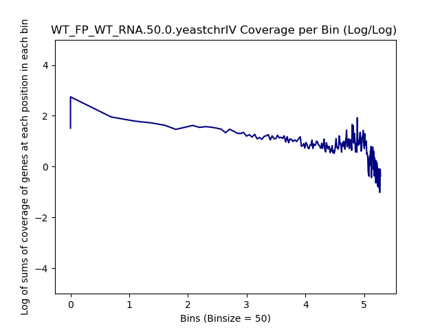
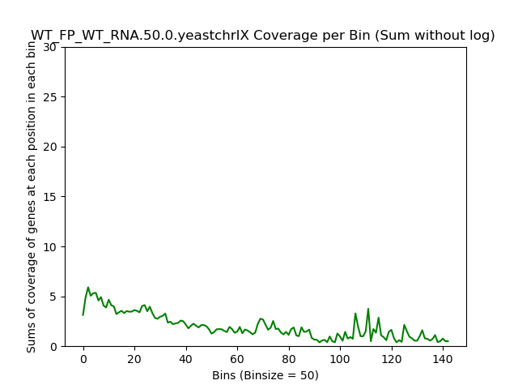

====================================================
**Chromosomes Plots**
====================================================

Chr I 
---------------------------

.. literalinclude:: WT_FP_WT_RNA.50.0.yeastchrI.summary.txt 
.. raw:: html 
    

.. raw:: html 
    

.. raw:: html 
    

.. raw:: html 
    

.. image:: WT_FP_WT_RNA.50.0.yeastchrI.LogLog.png
   :width: 400
   :alt:  WT_FP_WT_RNA.50.0.yeastchrI.loglog
.. raw:: html 
    

.. raw:: html 
    

Chr II
-----------------

.. literalinclude:: WT_FP_WT_RNA.50.0.yeastchrII.summary.txt
.. raw:: html
    

.. raw:: html
    

.. raw:: html
    

.. raw:: html
    

.. raw:: html
    

.. raw:: html
    

Chr III
-----------------

.. literalinclude:: WT_FP_WT_RNA.50.0.yeastchrIII.summary.txt
.. raw:: html
    

.. raw:: html
    

.. raw:: html
    

.. raw:: html
    

.. raw:: html
    

.. raw:: html
    

.. raw:: html
    
   

Chr IV
---------

.. literalinclude:: WT_FP_WT_RNA.50.0.yeastchrIV.summary.txt
.. raw:: html
    

.. raw:: html
    

.. raw:: html
    

.. raw:: html
    

.. raw:: html
    

.. raw:: html
    
.. image:: WT_FP_WT_RNA.50.0.yeastchrIV.regression.png
   :width: 400
   :alt:  WT_FP_WT_RNA.50.0.yeastchrIV.regression

Chr IX 
-------

.. literalinclude:: WT_FP_WT_RNA.50.0.yeastchrIX.summary.txt
.. raw:: html
    

.. raw:: html
    

.. raw:: html
    

.. raw:: html
    

.. raw:: html
    

.. raw:: html
    

Chr V 
--------

.. literalinclude:: WT_FP_WT_RNA.50.0.yeastchrV.summary.txt
.. raw:: html
    

.. raw:: html
    

.. raw:: html
    

.. raw:: html
    

.. raw:: html
    

.. image:: WT_FP_WT_RNA.50.0.yeastchrV.Pregression.png
   :width: 400
   :alt:  WT_FP_WT_RNA.50.0.yeastchrV.pregression
.. raw:: html
    

Chr VI
--------

.. literalinclude:: WT_FP_WT_RNA.50.0.yeastchrVI.summary.txt
.. raw:: html
    

.. raw:: html
    

.. raw:: html
    

.. raw:: html
    

.. image:: WT_FP_WT_RNA.50.0.yeastchrVI.LogLog.png
   :width: 400
   :alt:  WT_FP_WT_RNA.50.0.yeastchrVI.loglog
.. raw:: html
    

.. raw:: html
    

Chr VII
----------

.. literalinclude:: WT_FP_WT_RNA.50.0.yeastchrVII.summary.txt
.. raw:: html
    

.. image:: WT_FP_WT_RNA.50.0.yeastchrVII.Length.Histogram.png
   :width: 400
   :alt:  WT_FP_WT_RNA.50.0.yeastchrVII.histogram
.. raw:: html
    

.. raw:: html
    

.. raw:: html
    

.. raw:: html
    

.. raw:: html
    

Chr XV
-----------------

.. literalinclude:: WT_FP_WT_RNA.50.0.yeastchrXV.summary.txt
.. raw:: html
    

.. raw:: html
    

.. raw:: html
    

.. raw:: html
    

.. raw:: html
    

.. raw:: html
    

Chr XVI
-----------------

.. literalinclude:: WT_FP_WT_RNA.50.0.yeastchrXVI.summary.txt
.. raw:: html
    

.. raw:: html
    

.. raw:: html
    

.. raw:: html
    

.. raw:: html
    

.. raw:: html
    

