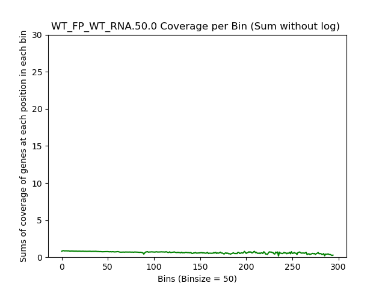

====================================================
**FP/RNA**
====================================================

WT_FP over WT_RNA
####################

.. image:: WT_FP_WT_RNA.50.0.Length.Histogram.png
   :width: 400
   :alt:  WT_FP_WT_RNA.50.0.histogram
.. raw:: html
    

.. raw:: html
    

.. raw:: html
    

.. raw:: html
    

.. raw:: html
    

.. image:: WT_FP_WT_RNA.50.0.regression.png
   :width: 400
   :alt:  WT_FP_WT_RNA.50.0.regression
.. raw:: html
    

SRR5945809 over SRR5945808
#############################

.. raw:: html
    

.. raw:: html
    

.. raw:: html
    

.. image:: SRR5945809_SRR5945808.50.0.LogLog.png
   :width: 400
   :alt:  SRR5945809_SRR5945808.50.0.loglog
.. raw:: html
    

.. raw:: html
    

.. image:: SRR5945809_SRR5945808.50.0.regression.png
   :width: 400
   :alt:  SRR5945809_SRR5945808.50.0.regression
.. raw:: html
    

