====================================================
**GC  Plots**
====================================================

WT_FP over WT_RNA 
#####################

WT_FP / WT_RNA Low GC content <40
------------------------------------------

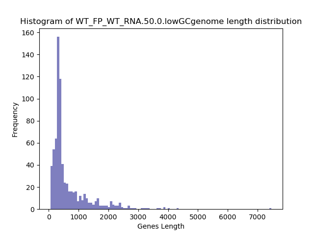
.. raw:: html
    

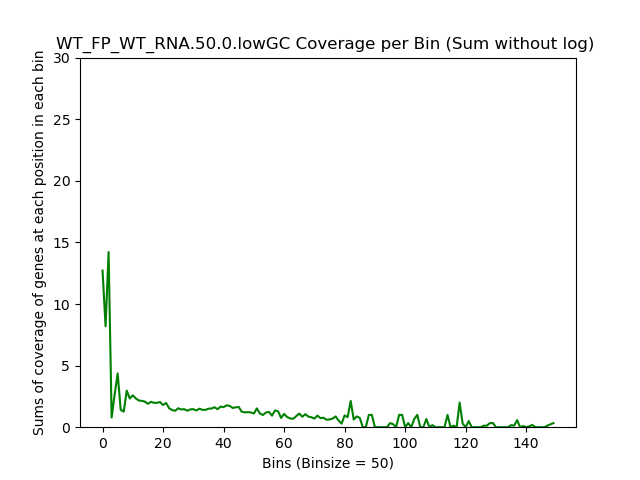
.. raw:: html
    

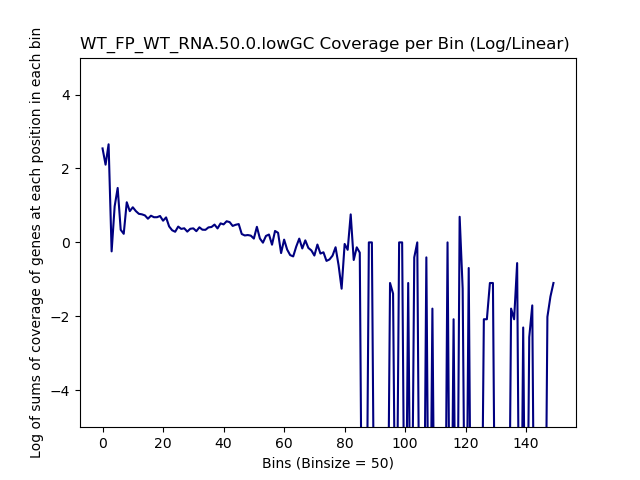
.. raw:: html
    

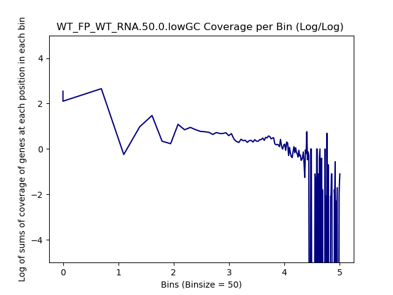
.. raw:: html
    

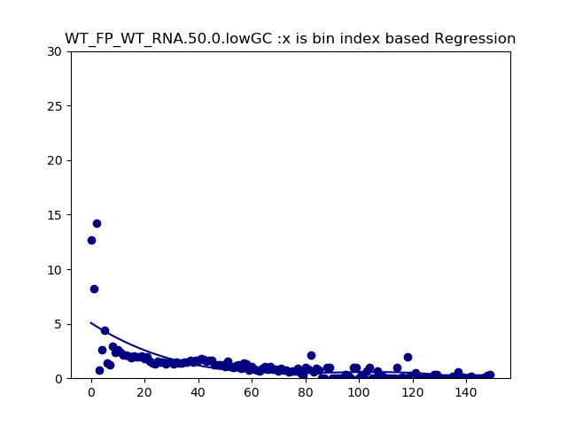
.. raw:: html
    

.. image:: WT_FP_WT_RNA.50.0.lowGC.regression.png
   :width: 400
   :alt:  WT_FP_WT_RNA.50.0.lowGC.regression
.. raw:: html
    

WT_FP / WT_RNA  High GC content >60  
-------------------------------------

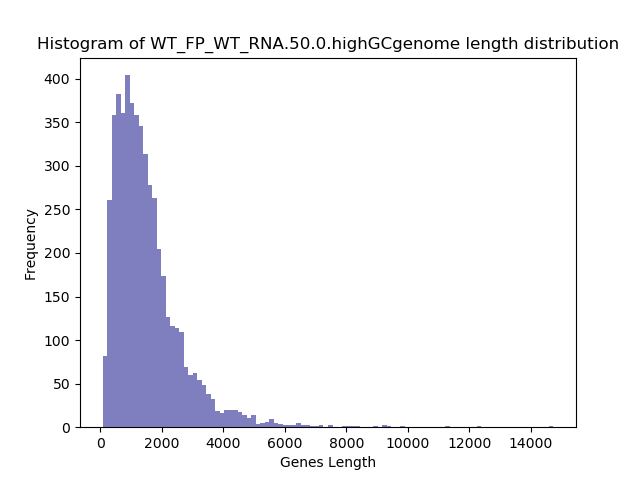
.. raw:: html
    

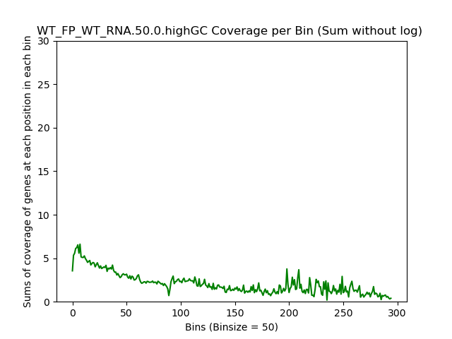
.. raw:: html
    

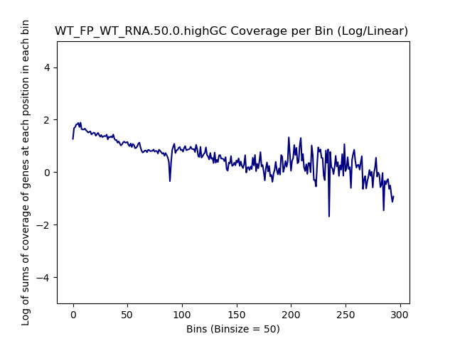
.. raw:: html
    

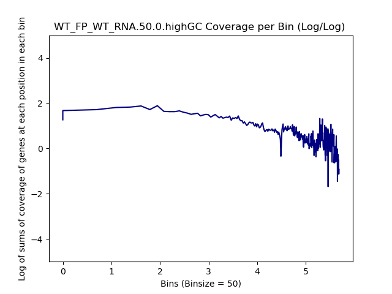
.. raw:: html
    

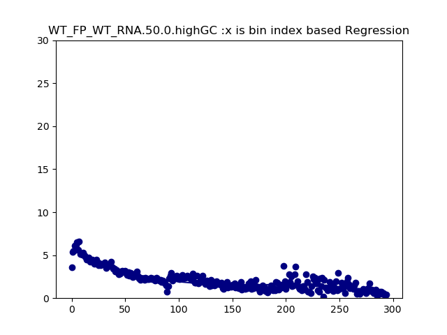
.. raw:: html
    

.. image:: WT_FP_WT_RNA.50.0.highGC.regression.png
   :width: 400
   :alt:  WT_FP_WT_RNA.50.0.highGC.regression
.. raw:: html
    

SRR5945809 over SRR5945808
############################

SRR5945809 over SRR5945808  Low GC content <40
-------------------------------------------------

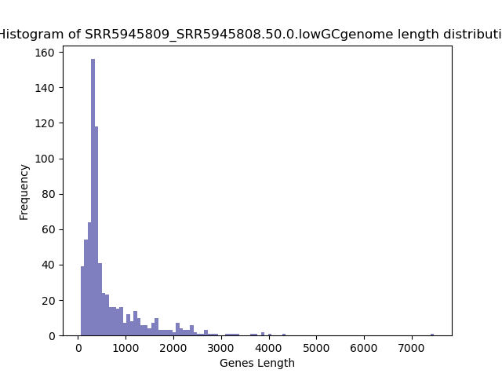
.. raw:: html
    

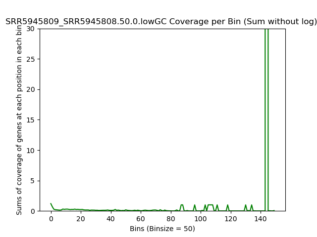
.. raw:: html
    

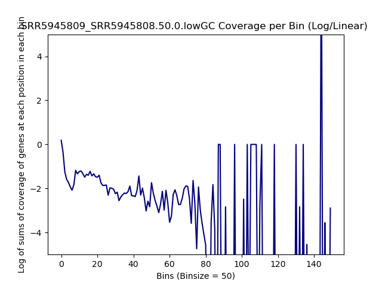
.. raw:: html
    

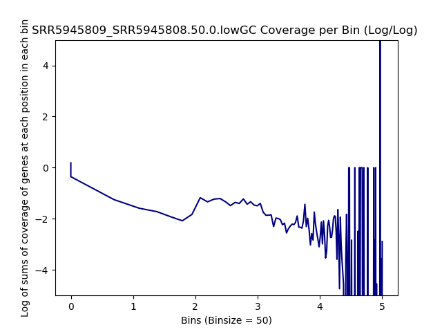
.. raw:: html
    

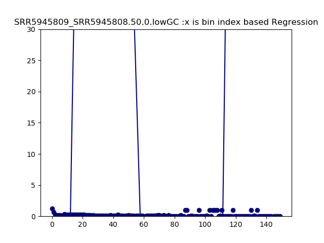
.. raw:: html
    

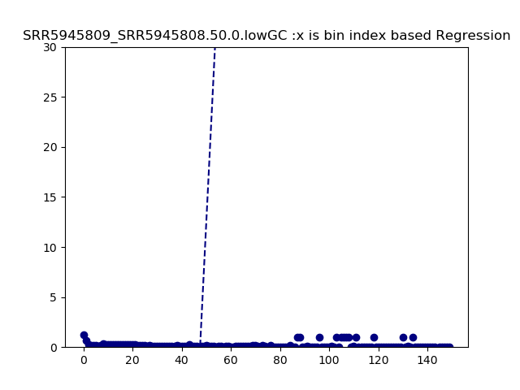
.. raw:: html
    

SRR5945809 over SRR5945808 High GC content >60  
---------------------------------------------------

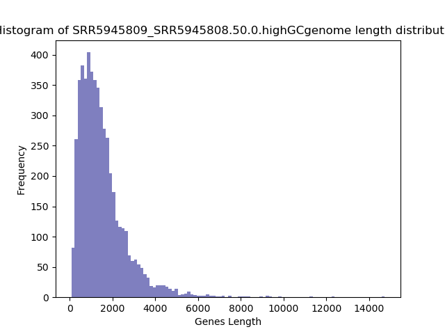
.. raw:: html
    

.. image:: SRR5945809_SRR5945808.50.0.highGC.NoLog.png
   :width: 400
   :alt:  SRR5945809_SRR5945808.50.0.highGC.nolog
.. raw:: html
    

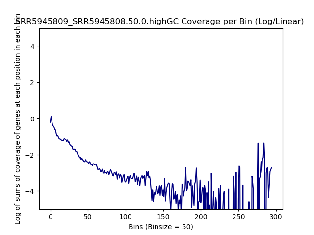
.. raw:: html
    

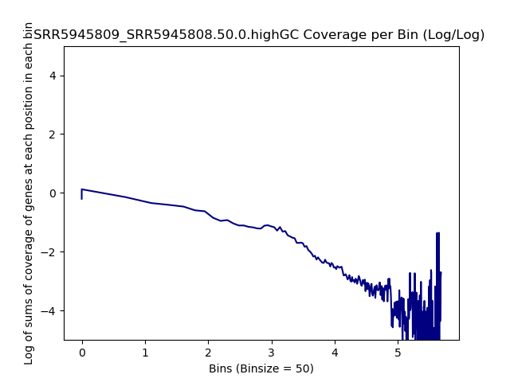
.. raw:: html
    

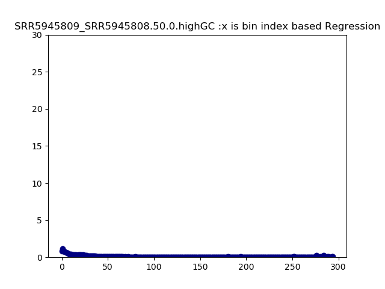
.. raw:: html
    

.. raw:: html
    

