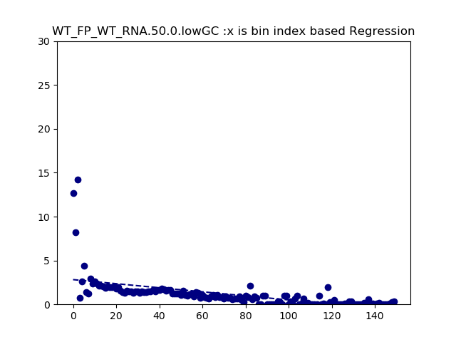
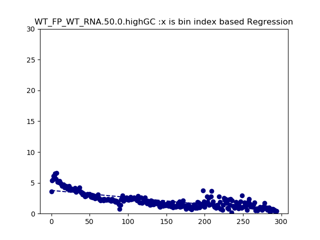
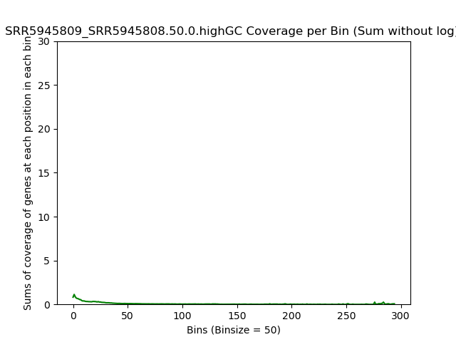

====================================================
**GC  Plots**
====================================================

WT_FP over WT_RNA 
#####################

WT_FP / WT_RNA Low GC content <40
------------------------------------------

.. raw:: html
    

.. raw:: html
    

.. raw:: html
    

.. raw:: html
    

.. raw:: html
    

.. raw:: html
    

WT_FP / WT_RNA  High GC content >60  
-------------------------------------

.. raw:: html
    

.. raw:: html
    

.. raw:: html
    

.. raw:: html
    

.. raw:: html
    

.. raw:: html
    

SRR5945809 over SRR5945808
############################

SRR5945809 over SRR5945808  Low GC content <40
-------------------------------------------------

.. raw:: html
    

.. raw:: html
    

.. raw:: html
    

.. raw:: html
    

.. raw:: html
    

.. raw:: html
    

SRR5945809 over SRR5945808 High GC content >60  
---------------------------------------------------

.. raw:: html
    

.. raw:: html
    

.. raw:: html
    

.. raw:: html
    

.. raw:: html
    

.. raw:: html
    

