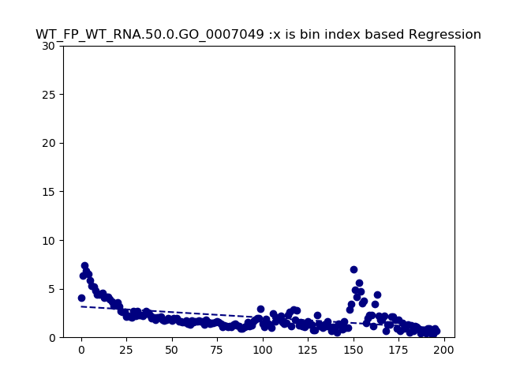
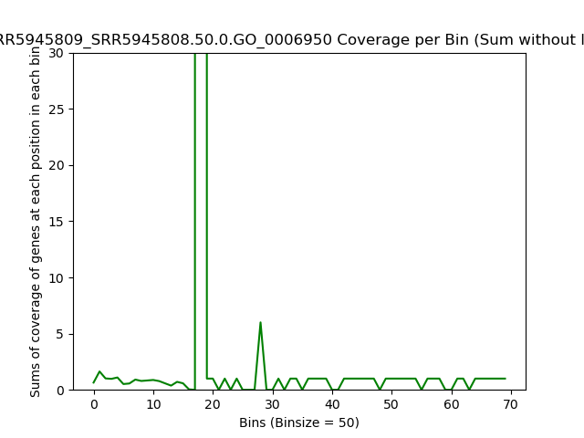
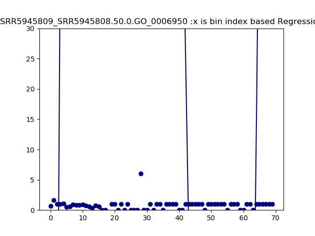
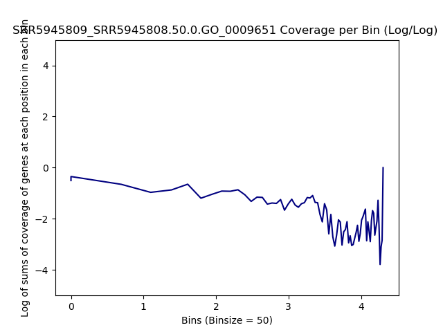
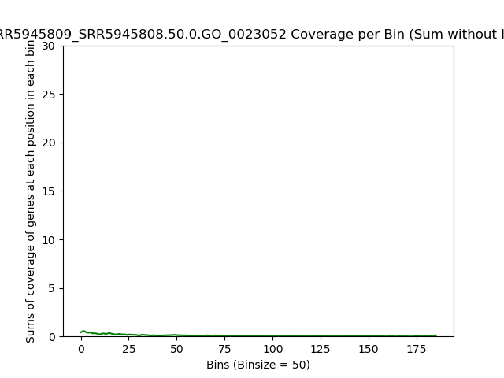
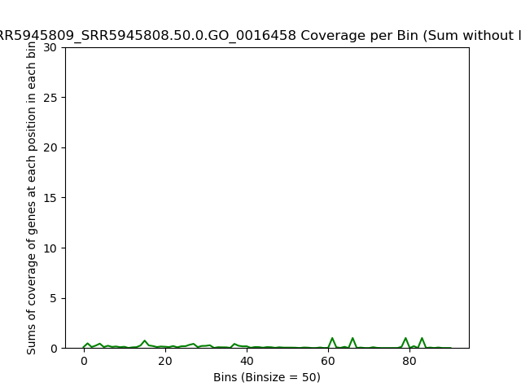
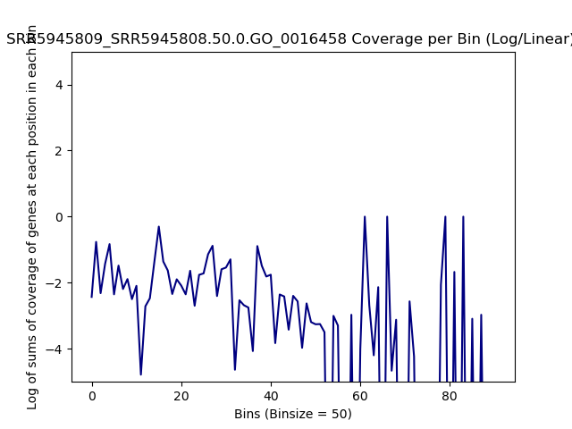

====================================================
**GO Plots**
====================================================

WT_FP over WT_RNA
#####################

GO:0006950 Response to Stress  
--------------------------------

.. raw:: html 
    

.. raw:: html 
    

.. raw:: html 
    

.. raw:: html 
    

.. raw:: html 
    

GO:0006951 Response to Salt Stress
------------------------------------

.. raw:: html
    

.. raw:: html
    

.. raw:: html
    

.. raw:: html
    

.. raw:: html
    

GO:0007049 CellCycle
--------------------------

.. raw:: html 
    

.. raw:: html 
    

.. raw:: html 
    

.. raw:: html 
    

.. raw:: html 
    

GO:0023052 Signaling  
--------------------------

.. raw:: html
    

.. raw:: html
    

.. raw:: html
    

.. image:: WT_FP_WT_RNA.50.0.GO_0023052.LogLog.png
   :width: 400
   :alt:  WT_FP_WT_RNA.50.0.GO_0023052.loglog

.. raw:: html
    

.. raw:: html
    

GO:0042254 Ribosome Biogenesis  
-----------------------------------

.. raw:: html
    

.. raw:: html
    

.. raw:: html
    

.. raw:: html
    

.. raw:: html
    

.. raw:: html
    
   

GO:0016458 Gene Silencing 
------------------------------- 

.. raw:: html
    

.. raw:: html
    

.. raw:: html
    

.. raw:: html
    

.. raw:: html
    

GO:0006119 Oxidative Phosphorylation  
------------------------------------------

.. raw:: html 
    

.. raw:: html 
    

.. raw:: html 
    

.. raw:: html 
    

.. raw:: html 
    

GO:0006412 Translation
---------------------------

.. raw:: html
    

.. raw:: html
    

.. raw:: html
    

.. raw:: html
    

.. raw:: html
    

SRR5945809 over SRR5945808
############################

GO:0006950 Response to Stress  
--------------------------------

.. raw:: html 
    

.. raw:: html 
    

.. raw:: html 
    

.. raw:: html 
    

.. raw:: html 
    
.. image:: SRR5945809_SRR5945808.50.0.GO_0006950.regression.png
   :width: 400
   :alt:  SRR5945809_SRR5945808.50.0.GO_0006950.regression

GO:0006951 Response to Salt Stress
------------------------------------

.. raw:: html
    

.. raw:: html
    

.. raw:: html
    

.. raw:: html
    

.. raw:: html
    

GO:0007049 CellCycle
--------------------------

.. raw:: html 
    

.. raw:: html 
    

.. raw:: html 
    

.. raw:: html 
    

.. raw:: html 
    

GO:0023052 Signaling  
--------------------------

.. raw:: html
    

.. raw:: html
    

.. raw:: html
    

.. raw:: html
    

.. raw:: html
    

GO:0042254 Ribosome Biogenesis  
-----------------------------------

.. raw:: html
    

.. raw:: html
    

.. raw:: html
    

.. raw:: html
    

.. raw:: html
    

.. raw:: html
    
   

GO:0016458 Gene Silencing 
------------------------------- 

.. raw:: html
    

.. raw:: html
    

.. raw:: html
    

.. raw:: html
    

.. raw:: html
    

GO:0006119 Oxidative Phosphorylation  
------------------------------------------

.. raw:: html 
    

.. raw:: html 
    

.. raw:: html 
    

.. raw:: html 
    

.. raw:: html 
    

GO:0006412 Translation
---------------------------

.. raw:: html
    

.. raw:: html
    

.. raw:: html
    

.. raw:: html
    

.. raw:: html
    

