====================================================
**GO random  FP/RNA Plots**
====================================================

GO:0023052 Signaling  
--------------------------
.. literalinclude:: WT_FP_WT_RNA.50.0.GO_0023052_random.summary.txt

.. raw:: html
    

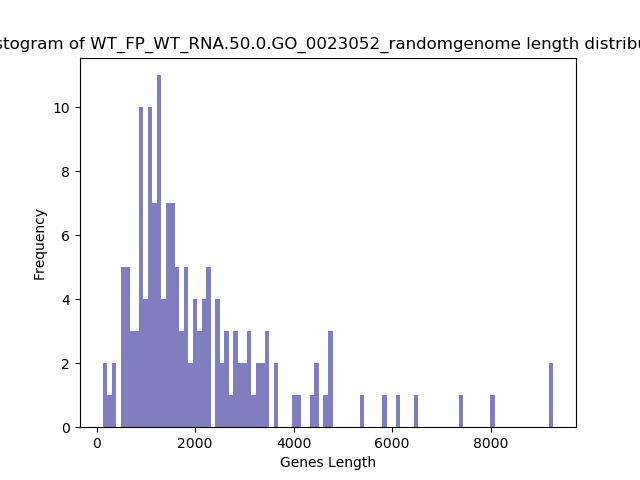

.. raw:: html
    

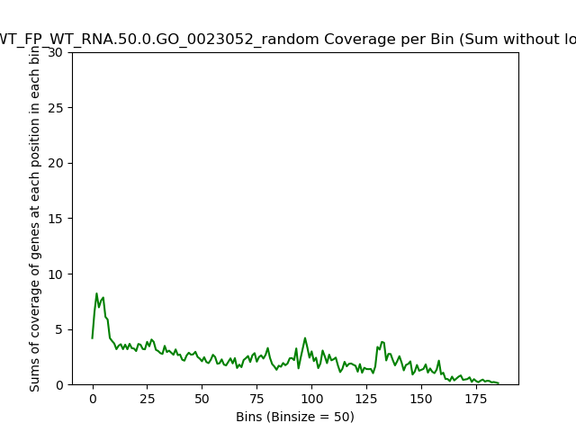

.. raw:: html
    

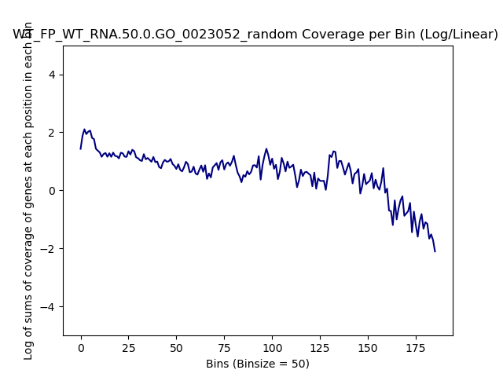

.. raw:: html
    

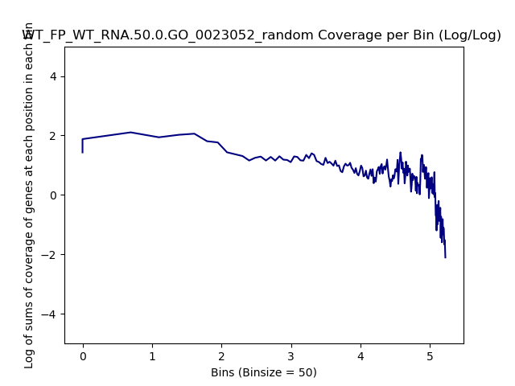

.. raw:: html
    

.. raw:: html
    

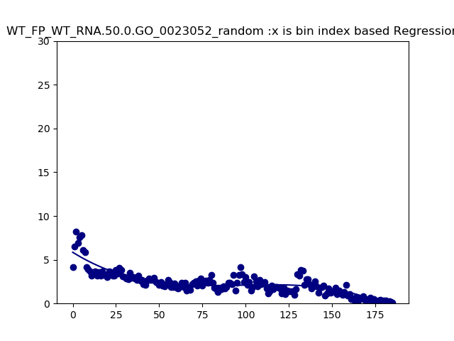

GO:0042254 Ribosome Biogenesis  
-----------------------------------

.. literalinclude:: WT_FP_WT_RNA.50.0.GO_0042254_random.summary.txt

.. raw:: html
    

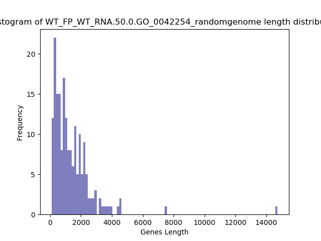

.. raw:: html
    

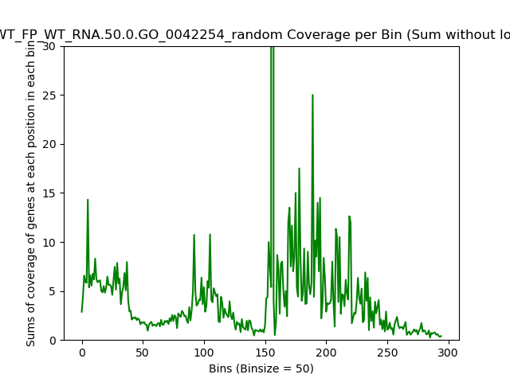

.. raw:: html
    

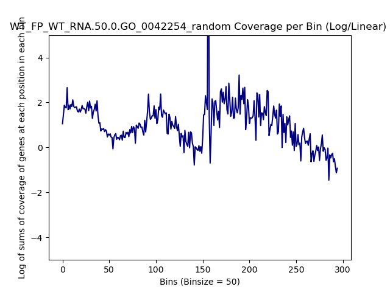

.. raw:: html
    

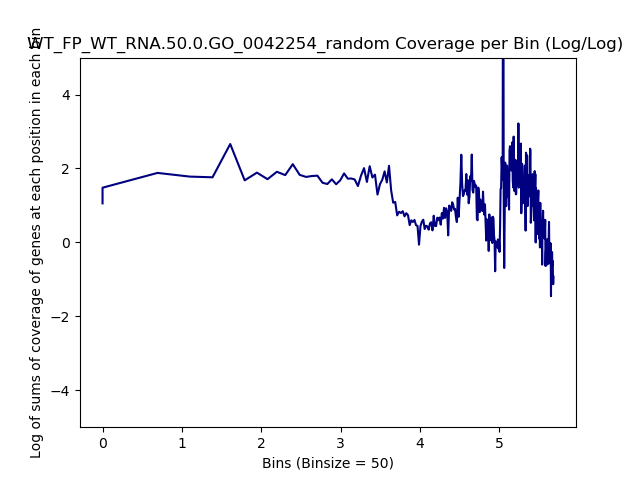

.. raw:: html
    

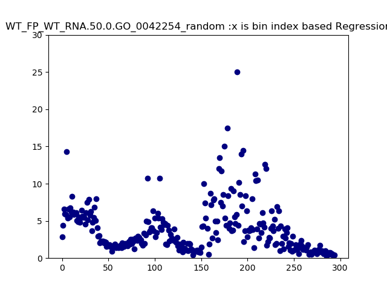

.. raw:: html
    

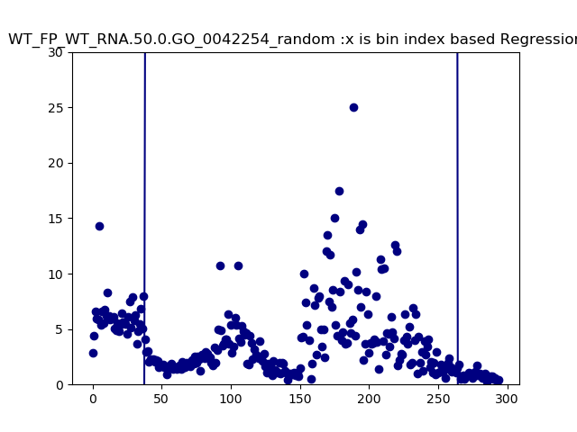

.. raw:: html
    
   

GO:0006412 Translation
---------------------------
.. literalinclude:: WT_FP_WT_RNA.50.0.GO_0006412_random.summary.txt
.. raw:: html
    

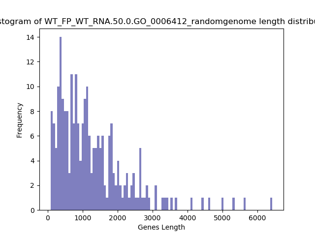
.. raw:: html
    

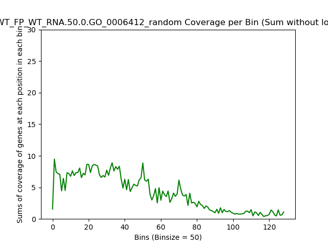
.. raw:: html
    

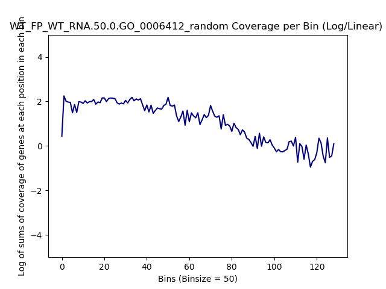
.. raw:: html
    

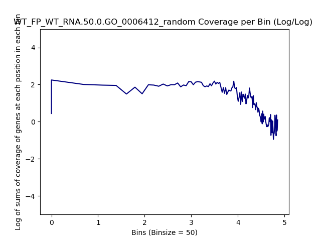
.. raw:: html
    

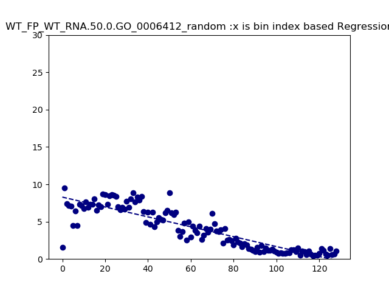
.. raw:: html
    
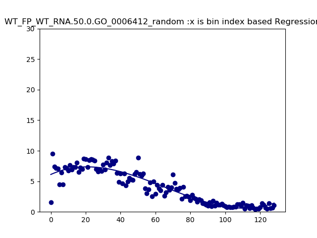

