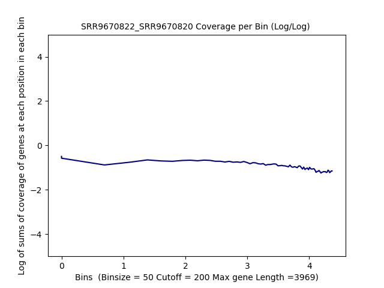
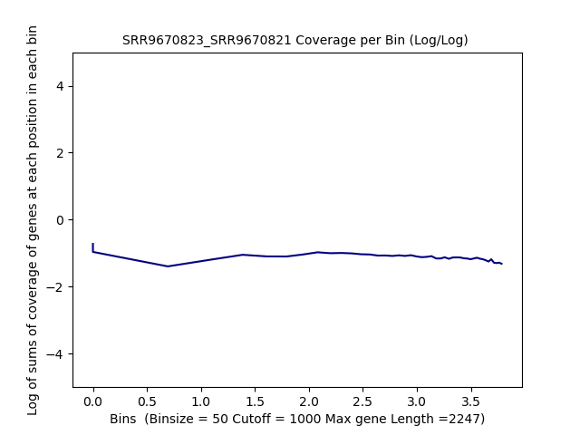
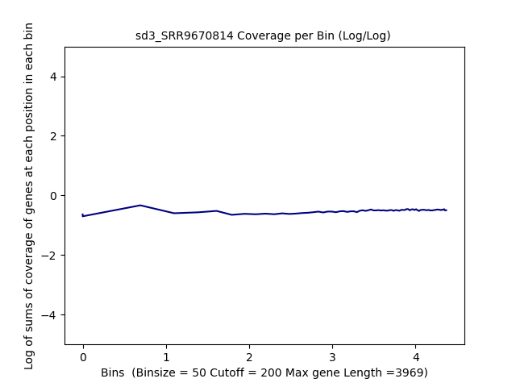
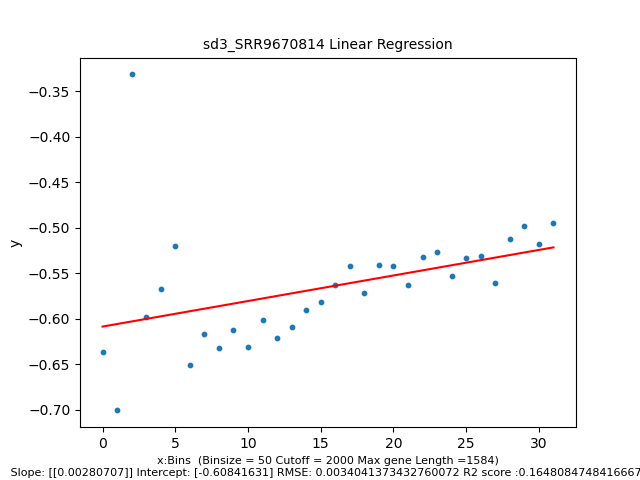

====================================================
**Case Studies**
===================================================

**Dataset 4:GSE134152**
------------------------

SRR9670822/SRR9670820
**************************

Histogram of Genes' Length 
###############################

.. raw:: html
    

Log Linear Plots 
###################

Where cutoff is the minimum no. of genes to support a position to be considered in bins. Max gene length is the longest gene considered corresponding to this cutoff. 

.. image:: SRR9670822_SRR9670820_50_0.LogLinear.png 
   :width: 20%

.. image:: SRR9670822_SRR9670820_50_200.LogLinear.png
   :width: 20%

.. image:: SRR9670822_SRR9670820_50_500.LogLinear.png
   :width: 20%

.. raw:: html
    

Log Log Plots 
###################

.. image:: SRR9670822_SRR9670820_50_0.LogLog.png 
   :width: 20%

.. image:: SRR9670822_SRR9670820_50_500.LogLog.png
   :width: 20%

.. image:: SRR9670822_SRR9670820_50_1000.LogLog.png
   :width: 20%

.. image:: SRR9670822_SRR9670820_50_2000.LogLog.png
   :width: 20%

.. raw:: html
    

Linear Regression 
###################

.. image:: SRR9670822_SRR9670820_50_0.LR.png 
   :width: 20%

.. image:: SRR9670822_SRR9670820_50_200.LR.png
   :width: 20%

.. image:: SRR9670822_SRR9670820_50_2000.LR.png
   :width: 20%

.. raw:: html
    

SRR9670823/SRR9670821
**************************

Histogram of Genes' Length 
###############################

.. raw:: html
    

Log Linear Plots 
###################

Where cutoff is the minimum no. of genes to support a position to be considered in bins. Max gene length is the longest gene considered corresponding to this cutoff. 

.. image:: SRR9670823_SRR9670821_50_0.LogLinear.png 
   :width: 20%

.. raw:: html
    

Log Log Plots 
###################

.. image:: SRR9670823_SRR9670821_50_0.LogLog.png 
   :width: 20%

.. image:: SRR9670823_SRR9670821_50_100.LogLog.png  
   :width: 20%  

.. image:: SRR9670823_SRR9670821_50_200.LogLog.png  
   :width: 20%

.. image:: SRR9670823_SRR9670821_50_2000.LogLog.png
   :width: 20%

.. raw:: html
    

Linear Regression 
###################

.. image:: SRR9670823_SRR9670821_50_0.LR.png 
   :width: 20%

.. image:: SRR9670823_SRR9670821_50_100.LR.png  
   :width: 20% 

.. image:: SRR9670823_SRR9670821_50_1000.LR.png
   :width: 20%

.. raw:: html
    

(SRR9670816 +SRR9670817)/SRR9670814
*************************************

Histogram of Genes' Length 
###############################

.. raw:: html
    

Log Linear Plots 
###################

Where cutoff is the minimum no. of genes to support a position to be considered in bins. Max gene length is the longest gene considered corresponding to this cutoff. 

.. image:: sd3_SRR9670814_50_0.LogLinear.png 
   :width: 20%

.. image:: sd3_SRR9670814_50_100.LogLinear.png  
   :width: 20% 

.. image:: sd3_SRR9670814_50_1000.LogLinear.png
   :width: 20%

.. image:: sd3_SRR9670814_50_2000.LogLinear.png
   :width: 20%

.. raw:: html
    

Log Log Plots 
###################

.. image:: sd3_SRR9670814_50_0.LogLog.png 
   :width: 20%

.. image:: sd3_SRR9670814_50_100.LogLog.png  
   :width: 20%  

.. image:: sd3_SRR9670814_50_2000.LogLog.png
   :width: 20%

.. raw:: html
    

Linear Regression 
###################

.. image:: sd3_SRR9670814_50_500.LR.png
   :width: 20%

.. raw:: html
    

(SRR9670818 + SRR9670819)/SRR9670815
*****************************************

Histogram of Genes' Length 
###############################

.. image:: gr4_SRR9670815.50.Length.Histogram.png  
   :width: 400 

.. raw:: html
    

Log Linear Plots 
###################

Where cutoff is the minimum no. of genes to support a position to be considered in bins. Max gene length is the longest gene considered corresponding to this cutoff. 

.. image:: gr4_SRR9670815_50_0.LogLinear.png 
   :width: 20%

.. image:: gr4_SRR9670815_50_200.LogLinear.png
   :width: 20%

.. image:: gr4_SRR9670815_50_2000.LogLinear.png
   :width: 20%

.. raw:: html
    

Log Log Plots 
###################

.. image:: gr4_SRR9670815_50_0.LogLog.png 
   :width: 20%

.. image:: gr4_SRR9670815_50_500.LogLog.png
   :width: 20%

.. raw:: html
    

Linear Regression 
###################

.. image:: gr4_SRR9670815_50_0.LR.png 
   :width: 20%

.. image:: gr4_SRR9670815_50_200.LR.png
   :width: 20%

.. image:: gr4_SRR9670815_50_500.LR.png
   :width: 20%

.. image:: gr4_SRR9670815_50_1000.LR.png
   :width: 20%

.. raw:: html
    

