====================================================
**Dataset 5:GSE134152:GSM3938060/GSM3938058**
====================================================

**Main**
---------------

**SRR9670823/SRR9670821**

Histogram of Genes' Length

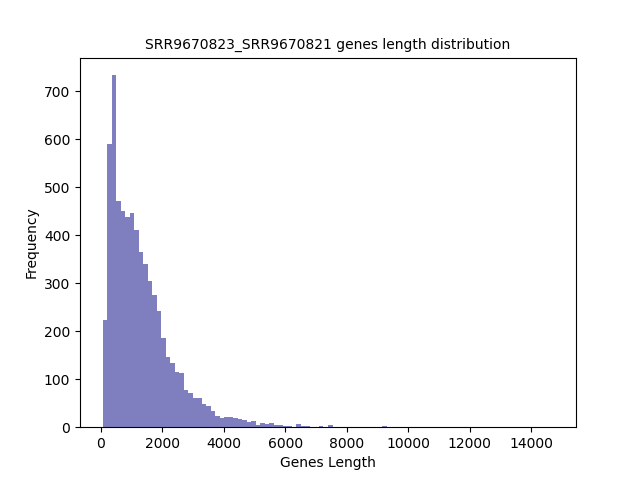

.. raw:: html
    

**Stats**

**Adapters confirmed by Authors**

+-------------+------------+------------------------+
| Sample      | mRNA/FP    | Unique Alignment       |
+=============+============+========================+
|  SRR9670821 |    mRNA    |       34.75%           |
+-------------+------------+------------------------+
| SRR9670823  |     FP     |       35.40%           |
+-------------+------------+------------------------+

**Running on a subset of short genes using --subset or -s**

Log Linear Plots
###################

.. image:: SRR9670823_SRR9670821.yeastGenes500_50_0_0.LogLinear.png
   :width: 20%

.. image:: SRR9670823_SRR9670821.yeastGenes1000_50_0_0.LogLinear.png
   :width: 20%

.. image:: SRR9670823_SRR9670821.yeastGenes2000_50_0_0.LogLinear.png
   :width: 20%

.. raw:: html
    

Log Log Plots
###################

.. image:: SRR9670823_SRR9670821.yeastGenes500_50_0_0.LogLog.png
   :width: 20%

.. image:: SRR9670823_SRR9670821.yeastGenes1000_50_0_0.LogLog.png
   :width: 20%

.. image:: SRR9670823_SRR9670821.yeastGenes2000_50_0_0.LogLog.png
   :width: 20%

.. raw:: html
    

Linear Regression Plots
##########################

.. image:: SRR9670823_SRR9670821.yeastGenes500_50_0_0.LR.png
   :width: 20%

.. image:: SRR9670823_SRR9670821.yeastGenes1000_50_0_0.LR.png
   :width: 20%

.. image:: SRR9670823_SRR9670821.yeastGenes2000_50_0_0.LR.png
   :width: 20%

.. raw:: html
    

**Filtering based on End --end or -e**

Here I use --end or -e as a cutoff for the last bin used in plotting, if e =0, all bins considered, if e = 10 then the last 10 bins are discarded in plottig. 
This is another way of discarding noise. 

Log Linear Plots
###################

.. image:: SRR9670823_SRR9670821_50_0_50.LogLinear.png
   :width: 25%

.. image:: SRR9670823_SRR9670821_50_0_100.LogLinear.png
   :width: 25%

.. image:: SRR9670823_SRR9670821_50_0_150.LogLinear.png
   :width: 25%

.. image:: SRR9670823_SRR9670821_50_0_200.LogLinear.png
   :width: 25%

.. raw:: html
    

Log Log Plots
###################

.. image:: SRR9670823_SRR9670821_50_0_50.LogLog.png
   :width: 25%

.. image:: SRR9670823_SRR9670821_50_0_100.LogLog.png
   :width: 25%

.. image:: SRR9670823_SRR9670821_50_0_150.LogLog.png
   :width: 25%

.. image:: SRR9670823_SRR9670821_50_0_200.LogLog.png
   :width: 25%

.. raw:: html
    

Linear Regression Plots
#########################

.. image:: SRR9670823_SRR9670821_50_0_50.LR.png
   :width: 25%

.. image:: SRR9670823_SRR9670821_50_0_100.LR.png
   :width: 25%

.. image:: SRR9670823_SRR9670821_50_0_150.LR.png
   :width: 25%

.. image:: SRR9670823_SRR9670821_50_0_200.LR.png
   :width: 25%

.. raw:: html
    

**Filtering based on cutoff --cutoff or -c** 

Where cutoff is the minimum no. of genes to support a position to be considered in bins. Max gene length is the longest gene considered corresponding to this cutoff.

Log Linear Plots 
###################

.. image:: SRR9670823_SRR9670821_50_0_0.LogLinear.png 
   :width: 20%

.. image:: SRR9670823_SRR9670821_50_100_0.LogLinear.png  
   :width: 20% 

.. image:: SRR9670823_SRR9670821_50_200_0.LogLinear.png
   :width: 20%

.. image:: SRR9670823_SRR9670821_50_500_0.LogLinear.png
   :width: 20%

.. image:: SRR9670823_SRR9670821_50_1000_0.LogLinear.png
   :width: 20%

.. image:: SRR9670823_SRR9670821_50_2000_0.LogLinear.png
   :width: 20%

.. raw:: html
    

Log Log Plots 
###################

.. image:: SRR9670823_SRR9670821_50_0_0.LogLog.png 
   :width: 20%

.. image:: SRR9670823_SRR9670821_50_100_0.LogLog.png  
   :width: 20%  

.. image:: SRR9670823_SRR9670821_50_200_0.LogLog.png  
   :width: 20%

.. image:: SRR9670823_SRR9670821_50_500_0.LogLog.png
   :width: 20%

.. image:: SRR9670823_SRR9670821_50_1000_0.LogLog.png
   :width: 20%

.. image:: SRR9670823_SRR9670821_50_2000_0.LogLog.png
   :width: 20%

.. raw:: html
    

Linear Regression 
###################

.. image:: SRR9670823_SRR9670821_50_0_0.LR.png 
   :width: 20%

.. image:: SRR9670823_SRR9670821_50_100_0.LR.png  
   :width: 20% 

.. image:: SRR9670823_SRR9670821_50_200_0.LR.png
   :width: 20%

.. image:: SRR9670823_SRR9670821_50_500_0.LR.png
   :width: 20%

.. image:: SRR9670823_SRR9670821_50_1000_0.LR.png
   :width: 20%

.. image:: SRR9670823_SRR9670821_50_2000_0.LR.png
   :width: 20%

.. raw:: html
    

**TPM** 
-------------------------

**TPM > 50**

Histogram of Genes' Length 
###############################

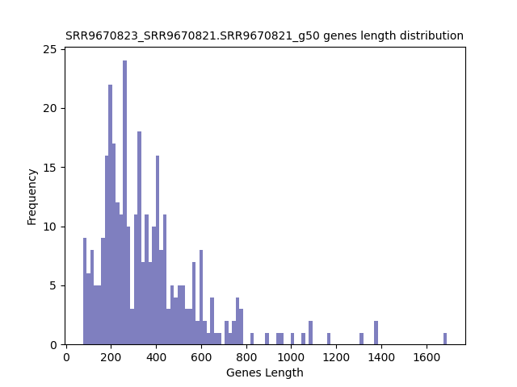

.. raw:: html
    

Log Linear Plots 
###################

.. image:: SRR9670823_SRR9670821.SRR9670821_g50_50_0_0.LogLinear.png 
   :width: 400

.. raw:: html
    

Log Log Plots 
###################

.. image:: SRR9670823_SRR9670821.SRR9670821_g50_50_0_0.LogLog.png 
   :width: 400

.. raw:: html
    

Linear Regression 
###################

.. image:: SRR9670823_SRR9670821.SRR9670821_g50_50_0_0.LR.png 
   :width: 400

.. raw:: html
    

**TPM < 50**

Histogram of Genes' Length 
###############################

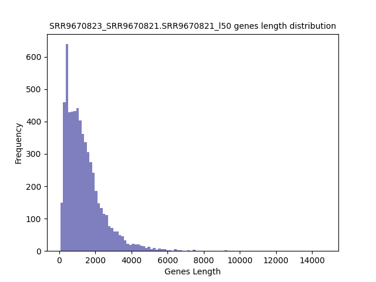

.. raw:: html
    

Log Linear Plots 
###################

.. image:: SRR9670823_SRR9670821.SRR9670821_l50_50_0_0.LogLinear.png 
   :width: 400

.. raw:: html
    

Log Log Plots 
###################

.. image:: SRR9670823_SRR9670821.SRR9670821_l50_50_0_0.LogLog.png 
   :width: 400

.. raw:: html
    

Linear Regression 
###################

.. image:: SRR9670823_SRR9670821.SRR9670821_l50_50_0_0.LR.png 
   :width: 400

.. raw:: html
    

**SNPs** 
-----------------------

**Genes with Zero SNPs**

Histogram of Genes' Length 
###############################

.. image:: SRR9670823_SRR9670821.SRR9670821_zerosnps.Length.Histogram.png 
   :width: 400 

.. raw:: html
    

Log Linear Plots 
###################

.. image:: SRR9670823_SRR9670821.SRR9670821_zerosnps_50_0_0.LogLinear.png 
   :width: 400

.. raw:: html
    

Log Log Plots 
###################

.. image:: SRR9670823_SRR9670821.SRR9670821_zerosnps_50_0_0.LogLog.png 
   :width: 400

.. raw:: html
    

Linear Regression 
###################

.. image:: SRR9670823_SRR9670821.SRR9670821_zerosnps_50_0_0.LR.png 
   :width: 400

.. raw:: html
    

**Genes with at least one SNP**

Histogram of Genes' Length 
###############################

.. image:: SRR9670823_SRR9670821.SRR9670821_1snps.Length.Histogram.png 
   :width: 400 

.. raw:: html
    

Log Linear Plots 
###################

.. image:: SRR9670823_SRR9670821.SRR9670821_1snps_50_0_0.LogLinear.png 
   :width: 400

.. raw:: html
    

Log Log Plots 
###################

.. image:: SRR9670823_SRR9670821.SRR9670821_1snps_50_0_0.LogLog.png 
   :width: 400

.. raw:: html
    

Linear Regression 
###################

.. image:: SRR9670823_SRR9670821.SRR9670821_1snps_50_0_0.LR.png 
   :width: 400

.. raw:: html
    

**GO** 
-----------------------

GO0006119
*************

**Oxidative phosphorylation Gene Ontology Term**

Histogram of Genes' Length 
###############################

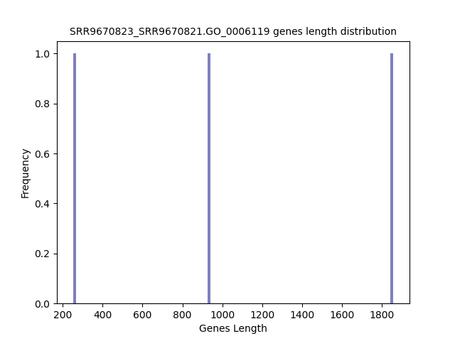

.. raw:: html
    

Log Linear Plots 
###################

.. image:: SRR9670823_SRR9670821.GO_0006119_50_0_0.LogLinear.png 
   :width: 400

.. raw:: html
    

Log Log Plots 
###################

.. image:: SRR9670823_SRR9670821.GO_0006119_50_0_0.LogLog.png 
   :width: 400

.. raw:: html
    

Linear Regression 
###################

.. image:: SRR9670823_SRR9670821.GO_0006119_50_0_0.LR.png 
   :width: 400

.. raw:: html
    

GO0006406
************* 
**mRNA export from nucleus** 

Histogram of Genes' Length 
###############################

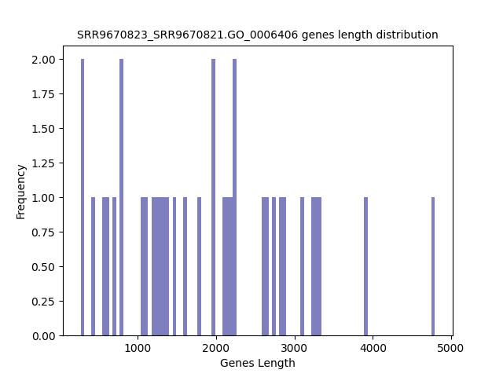

.. raw:: html
    

Log Linear Plots 
###################

.. image:: SRR9670823_SRR9670821.GO_0006406_50_0_0.LogLinear.png 
   :width: 400

.. raw:: html
    

Log Log Plots 
###################

.. image:: SRR9670823_SRR9670821.GO_0006406_50_0_0.LogLog.png 
   :width: 400

.. raw:: html
    

Linear Regression 
###################

.. image:: SRR9670823_SRR9670821.GO_0006406_50_0_0.LR.png 
   :width: 400

.. raw:: html
    

GO0006412
*************

**Translation** 

Histogram of Genes' Length 
###############################

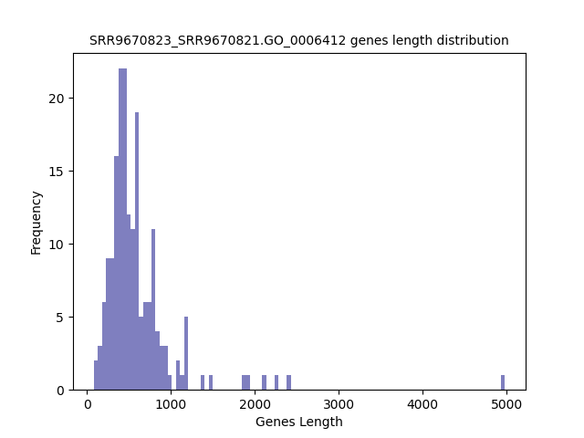

.. raw:: html
    

Log Linear Plots 
###################

.. image:: SRR9670823_SRR9670821.GO_0006412_50_0_0.LogLinear.png 
   :width: 400

.. raw:: html
    

Log Log Plots 
###################

.. image:: SRR9670823_SRR9670821.GO_0006412_50_0_0.LogLog.png 
   :width: 400

.. raw:: html
    

Linear Regression 
###################

.. image:: SRR9670823_SRR9670821.GO_0006412_50_0_0.LR.png 
   :width: 400

.. raw:: html
    

GO0006950
*************

**Response to stress** 

Histogram of Genes' Length 
###############################

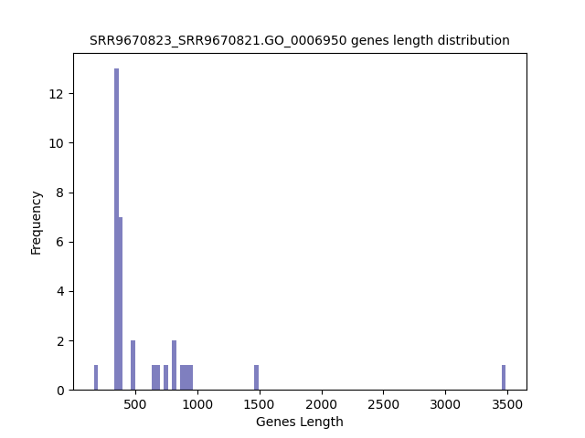

.. raw:: html
    

Log Linear Plots 
###################

.. image:: SRR9670823_SRR9670821.GO_0006950_50_0_0.LogLinear.png 
   :width: 400

.. raw:: html
    

Log Log Plots 
###################

.. image:: SRR9670823_SRR9670821.GO_0006950_50_0_0.LogLog.png 
   :width: 400

.. raw:: html
    

Linear Regression 
###################

.. image:: SRR9670823_SRR9670821.GO_0006950_50_0_0.LR.png 
   :width: 400

.. raw:: html
    

GO0009651
*************

**Response to salt stress**

Histogram of Genes' Length 
###############################

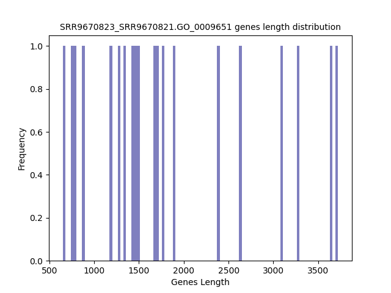

.. raw:: html
    

Log Linear Plots 
###################

.. image:: SRR9670823_SRR9670821.GO_0009651_50_0_0.LogLinear.png 
   :width: 400

.. raw:: html
    

Log Log Plots 
###################

.. image:: SRR9670823_SRR9670821.GO_0009651_50_0_0.LogLog.png 
   :width: 400

.. raw:: html
    

Linear Regression 
###################

.. image:: SRR9670823_SRR9670821.GO_0009651_50_0_0.LR.png 
   :width: 400

.. raw:: html
    

GO0016458
*************

**Gene silencing**

Histogram of Genes' Length 
###############################

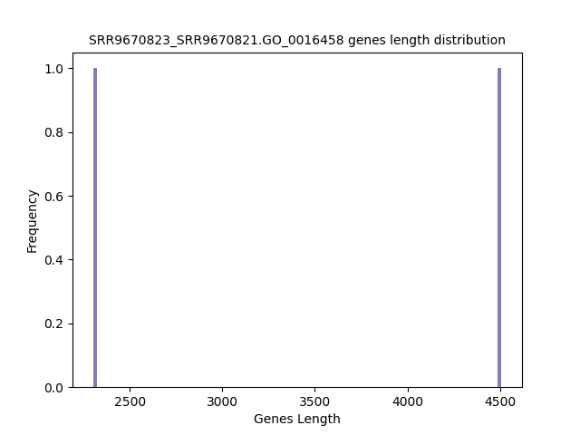

.. raw:: html
    

Log Linear Plots 
###################

.. image:: SRR9670823_SRR9670821.GO_0016458_50_0_0.LogLinear.png 
   :width: 400

.. raw:: html
    

Log Log Plots 
###################

.. image:: SRR9670823_SRR9670821.GO_0016458_50_0_0.LogLog.png 
   :width: 400

.. raw:: html
    

Linear Regression 
###################

.. image:: SRR9670823_SRR9670821.GO_0016458_50_0_0.LR.png 
   :width: 400

.. raw:: html
    

GO0031047
*************

**Gene silencing by RNA**

Histogram of Genes' Length 
###############################

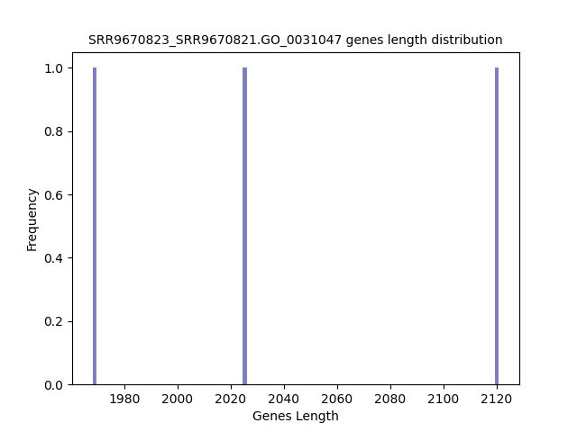

.. raw:: html
    

Log Linear Plots 
###################

.. image:: SRR9670823_SRR9670821.GO_0031047_50_0_0.LogLinear.png 
   :width: 400

.. raw:: html
    

Log Log Plots 
###################

.. image:: SRR9670823_SRR9670821.GO_0031047_50_0_0.LogLog.png 
   :width: 400

.. raw:: html
    

Linear Regression 
###################

.. image:: SRR9670823_SRR9670821.GO_0031047_50_0_0.LR.png 
   :width: 400

.. raw:: html
    

GO0031990
************

**Cellular Response to heat** 

Histogram of Genes' Length 
###############################

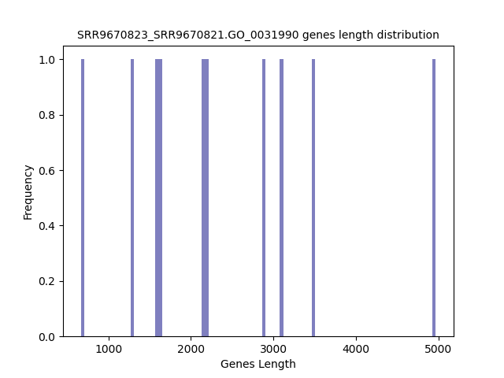

.. raw:: html
    

Log Linear Plots 
###################

.. image:: SRR9670823_SRR9670821.GO_0031990_50_0_0.LogLinear.png 
   :width: 400

.. raw:: html
    

Log Log Plots 
###################

.. image:: SRR9670823_SRR9670821.GO_0031990_50_0_0.LogLog.png 
   :width: 400

.. raw:: html
    

Linear Regression 
###################

.. image:: SRR9670823_SRR9670821.GO_0031990_50_0_0.LR.png 
   :width: 400

.. raw:: html
    

GO0042254
*************

**Ribosome biogenesis**

Histogram of Genes' Length 
###############################

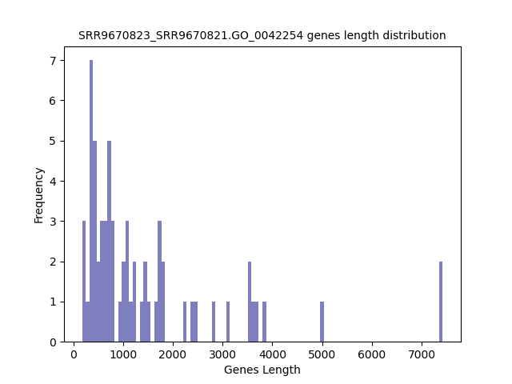

.. raw:: html
    

Log Linear Plots 
###################

.. image:: SRR9670823_SRR9670821.GO_0042254_50_0_0.LogLinear.png 
   :width: 400

.. raw:: html
    

Log Log Plots 
###################

.. image:: SRR9670823_SRR9670821.GO_0042254_50_0_0.LogLog.png 
   :width: 400

.. raw:: html
    

Linear Regression 
###################

.. image:: SRR9670823_SRR9670821.GO_0042254_50_0_0.LR.png 
   :width: 400

.. raw:: html
    

**Orthologous** 
-----------------------------

**Human**

Histogram of Genes' Length 
###############################

.. image:: SRR9670823_SRR9670821.yeastorthuman.Length.Histogram.png 
   :width: 400 

.. raw:: html
    

Log Linear Plots 
###################

.. image:: SRR9670823_SRR9670821.yeastorthuman_50_0_0.LogLinear.png 
   :width: 400

.. raw:: html
    

Log Log Plots 
###################

.. image:: SRR9670823_SRR9670821.yeastorthuman_50_0_0.LogLog.png 
   :width: 400

.. raw:: html
    

Linear Regression 
###################

.. image:: SRR9670823_SRR9670821.yeastorthuman_50_0_0.LR.png 
   :width: 400

.. raw:: html
    

**Mouse**

Histogram of Genes' Length 
###############################

.. image:: SRR9670823_SRR9670821.yeastortmouse.Length.Histogram.png 
   :width: 400 

.. raw:: html
    

Log Linear Plots 
###################

.. image:: SRR9670823_SRR9670821.yeastortmouse_50_0_0.LogLinear.png 
   :width: 400

.. raw:: html
    

Log Log Plots 
###################

.. image:: SRR9670823_SRR9670821.yeastortmouse_50_0_0.LogLog.png 
   :width: 400

.. raw:: html
    

Linear Regression 
###################

.. image:: SRR9670823_SRR9670821.yeastortmouse_50_0_0.LR.png 
   :width: 400

.. raw:: html
    

**Chromosomes** 
----------------------------

ChrI

Histogram of Genes' Length 
###############################

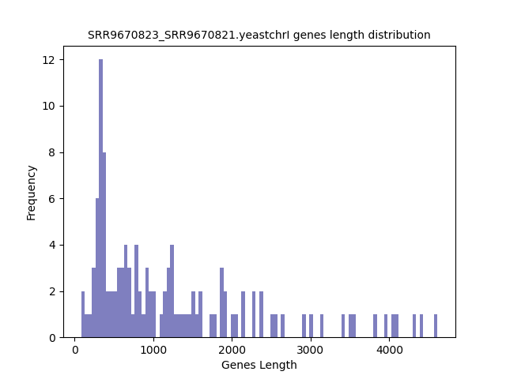

.. raw:: html
    

Log Linear Plots 
###################

.. image:: SRR9670823_SRR9670821.yeastchrI_50_0_0.LogLinear.png 
   :width: 400

.. raw:: html
    

Log Log Plots 
###################

.. image:: SRR9670823_SRR9670821.yeastchrI_50_0_0.LogLog.png 
   :width: 400

.. raw:: html
    

Linear Regression 
###################

.. image:: SRR9670823_SRR9670821.yeastchrI_50_0_0.LR.png 
   :width: 400

.. raw:: html
    

ChrII

Histogram of Genes' Length 
###############################

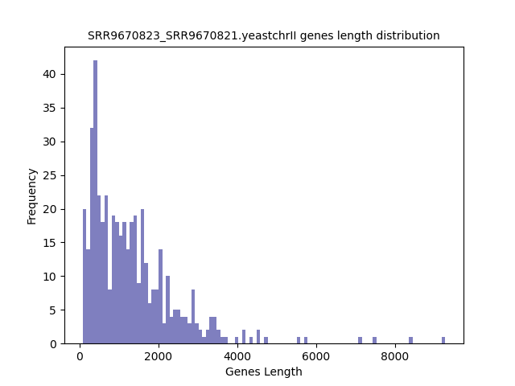

.. raw:: html
    

Log Linear Plots 
###################

.. image:: SRR9670823_SRR9670821.yeastchrII_50_0_0.LogLinear.png 
   :width: 400

.. raw:: html
    

Log Log Plots 
###################

.. image:: SRR9670823_SRR9670821.yeastchrII_50_0_0.LogLog.png 
   :width: 400

.. raw:: html
    

Linear Regression 
###################

.. image:: SRR9670823_SRR9670821.yeastchrII_50_0_0.LR.png 
   :width: 400

.. raw:: html
    

ChrIII

Histogram of Genes' Length 
###############################

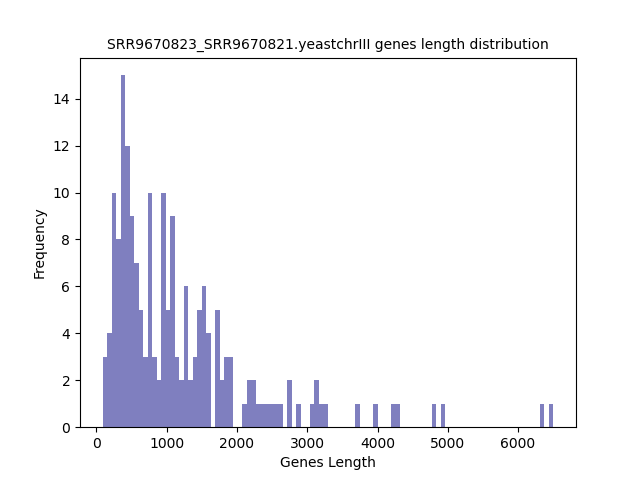

.. raw:: html
    

Log Linear Plots 
###################

.. image:: SRR9670823_SRR9670821.yeastchrIII_50_0_0.LogLinear.png 
   :width: 400

.. raw:: html
    

Log Log Plots 
###################

.. image:: SRR9670823_SRR9670821.yeastchrIII_50_0_0.LogLog.png 
   :width: 400

.. raw:: html
    

Linear Regression 
###################

.. image:: SRR9670823_SRR9670821.yeastchrIII_50_0_0.LR.png 
   :width: 400

.. raw:: html
    

ChrIV

Histogram of Genes' Length 
###############################

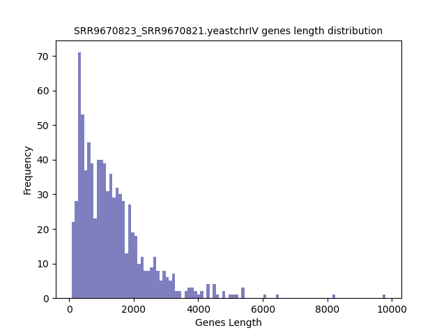

.. raw:: html
    

Log Linear Plots 
###################

.. image:: SRR9670823_SRR9670821.yeastchrIV_50_0_0.LogLinear.png 
   :width: 400

.. raw:: html
    

Log Log Plots 
###################

.. image:: SRR9670823_SRR9670821.yeastchrIV_50_0_0.LogLog.png 
   :width: 400

.. raw:: html
    

Linear Regression 
###################

.. image:: SRR9670823_SRR9670821.yeastchrIV_50_0_0.LR.png 
   :width: 400

.. raw:: html
    

ChrIX

Histogram of Genes' Length 
###############################

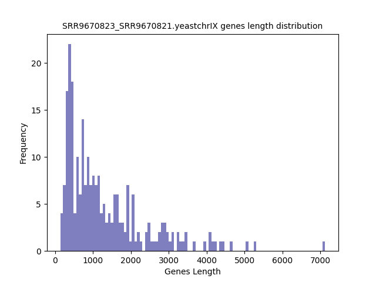

.. raw:: html
    

Log Linear Plots 
###################

.. image:: SRR9670823_SRR9670821.yeastchrIX_50_0_0.LogLinear.png 
   :width: 400

.. raw:: html
    

Log Log Plots 
###################

.. image:: SRR9670823_SRR9670821.yeastchrIX_50_0_0.LogLog.png 
   :width: 400

.. raw:: html
    

Linear Regression 
###################

.. image:: SRR9670823_SRR9670821.yeastchrIX_50_0_0.LR.png 
   :width: 400

.. raw:: html
    

ChrVIII

Histogram of Genes' Length 
###############################

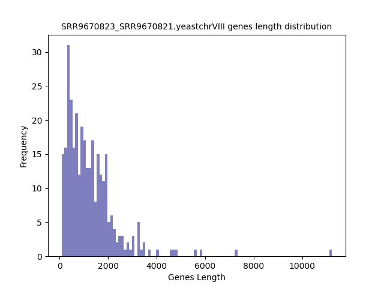

.. raw:: html
    

Log Linear Plots 
###################

.. image:: SRR9670823_SRR9670821.yeastchrVIII_50_0_0.LogLinear.png 
   :width: 400

.. raw:: html
    

Log Log Plots 
###################

.. image:: SRR9670823_SRR9670821.yeastchrVIII_50_0_0.LogLog.png 
   :width: 400

.. raw:: html
    

Linear Regression 
###################

.. image:: SRR9670823_SRR9670821.yeastchrVIII_50_0_0.LR.png 
   :width: 400

.. raw:: html
    

ChrVII

Histogram of Genes' Length 
###############################

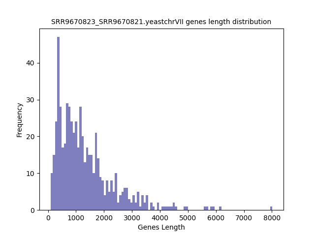

.. raw:: html
    

Log Linear Plots 
###################

.. image:: SRR9670823_SRR9670821.yeastchrVII_50_0_0.LogLinear.png 
   :width: 400

.. raw:: html
    

Log Log Plots 
###################

.. image:: SRR9670823_SRR9670821.yeastchrVII_50_0_0.LogLog.png 
   :width: 400

.. raw:: html
    

Linear Regression 
###################

.. image:: SRR9670823_SRR9670821.yeastchrVII_50_0_0.LR.png 
   :width: 400

.. raw:: html
    

ChrVI

Histogram of Genes' Length 
###############################

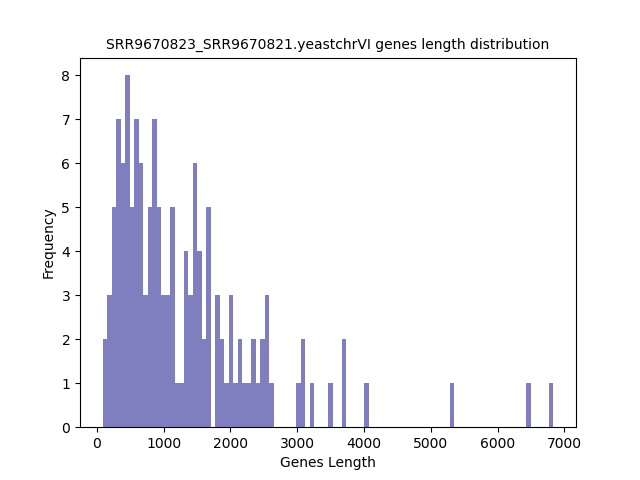

.. raw:: html
    

Log Linear Plots 
###################

.. image:: SRR9670823_SRR9670821.yeastchrVI_50_0_0.LogLinear.png 
   :width: 400

.. raw:: html
    

Log Log Plots 
###################

.. image:: SRR9670823_SRR9670821.yeastchrVI_50_0_0.LogLog.png 
   :width: 400

.. raw:: html
    

Linear Regression 
###################

.. image:: SRR9670823_SRR9670821.yeastchrVI_50_0_0.LR.png 
   :width: 400

.. raw:: html
    

ChrV

Histogram of Genes' Length 
###############################

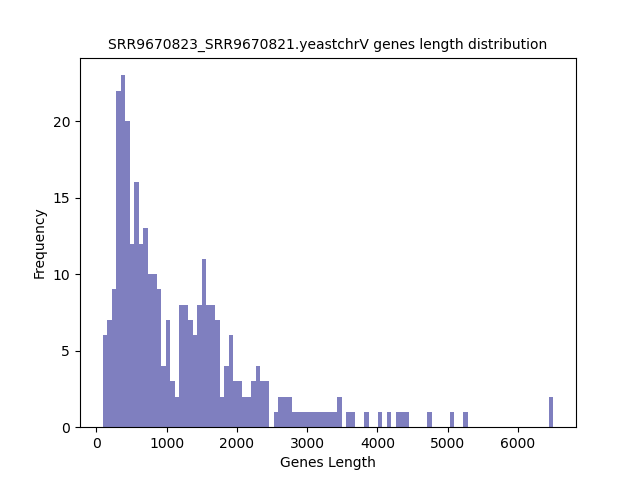

.. raw:: html
    

Log Linear Plots 
###################

.. image:: SRR9670823_SRR9670821.yeastchrV_50_0_0.LogLinear.png 
   :width: 400

.. raw:: html
    

Log Log Plots 
###################

.. image:: SRR9670823_SRR9670821.yeastchrV_50_0_0.LogLog.png 
   :width: 400

.. raw:: html
    

Linear Regression 
###################

.. image:: SRR9670823_SRR9670821.yeastchrV_50_0_0.LR.png 
   :width: 400

.. raw:: html
    

ChrXIII

Histogram of Genes' Length 
###############################

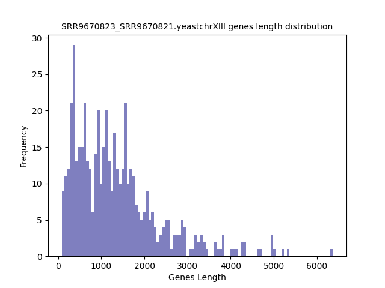

.. raw:: html
    

Log Linear Plots 
###################

.. image:: SRR9670823_SRR9670821.yeastchrXIII_50_0_0.LogLinear.png 
   :width: 400

.. raw:: html
    

Log Log Plots 
###################

.. image:: SRR9670823_SRR9670821.yeastchrXIII_50_0_0.LogLog.png 
   :width: 400

.. raw:: html
    

Linear Regression 
###################

.. image:: SRR9670823_SRR9670821.yeastchrXIII_50_0_0.LR.png 
   :width: 400

.. raw:: html
    

ChrXII

Histogram of Genes' Length 
###############################

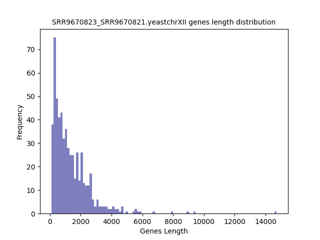

.. raw:: html
    

Log Linear Plots 
###################

.. image:: SRR9670823_SRR9670821.yeastchrXII_50_0_0.LogLinear.png 
   :width: 400

.. raw:: html
    

Log Log Plots 
###################

.. image:: SRR9670823_SRR9670821.yeastchrXII_50_0_0.LogLog.png 
   :width: 400

.. raw:: html
    

Linear Regression 
###################

.. image:: SRR9670823_SRR9670821.yeastchrXII_50_0_0.LR.png 
   :width: 400

.. raw:: html
    

ChrXI

Histogram of Genes' Length 
###############################

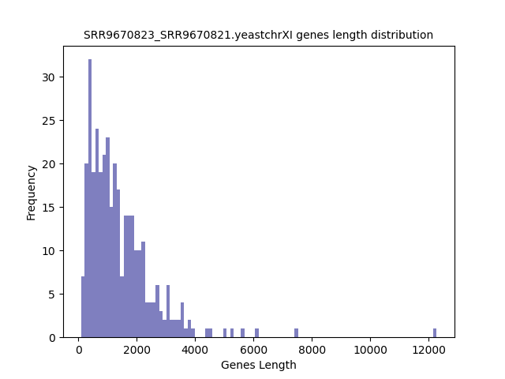

.. raw:: html
    

Log Linear Plots 
###################

.. image:: SRR9670823_SRR9670821.yeastchrXI_50_0_0.LogLinear.png 
   :width: 400

.. raw:: html
    

Log Log Plots 
###################

.. image:: SRR9670823_SRR9670821.yeastchrXI_50_0_0.LogLog.png 
   :width: 400

.. raw:: html
    

Linear Regression 
###################

.. image:: SRR9670823_SRR9670821.yeastchrXI_50_0_0.LR.png 
   :width: 400

.. raw:: html
    

ChrXIV

Histogram of Genes' Length 
###############################

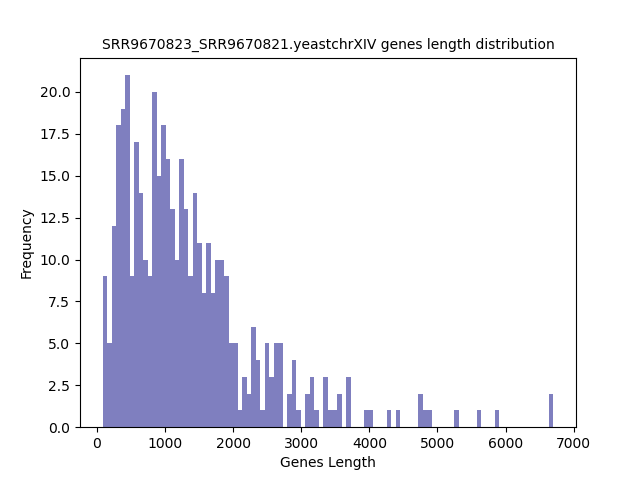

.. raw:: html
    

Log Linear Plots 
###################

.. image:: SRR9670823_SRR9670821.yeastchrXIV_50_0_0.LogLinear.png 
   :width: 400

.. raw:: html
    

Log Log Plots 
###################

.. image:: SRR9670823_SRR9670821.yeastchrXIV_50_0_0.LogLog.png 
   :width: 400

.. raw:: html
    

Linear Regression 
###################

.. image:: SRR9670823_SRR9670821.yeastchrXIV_50_0_0.LR.png 
   :width: 400

.. raw:: html
    

ChrX

Histogram of Genes' Length 
###############################

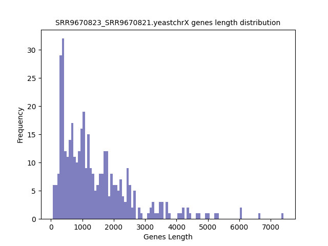

.. raw:: html
    

Log Linear Plots 
###################

.. image:: SRR9670823_SRR9670821.yeastchrX_50_0_0.LogLinear.png 
   :width: 400

.. raw:: html
    

Log Log Plots 
###################

.. image:: SRR9670823_SRR9670821.yeastchrX_50_0_0.LogLog.png 
   :width: 400

.. raw:: html
    

Linear Regression 
###################

.. image:: SRR9670823_SRR9670821.yeastchrX_50_0_0.LR.png 
   :width: 400

.. raw:: html
    

ChrXVI

Histogram of Genes' Length 
###############################

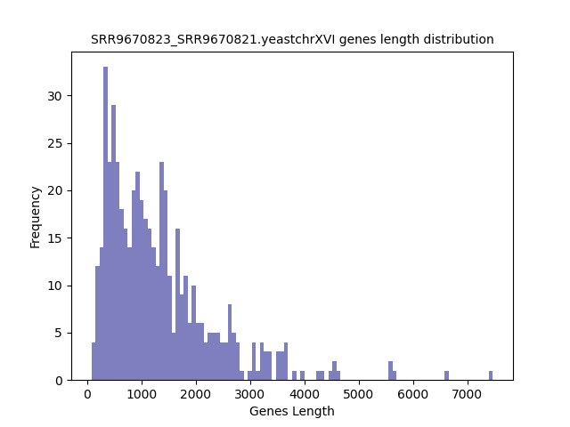

.. raw:: html
    

Log Linear Plots 
###################

.. image:: SRR9670823_SRR9670821.yeastchrXVI_50_0_0.LogLinear.png 
   :width: 400

.. raw:: html
    

Log Log Plots 
###################

.. image:: SRR9670823_SRR9670821.yeastchrXVI_50_0_0.LogLog.png 
   :width: 400

.. raw:: html
    

Linear Regression 
###################

.. image:: SRR9670823_SRR9670821.yeastchrXVI_50_0_0.LR.png 
   :width: 400

.. raw:: html
    

ChrXV

Histogram of Genes' Length 
###############################

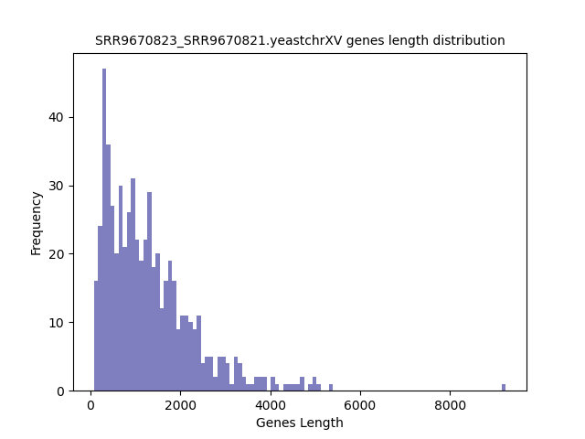

.. raw:: html
    

Log Linear Plots 
###################

.. image:: SRR9670823_SRR9670821.yeastchrXV_50_0_0.LogLinear.png 
   :width: 400

.. raw:: html
    

Log Log Plots 
###################

.. image:: SRR9670823_SRR9670821.yeastchrXV_50_0_0.LogLog.png 
   :width: 400

.. raw:: html
    

Linear Regression 
###################

.. image:: SRR9670823_SRR9670821.yeastchrXV_50_0_0.LR.png 
   :width: 400

.. raw:: html
    

