====================================================
**GSE134152:GO** 
====================================================

SRR9670822/SRR9670820
************************

GO0006119
------------
**Oxidative phosphorylation Gene Ontology Term**

Histogram of Genes' Length 
###############################

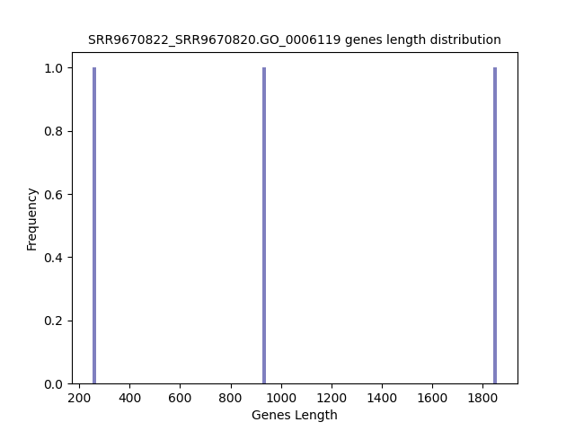

.. raw:: html
    

Log Linear Plots 
###################

Where cutoff is the minimum no. of genes to support a position to be considered in bins. Max gene length is the longest gene considered corresponding to this cutoff. 

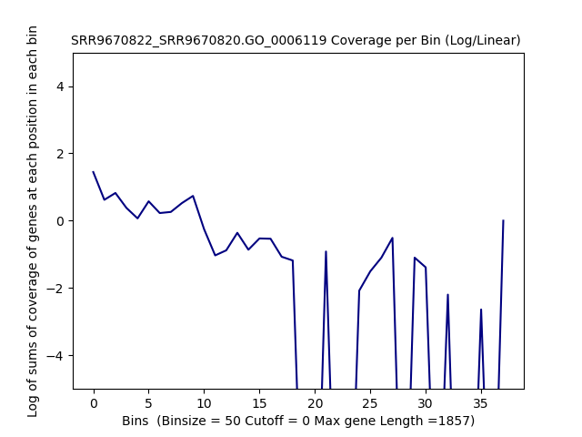

.. raw:: html
    

Log Log Plots 
###################

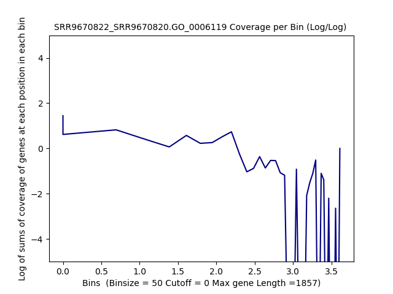

.. raw:: html
    

Linear Regression 
###################

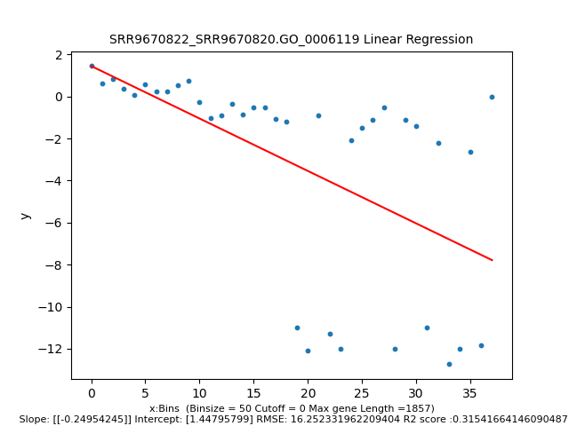

.. raw:: html
    

GO0006406
-------------
**mRNA export from nucleus** 

Histogram of Genes' Length 
###############################

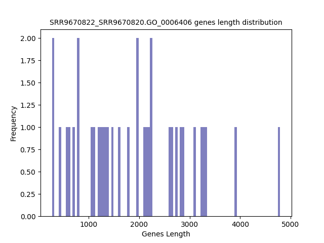

.. raw:: html
    

Log Linear Plots 
###################

Where cutoff is the minimum no. of genes to support a position to be considered in bins. Max gene length is the longest gene considered corresponding to this cutoff. 

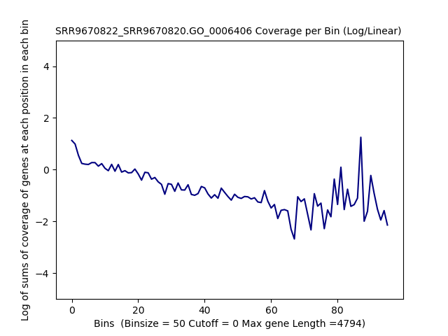

.. raw:: html
    

Log Log Plots 
###################

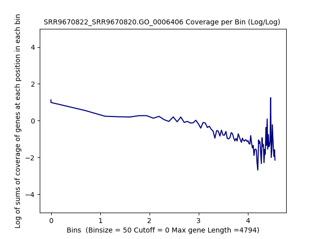

.. raw:: html
    

Linear Regression 
###################

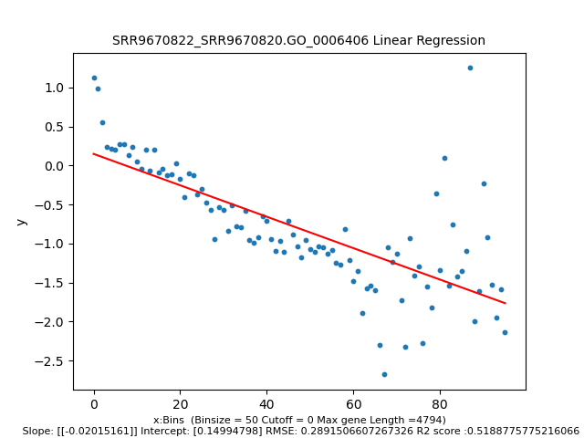

.. raw:: html
    

GO0006412
-------------
**Translation** 

Histogram of Genes' Length 
###############################

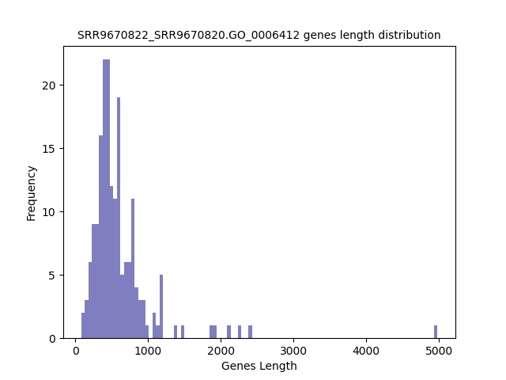

.. raw:: html
    

Log Linear Plots 
###################

Where cutoff is the minimum no. of genes to support a position to be considered in bins. Max gene length is the longest gene considered corresponding to this cutoff. 

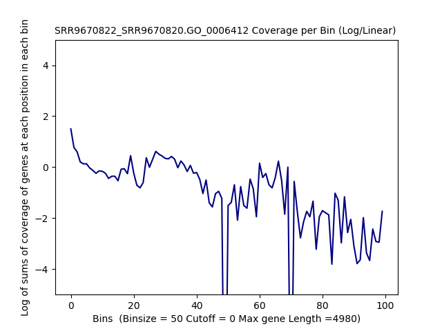

.. raw:: html
    

Log Log Plots 
###################

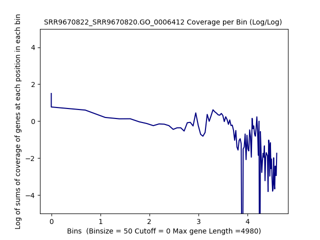

.. raw:: html
    

Linear Regression 
###################

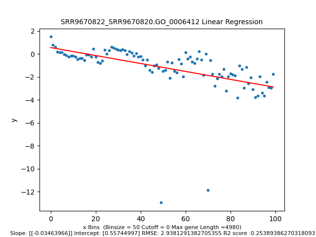

.. raw:: html
    

GO0006950
-------------
**Response to stress** 

Histogram of Genes' Length 
###############################

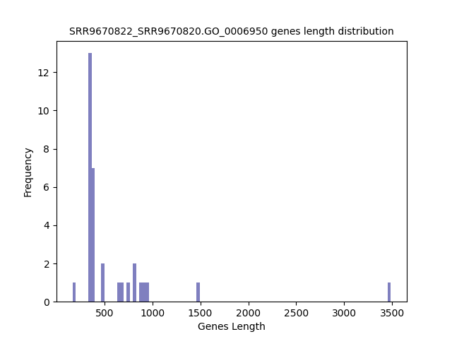

.. raw:: html
    

Log Linear Plots 
###################

Where cutoff is the minimum no. of genes to support a position to be considered in bins. Max gene length is the longest gene considered corresponding to this cutoff. 

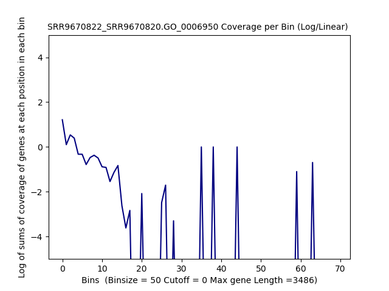

.. raw:: html
    

Log Log Plots 
###################

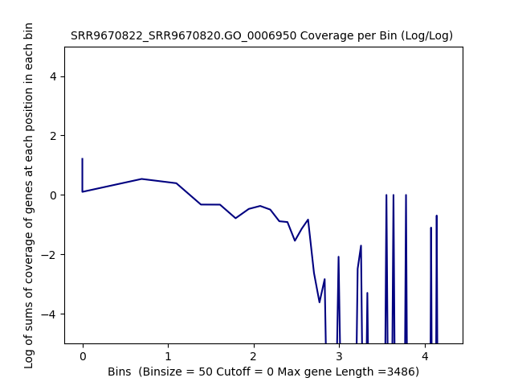

.. raw:: html
    

Linear Regression 
###################

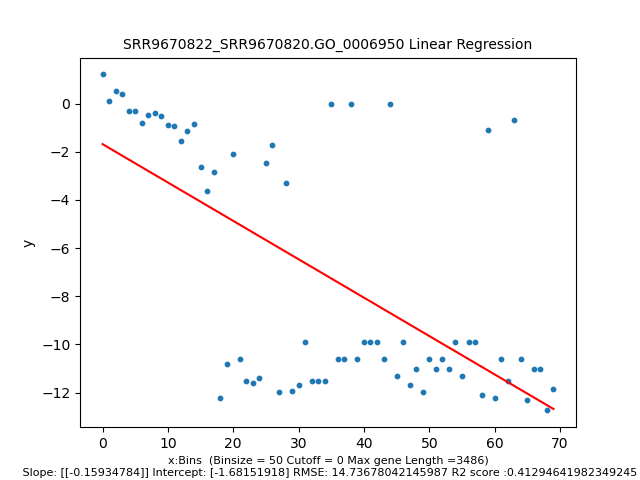

.. raw:: html
    

GO0009651
-------------
**Response to salt stress**

Histogram of Genes' Length 
###############################

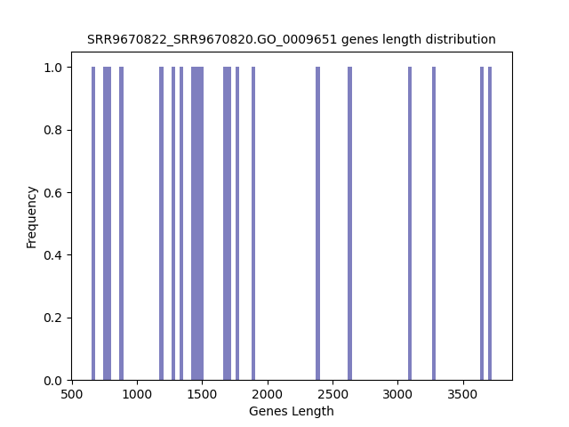

.. raw:: html
    

Log Linear Plots 
###################

Where cutoff is the minimum no. of genes to support a position to be considered in bins. Max gene length is the longest gene considered corresponding to this cutoff. 

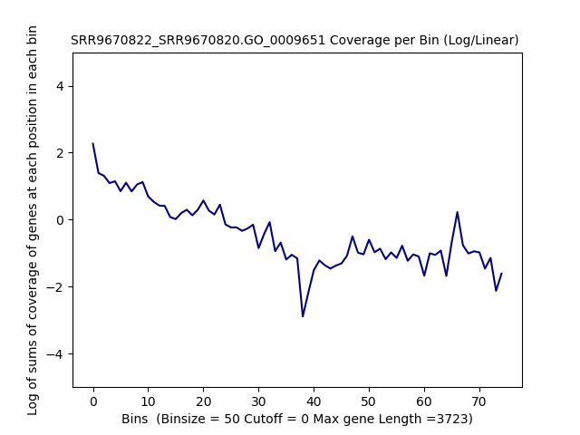

.. raw:: html
    

Log Log Plots 
###################

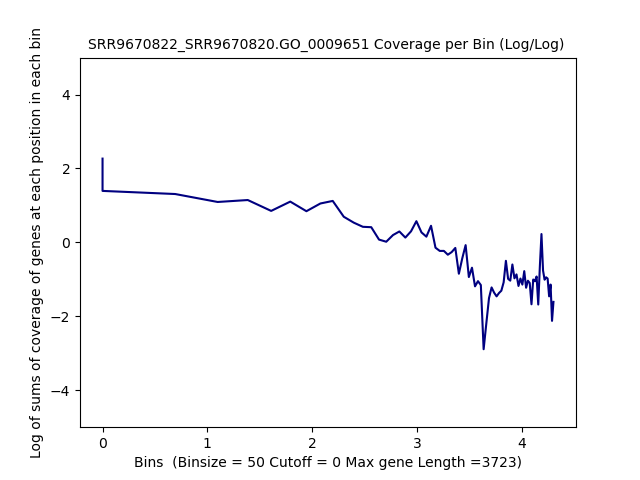

.. raw:: html
    

Linear Regression 
###################

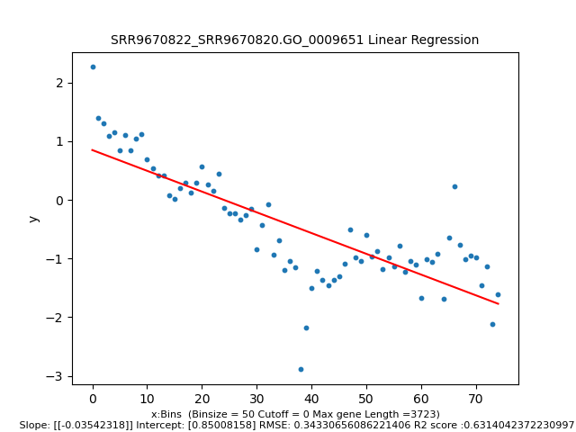

.. raw:: html
    

GO0016458
-------------
**Gene silencing**

Histogram of Genes' Length 
###############################

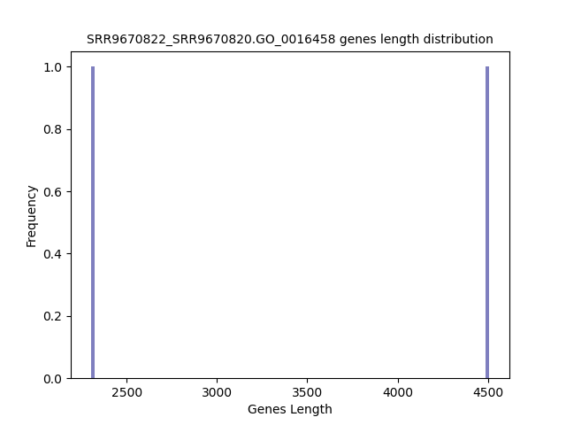

.. raw:: html
    

Log Linear Plots 
###################

Where cutoff is the minimum no. of genes to support a position to be considered in bins. Max gene length is the longest gene considered corresponding to this cutoff. 

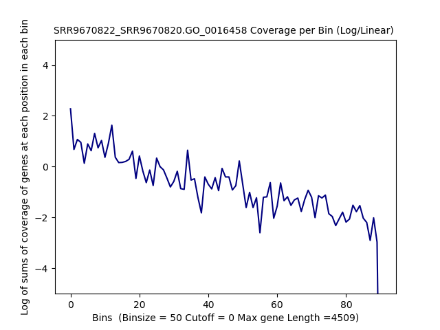

.. raw:: html
    

Log Log Plots 
###################

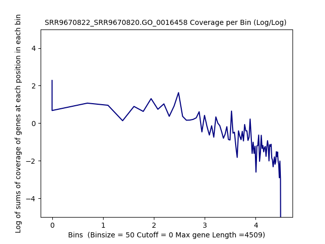

.. raw:: html
    

Linear Regression 
###################

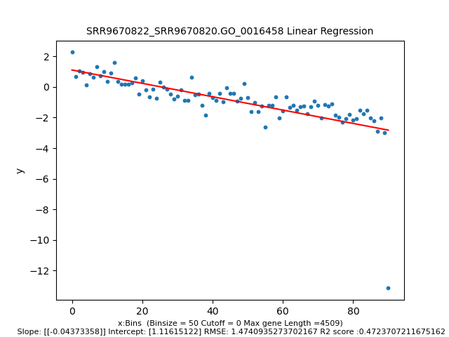

.. raw:: html
    

GO0031047
-------------
**Gene silencing by RNA**

Histogram of Genes' Length 
###############################

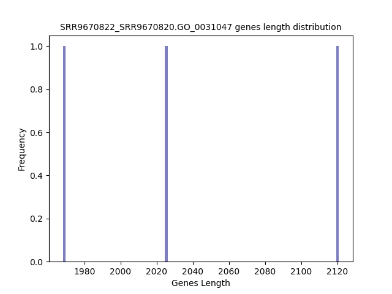

.. raw:: html
    

Log Linear Plots 
###################

Where cutoff is the minimum no. of genes to support a position to be considered in bins. Max gene length is the longest gene considered corresponding to this cutoff. 

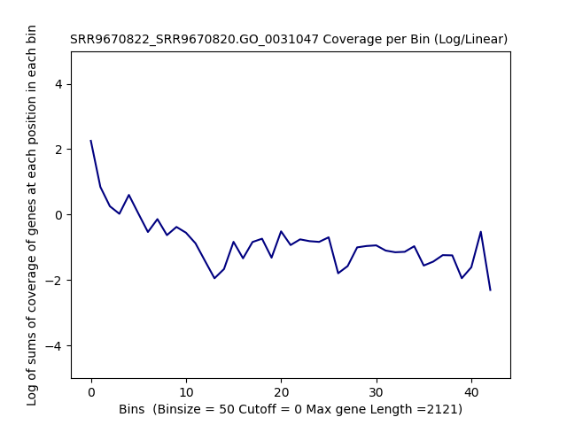

.. raw:: html
    

Log Log Plots 
###################

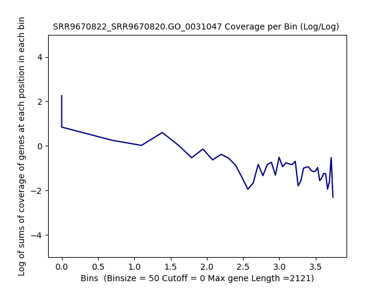

.. raw:: html
    

Linear Regression 
###################

.. image:: SRR9670822_SRR9670820.GO_0031047_50_0.LR.png 
   :width: 400

.. raw:: html
    

GO0031990
-------------
**Cellular Response to heat** 

Histogram of Genes' Length 
###############################

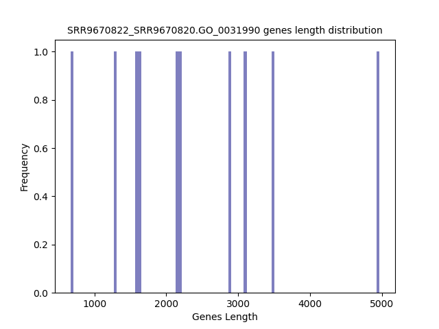

.. raw:: html
    

Log Linear Plots 
###################

Where cutoff is the minimum no. of genes to support a position to be considered in bins. Max gene length is the longest gene considered corresponding to this cutoff. 

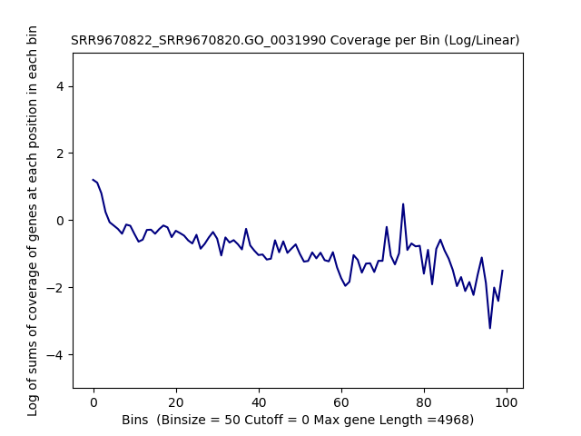

.. raw:: html
    

Log Log Plots 
###################

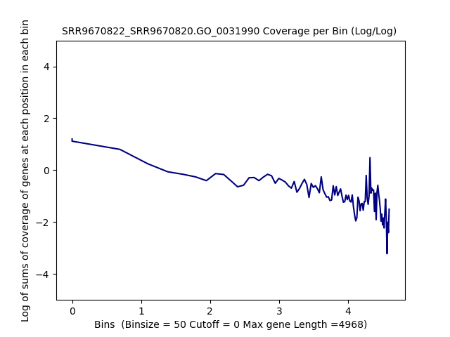

.. raw:: html
    

Linear Regression 
###################

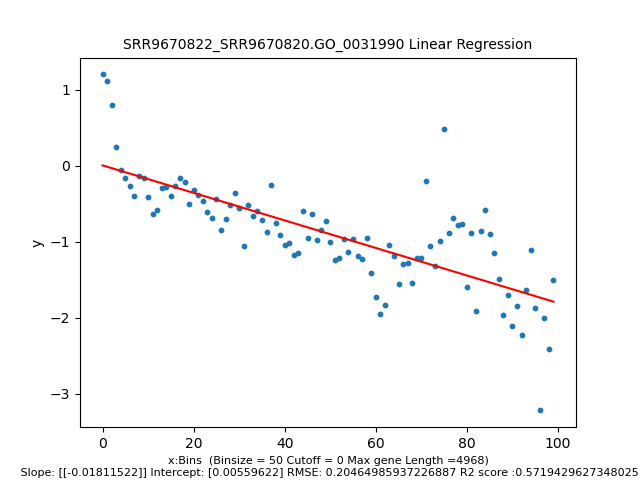

.. raw:: html
    

GO0042254
-------------
**Ribosome biogenesis**

Histogram of Genes' Length 
###############################

.. raw:: html
    

Log Linear Plots 
###################

Where cutoff is the minimum no. of genes to support a position to be considered in bins. Max gene length is the longest gene considered corresponding to this cutoff. 

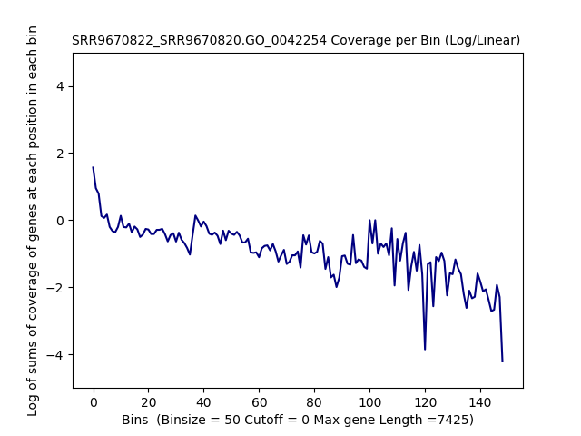

.. raw:: html
    

Log Log Plots 
###################

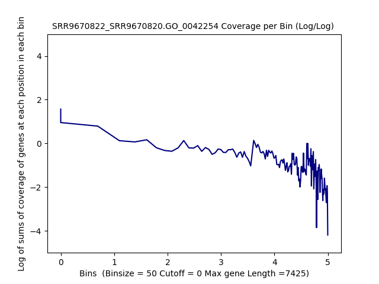

.. raw:: html
    

Linear Regression 
###################

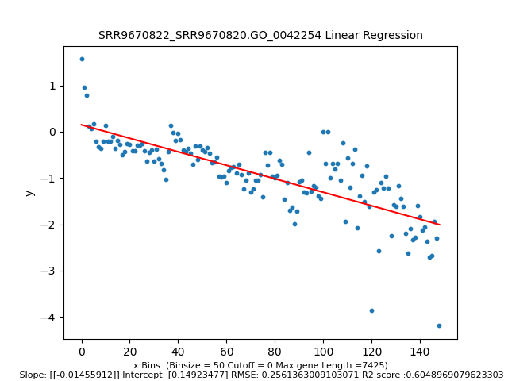

.. raw:: html
    

SRR9670823/SRR9670821
************************

GO0006119
------------
**Oxidative phosphorylation Gene Ontology Term**

Histogram of Genes' Length 
###############################

.. image:: SRR9670823_SRR9670821.GO_0006119.Length.Histogram.png 
   :width: 400 

.. raw:: html
    

Log Linear Plots 
###################

Where cutoff is the minimum no. of genes to support a position to be considered in bins. Max gene length is the longest gene considered corresponding to this cutoff. 

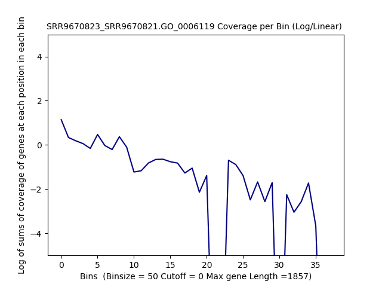

.. raw:: html
    

Log Log Plots 
###################

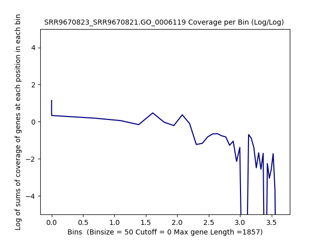

.. raw:: html
    

Linear Regression 
###################

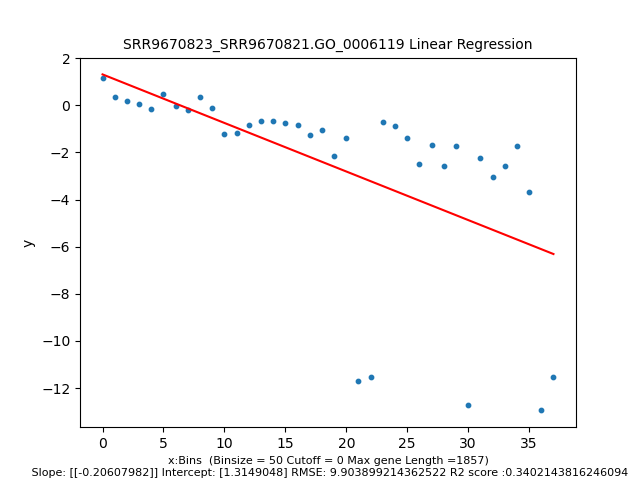

.. raw:: html
    

GO0006406
-------------
**mRNA export from nucleus** 

Histogram of Genes' Length 
###############################

.. image:: SRR9670823_SRR9670821.GO_0006406.Length.Histogram.png 
   :width: 400 

.. raw:: html
    

Log Linear Plots 
###################

Where cutoff is the minimum no. of genes to support a position to be considered in bins. Max gene length is the longest gene considered corresponding to this cutoff. 

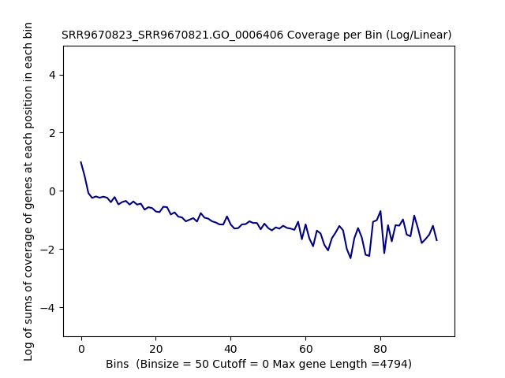

.. raw:: html
    

Log Log Plots 
###################

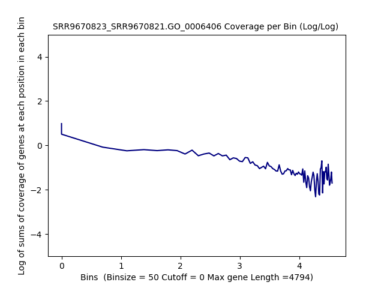

.. raw:: html
    

Linear Regression 
###################

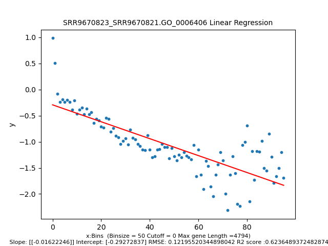

.. raw:: html
    

GO0006412
-------------
**Translation** 

Histogram of Genes' Length 
###############################

.. image:: SRR9670823_SRR9670821.GO_0006412.Length.Histogram.png 
   :width: 400 

.. raw:: html
    

Log Linear Plots 
###################

Where cutoff is the minimum no. of genes to support a position to be considered in bins. Max gene length is the longest gene considered corresponding to this cutoff. 

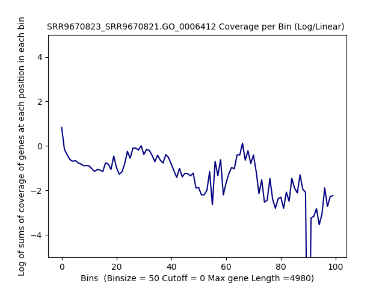

.. raw:: html
    

Log Log Plots 
###################

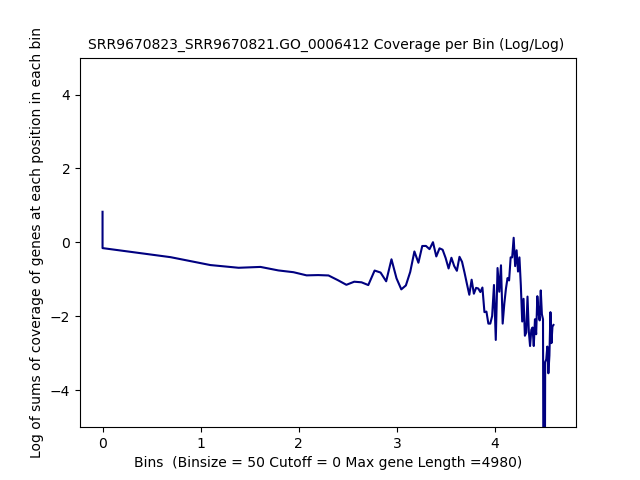

.. raw:: html
    

Linear Regression 
###################

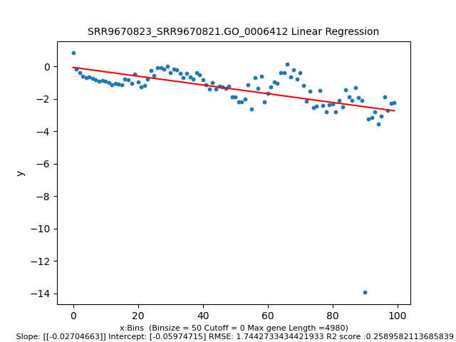

.. raw:: html
    

GO0006950
-------------
**Response to stress** 

Histogram of Genes' Length 
###############################

.. image:: SRR9670823_SRR9670821.GO_0006950.Length.Histogram.png 
   :width: 400 

.. raw:: html
    

Log Linear Plots 
###################

Where cutoff is the minimum no. of genes to support a position to be considered in bins. Max gene length is the longest gene considered corresponding to this cutoff. 

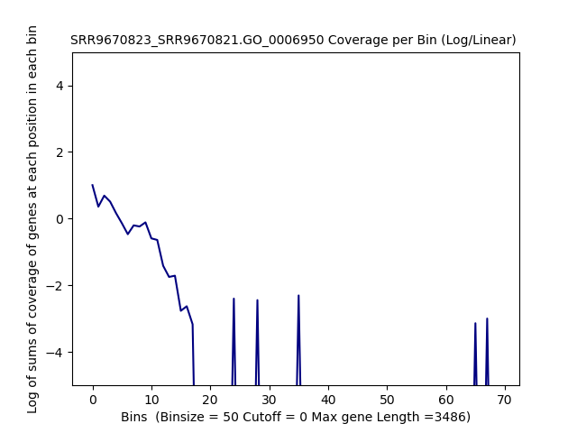

.. raw:: html
    

Log Log Plots 
###################

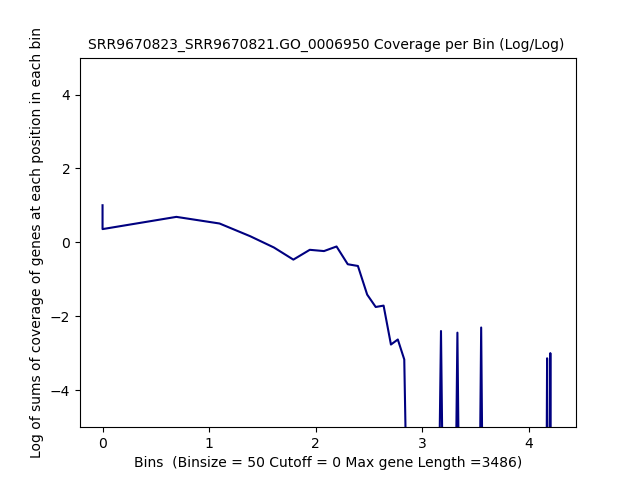

.. raw:: html
    

Linear Regression 
###################

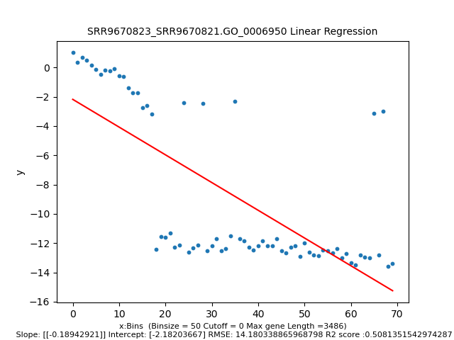

.. raw:: html
    

GO0009651
-------------
**Response to salt stress**

Histogram of Genes' Length 
###############################

.. image:: SRR9670823_SRR9670821.GO_0009651.Length.Histogram.png 
   :width: 400 

.. raw:: html
    

Log Linear Plots 
###################

Where cutoff is the minimum no. of genes to support a position to be considered in bins. Max gene length is the longest gene considered corresponding to this cutoff. 

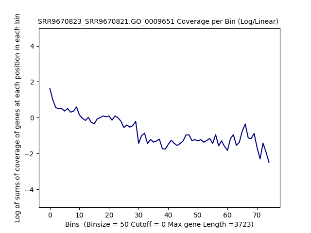

.. raw:: html
    

Log Log Plots 
###################

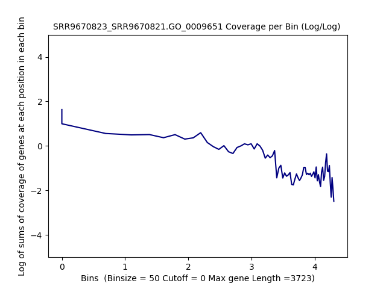

.. raw:: html
    

Linear Regression 
###################

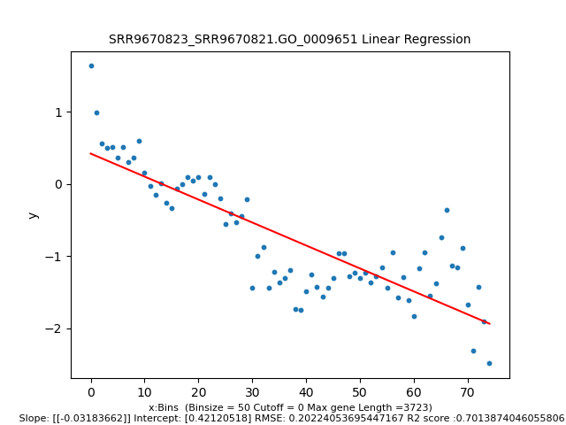

.. raw:: html
    

GO0016458
-------------
**Gene silencing**

Histogram of Genes' Length 
###############################

.. image:: SRR9670823_SRR9670821.GO_0016458.Length.Histogram.png 
   :width: 400 

.. raw:: html
    

Log Linear Plots 
###################

Where cutoff is the minimum no. of genes to support a position to be considered in bins. Max gene length is the longest gene considered corresponding to this cutoff. 

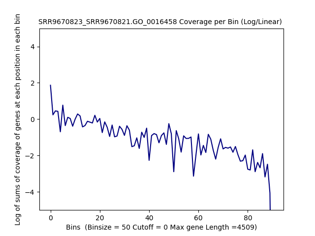

.. raw:: html
    

Log Log Plots 
###################

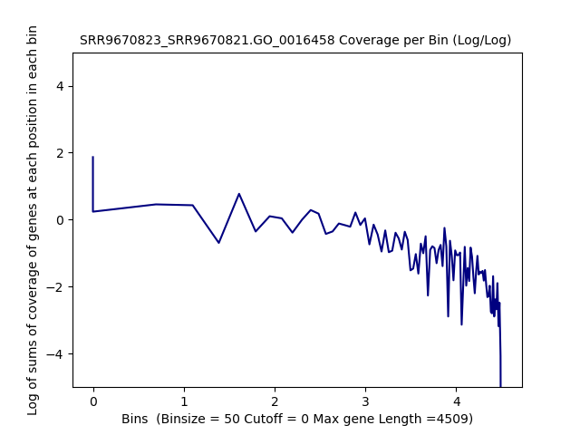

.. raw:: html
    

Linear Regression 
###################

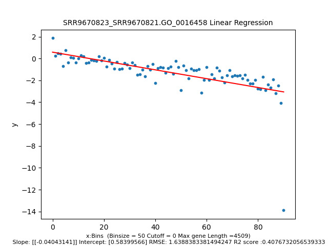

.. raw:: html
    

GO0031047
-------------
**Gene silencing by RNA**

Histogram of Genes' Length 
###############################

.. image:: SRR9670823_SRR9670821.GO_0031047.Length.Histogram.png 
   :width: 400 

.. raw:: html
    

Log Linear Plots 
###################

Where cutoff is the minimum no. of genes to support a position to be considered in bins. Max gene length is the longest gene considered corresponding to this cutoff. 

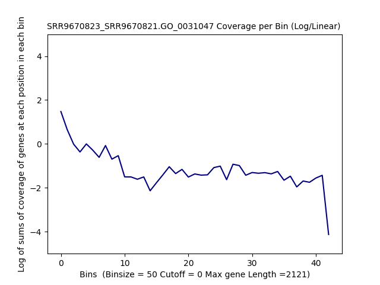

.. raw:: html
    

Log Log Plots 
###################

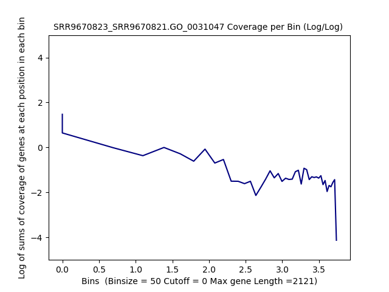

.. raw:: html
    

Linear Regression 
###################

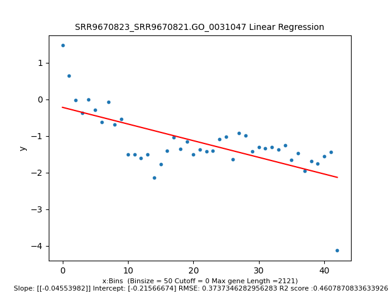

.. raw:: html
    

GO0031990
-------------
**Cellular Response to heat** 

Histogram of Genes' Length 
###############################

.. image:: SRR9670823_SRR9670821.GO_0031990.Length.Histogram.png 
   :width: 400 

.. raw:: html
    

Log Linear Plots 
###################

Where cutoff is the minimum no. of genes to support a position to be considered in bins. Max gene length is the longest gene considered corresponding to this cutoff. 

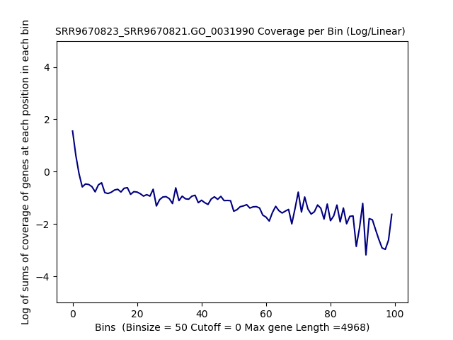

.. raw:: html
    

Log Log Plots 
###################

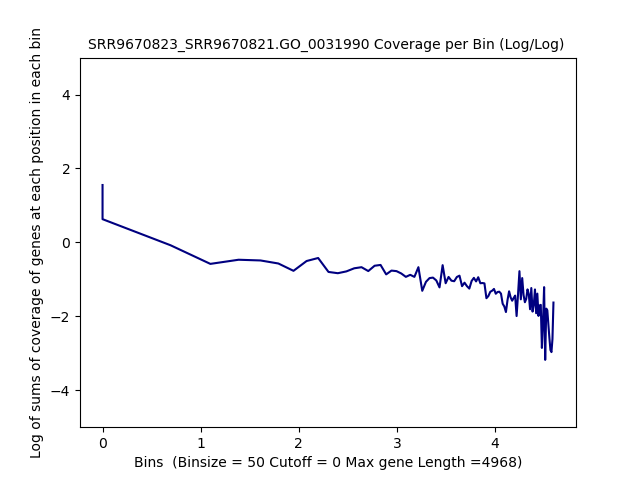

.. raw:: html
    

Linear Regression 
###################

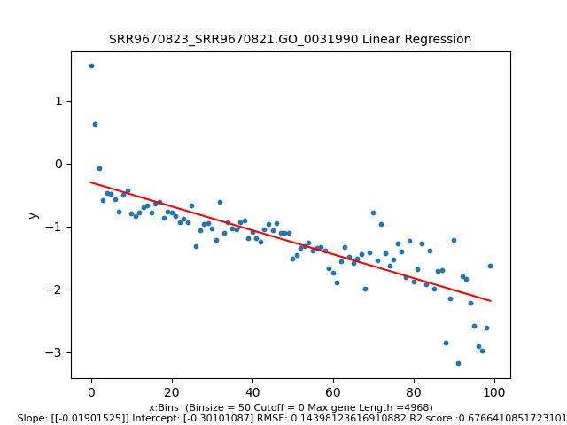

.. raw:: html
    

GO0042254
-------------
**Ribosome biogenesis**

Histogram of Genes' Length 
###############################

.. image:: SRR9670823_SRR9670821.GO_0042254.Length.Histogram.png 
   :width: 400 

.. raw:: html
    

Log Linear Plots 
###################

Where cutoff is the minimum no. of genes to support a position to be considered in bins. Max gene length is the longest gene considered corresponding to this cutoff. 

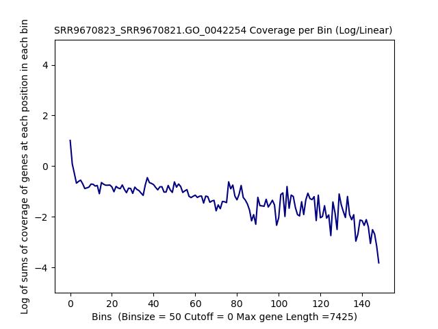

.. raw:: html
    

Log Log Plots 
###################

.. image:: SRR9670823_SRR9670821.GO_0042254_50_0.LogLog.png 
   :width: 400

.. raw:: html
    

Linear Regression 
###################

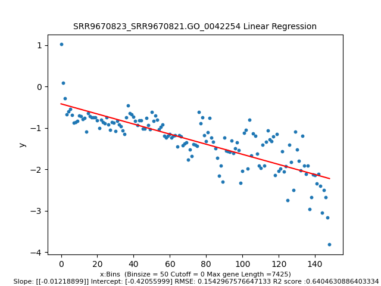

.. raw:: html
    

(SRR9670816+SRR9670817)/SRR9670814
***************************************

GO0006119
------------
**Oxidative phosphorylation Gene Ontology Term**

Histogram of Genes' Length 
###############################

.. raw:: html
    

Log Linear Plots 
###################

Where cutoff is the minimum no. of genes to support a position to be considered in bins. Max gene length is the longest gene considered corresponding to this cutoff. 

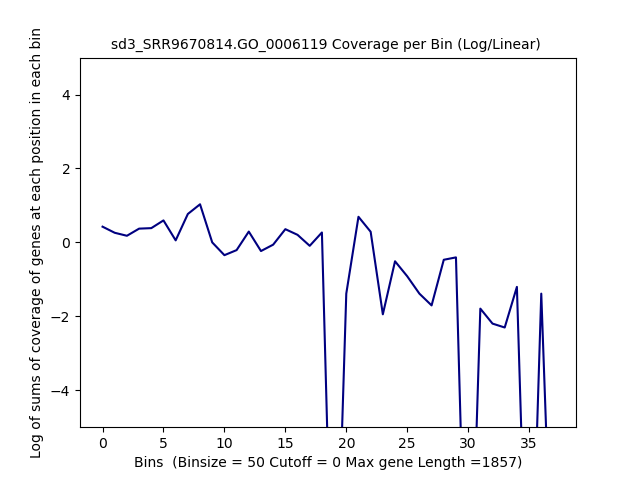

.. raw:: html
    

Log Log Plots 
###################

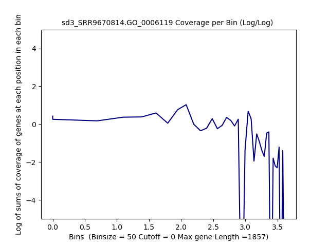

.. raw:: html
    

Linear Regression 
###################

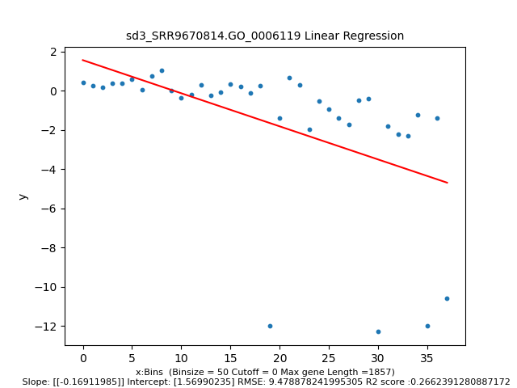

.. raw:: html
    

GO0006406
-------------
**mRNA export from nucleus** 

Histogram of Genes' Length 
###############################

.. raw:: html
    

Log Linear Plots 
###################

Where cutoff is the minimum no. of genes to support a position to be considered in bins. Max gene length is the longest gene considered corresponding to this cutoff. 

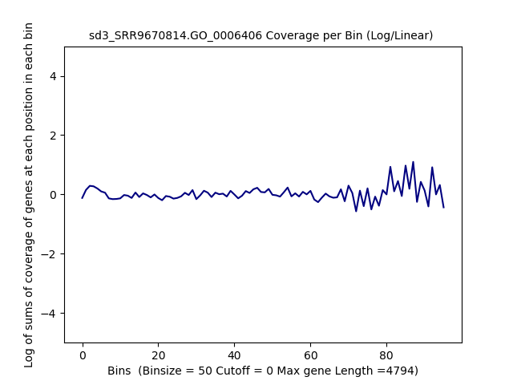

.. raw:: html
    

Log Log Plots 
###################

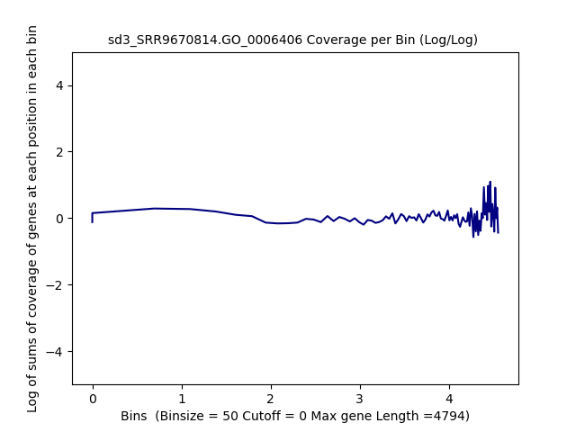

.. raw:: html
    

Linear Regression 
###################

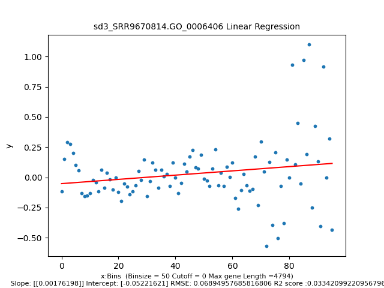

.. raw:: html
    

GO0006412
-------------
**Translation** 

Histogram of Genes' Length 
###############################

.. raw:: html
    

Log Linear Plots 
###################

Where cutoff is the minimum no. of genes to support a position to be considered in bins. Max gene length is the longest gene considered corresponding to this cutoff. 

.. image:: sd3_SRR9670814.GO_0006412_50_0.LogLinear.png 
   :width: 400

.. raw:: html
    

Log Log Plots 
###################

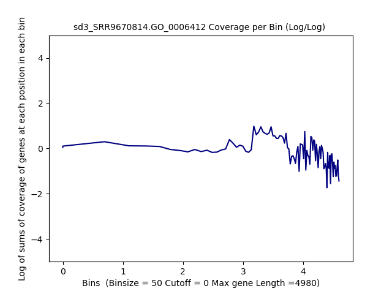

.. raw:: html
    

Linear Regression 
###################

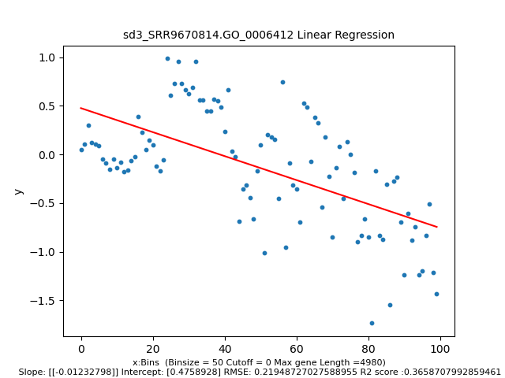

.. raw:: html
    

GO0006950
-------------
**Response to stress** 

Histogram of Genes' Length 
###############################

.. raw:: html
    

Log Linear Plots 
###################

Where cutoff is the minimum no. of genes to support a position to be considered in bins. Max gene length is the longest gene considered corresponding to this cutoff. 

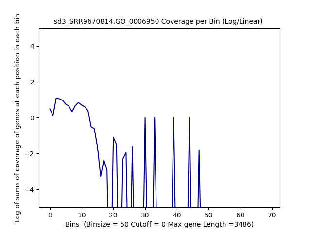

.. raw:: html
    

Log Log Plots 
###################

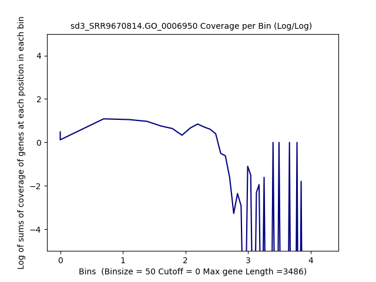

.. raw:: html
    

Linear Regression 
###################

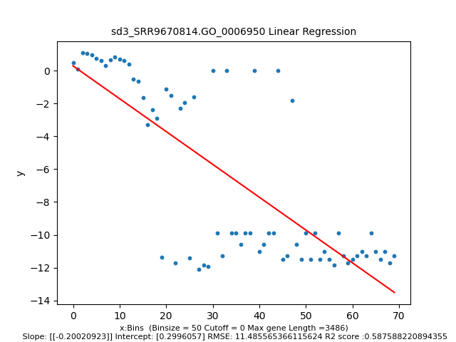

.. raw:: html
    

GO0009651
-------------
**Response to salt stress**

Histogram of Genes' Length 
###############################

.. raw:: html
    

Log Linear Plots 
###################

Where cutoff is the minimum no. of genes to support a position to be considered in bins. Max gene length is the longest gene considered corresponding to this cutoff. 

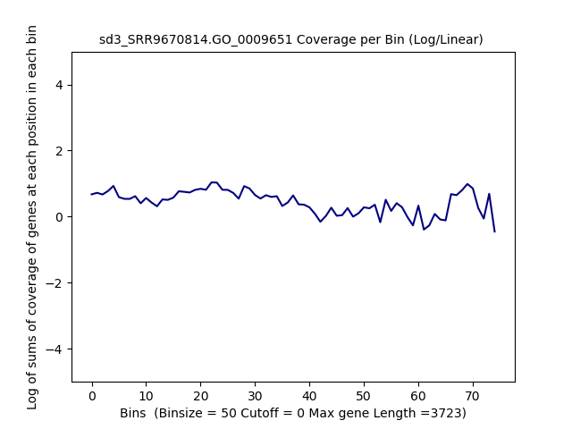

.. raw:: html
    

Log Log Plots 
###################

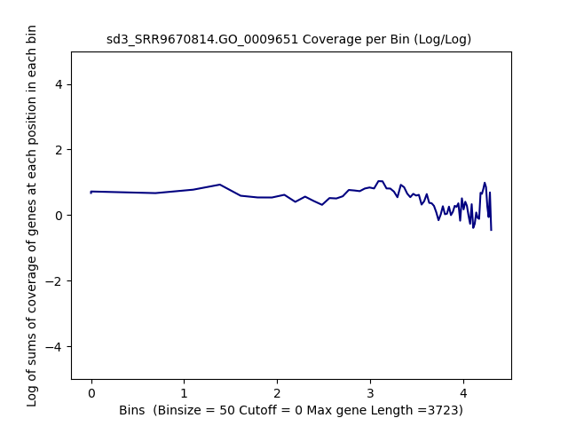

.. raw:: html
    

Linear Regression 
###################

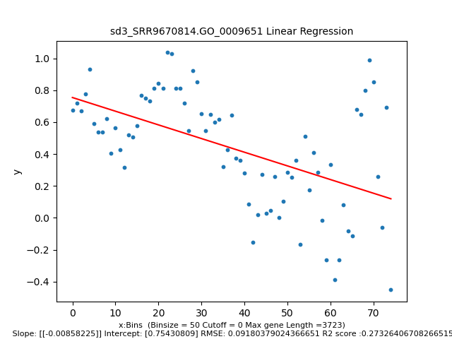

.. raw:: html
    

GO0016458
-------------
**Gene silencing**

Histogram of Genes' Length 
###############################

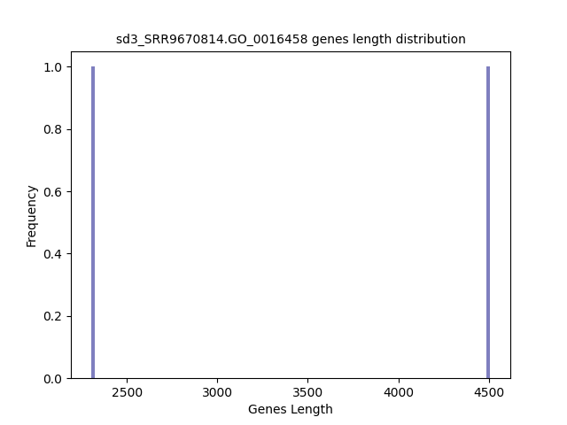

.. raw:: html
    

Log Linear Plots 
###################

Where cutoff is the minimum no. of genes to support a position to be considered in bins. Max gene length is the longest gene considered corresponding to this cutoff. 

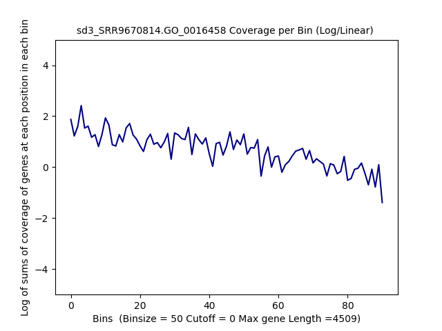

.. raw:: html
    

Log Log Plots 
###################

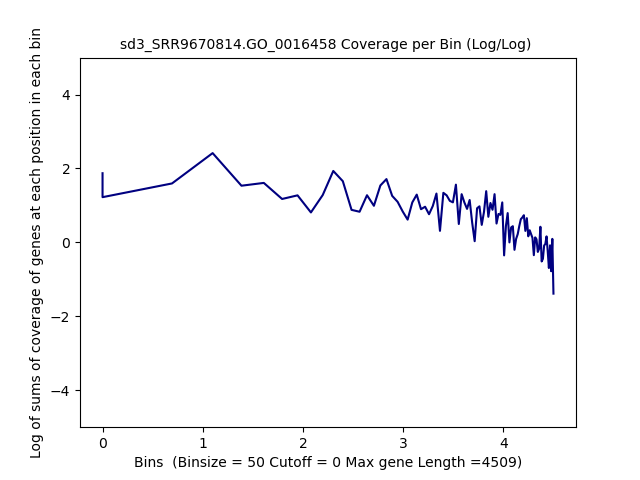

.. raw:: html
    

Linear Regression 
###################

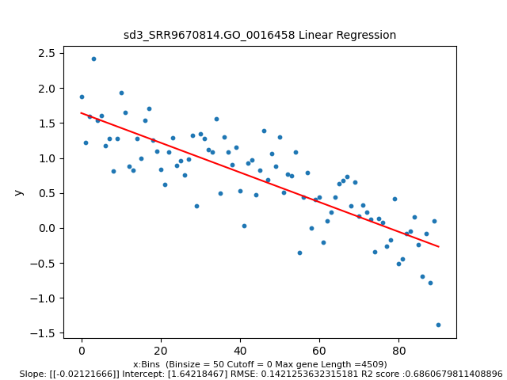

.. raw:: html
    

GO0031047
-------------
**Gene silencing by RNA**

Histogram of Genes' Length 
###############################

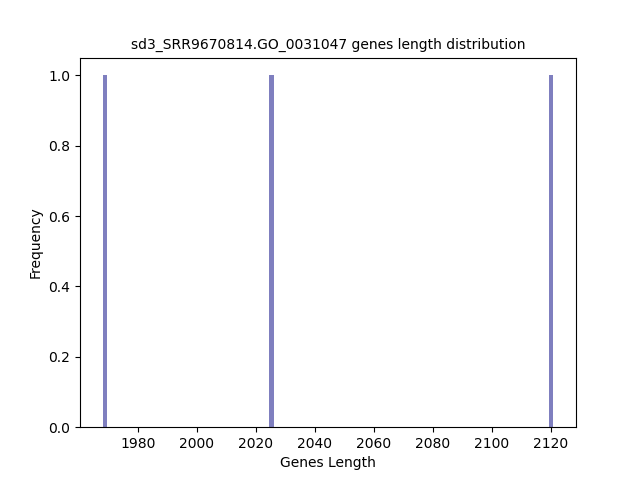

.. raw:: html
    

Log Linear Plots 
###################

Where cutoff is the minimum no. of genes to support a position to be considered in bins. Max gene length is the longest gene considered corresponding to this cutoff. 

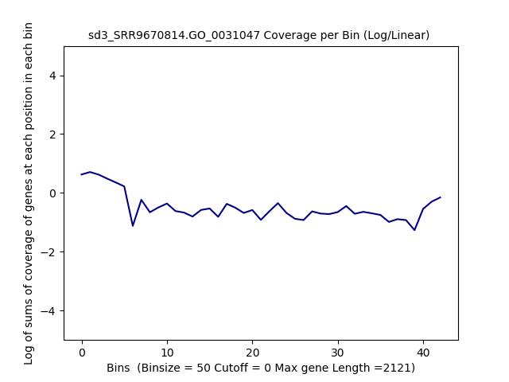

.. raw:: html
    

Log Log Plots 
###################

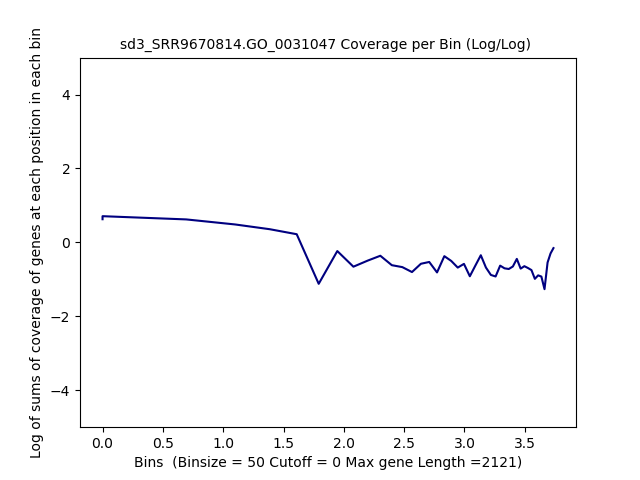

.. raw:: html
    

Linear Regression 
###################

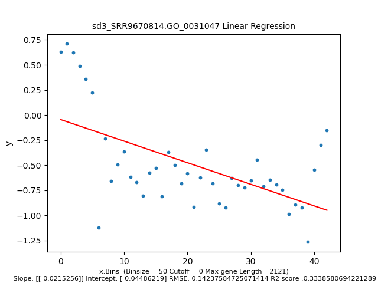

.. raw:: html
    

GO0031990
-------------
**Cellular Response to heat** 

Histogram of Genes' Length 
###############################

.. raw:: html
    

Log Linear Plots 
###################

Where cutoff is the minimum no. of genes to support a position to be considered in bins. Max gene length is the longest gene considered corresponding to this cutoff. 

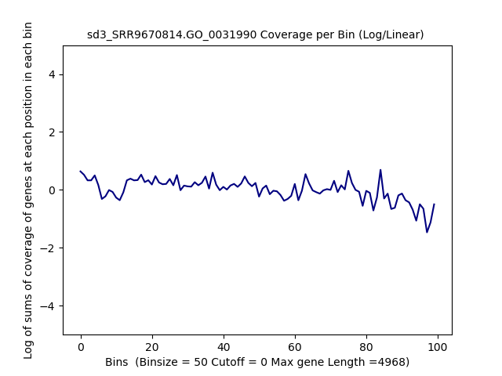

.. raw:: html
    

Log Log Plots 
###################

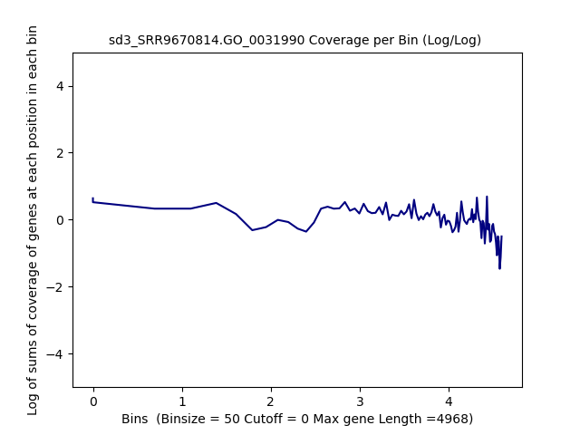

.. raw:: html
    

Linear Regression 
###################

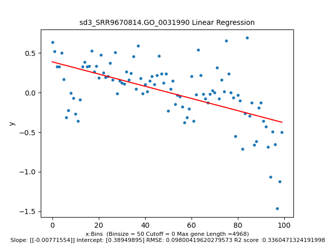

.. raw:: html
    

GO0042254
-------------
**Ribosome biogenesis**

Histogram of Genes' Length 
###############################

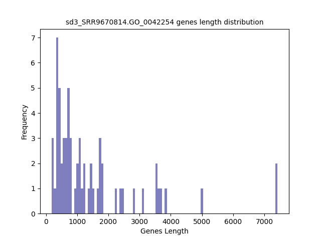

.. raw:: html
    

Log Linear Plots 
###################

Where cutoff is the minimum no. of genes to support a position to be considered in bins. Max gene length is the longest gene considered corresponding to this cutoff. 

.. image:: sd3_SRR9670814.GO_0042254_50_0.LogLinear.png 
   :width: 400

.. raw:: html
    

Log Log Plots 
###################

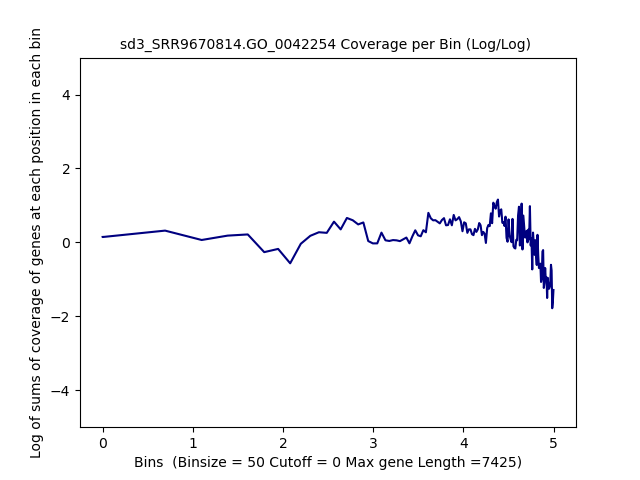

.. raw:: html
    

Linear Regression 
###################

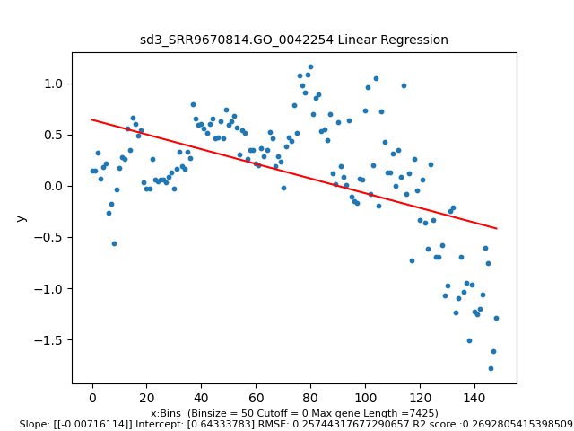

.. raw:: html
    

(SRR9670818+SRR9670819)/SRR9670815
***************************************

GO0006119
------------
**Oxidative phosphorylation Gene Ontology Term**

Histogram of Genes' Length 
###############################

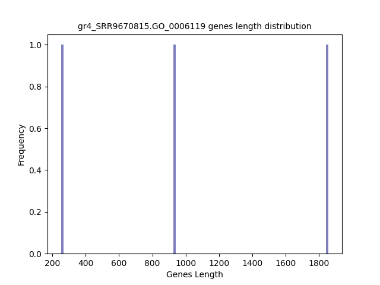

.. raw:: html
    

Log Linear Plots 
###################

Where cutoff is the minimum no. of genes to support a position to be considered in bins. Max gene length is the longest gene considered corresponding to this cutoff. 

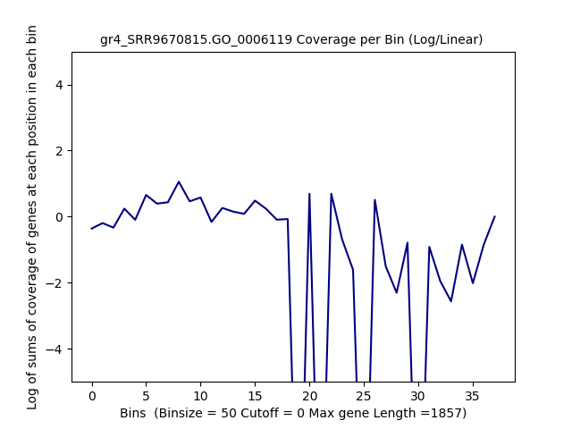

.. raw:: html
    

Log Log Plots 
###################

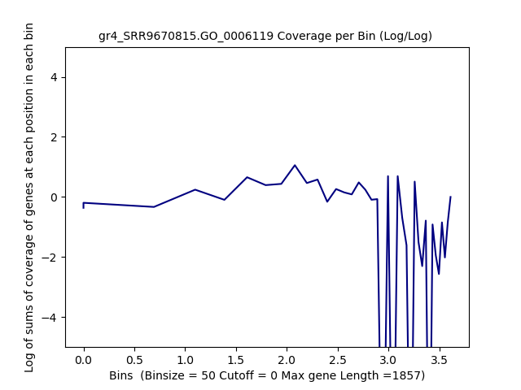

.. raw:: html
    

Linear Regression 
###################

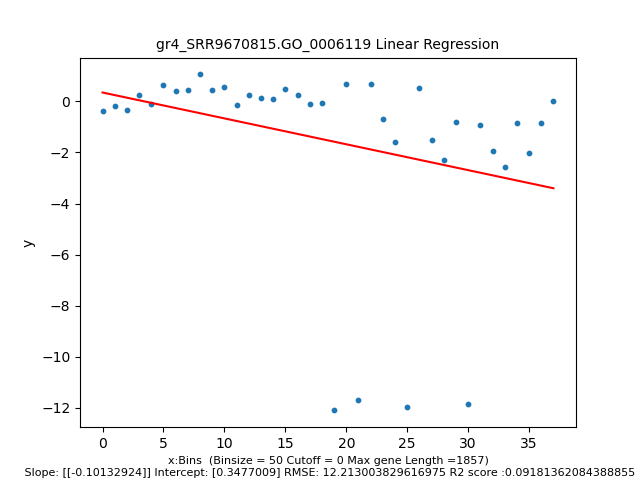

.. raw:: html
    

GO0006406
-------------
**mRNA export from nucleus** 

Histogram of Genes' Length 
###############################

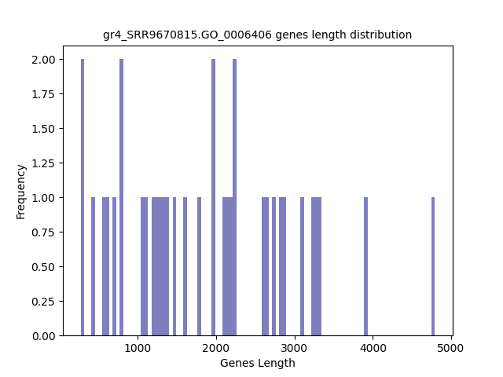

.. raw:: html
    

Log Linear Plots 
###################

Where cutoff is the minimum no. of genes to support a position to be considered in bins. Max gene length is the longest gene considered corresponding to this cutoff. 

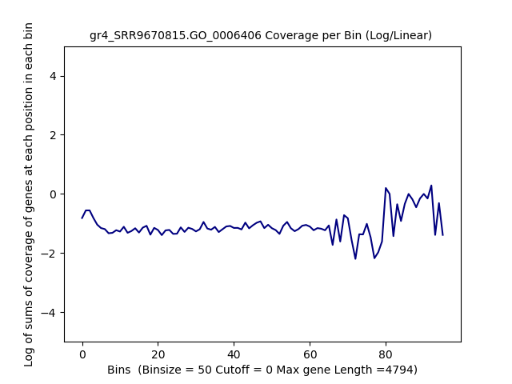

.. raw:: html
    

Log Log Plots 
###################

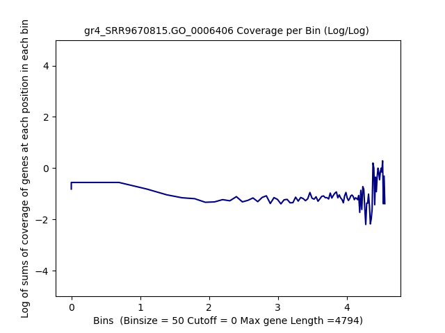

.. raw:: html
    

Linear Regression 
###################

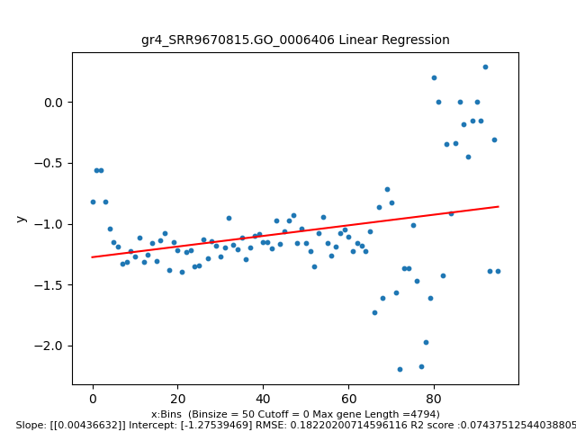

.. raw:: html
    

GO0006412
-------------
**Translation** 

Histogram of Genes' Length 
###############################

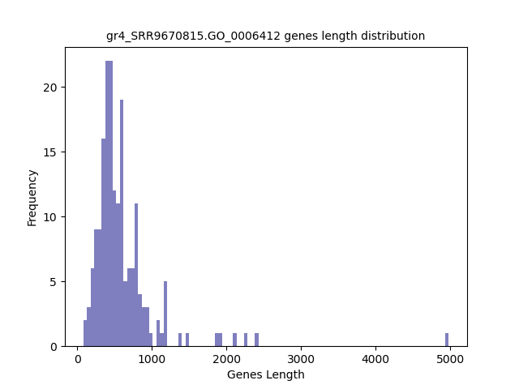

.. raw:: html
    

Log Linear Plots 
###################

Where cutoff is the minimum no. of genes to support a position to be considered in bins. Max gene length is the longest gene considered corresponding to this cutoff. 

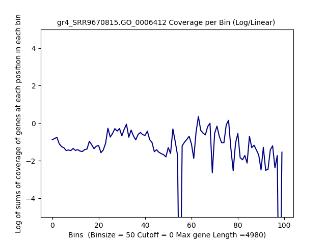

.. raw:: html
    

Log Log Plots 
###################

.. image:: gr4_SRR9670815.GO_0006412_50_0.LogLog.png 
   :width: 400

.. raw:: html
    

Linear Regression 
###################

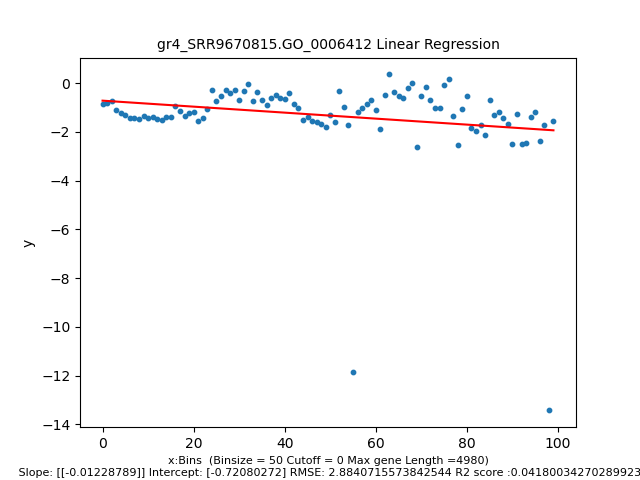

.. raw:: html
    

GO0006950
-------------
**Response to stress** 

Histogram of Genes' Length 
###############################

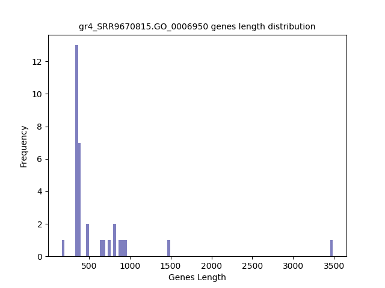

.. raw:: html
    

Log Linear Plots 
###################

Where cutoff is the minimum no. of genes to support a position to be considered in bins. Max gene length is the longest gene considered corresponding to this cutoff. 

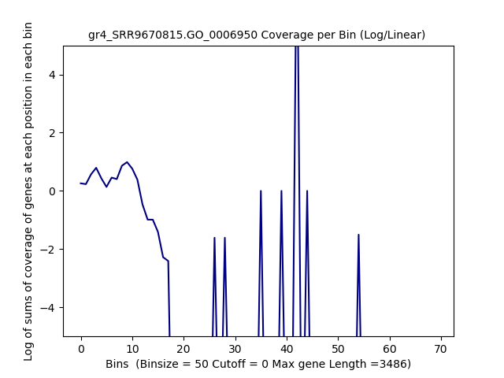

.. raw:: html
    

Log Log Plots 
###################

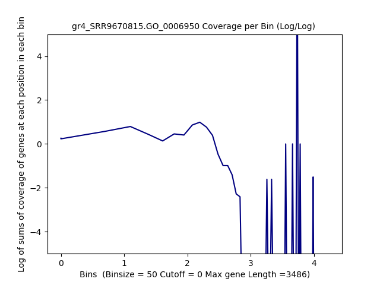

.. raw:: html
    

Linear Regression 
###################

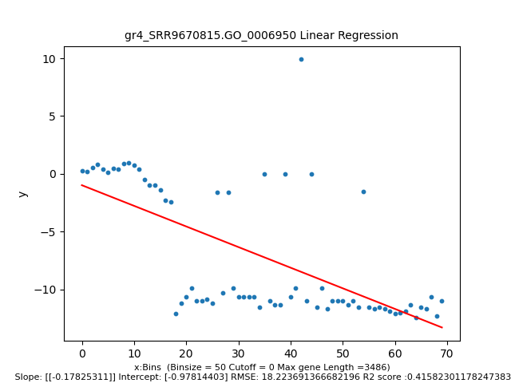

.. raw:: html
    

GO0009651
-------------
**Response to salt stress**

Histogram of Genes' Length 
###############################

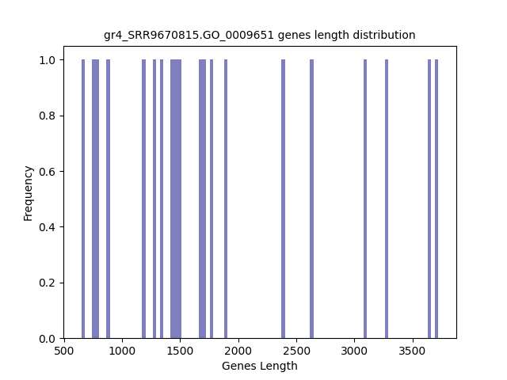

.. raw:: html
    

Log Linear Plots 
###################

Where cutoff is the minimum no. of genes to support a position to be considered in bins. Max gene length is the longest gene considered corresponding to this cutoff. 

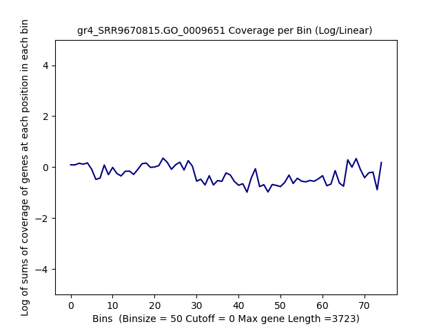

.. raw:: html
    

Log Log Plots 
###################

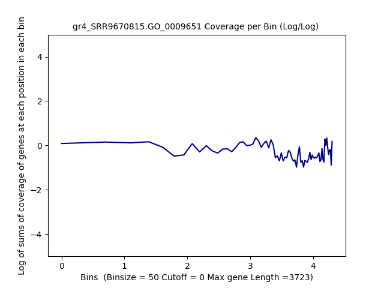

.. raw:: html
    

Linear Regression 
###################

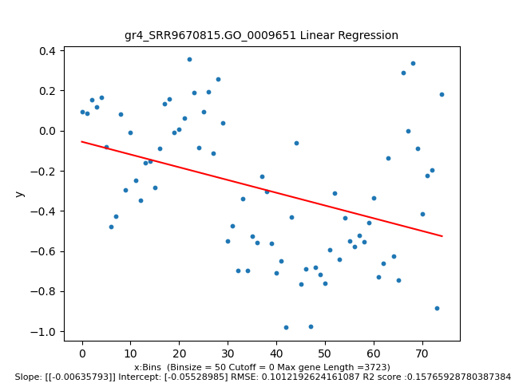

.. raw:: html
    

GO0016458
-------------
**Gene silencing**

Histogram of Genes' Length 
###############################

.. raw:: html
    

Log Linear Plots 
###################

Where cutoff is the minimum no. of genes to support a position to be considered in bins. Max gene length is the longest gene considered corresponding to this cutoff. 

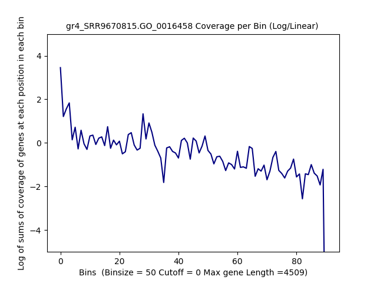

.. raw:: html
    

Log Log Plots 
###################

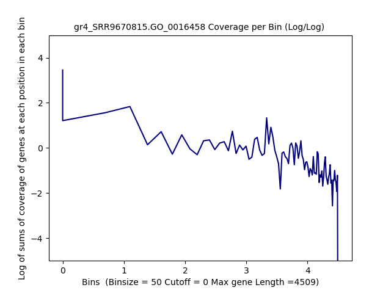

.. raw:: html
    

Linear Regression 
###################

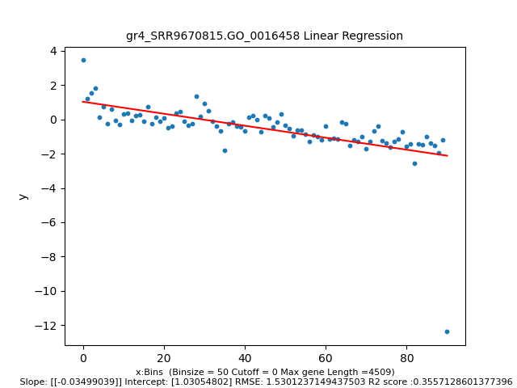

.. raw:: html
    

GO0031047
-------------
**Gene silencing by RNA**

Histogram of Genes' Length 
###############################

.. raw:: html
    

Log Linear Plots 
###################

Where cutoff is the minimum no. of genes to support a position to be considered in bins. Max gene length is the longest gene considered corresponding to this cutoff. 

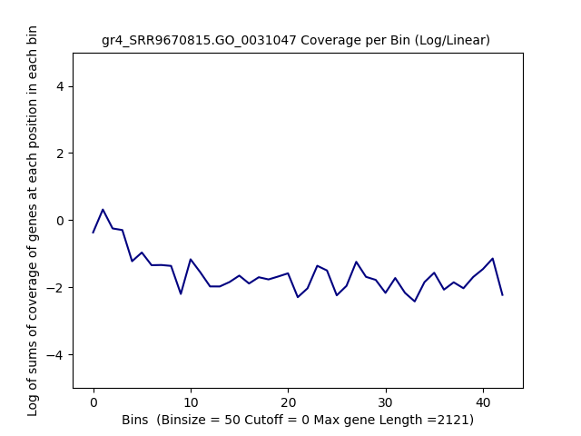

.. raw:: html
    

Log Log Plots 
###################

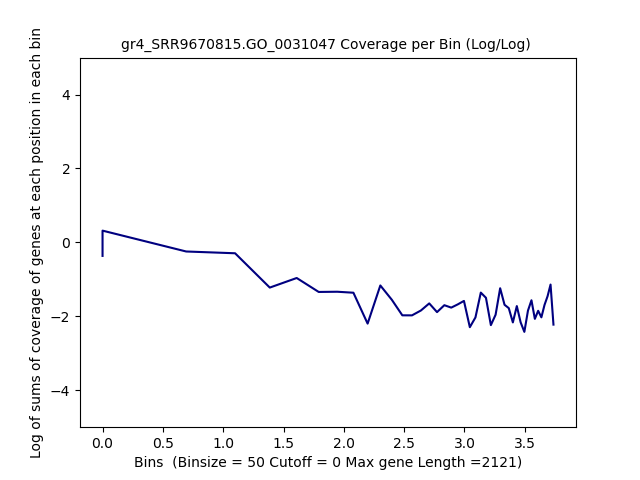

.. raw:: html
    

Linear Regression 
###################

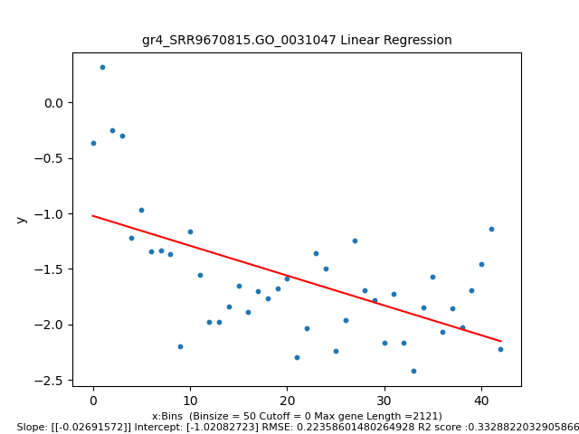

.. raw:: html
    

GO0031990
-------------
**Cellular Response to heat** 

Histogram of Genes' Length 
###############################

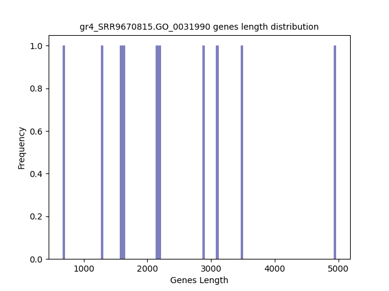

.. raw:: html
    

Log Linear Plots 
###################

Where cutoff is the minimum no. of genes to support a position to be considered in bins. Max gene length is the longest gene considered corresponding to this cutoff. 

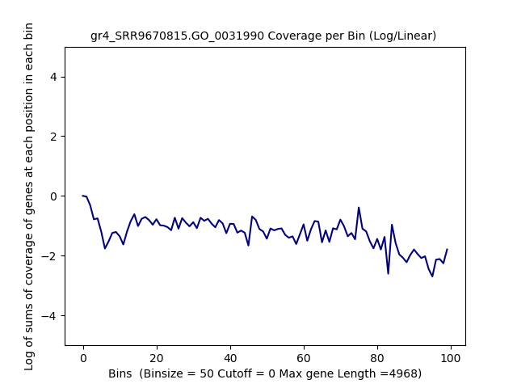

.. raw:: html
    

Log Log Plots 
###################

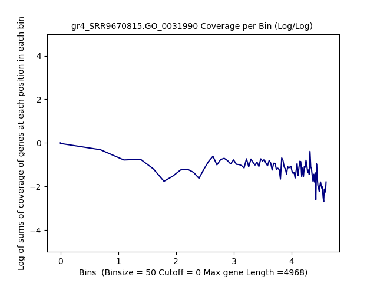

.. raw:: html
    

Linear Regression 
###################

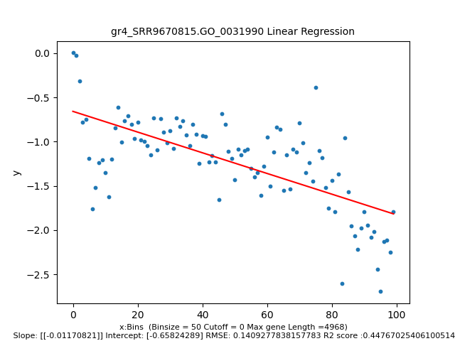

.. raw:: html
    

GO0042254
-------------
**Ribosome biogenesis**

Histogram of Genes' Length 
###############################

.. raw:: html
    

Log Linear Plots 
###################

Where cutoff is the minimum no. of genes to support a position to be considered in bins. Max gene length is the longest gene considered corresponding to this cutoff. 

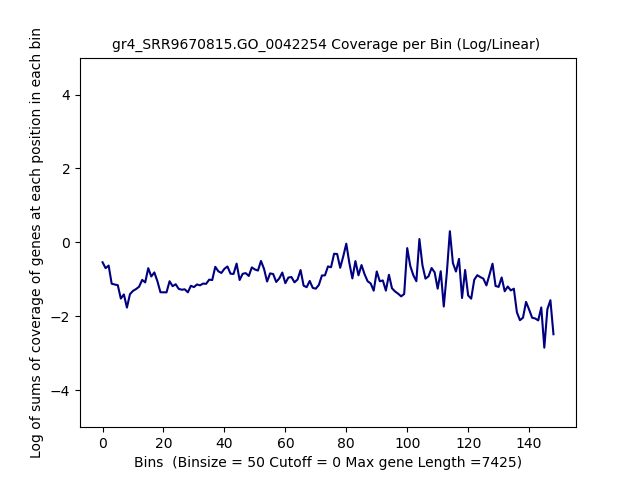

.. raw:: html
    

Log Log Plots 
###################

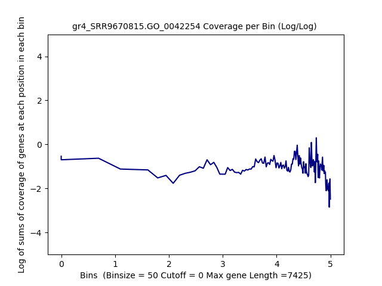

.. raw:: html
    

Linear Regression 
###################

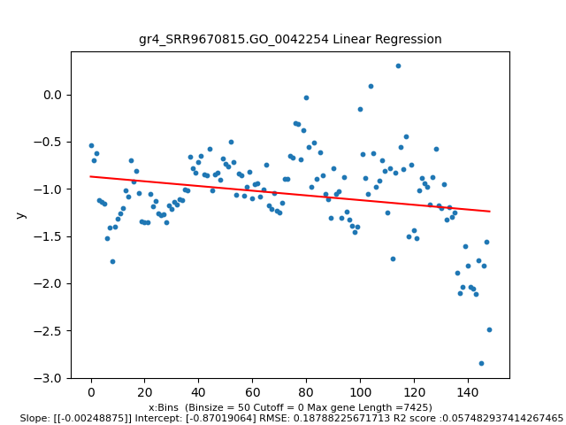

.. raw:: html
    

