====================================================
**GSE134152:Chromosomes** 
====================================================

SRR9670822/SRR9670820
************************

ChrI
------------

Histogram of Genes' Length 
###############################

.. image:: SRR9670822_SRR9670820.yeastchrI.Length.Histogram.png 
   :width: 400 

.. raw:: html
    

Log Linear Plots 
###################

Where cutoff is the minimum no. of genes to support a position to be considered in bins. Max gene length is the longest gene considered corresponding to this cutoff. 

.. image:: SRR9670822_SRR9670820.yeastchrI_50_0.LogLinear.png 
   :width: 400

.. raw:: html
    

Log Log Plots 
###################

.. image:: SRR9670822_SRR9670820.yeastchrI_50_0.LogLog.png 
   :width: 400

.. raw:: html
    

Linear Regression 
###################

.. image:: SRR9670822_SRR9670820.yeastchrI_50_0.LR.png 
   :width: 400

.. raw:: html
    

ChrII
------------

Histogram of Genes' Length 
###############################

.. image:: SRR9670822_SRR9670820.yeastchrII.Length.Histogram.png 
   :width: 400 

.. raw:: html
    

Log Linear Plots 
###################

Where cutoff is the minimum no. of genes to support a position to be considered in bins. Max gene length is the longest gene considered corresponding to this cutoff. 

.. image:: SRR9670822_SRR9670820.yeastchrII_50_0.LogLinear.png 
   :width: 400

.. raw:: html
    

Log Log Plots 
###################

.. image:: SRR9670822_SRR9670820.yeastchrII_50_0.LogLog.png 
   :width: 400

.. raw:: html
    

Linear Regression 
###################

.. image:: SRR9670822_SRR9670820.yeastchrII_50_0.LR.png 
   :width: 400

.. raw:: html
    

ChrIII
------------

Histogram of Genes' Length 
###############################

.. image:: SRR9670822_SRR9670820.yeastchrIII.Length.Histogram.png 
   :width: 400 

.. raw:: html
    

Log Linear Plots 
###################

Where cutoff is the minimum no. of genes to support a position to be considered in bins. Max gene length is the longest gene considered corresponding to this cutoff. 

.. image:: SRR9670822_SRR9670820.yeastchrIII_50_0.LogLinear.png 
   :width: 400

.. raw:: html
    

Log Log Plots 
###################

.. image:: SRR9670822_SRR9670820.yeastchrIII_50_0.LogLog.png 
   :width: 400

.. raw:: html
    

Linear Regression 
###################

.. image:: SRR9670822_SRR9670820.yeastchrIII_50_0.LR.png 
   :width: 400

.. raw:: html
    

ChrIV
------------

Histogram of Genes' Length 
###############################

.. image:: SRR9670822_SRR9670820.yeastchrIV.Length.Histogram.png 
   :width: 400 

.. raw:: html
    

Log Linear Plots 
###################

Where cutoff is the minimum no. of genes to support a position to be considered in bins. Max gene length is the longest gene considered corresponding to this cutoff. 

.. image:: SRR9670822_SRR9670820.yeastchrIV_50_0.LogLinear.png 
   :width: 400

.. raw:: html
    

Log Log Plots 
###################

.. image:: SRR9670822_SRR9670820.yeastchrIV_50_0.LogLog.png 
   :width: 400

.. raw:: html
    

Linear Regression 
###################

.. image:: SRR9670822_SRR9670820.yeastchrIV_50_0.LR.png 
   :width: 400

.. raw:: html
    

ChrIX
------------

Histogram of Genes' Length 
###############################

.. image:: SRR9670822_SRR9670820.yeastchrIX.Length.Histogram.png 
   :width: 400 

.. raw:: html
    

Log Linear Plots 
###################

Where cutoff is the minimum no. of genes to support a position to be considered in bins. Max gene length is the longest gene considered corresponding to this cutoff. 

.. image:: SRR9670822_SRR9670820.yeastchrIX_50_0.LogLinear.png 
   :width: 400

.. raw:: html
    

Log Log Plots 
###################

.. image:: SRR9670822_SRR9670820.yeastchrIX_50_0.LogLog.png 
   :width: 400

.. raw:: html
    

Linear Regression 
###################

.. image:: SRR9670822_SRR9670820.yeastchrIX_50_0.LR.png 
   :width: 400

.. raw:: html
    

ChrVIII
------------

Histogram of Genes' Length 
###############################

.. image:: SRR9670822_SRR9670820.yeastchrVIII.Length.Histogram.png 
   :width: 400 

.. raw:: html
    

Log Linear Plots 
###################

Where cutoff is the minimum no. of genes to support a position to be considered in bins. Max gene length is the longest gene considered corresponding to this cutoff. 

.. image:: SRR9670822_SRR9670820.yeastchrVIII_50_0.LogLinear.png 
   :width: 400

.. raw:: html
    

Log Log Plots 
###################

.. image:: SRR9670822_SRR9670820.yeastchrVIII_50_0.LogLog.png 
   :width: 400

.. raw:: html
    

Linear Regression 
###################

.. image:: SRR9670822_SRR9670820.yeastchrVIII_50_0.LR.png 
   :width: 400

.. raw:: html
    

ChrVII
------------

Histogram of Genes' Length 
###############################

.. image:: SRR9670822_SRR9670820.yeastchrVII.Length.Histogram.png 
   :width: 400 

.. raw:: html
    

Log Linear Plots 
###################

Where cutoff is the minimum no. of genes to support a position to be considered in bins. Max gene length is the longest gene considered corresponding to this cutoff. 

.. image:: SRR9670822_SRR9670820.yeastchrVII_50_0.LogLinear.png 
   :width: 400

.. raw:: html
    

Log Log Plots 
###################

.. image:: SRR9670822_SRR9670820.yeastchrVII_50_0.LogLog.png 
   :width: 400

.. raw:: html
    

Linear Regression 
###################

.. image:: SRR9670822_SRR9670820.yeastchrVII_50_0.LR.png 
   :width: 400

.. raw:: html
    

ChrVI
------------

Histogram of Genes' Length 
###############################

.. image:: SRR9670822_SRR9670820.yeastchrVI.Length.Histogram.png 
   :width: 400 

.. raw:: html
    

Log Linear Plots 
###################

Where cutoff is the minimum no. of genes to support a position to be considered in bins. Max gene length is the longest gene considered corresponding to this cutoff. 

.. image:: SRR9670822_SRR9670820.yeastchrVI_50_0.LogLinear.png 
   :width: 400

.. raw:: html
    

Log Log Plots 
###################

.. image:: SRR9670822_SRR9670820.yeastchrVI_50_0.LogLog.png 
   :width: 400

.. raw:: html
    

Linear Regression 
###################

.. image:: SRR9670822_SRR9670820.yeastchrVI_50_0.LR.png 
   :width: 400

.. raw:: html
    

ChrV
------------

Histogram of Genes' Length 
###############################

.. image:: SRR9670822_SRR9670820.yeastchrV.Length.Histogram.png 
   :width: 400 

.. raw:: html
    

Log Linear Plots 
###################

Where cutoff is the minimum no. of genes to support a position to be considered in bins. Max gene length is the longest gene considered corresponding to this cutoff. 

.. image:: SRR9670822_SRR9670820.yeastchrV_50_0.LogLinear.png 
   :width: 400

.. raw:: html
    

Log Log Plots 
###################

.. image:: SRR9670822_SRR9670820.yeastchrV_50_0.LogLog.png 
   :width: 400

.. raw:: html
    

Linear Regression 
###################

.. image:: SRR9670822_SRR9670820.yeastchrV_50_0.LR.png 
   :width: 400

.. raw:: html
    

ChrXIII
------------

Histogram of Genes' Length 
###############################

.. image:: SRR9670822_SRR9670820.yeastchrXIII.Length.Histogram.png 
   :width: 400 

.. raw:: html
    

Log Linear Plots 
###################

Where cutoff is the minimum no. of genes to support a position to be considered in bins. Max gene length is the longest gene considered corresponding to this cutoff. 

.. image:: SRR9670822_SRR9670820.yeastchrXIII_50_0.LogLinear.png 
   :width: 400

.. raw:: html
    

Log Log Plots 
###################

.. image:: SRR9670822_SRR9670820.yeastchrXIII_50_0.LogLog.png 
   :width: 400

.. raw:: html
    

Linear Regression 
###################

.. image:: SRR9670822_SRR9670820.yeastchrXIII_50_0.LR.png 
   :width: 400

.. raw:: html
    

ChrXII
------------

Histogram of Genes' Length 
###############################

.. image:: SRR9670822_SRR9670820.yeastchrXII.Length.Histogram.png 
   :width: 400 

.. raw:: html
    

Log Linear Plots 
###################

Where cutoff is the minimum no. of genes to support a position to be considered in bins. Max gene length is the longest gene considered corresponding to this cutoff. 

.. image:: SRR9670822_SRR9670820.yeastchrXII_50_0.LogLinear.png 
   :width: 400

.. raw:: html
    

Log Log Plots 
###################

.. image:: SRR9670822_SRR9670820.yeastchrXII_50_0.LogLog.png 
   :width: 400

.. raw:: html
    

Linear Regression 
###################

.. image:: SRR9670822_SRR9670820.yeastchrXII_50_0.LR.png 
   :width: 400

.. raw:: html
    

ChrXI
------------

Histogram of Genes' Length 
###############################

.. image:: SRR9670822_SRR9670820.yeastchrXI.Length.Histogram.png 
   :width: 400 

.. raw:: html
    

Log Linear Plots 
###################

Where cutoff is the minimum no. of genes to support a position to be considered in bins. Max gene length is the longest gene considered corresponding to this cutoff. 

.. image:: SRR9670822_SRR9670820.yeastchrXI_50_0.LogLinear.png 
   :width: 400

.. raw:: html
    

Log Log Plots 
###################

.. image:: SRR9670822_SRR9670820.yeastchrXI_50_0.LogLog.png 
   :width: 400

.. raw:: html
    

Linear Regression 
###################

.. image:: SRR9670822_SRR9670820.yeastchrXI_50_0.LR.png 
   :width: 400

.. raw:: html
    

ChrXIV
------------

Histogram of Genes' Length 
###############################

.. image:: SRR9670822_SRR9670820.yeastchrXIV.Length.Histogram.png 
   :width: 400 

.. raw:: html
    

Log Linear Plots 
###################

Where cutoff is the minimum no. of genes to support a position to be considered in bins. Max gene length is the longest gene considered corresponding to this cutoff. 

.. image:: SRR9670822_SRR9670820.yeastchrXIV_50_0.LogLinear.png 
   :width: 400

.. raw:: html
    

Log Log Plots 
###################

.. image:: SRR9670822_SRR9670820.yeastchrXIV_50_0.LogLog.png 
   :width: 400

.. raw:: html
    

Linear Regression 
###################

.. image:: SRR9670822_SRR9670820.yeastchrXIV_50_0.LR.png 
   :width: 400

.. raw:: html
    

ChrX
------------

Histogram of Genes' Length 
###############################

.. image:: SRR9670822_SRR9670820.yeastchrX.Length.Histogram.png 
   :width: 400 

.. raw:: html
    

Log Linear Plots 
###################

Where cutoff is the minimum no. of genes to support a position to be considered in bins. Max gene length is the longest gene considered corresponding to this cutoff. 

.. image:: SRR9670822_SRR9670820.yeastchrX_50_0.LogLinear.png 
   :width: 400

.. raw:: html
    

Log Log Plots 
###################

.. image:: SRR9670822_SRR9670820.yeastchrX_50_0.LogLog.png 
   :width: 400

.. raw:: html
    

Linear Regression 
###################

.. image:: SRR9670822_SRR9670820.yeastchrX_50_0.LR.png 
   :width: 400

.. raw:: html
    

ChrXVI
------------

Histogram of Genes' Length 
###############################

.. image:: SRR9670822_SRR9670820.yeastchrXVI.Length.Histogram.png 
   :width: 400 

.. raw:: html
    

Log Linear Plots 
###################

Where cutoff is the minimum no. of genes to support a position to be considered in bins. Max gene length is the longest gene considered corresponding to this cutoff. 

.. image:: SRR9670822_SRR9670820.yeastchrXVI_50_0.LogLinear.png 
   :width: 400

.. raw:: html
    

Log Log Plots 
###################

.. image:: SRR9670822_SRR9670820.yeastchrXVI_50_0.LogLog.png 
   :width: 400

.. raw:: html
    

Linear Regression 
###################

.. image:: SRR9670822_SRR9670820.yeastchrXVI_50_0.LR.png 
   :width: 400

.. raw:: html
    

ChrXV
------------

Histogram of Genes' Length 
###############################

.. image:: SRR9670822_SRR9670820.yeastchrXV.Length.Histogram.png 
   :width: 400 

.. raw:: html
    

Log Linear Plots 
###################

Where cutoff is the minimum no. of genes to support a position to be considered in bins. Max gene length is the longest gene considered corresponding to this cutoff. 

.. image:: SRR9670822_SRR9670820.yeastchrXV_50_0.LogLinear.png 
   :width: 400

.. raw:: html
    

Log Log Plots 
###################

.. image:: SRR9670822_SRR9670820.yeastchrXV_50_0.LogLog.png 
   :width: 400

.. raw:: html
    

Linear Regression 
###################

.. image:: SRR9670822_SRR9670820.yeastchrXV_50_0.LR.png 
   :width: 400

.. raw:: html
    

SRR9670823/SRR9670821
************************

ChrI
------------

Histogram of Genes' Length 
###############################

.. image:: SRR9670823_SRR9670821.yeastchrI.Length.Histogram.png 
   :width: 400 

.. raw:: html
    

Log Linear Plots 
###################

Where cutoff is the minimum no. of genes to support a position to be considered in bins. Max gene length is the longest gene considered corresponding to this cutoff. 

.. image:: SRR9670823_SRR9670821.yeastchrI_50_0.LogLinear.png 
   :width: 400

.. raw:: html
    

Log Log Plots 
###################

.. image:: SRR9670823_SRR9670821.yeastchrI_50_0.LogLog.png 
   :width: 400

.. raw:: html
    

Linear Regression 
###################

.. image:: SRR9670823_SRR9670821.yeastchrI_50_0.LR.png 
   :width: 400

.. raw:: html
    

ChrII
------------

Histogram of Genes' Length 
###############################

.. image:: SRR9670823_SRR9670821.yeastchrII.Length.Histogram.png 
   :width: 400 

.. raw:: html
    

Log Linear Plots 
###################

Where cutoff is the minimum no. of genes to support a position to be considered in bins. Max gene length is the longest gene considered corresponding to this cutoff. 

.. image:: SRR9670823_SRR9670821.yeastchrII_50_0.LogLinear.png 
   :width: 400

.. raw:: html
    

Log Log Plots 
###################

.. image:: SRR9670823_SRR9670821.yeastchrII_50_0.LogLog.png 
   :width: 400

.. raw:: html
    

Linear Regression 
###################

.. image:: SRR9670823_SRR9670821.yeastchrII_50_0.LR.png 
   :width: 400

.. raw:: html
    

ChrIII
------------

Histogram of Genes' Length 
###############################

.. image:: SRR9670823_SRR9670821.yeastchrIII.Length.Histogram.png 
   :width: 400 

.. raw:: html
    

Log Linear Plots 
###################

Where cutoff is the minimum no. of genes to support a position to be considered in bins. Max gene length is the longest gene considered corresponding to this cutoff. 

.. image:: SRR9670823_SRR9670821.yeastchrIII_50_0.LogLinear.png 
   :width: 400

.. raw:: html
    

Log Log Plots 
###################

.. image:: SRR9670823_SRR9670821.yeastchrIII_50_0.LogLog.png 
   :width: 400

.. raw:: html
    

Linear Regression 
###################

.. image:: SRR9670823_SRR9670821.yeastchrIII_50_0.LR.png 
   :width: 400

.. raw:: html
    

ChrIV
------------

Histogram of Genes' Length 
###############################

.. image:: SRR9670823_SRR9670821.yeastchrIV.Length.Histogram.png 
   :width: 400 

.. raw:: html
    

Log Linear Plots 
###################

Where cutoff is the minimum no. of genes to support a position to be considered in bins. Max gene length is the longest gene considered corresponding to this cutoff. 

.. image:: SRR9670823_SRR9670821.yeastchrIV_50_0.LogLinear.png 
   :width: 400

.. raw:: html
    

Log Log Plots 
###################

.. image:: SRR9670823_SRR9670821.yeastchrIV_50_0.LogLog.png 
   :width: 400

.. raw:: html
    

Linear Regression 
###################

.. image:: SRR9670823_SRR9670821.yeastchrIV_50_0.LR.png 
   :width: 400

.. raw:: html
    

ChrIX
------------

Histogram of Genes' Length 
###############################

.. image:: SRR9670823_SRR9670821.yeastchrIX.Length.Histogram.png 
   :width: 400 

.. raw:: html
    

Log Linear Plots 
###################

Where cutoff is the minimum no. of genes to support a position to be considered in bins. Max gene length is the longest gene considered corresponding to this cutoff. 

.. image:: SRR9670823_SRR9670821.yeastchrIX_50_0.LogLinear.png 
   :width: 400

.. raw:: html
    

Log Log Plots 
###################

.. image:: SRR9670823_SRR9670821.yeastchrIX_50_0.LogLog.png 
   :width: 400

.. raw:: html
    

Linear Regression 
###################

.. image:: SRR9670823_SRR9670821.yeastchrIX_50_0.LR.png 
   :width: 400

.. raw:: html
    

ChrVIII
------------

Histogram of Genes' Length 
###############################

.. image:: SRR9670823_SRR9670821.yeastchrVIII.Length.Histogram.png 
   :width: 400 

.. raw:: html
    

Log Linear Plots 
###################

Where cutoff is the minimum no. of genes to support a position to be considered in bins. Max gene length is the longest gene considered corresponding to this cutoff. 

.. image:: SRR9670823_SRR9670821.yeastchrVIII_50_0.LogLinear.png 
   :width: 400

.. raw:: html
    

Log Log Plots 
###################

.. image:: SRR9670823_SRR9670821.yeastchrVIII_50_0.LogLog.png 
   :width: 400

.. raw:: html
    

Linear Regression 
###################

.. image:: SRR9670823_SRR9670821.yeastchrVIII_50_0.LR.png 
   :width: 400

.. raw:: html
    

ChrVII
------------

Histogram of Genes' Length 
###############################

.. image:: SRR9670823_SRR9670821.yeastchrVII.Length.Histogram.png 
   :width: 400 

.. raw:: html
    

Log Linear Plots 
###################

Where cutoff is the minimum no. of genes to support a position to be considered in bins. Max gene length is the longest gene considered corresponding to this cutoff. 

.. image:: SRR9670823_SRR9670821.yeastchrVII_50_0.LogLinear.png 
   :width: 400

.. raw:: html
    

Log Log Plots 
###################

.. image:: SRR9670823_SRR9670821.yeastchrVII_50_0.LogLog.png 
   :width: 400

.. raw:: html
    

Linear Regression 
###################

.. image:: SRR9670823_SRR9670821.yeastchrVII_50_0.LR.png 
   :width: 400

.. raw:: html
    

ChrVI
------------

Histogram of Genes' Length 
###############################

.. image:: SRR9670823_SRR9670821.yeastchrVI.Length.Histogram.png 
   :width: 400 

.. raw:: html
    

Log Linear Plots 
###################

Where cutoff is the minimum no. of genes to support a position to be considered in bins. Max gene length is the longest gene considered corresponding to this cutoff. 

.. image:: SRR9670823_SRR9670821.yeastchrVI_50_0.LogLinear.png 
   :width: 400

.. raw:: html
    

Log Log Plots 
###################

.. image:: SRR9670823_SRR9670821.yeastchrVI_50_0.LogLog.png 
   :width: 400

.. raw:: html
    

Linear Regression 
###################

.. image:: SRR9670823_SRR9670821.yeastchrVI_50_0.LR.png 
   :width: 400

.. raw:: html
    

ChrV
------------

Histogram of Genes' Length 
###############################

.. image:: SRR9670823_SRR9670821.yeastchrV.Length.Histogram.png 
   :width: 400 

.. raw:: html
    

Log Linear Plots 
###################

Where cutoff is the minimum no. of genes to support a position to be considered in bins. Max gene length is the longest gene considered corresponding to this cutoff. 

.. image:: SRR9670823_SRR9670821.yeastchrV_50_0.LogLinear.png 
   :width: 400

.. raw:: html
    

Log Log Plots 
###################

.. image:: SRR9670823_SRR9670821.yeastchrV_50_0.LogLog.png 
   :width: 400

.. raw:: html
    

Linear Regression 
###################

.. image:: SRR9670823_SRR9670821.yeastchrV_50_0.LR.png 
   :width: 400

.. raw:: html
    

ChrXIII
------------

Histogram of Genes' Length 
###############################

.. image:: SRR9670823_SRR9670821.yeastchrXIII.Length.Histogram.png 
   :width: 400 

.. raw:: html
    

Log Linear Plots 
###################

Where cutoff is the minimum no. of genes to support a position to be considered in bins. Max gene length is the longest gene considered corresponding to this cutoff. 

.. image:: SRR9670823_SRR9670821.yeastchrXIII_50_0.LogLinear.png 
   :width: 400

.. raw:: html
    

Log Log Plots 
###################

.. image:: SRR9670823_SRR9670821.yeastchrXIII_50_0.LogLog.png 
   :width: 400

.. raw:: html
    

Linear Regression 
###################

.. image:: SRR9670823_SRR9670821.yeastchrXIII_50_0.LR.png 
   :width: 400

.. raw:: html
    

ChrXII
------------

Histogram of Genes' Length 
###############################

.. image:: SRR9670823_SRR9670821.yeastchrXII.Length.Histogram.png 
   :width: 400 

.. raw:: html
    

Log Linear Plots 
###################

Where cutoff is the minimum no. of genes to support a position to be considered in bins. Max gene length is the longest gene considered corresponding to this cutoff. 

.. image:: SRR9670823_SRR9670821.yeastchrXII_50_0.LogLinear.png 
   :width: 400

.. raw:: html
    

Log Log Plots 
###################

.. image:: SRR9670823_SRR9670821.yeastchrXII_50_0.LogLog.png 
   :width: 400

.. raw:: html
    

Linear Regression 
###################

.. image:: SRR9670823_SRR9670821.yeastchrXII_50_0.LR.png 
   :width: 400

.. raw:: html
    

ChrXI
------------

Histogram of Genes' Length 
###############################

.. image:: SRR9670823_SRR9670821.yeastchrXI.Length.Histogram.png 
   :width: 400 

.. raw:: html
    

Log Linear Plots 
###################

Where cutoff is the minimum no. of genes to support a position to be considered in bins. Max gene length is the longest gene considered corresponding to this cutoff. 

.. image:: SRR9670823_SRR9670821.yeastchrXI_50_0.LogLinear.png 
   :width: 400

.. raw:: html
    

Log Log Plots 
###################

.. image:: SRR9670823_SRR9670821.yeastchrXI_50_0.LogLog.png 
   :width: 400

.. raw:: html
    

Linear Regression 
###################

.. image:: SRR9670823_SRR9670821.yeastchrXI_50_0.LR.png 
   :width: 400

.. raw:: html
    

ChrXIV
------------

Histogram of Genes' Length 
###############################

.. image:: SRR9670823_SRR9670821.yeastchrXIV.Length.Histogram.png 
   :width: 400 

.. raw:: html
    

Log Linear Plots 
###################

Where cutoff is the minimum no. of genes to support a position to be considered in bins. Max gene length is the longest gene considered corresponding to this cutoff. 

.. image:: SRR9670823_SRR9670821.yeastchrXIV_50_0.LogLinear.png 
   :width: 400

.. raw:: html
    

Log Log Plots 
###################

.. image:: SRR9670823_SRR9670821.yeastchrXIV_50_0.LogLog.png 
   :width: 400

.. raw:: html
    

Linear Regression 
###################

.. image:: SRR9670823_SRR9670821.yeastchrXIV_50_0.LR.png 
   :width: 400

.. raw:: html
    

ChrX
------------

Histogram of Genes' Length 
###############################

.. image:: SRR9670823_SRR9670821.yeastchrX.Length.Histogram.png 
   :width: 400 

.. raw:: html
    

Log Linear Plots 
###################

Where cutoff is the minimum no. of genes to support a position to be considered in bins. Max gene length is the longest gene considered corresponding to this cutoff. 

.. image:: SRR9670823_SRR9670821.yeastchrX_50_0.LogLinear.png 
   :width: 400

.. raw:: html
    

Log Log Plots 
###################

.. image:: SRR9670823_SRR9670821.yeastchrX_50_0.LogLog.png 
   :width: 400

.. raw:: html
    

Linear Regression 
###################

.. image:: SRR9670823_SRR9670821.yeastchrX_50_0.LR.png 
   :width: 400

.. raw:: html
    

ChrXVI
------------

Histogram of Genes' Length 
###############################

.. image:: SRR9670823_SRR9670821.yeastchrXVI.Length.Histogram.png 
   :width: 400 

.. raw:: html
    

Log Linear Plots 
###################

Where cutoff is the minimum no. of genes to support a position to be considered in bins. Max gene length is the longest gene considered corresponding to this cutoff. 

.. image:: SRR9670823_SRR9670821.yeastchrXVI_50_0.LogLinear.png 
   :width: 400

.. raw:: html
    

Log Log Plots 
###################

.. image:: SRR9670823_SRR9670821.yeastchrXVI_50_0.LogLog.png 
   :width: 400

.. raw:: html
    

Linear Regression 
###################

.. image:: SRR9670823_SRR9670821.yeastchrXVI_50_0.LR.png 
   :width: 400

.. raw:: html
    

ChrXV
------------

Histogram of Genes' Length 
###############################

.. image:: SRR9670823_SRR9670821.yeastchrXV.Length.Histogram.png 
   :width: 400 

.. raw:: html
    

Log Linear Plots 
###################

Where cutoff is the minimum no. of genes to support a position to be considered in bins. Max gene length is the longest gene considered corresponding to this cutoff. 

.. image:: SRR9670823_SRR9670821.yeastchrXV_50_0.LogLinear.png 
   :width: 400

.. raw:: html
    

Log Log Plots 
###################

.. image:: SRR9670823_SRR9670821.yeastchrXV_50_0.LogLog.png 
   :width: 400

.. raw:: html
    

Linear Regression 
###################

.. image:: SRR9670823_SRR9670821.yeastchrXV_50_0.LR.png 
   :width: 400

.. raw:: html
    

(SRR9670816 +SRR9670817)/SRR9670814
**************************************

ChrI
------------

Histogram of Genes' Length 
###############################

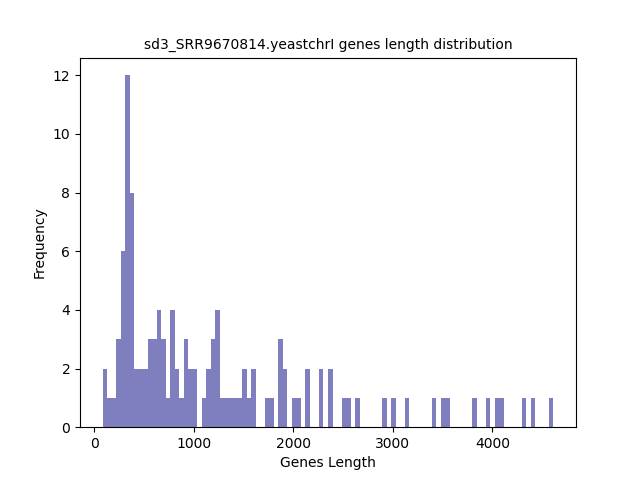

.. raw:: html
    

Log Linear Plots 
###################

Where cutoff is the minimum no. of genes to support a position to be considered in bins. Max gene length is the longest gene considered corresponding to this cutoff. 

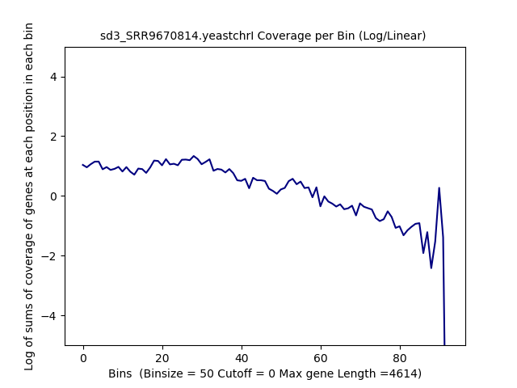

.. raw:: html
    

Log Log Plots 
###################

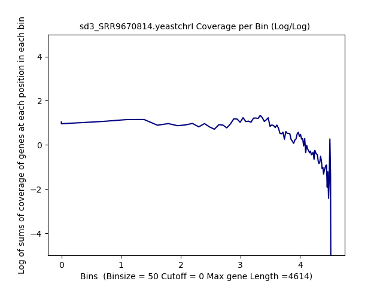

.. raw:: html
    

Linear Regression 
###################

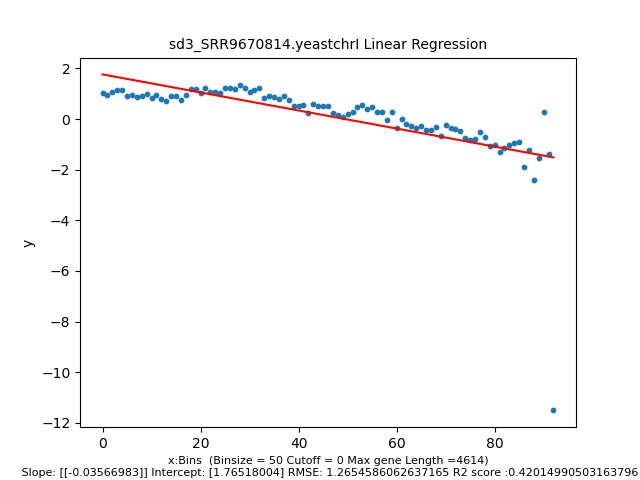

.. raw:: html
    

ChrII
------------

Histogram of Genes' Length 
###############################

.. raw:: html
    

Log Linear Plots 
###################

Where cutoff is the minimum no. of genes to support a position to be considered in bins. Max gene length is the longest gene considered corresponding to this cutoff. 

.. image:: sd3_SRR9670814.yeastchrII_50_0.LogLinear.png 
   :width: 400

.. raw:: html
    

Log Log Plots 
###################

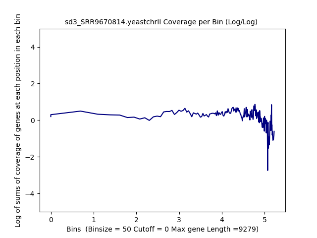

.. raw:: html
    

Linear Regression 
###################

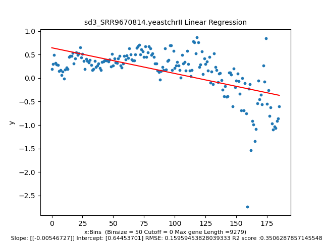

.. raw:: html
    

ChrIII
------------

Histogram of Genes' Length 
###############################

.. raw:: html
    

Log Linear Plots 
###################

Where cutoff is the minimum no. of genes to support a position to be considered in bins. Max gene length is the longest gene considered corresponding to this cutoff. 

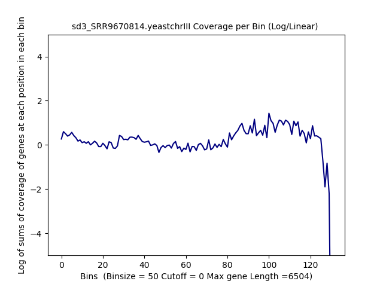

.. raw:: html
    

Log Log Plots 
###################

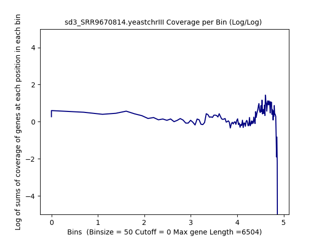

.. raw:: html
    

Linear Regression 
###################

.. image:: sd3_SRR9670814.yeastchrIII_50_0.LR.png 
   :width: 400

.. raw:: html
    

ChrIV
------------

Histogram of Genes' Length 
###############################

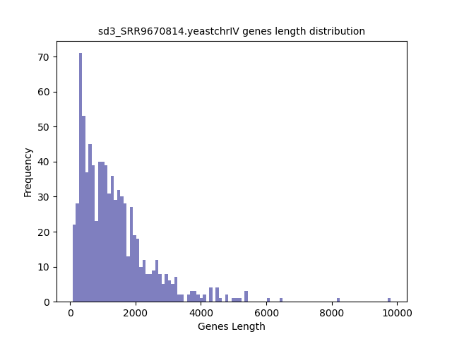

.. raw:: html
    

Log Linear Plots 
###################

Where cutoff is the minimum no. of genes to support a position to be considered in bins. Max gene length is the longest gene considered corresponding to this cutoff. 

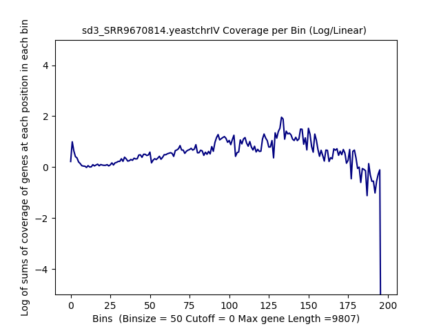

.. raw:: html
    

Log Log Plots 
###################

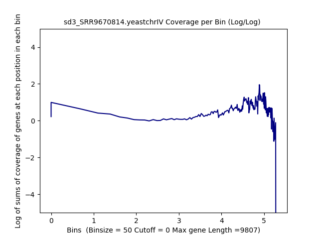

.. raw:: html
    

Linear Regression 
###################

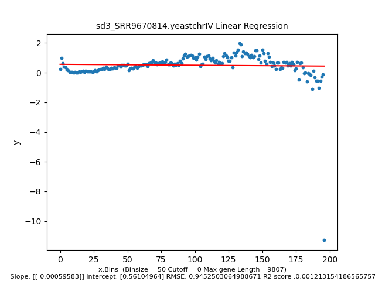

.. raw:: html
    

ChrIX
------------

Histogram of Genes' Length 
###############################

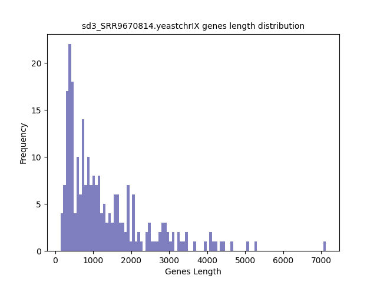

.. raw:: html
    

Log Linear Plots 
###################

Where cutoff is the minimum no. of genes to support a position to be considered in bins. Max gene length is the longest gene considered corresponding to this cutoff. 

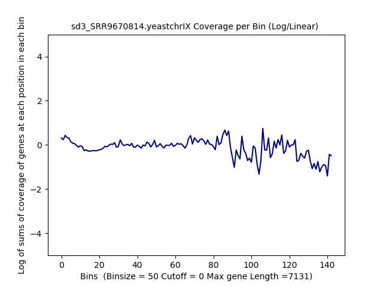

.. raw:: html
    

Log Log Plots 
###################

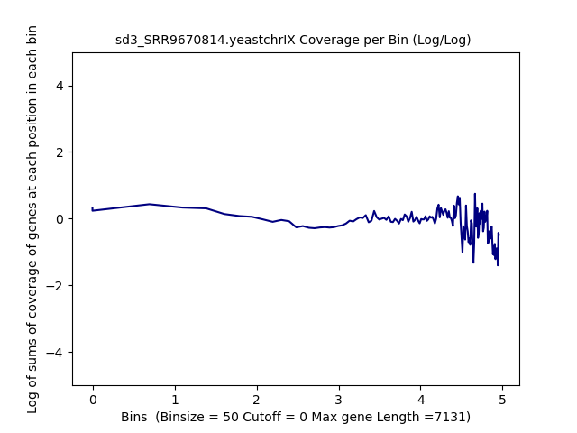

.. raw:: html
    

Linear Regression 
###################

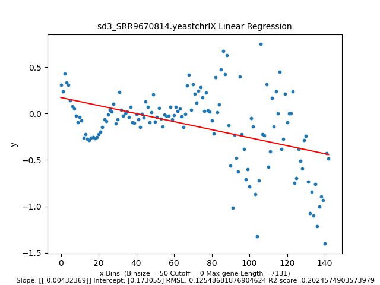

.. raw:: html
    

ChrVIII
------------

Histogram of Genes' Length 
###############################

.. image:: sd3_SRR9670814.yeastchrVIII.Length.Histogram.png 
   :width: 400 

.. raw:: html
    

Log Linear Plots 
###################

Where cutoff is the minimum no. of genes to support a position to be considered in bins. Max gene length is the longest gene considered corresponding to this cutoff. 

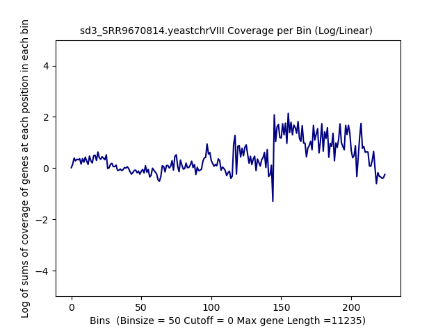

.. raw:: html
    

Log Log Plots 
###################

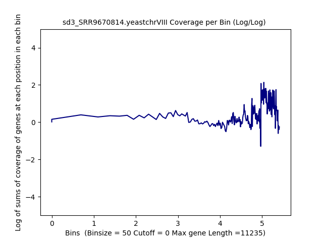

.. raw:: html
    

Linear Regression 
###################

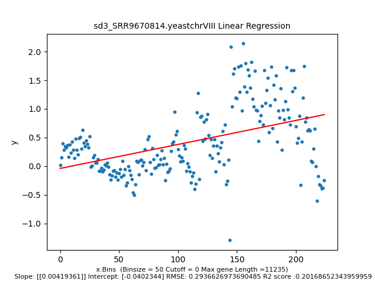

.. raw:: html
    

ChrVII
------------

Histogram of Genes' Length 
###############################

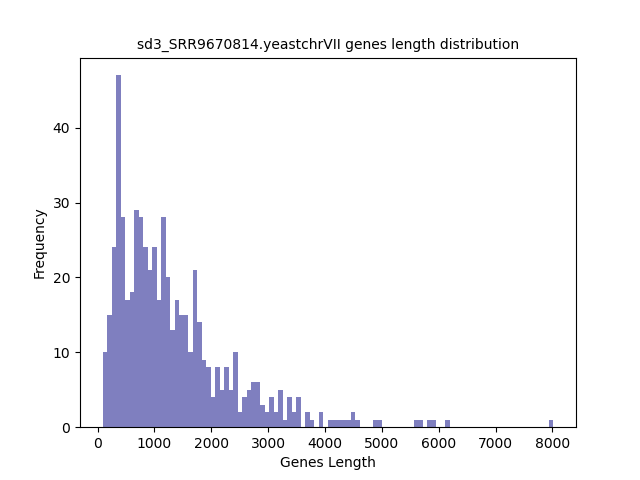

.. raw:: html
    

Log Linear Plots 
###################

Where cutoff is the minimum no. of genes to support a position to be considered in bins. Max gene length is the longest gene considered corresponding to this cutoff. 

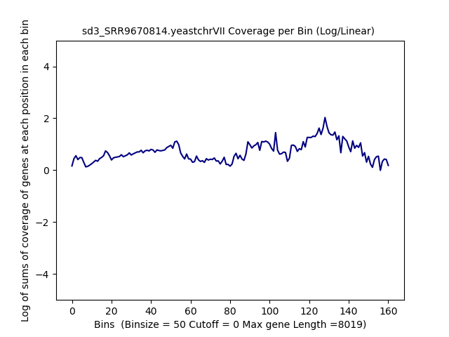

.. raw:: html
    

Log Log Plots 
###################

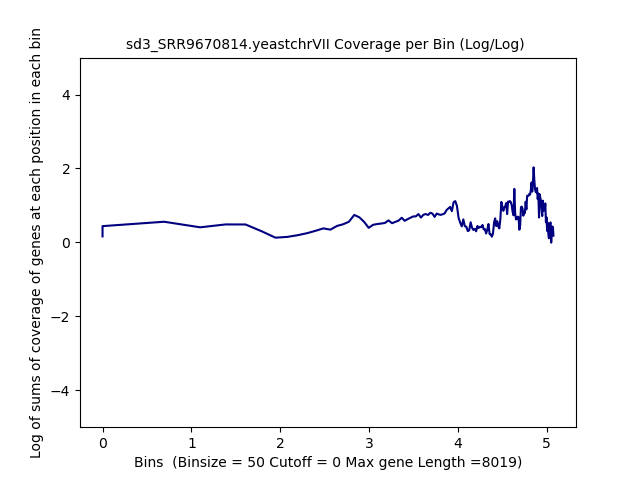

.. raw:: html
    

Linear Regression 
###################

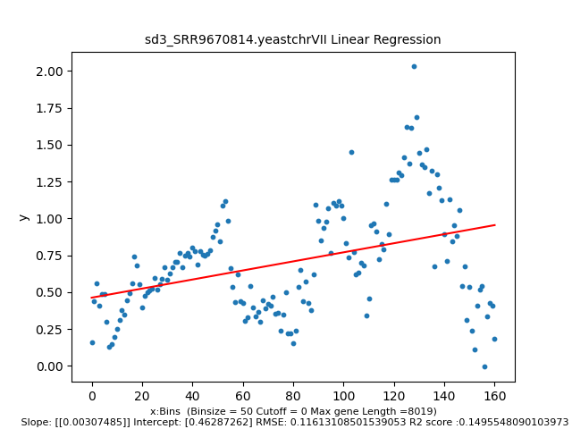

.. raw:: html
    

ChrVI
------------

Histogram of Genes' Length 
###############################

.. raw:: html
    

Log Linear Plots 
###################

Where cutoff is the minimum no. of genes to support a position to be considered in bins. Max gene length is the longest gene considered corresponding to this cutoff. 

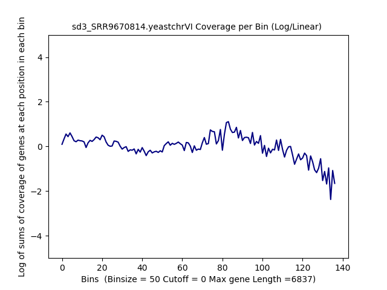

.. raw:: html
    

Log Log Plots 
###################

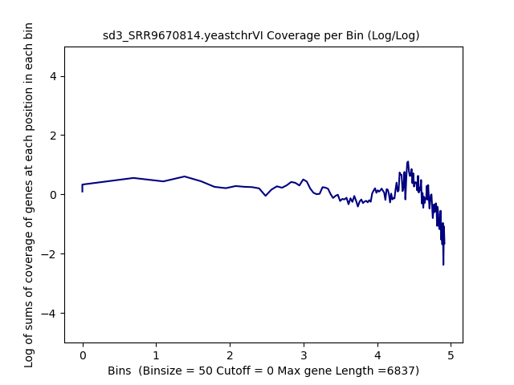

.. raw:: html
    

Linear Regression 
###################

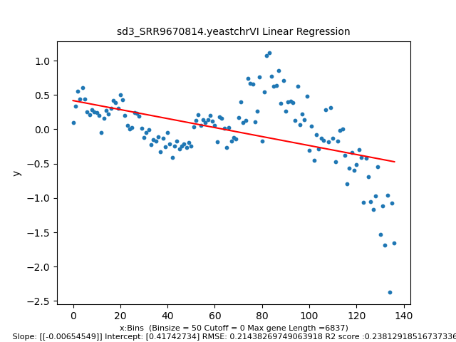

.. raw:: html
    

ChrV
------------

Histogram of Genes' Length 
###############################

.. raw:: html
    

Log Linear Plots 
###################

Where cutoff is the minimum no. of genes to support a position to be considered in bins. Max gene length is the longest gene considered corresponding to this cutoff. 

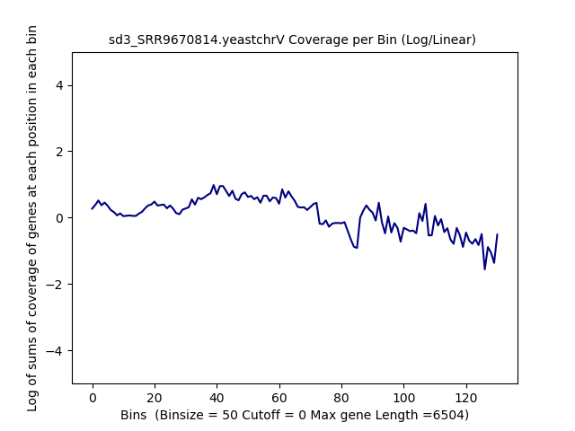

.. raw:: html
    

Log Log Plots 
###################

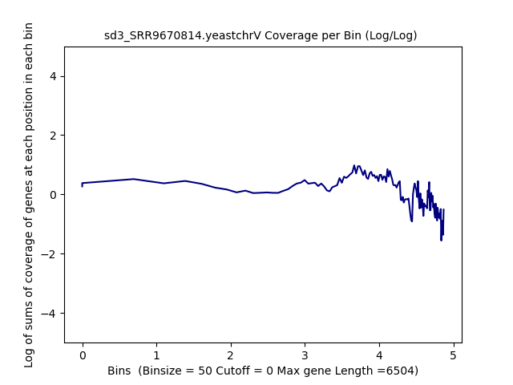

.. raw:: html
    

Linear Regression 
###################

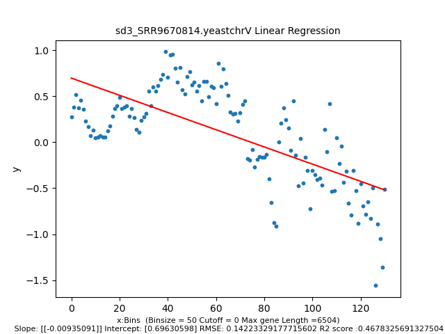

.. raw:: html
    

ChrXIII
------------

Histogram of Genes' Length 
###############################

.. image:: sd3_SRR9670814.yeastchrXIII.Length.Histogram.png 
   :width: 400 

.. raw:: html
    

Log Linear Plots 
###################

Where cutoff is the minimum no. of genes to support a position to be considered in bins. Max gene length is the longest gene considered corresponding to this cutoff. 

.. image:: sd3_SRR9670814.yeastchrXIII_50_0.LogLinear.png 
   :width: 400

.. raw:: html
    

Log Log Plots 
###################

.. image:: sd3_SRR9670814.yeastchrXIII_50_0.LogLog.png 
   :width: 400

.. raw:: html
    

Linear Regression 
###################

.. image:: sd3_SRR9670814.yeastchrXIII_50_0.LR.png 
   :width: 400

.. raw:: html
    

ChrXII
------------

Histogram of Genes' Length 
###############################

.. raw:: html
    

Log Linear Plots 
###################

Where cutoff is the minimum no. of genes to support a position to be considered in bins. Max gene length is the longest gene considered corresponding to this cutoff. 

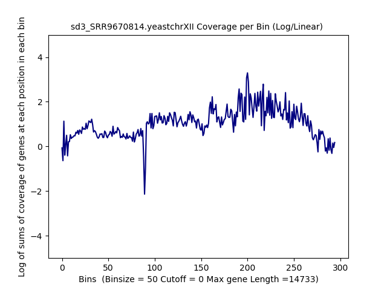

.. raw:: html
    

Log Log Plots 
###################

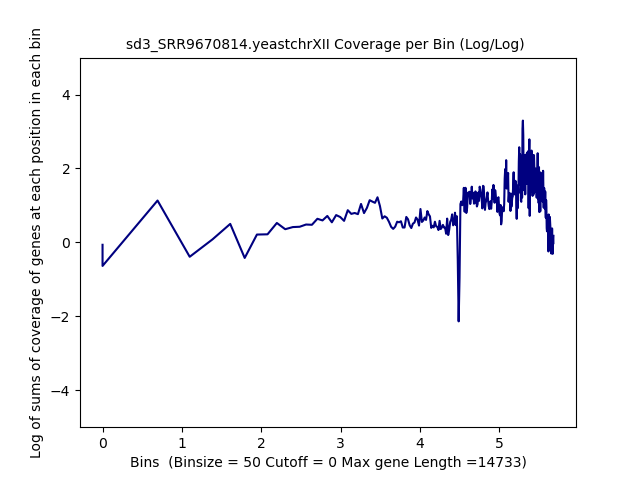

.. raw:: html
    

Linear Regression 
###################

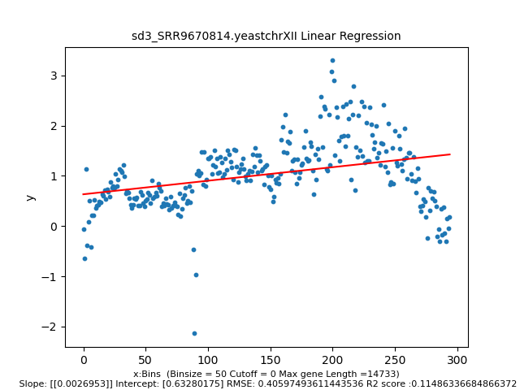

.. raw:: html
    

ChrXI
------------

Histogram of Genes' Length 
###############################

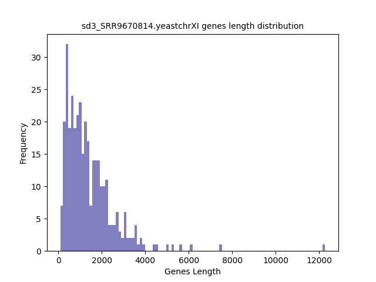

.. raw:: html
    

Log Linear Plots 
###################

Where cutoff is the minimum no. of genes to support a position to be considered in bins. Max gene length is the longest gene considered corresponding to this cutoff. 

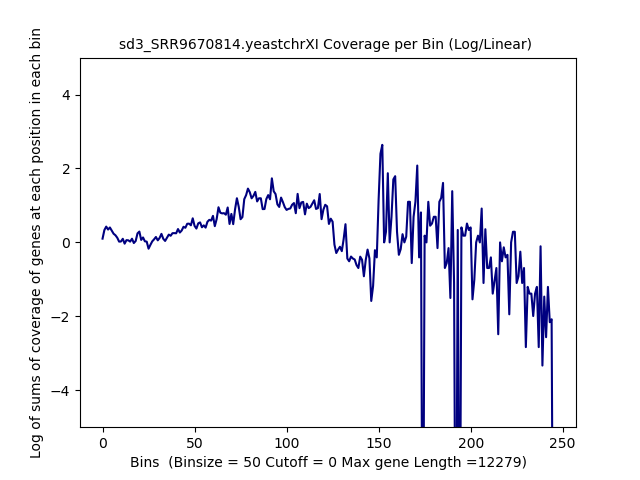

.. raw:: html
    

Log Log Plots 
###################

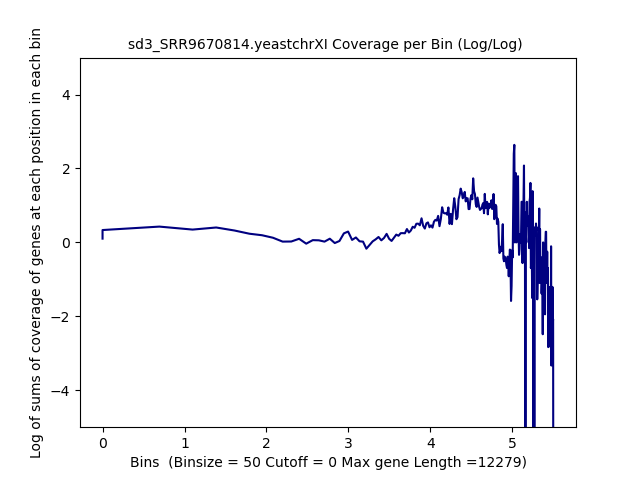

.. raw:: html
    

Linear Regression 
###################

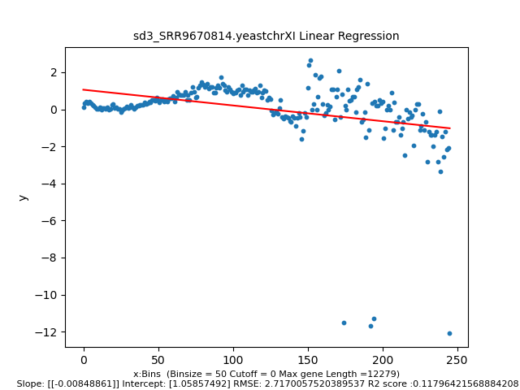

.. raw:: html
    

ChrXIV
------------

Histogram of Genes' Length 
###############################

.. image:: sd3_SRR9670814.yeastchrXIV.Length.Histogram.png 
   :width: 400 

.. raw:: html
    

Log Linear Plots 
###################

Where cutoff is the minimum no. of genes to support a position to be considered in bins. Max gene length is the longest gene considered corresponding to this cutoff. 

.. image:: sd3_SRR9670814.yeastchrXIV_50_0.LogLinear.png 
   :width: 400

.. raw:: html
    

Log Log Plots 
###################

.. image:: sd3_SRR9670814.yeastchrXIV_50_0.LogLog.png 
   :width: 400

.. raw:: html
    

Linear Regression 
###################

.. image:: sd3_SRR9670814.yeastchrXIV_50_0.LR.png 
   :width: 400

.. raw:: html
    

ChrX
------------

Histogram of Genes' Length 
###############################

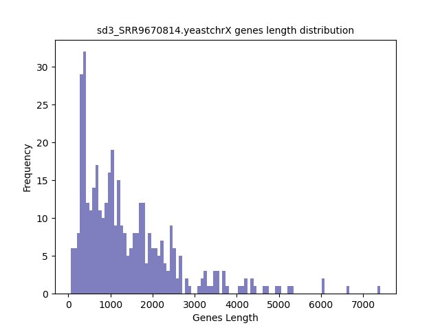

.. raw:: html
    

Log Linear Plots 
###################

Where cutoff is the minimum no. of genes to support a position to be considered in bins. Max gene length is the longest gene considered corresponding to this cutoff. 

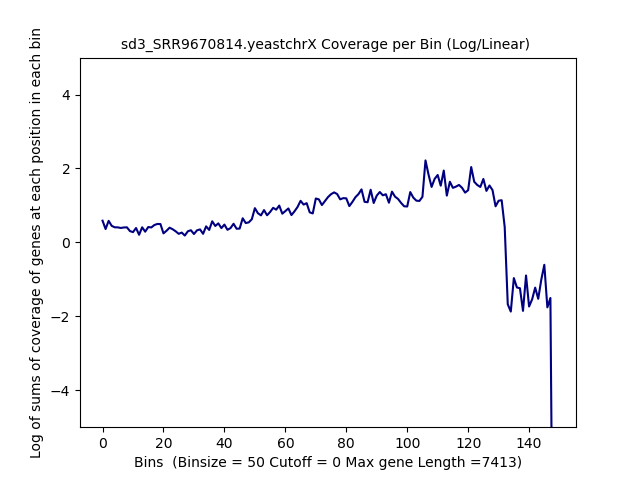

.. raw:: html
    

Log Log Plots 
###################

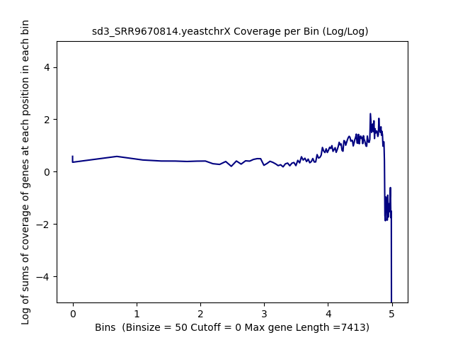

.. raw:: html
    

Linear Regression 
###################

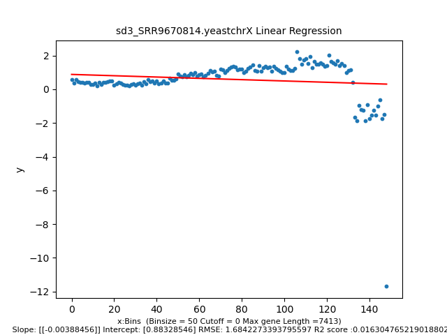

.. raw:: html
    

ChrXVI
------------

Histogram of Genes' Length 
###############################

.. image:: sd3_SRR9670814.yeastchrXVI.Length.Histogram.png 
   :width: 400 

.. raw:: html
    

Log Linear Plots 
###################

Where cutoff is the minimum no. of genes to support a position to be considered in bins. Max gene length is the longest gene considered corresponding to this cutoff. 

.. image:: sd3_SRR9670814.yeastchrXVI_50_0.LogLinear.png 
   :width: 400

.. raw:: html
    

Log Log Plots 
###################

.. image:: sd3_SRR9670814.yeastchrXVI_50_0.LogLog.png 
   :width: 400

.. raw:: html
    

Linear Regression 
###################

.. image:: sd3_SRR9670814.yeastchrXVI_50_0.LR.png 
   :width: 400

.. raw:: html
    

ChrXV
------------

Histogram of Genes' Length 
###############################

.. image:: sd3_SRR9670814.yeastchrXV.Length.Histogram.png 
   :width: 400 

.. raw:: html
    

Log Linear Plots 
###################

Where cutoff is the minimum no. of genes to support a position to be considered in bins. Max gene length is the longest gene considered corresponding to this cutoff. 

.. image:: sd3_SRR9670814.yeastchrXV_50_0.LogLinear.png 
   :width: 400

.. raw:: html
    

Log Log Plots 
###################

.. image:: sd3_SRR9670814.yeastchrXV_50_0.LogLog.png 
   :width: 400

.. raw:: html
    

Linear Regression 
###################

.. image:: sd3_SRR9670814.yeastchrXV_50_0.LR.png 
   :width: 400

.. raw:: html
    

(SRR9670818 +SRR9670819)/SRR9670815
**************************************

ChrI
------------

Histogram of Genes' Length 
###############################

.. raw:: html
    

Log Linear Plots 
###################

Where cutoff is the minimum no. of genes to support a position to be considered in bins. Max gene length is the longest gene considered corresponding to this cutoff. 

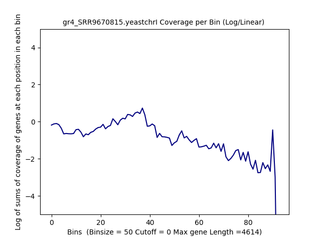

.. raw:: html
    

Log Log Plots 
###################

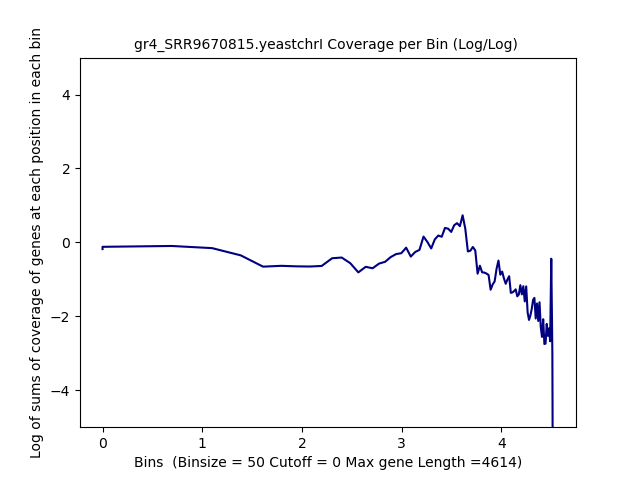

.. raw:: html
    

Linear Regression 
###################

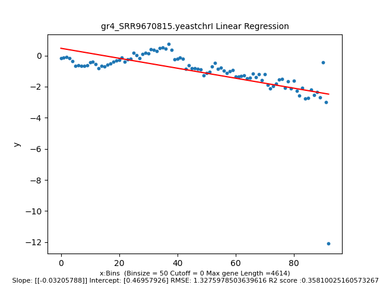

.. raw:: html
    

ChrII
------------

Histogram of Genes' Length 
###############################

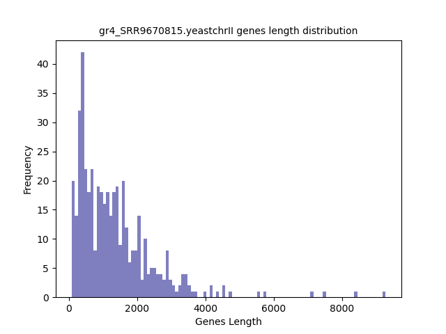

.. raw:: html
    

Log Linear Plots 
###################

Where cutoff is the minimum no. of genes to support a position to be considered in bins. Max gene length is the longest gene considered corresponding to this cutoff. 

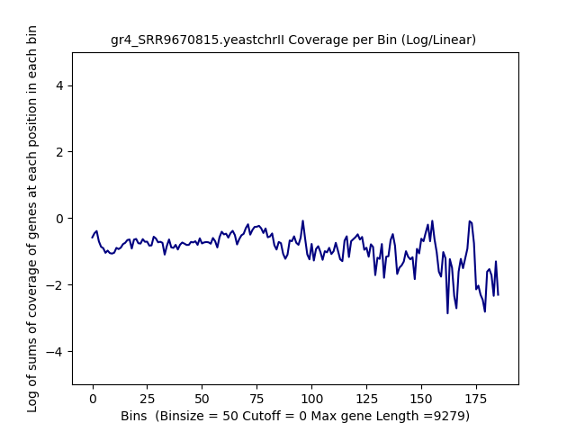

.. raw:: html
    

Log Log Plots 
###################

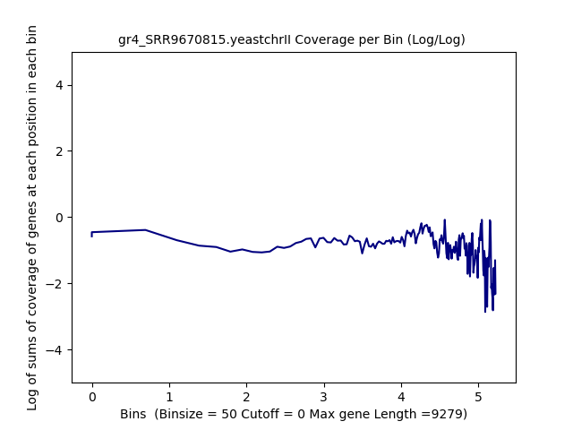

.. raw:: html
    

Linear Regression 
###################

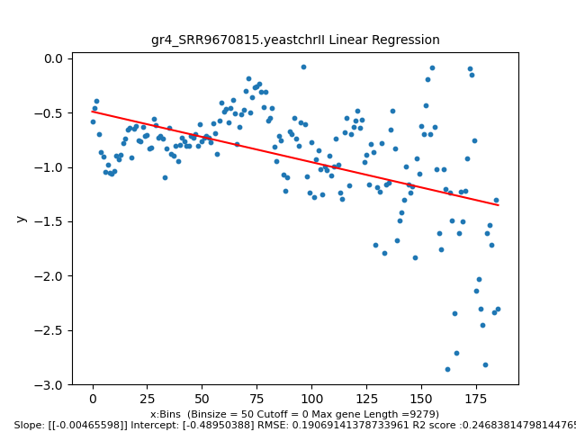

.. raw:: html
    

ChrIII
------------

Histogram of Genes' Length 
###############################

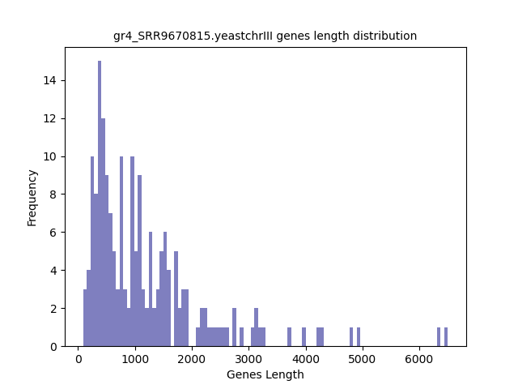

.. raw:: html
    

Log Linear Plots 
###################

Where cutoff is the minimum no. of genes to support a position to be considered in bins. Max gene length is the longest gene considered corresponding to this cutoff. 

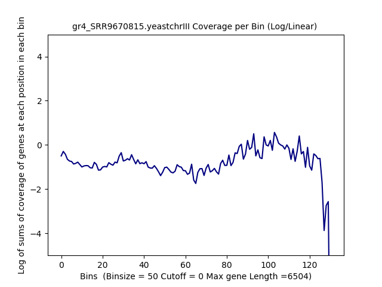

.. raw:: html
    

Log Log Plots 
###################

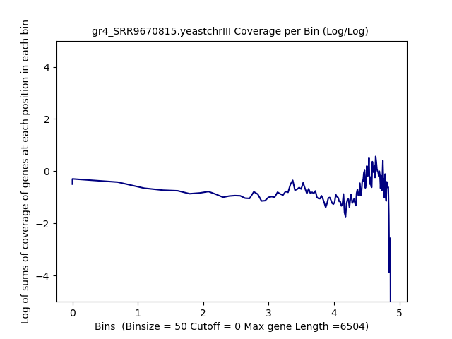

.. raw:: html
    

Linear Regression 
###################


.. raw:: html
    

ChrIV
------------

Histogram of Genes' Length 
###############################

.. raw:: html
    

Log Linear Plots 
###################

Where cutoff is the minimum no. of genes to support a position to be considered in bins. Max gene length is the longest gene considered corresponding to this cutoff. 


.. raw:: html
    

Log Log Plots 
###################


.. raw:: html
    

Linear Regression 
###################


.. raw:: html
    

ChrIX
------------

Histogram of Genes' Length 
###############################

.. raw:: html
    

Log Linear Plots 
###################

Where cutoff is the minimum no. of genes to support a position to be considered in bins. Max gene length is the longest gene considered corresponding to this cutoff. 


.. raw:: html
    

Log Log Plots 
###################


.. raw:: html
    

Linear Regression 
###################


.. raw:: html
    

ChrVIII
------------

Histogram of Genes' Length 
###############################


.. raw:: html
    

Log Linear Plots 
###################

Where cutoff is the minimum no. of genes to support a position to be considered in bins. Max gene length is the longest gene considered corresponding to this cutoff. 


.. raw:: html
    

Log Log Plots 
###################


.. raw:: html
    

Linear Regression 
###################


.. raw:: html
    

ChrVII
------------

Histogram of Genes' Length 
###############################

.. raw:: html
    

Log Linear Plots 
###################

Where cutoff is the minimum no. of genes to support a position to be considered in bins. Max gene length is the longest gene considered corresponding to this cutoff. 


.. raw:: html
    

Log Log Plots 
###################


.. raw:: html
    

Linear Regression 
###################


.. raw:: html
    

ChrVI
------------

Histogram of Genes' Length 
###############################


.. raw:: html
    

Log Linear Plots 
###################

Where cutoff is the minimum no. of genes to support a position to be considered in bins. Max gene length is the longest gene considered corresponding to this cutoff. 


.. raw:: html
    

Log Log Plots 
###################

.. image:: gr4_SRR9670815.yeastchrVI_50_0.LogLog.png 
   :width: 400

.. raw:: html
    

Linear Regression 
###################


.. raw:: html
    

ChrV
------------

Histogram of Genes' Length 
###############################


.. raw:: html
    

Log Linear Plots 
###################

Where cutoff is the minimum no. of genes to support a position to be considered in bins. Max gene length is the longest gene considered corresponding to this cutoff. 


.. raw:: html
    

Log Log Plots 
###################


.. raw:: html
    

Linear Regression 
###################


.. raw:: html
    

ChrXIII
------------

Histogram of Genes' Length 
###############################


.. raw:: html
    

Log Linear Plots 
###################

Where cutoff is the minimum no. of genes to support a position to be considered in bins. Max gene length is the longest gene considered corresponding to this cutoff. 


.. raw:: html
    

Log Log Plots 
###################


.. raw:: html
    

Linear Regression 
###################


.. raw:: html
    

ChrXII
------------

Histogram of Genes' Length 
###############################


.. raw:: html
    

Log Linear Plots 
###################

Where cutoff is the minimum no. of genes to support a position to be considered in bins. Max gene length is the longest gene considered corresponding to this cutoff. 


.. raw:: html
    

Log Log Plots 
###################


.. raw:: html
    

Linear Regression 
###################


.. raw:: html
    

ChrXI
------------

Histogram of Genes' Length 
###############################

.. image:: gr4_SRR9670815.yeastchrXI.Length.Histogram.png 
   :width: 400 

.. raw:: html
    

Log Linear Plots 
###################

Where cutoff is the minimum no. of genes to support a position to be considered in bins. Max gene length is the longest gene considered corresponding to this cutoff. 


.. raw:: html
    

Log Log Plots 
###################


.. raw:: html
    

Linear Regression 
###################


.. raw:: html
    

ChrXIV
------------

Histogram of Genes' Length 
###############################


.. raw:: html
    

Log Linear Plots 
###################

Where cutoff is the minimum no. of genes to support a position to be considered in bins. Max gene length is the longest gene considered corresponding to this cutoff. 


.. raw:: html
    

Log Log Plots 
###################

.. image:: gr4_SRR9670815.yeastchrXIV_50_0.LogLog.png 
   :width: 400

.. raw:: html
    

Linear Regression 
###################


.. raw:: html
    

ChrX
------------

Histogram of Genes' Length 
###############################

.. raw:: html
    

Log Linear Plots 
###################

Where cutoff is the minimum no. of genes to support a position to be considered in bins. Max gene length is the longest gene considered corresponding to this cutoff. 


.. raw:: html
    

Log Log Plots 
###################


.. raw:: html
    

Linear Regression 
###################


.. raw:: html
    

ChrXVI
------------

Histogram of Genes' Length 
###############################


.. raw:: html
    

Log Linear Plots 
###################

Where cutoff is the minimum no. of genes to support a position to be considered in bins. Max gene length is the longest gene considered corresponding to this cutoff. 


.. raw:: html
    

Log Log Plots 
###################

.. image:: gr4_SRR9670815.yeastchrXVI_50_0.LogLog.png 
   :width: 400

.. raw:: html
    

Linear Regression 
###################


.. raw:: html
    

ChrXV
------------

Histogram of Genes' Length 
###############################


.. raw:: html
    

Log Linear Plots 
###################

Where cutoff is the minimum no. of genes to support a position to be considered in bins. Max gene length is the longest gene considered corresponding to this cutoff. 

.. image:: gr4_SRR9670815.yeastchrXV_50_0.LogLinear.png 
   :width: 400

.. raw:: html
    

Log Log Plots 
###################


.. raw:: html
    

Linear Regression 
###################


.. raw:: html
    

