====================================================
**GSE134152:Orthologous** 
====================================================

SRR9670822/SRR9670820
***************************

Human
------------

Histogram of Genes' Length 
###############################

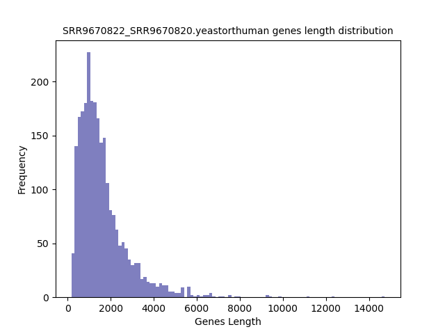

.. raw:: html
    

Log Linear Plots 
###################

Where cutoff is the minimum no. of genes to support a position to be considered in bins. Max gene length is the longest gene considered corresponding to this cutoff. 

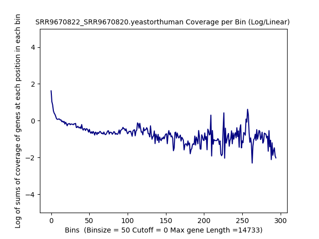

.. raw:: html
    

Log Log Plots 
###################

.. raw:: html
    

Linear Regression 
###################

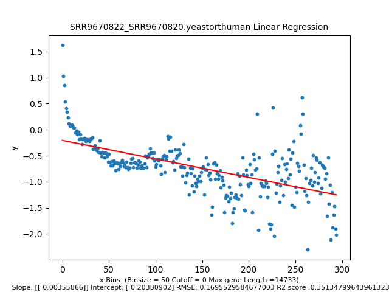

.. raw:: html
    

Mouse
------------

Histogram of Genes' Length 
###############################

.. raw:: html
    

Log Linear Plots 
###################

Where cutoff is the minimum no. of genes to support a position to be considered in bins. Max gene length is the longest gene considered corresponding to this cutoff. 

.. raw:: html
    

Log Log Plots 
###################

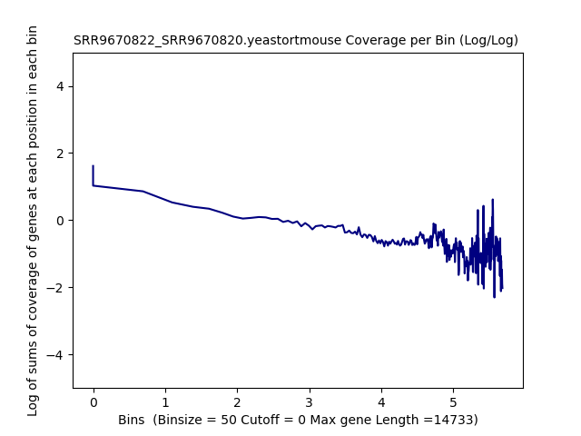

.. raw:: html
    

Linear Regression 
###################

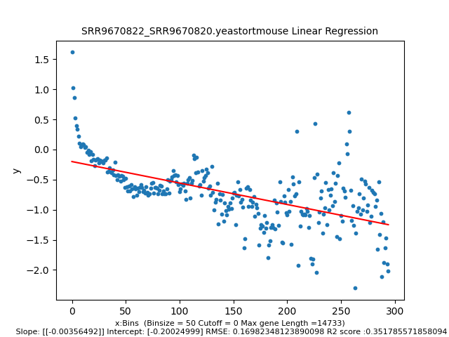

.. raw:: html
    

SRR9670823/SRR9670821
***************************

Human
------------

Histogram of Genes' Length 
###############################

.. raw:: html
    

Log Linear Plots 
###################

Where cutoff is the minimum no. of genes to support a position to be considered in bins. Max gene length is the longest gene considered corresponding to this cutoff. 

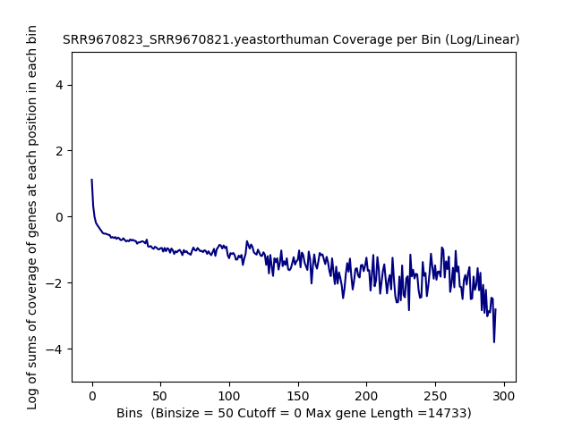

.. raw:: html
    

Log Log Plots 
###################

.. raw:: html
    

Linear Regression 
###################

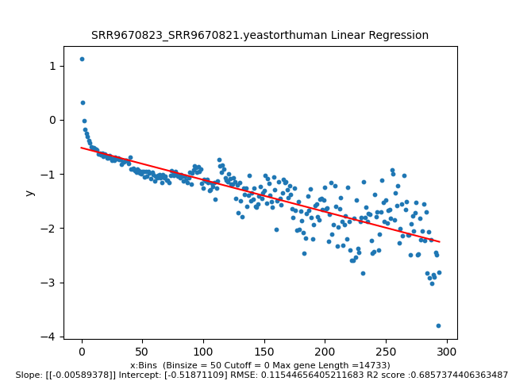

.. raw:: html
    

Mouse
------------

Histogram of Genes' Length 
###############################

.. raw:: html
    

Log Linear Plots 
###################

Where cutoff is the minimum no. of genes to support a position to be considered in bins. Max gene length is the longest gene considered corresponding to this cutoff. 

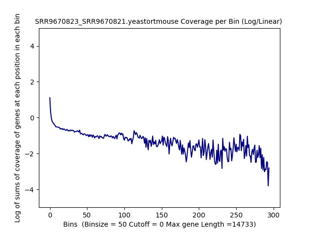

.. raw:: html
    

Log Log Plots 
###################

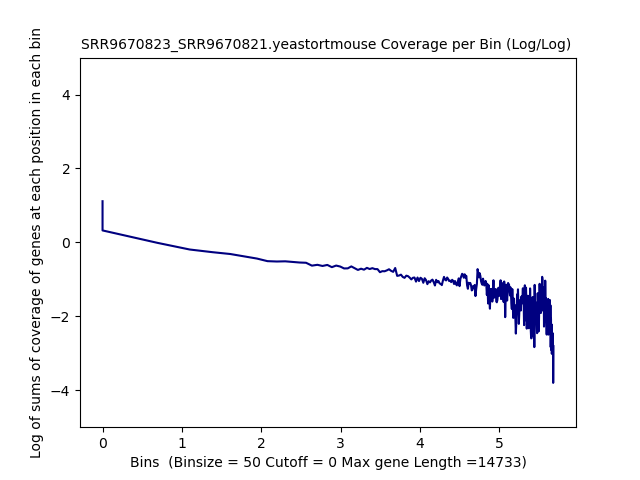

.. raw:: html
    

Linear Regression 
###################

.. raw:: html
    

(SRR9670816+SRR9670817)/SRR9670814
***************************************

Human
------------

Histogram of Genes' Length 
###############################

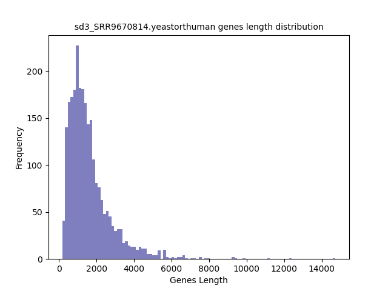

.. raw:: html
    

Log Linear Plots 
###################

Where cutoff is the minimum no. of genes to support a position to be considered in bins. Max gene length is the longest gene considered corresponding to this cutoff. 

.. raw:: html
    

Log Log Plots 
###################

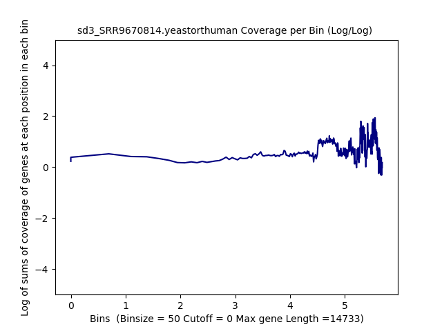

.. raw:: html
    

Linear Regression 
###################

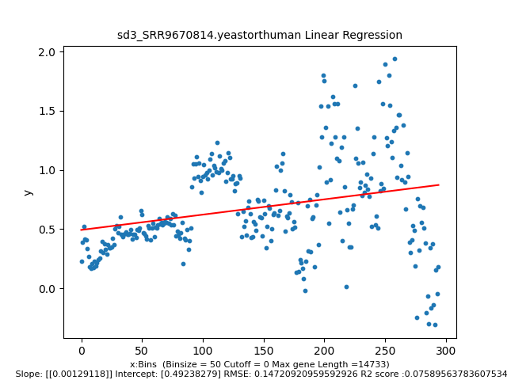

.. raw:: html
    

Mouse
------------

Histogram of Genes' Length 
###############################

.. raw:: html
    

Log Linear Plots 
###################

Where cutoff is the minimum no. of genes to support a position to be considered in bins. Max gene length is the longest gene considered corresponding to this cutoff. 

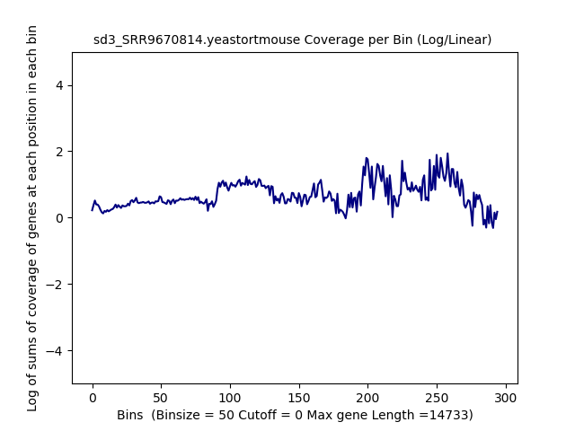

.. raw:: html
    

Log Log Plots 
###################

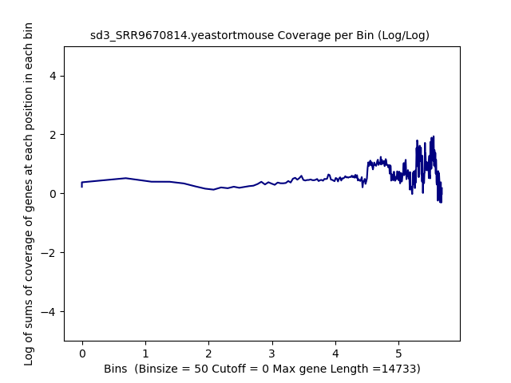

.. raw:: html
    

Linear Regression 
###################

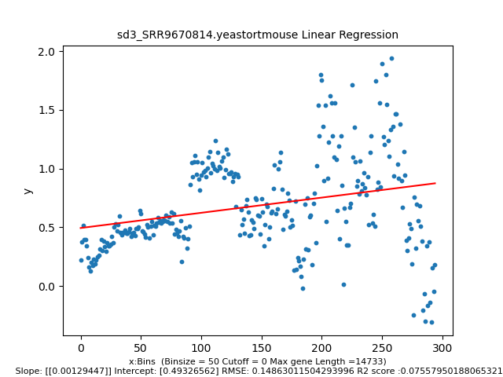

.. raw:: html
    

(SRR9670818+SRR9670819)/SRR9670815
***************************************

Human
------------

Histogram of Genes' Length 
###############################

.. raw:: html
    

Log Linear Plots 
###################

Where cutoff is the minimum no. of genes to support a position to be considered in bins. Max gene length is the longest gene considered corresponding to this cutoff. 

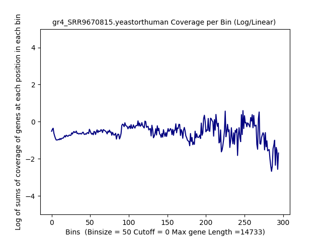

.. raw:: html
    

Log Log Plots 
###################

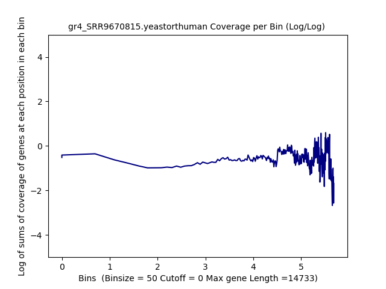

.. raw:: html
    

Linear Regression 
###################

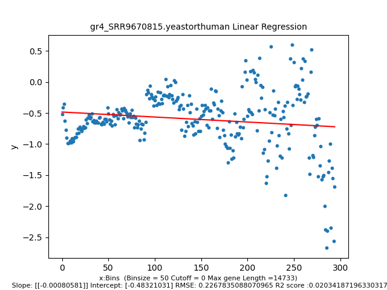

.. raw:: html
    

Mouse
------------

Histogram of Genes' Length 
###############################

.. raw:: html
    

Log Linear Plots 
###################

Where cutoff is the minimum no. of genes to support a position to be considered in bins. Max gene length is the longest gene considered corresponding to this cutoff. 

.. raw:: html
    

Log Log Plots 
###################

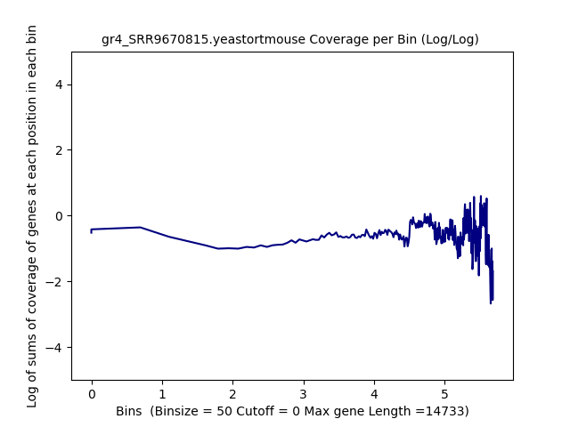

.. raw:: html
    

Linear Regression 
###################

.. image:: gr4_SRR9670815.yeastortmouse_50_0.LR.png 
   :width: 400

.. raw:: html
    

