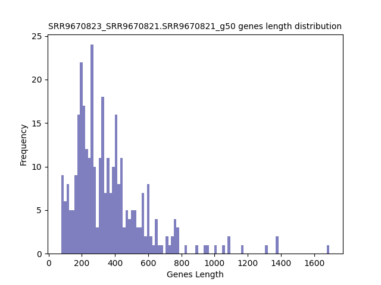

====================================================
**GSE134152:TPM** 
====================================================

SRR9670822/SRR9670820
*************************

TPM >50
------------

Histogram of Genes' Length 
###############################

.. image:: SRR9670822_SRR9670820.SRR9670820_g50.Length.Histogram.png 
   :width: 400 

.. raw:: html
    

Log Linear Plots 
###################

Where cutoff is the minimum no. of genes to support a position to be considered in bins. Max gene length is the longest gene considered corresponding to this cutoff. 

.. raw:: html
    

Log Log Plots 
###################

.. raw:: html
    

Linear Regression 
###################

.. image:: SRR9670822_SRR9670820.SRR9670820_g50_50_0.LR.png 
   :width: 400

.. raw:: html
    

TPM < 50
------------

Histogram of Genes' Length 
###############################

.. image:: SRR9670822_SRR9670820.SRR9670820_l50.Length.Histogram.png 
   :width: 400 

.. raw:: html
    

Log Linear Plots 
###################

Where cutoff is the minimum no. of genes to support a position to be considered in bins. Max gene length is the longest gene considered corresponding to this cutoff. 

.. raw:: html
    

Log Log Plots 
###################

.. image:: SRR9670822_SRR9670820.SRR9670820_l50_50_0.LogLog.png 
   :width: 400

.. raw:: html
    

Linear Regression 
###################

.. image:: SRR9670822_SRR9670820.SRR9670820_l50_50_0.LR.png 
   :width: 400

.. raw:: html
    

SRR96708223/SRR9670821
**************************

TPM >50
------------

Histogram of Genes' Length 
###############################

.. raw:: html
    

Log Linear Plots 
###################

Where cutoff is the minimum no. of genes to support a position to be considered in bins. Max gene length is the longest gene considered corresponding to this cutoff. 

.. raw:: html
    

Log Log Plots 
###################

.. raw:: html
    

Linear Regression 
###################

.. raw:: html
    

TPM < 50
------------

Histogram of Genes' Length 
###############################

.. raw:: html
    

Log Linear Plots 
###################

Where cutoff is the minimum no. of genes to support a position to be considered in bins. Max gene length is the longest gene considered corresponding to this cutoff. 

.. raw:: html
    

Log Log Plots 
###################

.. raw:: html
    

Linear Regression 
###################

.. raw:: html
    

(SRR9670816+SRR9670817)/SRR9670814
*************************************

TPM >50
------------

Histogram of Genes' Length 
###############################

.. raw:: html
    

Log Linear Plots 
###################

Where cutoff is the minimum no. of genes to support a position to be considered in bins. Max gene length is the longest gene considered corresponding to this cutoff. 

.. raw:: html
    

Log Log Plots 
###################

.. raw:: html
    

Linear Regression 
###################

.. raw:: html
    

TPM < 50
------------

Histogram of Genes' Length 
###############################

.. raw:: html
    

Log Linear Plots 
###################

Where cutoff is the minimum no. of genes to support a position to be considered in bins. Max gene length is the longest gene considered corresponding to this cutoff. 

.. raw:: html
    

Log Log Plots 
###################

.. raw:: html
    

Linear Regression 
###################

.. raw:: html
    

(SRR9670818+SRR9670819)/SRR9670815
*************************************

TPM >50
------------

Histogram of Genes' Length 
###############################

.. raw:: html
    

Log Linear Plots 
###################

Where cutoff is the minimum no. of genes to support a position to be considered in bins. Max gene length is the longest gene considered corresponding to this cutoff. 

.. raw:: html
    

Log Log Plots 
###################

.. image:: gr4_SRR9670815.SRR9670815_g50_50_0.LogLog.png 
   :width: 400

.. raw:: html
    

Linear Regression 
###################

.. image:: gr4_SRR9670815.SRR9670815_g50_50_0.LR.png 
   :width: 400

.. raw:: html
    

TPM < 50
------------

Histogram of Genes' Length 
###############################

.. raw:: html
    

Log Linear Plots 
###################

Where cutoff is the minimum no. of genes to support a position to be considered in bins. Max gene length is the longest gene considered corresponding to this cutoff. 

.. raw:: html
    

Log Log Plots 
###################

.. raw:: html
    

Linear Regression 
###################

.. image:: gr4_SRR9670815.SRR9670815_l50_50_0.LR.png 
   :width: 400

.. raw:: html
    

TPM >50
------------

Histogram of Genes' Length 
###############################

.. raw:: html
    

Log Linear Plots 
###################

Where cutoff is the minimum no. of genes to support a position to be considered in bins. Max gene length is the longest gene considered corresponding to this cutoff. 

.. raw:: html
    

Log Log Plots 
###################

.. raw:: html
    

Linear Regression 
###################

.. raw:: html
    

TPM < 50
------------

Histogram of Genes' Length 
###############################

.. raw:: html
    

Log Linear Plots 
###################

Where cutoff is the minimum no. of genes to support a position to be considered in bins. Max gene length is the longest gene considered corresponding to this cutoff. 

.. raw:: html
    

Log Log Plots 
###################

.. raw:: html
    

Linear Regression 
###################

.. raw:: html
    

