==========================
**Dataset 3:GSE13750**
==========================

**fp-rich-1/mRNA-rich-1**
-------------------------

Histogram of Genes' Length 

.. raw:: html
    

Log Linear Plots 

Where cutoff is the minimum no. of genes to support a position to be considered in bins. Max gene length is the longest gene considered corresponding to this cutoff. 

.. image:: fp-rich-1_mRNA-rich-1_50_0.LogLinear.png 
   :width: 20%

.. image:: fp-rich-1_mRNA-rich-1_50_100.LogLinear.png  
   :width: 20% 

.. image:: fp-rich-1_mRNA-rich-1_50_200.LogLinear.png
   :width: 20%

.. image:: fp-rich-1_mRNA-rich-1_50_500.LogLinear.png
   :width: 20%

.. image:: fp-rich-1_mRNA-rich-1_50_1000.LogLinear.png
   :width: 20%

.. image:: fp-rich-1_mRNA-rich-1_50_2000.LogLinear.png
   :width: 20%

.. raw:: html
    

Log Log Plots 

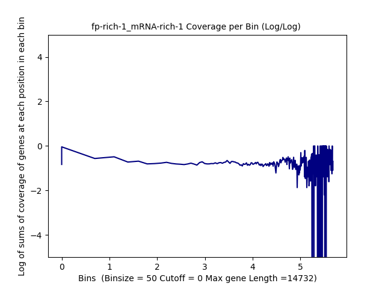

.. image:: fp-rich-1_mRNA-rich-1_50_500.LogLog.png
   :width: 20%

.. image:: fp-rich-1_mRNA-rich-1_50_1000.LogLog.png
   :width: 20%

.. raw:: html
    

Linear Regression 

.. image:: fp-rich-1_mRNA-rich-1_50_0.LR.png 
   :width: 20%

.. image:: fp-rich-1_mRNA-rich-1_50_500.LR.png
   :width: 20%

.. image:: fp-rich-1_mRNA-rich-1_50_1000.LR.png
   :width: 20%

.. raw:: html
    

**Stats**
#########################

**Adapters confirmation from authors in progress:email sent** 

+---------------+------------+---------------------------------------------------+
| Sample        | mRNA/FP    | Unique Alignment                                  |
+===============+============+===================================================+
| mRNA-rich-1   |    mRNA    |       29.13%                                      |
+---------------+------------+---------------------------------------------------+
| fp-rich-1     |    FP      | Merged:(60.26%)+(57.42%)+(4.46%)                  |
+---------------+------------+---------------------------------------------------+
| mRNA-rich-2   |    mRNA    | Merged: (11.81%)+(35.70%)+(?)                     |
+---------------+------------+---------------------------------------------------+
| fp-rich-2     |    FP      | Merged:(2.64%)+(3.86%)+(4.97%)+(5.87%)+(5.90%)    |
+---------------+------------+---------------------------------------------------+
| mRNA-starved-1|    mRNA    |       26.61%                                      |
+---------------+------------+---------------------------------------------------+
| fp-starved-1  |    FP      | Merged:(54.39%)+(52.57%)                          |
+---------------+------------+---------------------------------------------------+
| mRNA-starved-2|    mRNA    | Merged :(8.91%) + (11.77%)                        |
+---------------+------------+---------------------------------------------------+
| fp-starved-2  |    FP      | Merged:(3.57%)+(66.32%)+(6.66%)+(6.58%)           |
+---------------+------------+---------------------------------------------------+

**TPM** 
#########################

TPM >50

Histogram of Genes' Length 

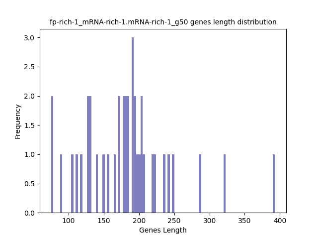

.. raw:: html
    

Log Linear Plots 

Where cutoff is the minimum no. of genes to support a position to be considered in bins. Max gene length is the longest gene considered corresponding to this cutoff. 

.. image:: fp-rich-1_mRNA-rich-1.mRNA-rich-1_g50_50_0.LogLinear.png 
   :width: 400

.. raw:: html
    

Log Log Plots 

.. raw:: html
    

Linear Regression 

.. image:: fp-rich-1_mRNA-rich-1.mRNA-rich-1_g50_50_0.LR.png 
   :width: 400

.. raw:: html
    

**TPM < 50**

Histogram of Genes' Length 

.. image:: fp-rich-1_mRNA-rich-1.mRNA-rich-1_l50.Length.Histogram.png 
   :width: 400 

.. raw:: html
    

Log Linear Plots 

Where cutoff is the minimum no. of genes to support a position to be considered in bins. Max gene length is the longest gene considered corresponding to this cutoff. 

.. image:: fp-rich-1_mRNA-rich-1.mRNA-rich-1_l50_50_0.LogLinear.png 
   :width: 400

.. raw:: html
    

Log Log Plots 

.. raw:: html
    

Linear Regression 

.. image:: fp-rich-1_mRNA-rich-1.mRNA-rich-1_l50_50_0.LR.png 
   :width: 400

.. raw:: html
    

**SNPs** 
#########################

**Genes with Zero SNPs**

Histogram of Genes' Length 

.. raw:: html
    

Log Linear Plots 

Where cutoff is the minimum no. of genes to support a position to be considered in bins. Max gene length is the longest gene considered corresponding to this cutoff. 

.. raw:: html
    

Log Log Plots 

.. image:: fp-rich-1_mRNA-rich-1.mRNA-rich-1_zerosnps_50_0.LogLog.png 
   :width: 400

.. raw:: html
    

Linear Regression 

.. raw:: html
    

**Genes with at least one SNP**

Histogram of Genes' Length 

.. raw:: html
    

Log Linear Plots 

Where cutoff is the minimum no. of genes to support a position to be considered in bins. Max gene length is the longest gene considered corresponding to this cutoff. 

.. raw:: html
    

Log Log Plots 

.. raw:: html
    

Linear Regression 

.. raw:: html
    

**GO** 
#########################

GO0006119
**Oxidative phosphorylation Gene Ontology Term**

Histogram of Genes' Length 

.. raw:: html
    

Log Linear Plots 

Where cutoff is the minimum no. of genes to support a position to be considered in bins. Max gene length is the longest gene considered corresponding to this cutoff. 

.. raw:: html
    

Log Log Plots 

.. raw:: html
    

Linear Regression 

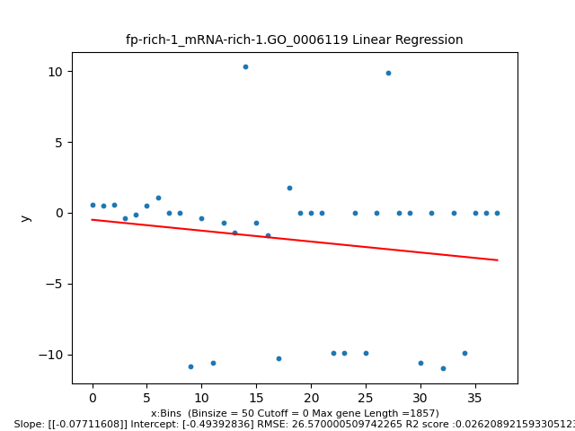

.. raw:: html
    

GO0006406
**mRNA export from nucleus** 

Histogram of Genes' Length 

.. raw:: html
    

Log Linear Plots 

Where cutoff is the minimum no. of genes to support a position to be considered in bins. Max gene length is the longest gene considered corresponding to this cutoff. 

.. raw:: html
    

Log Log Plots 

.. raw:: html
    

Linear Regression 

.. raw:: html
    

GO0006412
**Translation** 

Histogram of Genes' Length 

.. raw:: html
    

Log Linear Plots 

Where cutoff is the minimum no. of genes to support a position to be considered in bins. Max gene length is the longest gene considered corresponding to this cutoff. 

.. raw:: html
    

Log Log Plots 

.. image:: fp-rich-1_mRNA-rich-1.GO_0006412_50_0.LogLog.png 
   :width: 400

.. raw:: html
    

Linear Regression 

.. image:: fp-rich-1_mRNA-rich-1.GO_0006412_50_0.LR.png 
   :width: 400

.. raw:: html
    

GO0006950
**Response to stress** 

Histogram of Genes' Length 

.. raw:: html
    

Log Linear Plots 

Where cutoff is the minimum no. of genes to support a position to be considered in bins. Max gene length is the longest gene considered corresponding to this cutoff. 

.. image:: fp-rich-1_mRNA-rich-1.GO_0006950_50_0.LogLinear.png 
   :width: 400

.. raw:: html
    

Log Log Plots 

.. raw:: html
    

Linear Regression 

.. raw:: html
    

GO0009651
**Response to salt stress**

Histogram of Genes' Length 

.. raw:: html
    

Log Linear Plots 

Where cutoff is the minimum no. of genes to support a position to be considered in bins. Max gene length is the longest gene considered corresponding to this cutoff. 

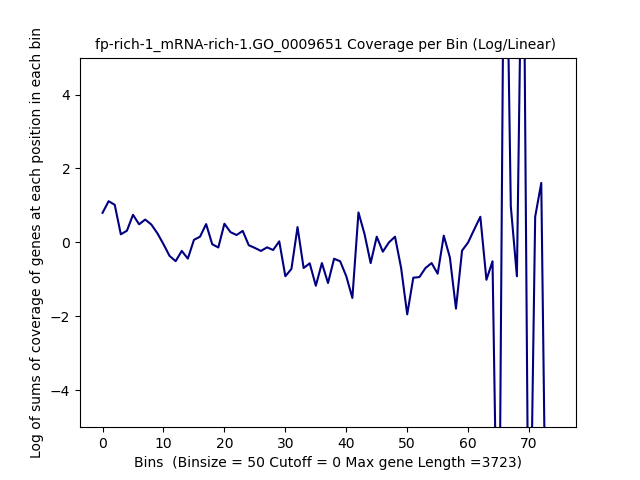

.. raw:: html
    

Log Log Plots 

.. raw:: html
    

Linear Regression 

.. raw:: html
    

GO0016458
**Gene silencing**

Histogram of Genes' Length 

.. raw:: html
    

Log Linear Plots 

Where cutoff is the minimum no. of genes to support a position to be considered in bins. Max gene length is the longest gene considered corresponding to this cutoff. 

.. raw:: html
    

Log Log Plots 

.. raw:: html
    

Linear Regression 

.. raw:: html
    

GO0031047
**Gene silencing by RNA**

Histogram of Genes' Length 

.. image:: fp-rich-1_mRNA-rich-1.GO_0031047.Length.Histogram.png 
   :width: 400 

.. raw:: html
    

Log Linear Plots 

Where cutoff is the minimum no. of genes to support a position to be considered in bins. Max gene length is the longest gene considered corresponding to this cutoff. 

.. raw:: html
    

Log Log Plots 

.. raw:: html
    

Linear Regression 

.. raw:: html
    

GO0031990
**Cellular Response to heat** 

Histogram of Genes' Length 

.. raw:: html
    

Log Linear Plots 

Where cutoff is the minimum no. of genes to support a position to be considered in bins. Max gene length is the longest gene considered corresponding to this cutoff. 

.. raw:: html
    

Log Log Plots 

.. raw:: html
    

Linear Regression 

.. raw:: html
    

GO0042254
**Ribosome biogenesis**

Histogram of Genes' Length 

.. raw:: html
    

Log Linear Plots 

Where cutoff is the minimum no. of genes to support a position to be considered in bins. Max gene length is the longest gene considered corresponding to this cutoff. 

.. raw:: html
    

Log Log Plots 

.. raw:: html
    

Linear Regression 

.. raw:: html
    

**Orthologous** 
#############################
**Human**

Histogram of Genes' Length 

.. raw:: html
    

Log Linear Plots 

Where cutoff is the minimum no. of genes to support a position to be considered in bins. Max gene length is the longest gene considered corresponding to this cutoff. 

.. raw:: html
    

Log Log Plots 

.. raw:: html
    

Linear Regression 

.. image:: fp-rich-1_mRNA-rich-1.yeastorthuman_50_0.LR.png 
   :width: 400

.. raw:: html
    

**Mouse**

Histogram of Genes' Length 

.. raw:: html
    

Log Linear Plots 

Where cutoff is the minimum no. of genes to support a position to be considered in bins. Max gene length is the longest gene considered corresponding to this cutoff. 

.. raw:: html
    

Log Log Plots 

.. raw:: html
    

Linear Regression 

.. image:: fp-rich-1_mRNA-rich-1.yeastortmouse_50_0.LR.png 
   :width: 400

.. raw:: html
    

**Chromosomes** 
###########################

ChrI

Histogram of Genes' Length 

.. raw:: html
    

Log Linear Plots 

Where cutoff is the minimum no. of genes to support a position to be considered in bins. Max gene length is the longest gene considered corresponding to this cutoff. 

.. image:: fp-rich-1_mRNA-rich-1.yeastchrI_50_0.LogLinear.png 
   :width: 400

.. raw:: html
    

Log Log Plots 

.. raw:: html
    

Linear Regression 

.. image:: fp-rich-1_mRNA-rich-1.yeastchrI_50_0.LR.png 
   :width: 400

.. raw:: html
    

ChrII

Histogram of Genes' Length 

.. raw:: html
    

Log Linear Plots 

Where cutoff is the minimum no. of genes to support a position to be considered in bins. Max gene length is the longest gene considered corresponding to this cutoff. 

.. image:: fp-rich-1_mRNA-rich-1.yeastchrII_50_0.LogLinear.png 
   :width: 400

.. raw:: html
    

Log Log Plots 

.. raw:: html
    

Linear Regression 

.. image:: fp-rich-1_mRNA-rich-1.yeastchrII_50_0.LR.png 
   :width: 400

.. raw:: html
    

ChrIII

Histogram of Genes' Length 

.. image:: fp-rich-1_mRNA-rich-1.yeastchrIII.Length.Histogram.png 
   :width: 400 

.. raw:: html
    

Log Linear Plots 

Where cutoff is the minimum no. of genes to support a position to be considered in bins. Max gene length is the longest gene considered corresponding to this cutoff. 

.. image:: fp-rich-1_mRNA-rich-1.yeastchrIII_50_0.LogLinear.png 
   :width: 400

.. raw:: html
    

Log Log Plots 

.. raw:: html
    

Linear Regression 

.. raw:: html
    

ChrIV

Histogram of Genes' Length 

.. image:: fp-rich-1_mRNA-rich-1.yeastchrIV.Length.Histogram.png 
   :width: 400 

.. raw:: html
    

Log Linear Plots 

Where cutoff is the minimum no. of genes to support a position to be considered in bins. Max gene length is the longest gene considered corresponding to this cutoff. 

.. image:: fp-rich-1_mRNA-rich-1.yeastchrIV_50_0.LogLinear.png 
   :width: 400

.. raw:: html
    

Log Log Plots 

.. image:: fp-rich-1_mRNA-rich-1.yeastchrIV_50_0.LogLog.png 
   :width: 400

.. raw:: html
    

Linear Regression 

.. image:: fp-rich-1_mRNA-rich-1.yeastchrIV_50_0.LR.png 
   :width: 400

.. raw:: html
    

ChrIX

Histogram of Genes' Length 

.. image:: fp-rich-1_mRNA-rich-1.yeastchrIX.Length.Histogram.png 
   :width: 400 

.. raw:: html
    

Log Linear Plots 

Where cutoff is the minimum no. of genes to support a position to be considered in bins. Max gene length is the longest gene considered corresponding to this cutoff. 

.. raw:: html
    

Log Log Plots 

.. raw:: html
    

Linear Regression 

.. raw:: html
    

ChrVIII

Histogram of Genes' Length 

.. raw:: html
    

Log Linear Plots 

Where cutoff is the minimum no. of genes to support a position to be considered in bins. Max gene length is the longest gene considered corresponding to this cutoff. 

.. image:: fp-rich-1_mRNA-rich-1.yeastchrVIII_50_0.LogLinear.png 
   :width: 400

.. raw:: html
    

Log Log Plots 

.. raw:: html
    

Linear Regression 

.. raw:: html
    

ChrVII

Histogram of Genes' Length 

.. raw:: html
    

Log Linear Plots 

Where cutoff is the minimum no. of genes to support a position to be considered in bins. Max gene length is the longest gene considered corresponding to this cutoff. 

.. image:: fp-rich-1_mRNA-rich-1.yeastchrVII_50_0.LogLinear.png 
   :width: 400

.. raw:: html
    

Log Log Plots 

.. image:: fp-rich-1_mRNA-rich-1.yeastchrVII_50_0.LogLog.png 
   :width: 400

.. raw:: html
    

Linear Regression 

.. raw:: html
    

ChrVI

Histogram of Genes' Length 

.. image:: fp-rich-1_mRNA-rich-1.yeastchrVI.Length.Histogram.png 
   :width: 400 

.. raw:: html
    

Log Linear Plots 

Where cutoff is the minimum no. of genes to support a position to be considered in bins. Max gene length is the longest gene considered corresponding to this cutoff. 

.. raw:: html
    

Log Log Plots 

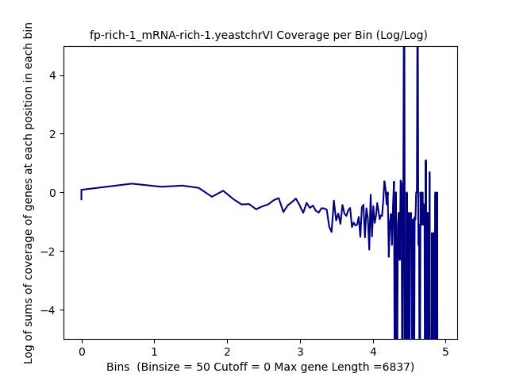

.. raw:: html
    

Linear Regression 

.. image:: fp-rich-1_mRNA-rich-1.yeastchrVI_50_0.LR.png 
   :width: 400

.. raw:: html
    

ChrV

Histogram of Genes' Length 

.. image:: fp-rich-1_mRNA-rich-1.yeastchrV.Length.Histogram.png 
   :width: 400 

.. raw:: html
    

Log Linear Plots 

Where cutoff is the minimum no. of genes to support a position to be considered in bins. Max gene length is the longest gene considered corresponding to this cutoff. 

.. image:: fp-rich-1_mRNA-rich-1.yeastchrV_50_0.LogLinear.png 
   :width: 400

.. raw:: html
    

Log Log Plots 

.. image:: fp-rich-1_mRNA-rich-1.yeastchrV_50_0.LogLog.png 
   :width: 400

.. raw:: html
    

Linear Regression 

.. image:: fp-rich-1_mRNA-rich-1.yeastchrV_50_0.LR.png 
   :width: 400

.. raw:: html
    

ChrXIII

Histogram of Genes' Length 

.. raw:: html
    

Log Linear Plots 

Where cutoff is the minimum no. of genes to support a position to be considered in bins. Max gene length is the longest gene considered corresponding to this cutoff. 

.. image:: fp-rich-1_mRNA-rich-1.yeastchrXIII_50_0.LogLinear.png 
   :width: 400

.. raw:: html
    

Log Log Plots 

.. image:: fp-rich-1_mRNA-rich-1.yeastchrXIII_50_0.LogLog.png 
   :width: 400

.. raw:: html
    

Linear Regression 

.. image:: fp-rich-1_mRNA-rich-1.yeastchrXIII_50_0.LR.png 
   :width: 400

.. raw:: html
    

ChrXII

Histogram of Genes' Length 

.. image:: fp-rich-1_mRNA-rich-1.yeastchrXII.Length.Histogram.png 
   :width: 400 

.. raw:: html
    

Log Linear Plots 

Where cutoff is the minimum no. of genes to support a position to be considered in bins. Max gene length is the longest gene considered corresponding to this cutoff. 

.. image:: fp-rich-1_mRNA-rich-1.yeastchrXII_50_0.LogLinear.png 
   :width: 400

.. raw:: html
    

Log Log Plots 

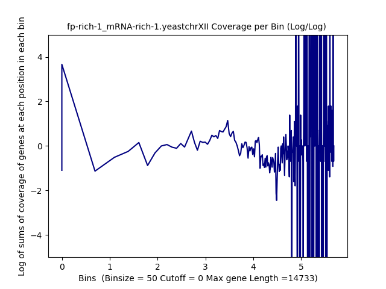

.. raw:: html
    

Linear Regression 

.. image:: fp-rich-1_mRNA-rich-1.yeastchrXII_50_0.LR.png 
   :width: 400

.. raw:: html
    

ChrXI

Histogram of Genes' Length 

.. image:: fp-rich-1_mRNA-rich-1.yeastchrXI.Length.Histogram.png 
   :width: 400 

.. raw:: html
    

Log Linear Plots 

Where cutoff is the minimum no. of genes to support a position to be considered in bins. Max gene length is the longest gene considered corresponding to this cutoff. 

.. image:: fp-rich-1_mRNA-rich-1.yeastchrXI_50_0.LogLinear.png 
   :width: 400

.. raw:: html
    

Log Log Plots 

.. image:: fp-rich-1_mRNA-rich-1.yeastchrXI_50_0.LogLog.png 
   :width: 400

.. raw:: html
    

Linear Regression 

.. raw:: html
    

ChrXIV

Histogram of Genes' Length 

.. image:: fp-rich-1_mRNA-rich-1.yeastchrXIV.Length.Histogram.png 
   :width: 400 

.. raw:: html
    

Log Linear Plots 

Where cutoff is the minimum no. of genes to support a position to be considered in bins. Max gene length is the longest gene considered corresponding to this cutoff. 

.. raw:: html
    

Log Log Plots 

.. image:: fp-rich-1_mRNA-rich-1.yeastchrXIV_50_0.LogLog.png 
   :width: 400

.. raw:: html
    

Linear Regression 

.. raw:: html
    

ChrX

Histogram of Genes' Length 

.. raw:: html
    

Log Linear Plots 

Where cutoff is the minimum no. of genes to support a position to be considered in bins. Max gene length is the longest gene considered corresponding to this cutoff. 

.. image:: fp-rich-1_mRNA-rich-1.yeastchrX_50_0.LogLinear.png 
   :width: 400

.. raw:: html
    

Log Log Plots 

.. image:: fp-rich-1_mRNA-rich-1.yeastchrX_50_0.LogLog.png 
   :width: 400

.. raw:: html
    

Linear Regression 

.. image:: fp-rich-1_mRNA-rich-1.yeastchrX_50_0.LR.png 
   :width: 400

.. raw:: html
    

ChrXVI

Histogram of Genes' Length 

.. image:: fp-rich-1_mRNA-rich-1.yeastchrXVI.Length.Histogram.png 
   :width: 400 

.. raw:: html
    

Log Linear Plots 

Where cutoff is the minimum no. of genes to support a position to be considered in bins. Max gene length is the longest gene considered corresponding to this cutoff. 

.. image:: fp-rich-1_mRNA-rich-1.yeastchrXVI_50_0.LogLinear.png 
   :width: 400

.. raw:: html
    

Log Log Plots 

.. raw:: html
    

Linear Regression 

.. raw:: html
    

ChrXV

Histogram of Genes' Length 

.. raw:: html
    

Log Linear Plots 

Where cutoff is the minimum no. of genes to support a position to be considered in bins. Max gene length is the longest gene considered corresponding to this cutoff. 

.. image:: fp-rich-1_mRNA-rich-1.yeastchrXV_50_0.LogLinear.png 
   :width: 400

.. raw:: html
    

Log Log Plots 

.. image:: fp-rich-1_mRNA-rich-1.yeastchrXV_50_0.LogLog.png 
   :width: 400

.. raw:: html
    

Linear Regression 

.. image:: fp-rich-1_mRNA-rich-1.yeastchrXV_50_0.LR.png 
   :width: 400

.. raw:: html
    

**fp-starved-1/mRNA-starved-1**
-------------------------

Histogram of Genes' Length 

.. image:: fp-starved-1_mRNA-starved-1.Length.Histogram.png 
   :width: 400 

.. raw:: html
    

Log Linear Plots 

Where cutoff is the minimum no. of genes to support a position to be considered in bins. Max gene length is the longest gene considered corresponding to this cutoff. 

.. image:: fp-starved-1_mRNA-starved-1_50_0.LogLinear.png 
   :width: 20%

.. image:: fp-starved-1_mRNA-starved-1_50_200.LogLinear.png
   :width: 20%

.. raw:: html
    

Log Log Plots 

.. image:: fp-starved-1_mRNA-starved-1_50_0.LogLog.png 
   :width: 20%

.. image:: fp-starved-1_mRNA-starved-1_50_1000.LogLog.png
   :width: 20%

.. raw:: html
    

Linear Regression 

.. image:: fp-starved-1_mRNA-starved-1_50_0.LR.png 
   :width: 20%

.. image:: fp-starved-1_mRNA-starved-1_50_100.LR.png  
   :width: 20% 

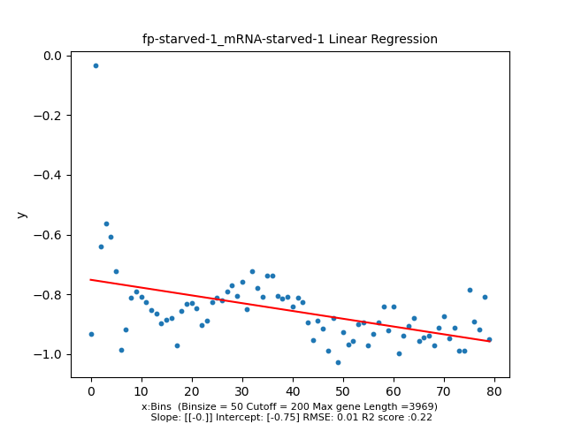

.. image:: fp-starved-1_mRNA-starved-1_50_1000.LR.png
   :width: 20%

.. raw:: html
    

**Stats**
#########################

**Adapters confirmation from authors in progress:email sent** 

+---------------+------------+---------------------------------------------------+
| Sample        | mRNA/FP    | Unique Alignment                                  |
+===============+============+===================================================+
| mRNA-starved-1   |    mRNA    |       29.13%                                      |
+---------------+------------+---------------------------------------------------+
| fp-starved-1     |    FP      | Merged:(60.26%)+(57.42%)+(4.46%)                  |
+---------------+------------+---------------------------------------------------+
| mRNA-starved-2   |    mRNA    | Merged: (11.81%)+(35.70%)+(?)                     |
+---------------+------------+---------------------------------------------------+
| fp-starved-2     |    FP      | Merged:(2.64%)+(3.86%)+(4.97%)+(5.87%)+(5.90%)    |
+---------------+------------+---------------------------------------------------+
| mRNA-starved-1|    mRNA    |       26.61%                                      |
+---------------+------------+---------------------------------------------------+
| fp-starved-1  |    FP      | Merged:(54.39%)+(52.57%)                          |
+---------------+------------+---------------------------------------------------+
| mRNA-starved-2|    mRNA    | Merged :(8.91%) + (11.77%)                        |
+---------------+------------+---------------------------------------------------+
| fp-starved-2  |    FP      | Merged:(3.57%)+(66.32%)+(6.66%)+(6.58%)           |
+---------------+------------+---------------------------------------------------+

**TPM** 
#########################

TPM >50

Histogram of Genes' Length 

.. raw:: html
    

Log Linear Plots 

Where cutoff is the minimum no. of genes to support a position to be considered in bins. Max gene length is the longest gene considered corresponding to this cutoff. 

.. raw:: html
    

Log Log Plots 

.. image:: fp-starved-1_mRNA-starved-1.mRNA-starved-1_g50_50_0.LogLog.png 
   :width: 400

.. raw:: html
    

Linear Regression 

.. raw:: html
    

**TPM < 50**

Histogram of Genes' Length 

.. raw:: html
    

Log Linear Plots 

Where cutoff is the minimum no. of genes to support a position to be considered in bins. Max gene length is the longest gene considered corresponding to this cutoff. 

.. image:: fp-starved-1_mRNA-starved-1.mRNA-starved-1_l50_50_0.LogLinear.png 
   :width: 400

.. raw:: html
    

Log Log Plots 

.. image:: fp-starved-1_mRNA-starved-1.mRNA-starved-1_l50_50_0.LogLog.png 
   :width: 400

.. raw:: html
    

Linear Regression 

.. raw:: html
    

**SNPs** 
#########################

**Genes with Zero SNPs**

Histogram of Genes' Length 

.. raw:: html
    

Log Linear Plots 

Where cutoff is the minimum no. of genes to support a position to be considered in bins. Max gene length is the longest gene considered corresponding to this cutoff. 

.. image:: fp-starved-1_mRNA-starved-1.mRNA-starved-1_zerosnps_50_0.LogLinear.png 
   :width: 400

.. raw:: html
    

Log Log Plots 

.. raw:: html
    

Linear Regression 

.. raw:: html
    

**Genes with at least one SNP**

Histogram of Genes' Length 

.. raw:: html
    

Log Linear Plots 

Where cutoff is the minimum no. of genes to support a position to be considered in bins. Max gene length is the longest gene considered corresponding to this cutoff. 

.. raw:: html
    

Log Log Plots 

.. raw:: html
    

Linear Regression 

.. raw:: html
    

**GO** 
#########################

GO0006119
**Oxidative phosphorylation Gene Ontology Term**

Histogram of Genes' Length 

.. raw:: html
    

Log Linear Plots 

Where cutoff is the minimum no. of genes to support a position to be considered in bins. Max gene length is the longest gene considered corresponding to this cutoff. 

.. raw:: html
    

Log Log Plots 

.. raw:: html
    

Linear Regression 

.. raw:: html
    

GO0006406
**mRNA export from nucleus** 

Histogram of Genes' Length 

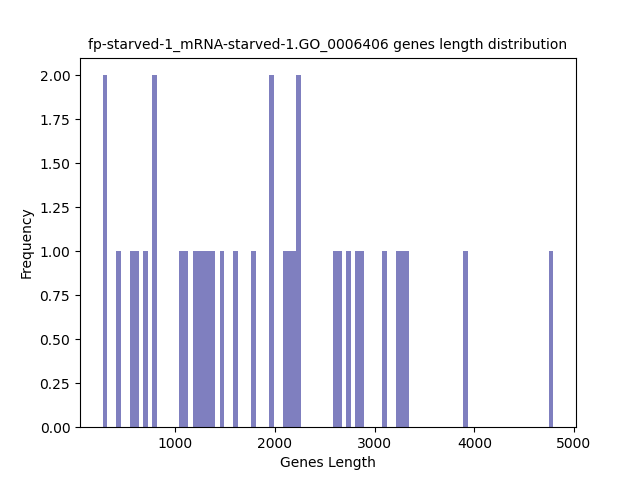

.. raw:: html
    

Log Linear Plots 

Where cutoff is the minimum no. of genes to support a position to be considered in bins. Max gene length is the longest gene considered corresponding to this cutoff. 

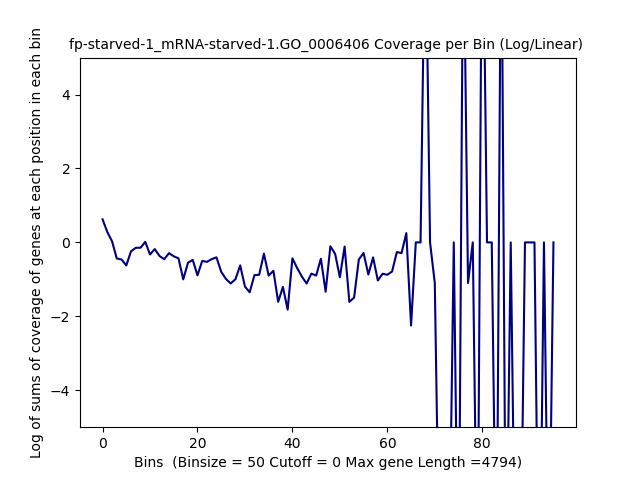

.. raw:: html
    

Log Log Plots 

.. raw:: html
    

Linear Regression 

.. raw:: html
    

GO0006412
**Translation** 

Histogram of Genes' Length 

.. raw:: html
    

Log Linear Plots 

Where cutoff is the minimum no. of genes to support a position to be considered in bins. Max gene length is the longest gene considered corresponding to this cutoff. 

.. raw:: html
    

Log Log Plots 

.. raw:: html
    

Linear Regression 

.. raw:: html
    

GO0006950
**Response to stress** 

Histogram of Genes' Length 

.. raw:: html
    

Log Linear Plots 

Where cutoff is the minimum no. of genes to support a position to be considered in bins. Max gene length is the longest gene considered corresponding to this cutoff. 

.. raw:: html
    

Log Log Plots 

.. raw:: html
    

Linear Regression 

.. raw:: html
    

GO0009651
**Response to salt stress**

Histogram of Genes' Length 

.. raw:: html
    

Log Linear Plots 

Where cutoff is the minimum no. of genes to support a position to be considered in bins. Max gene length is the longest gene considered corresponding to this cutoff. 

.. raw:: html
    

Log Log Plots 

.. raw:: html
    

Linear Regression 

.. raw:: html
    

GO0016458
**Gene silencing**

Histogram of Genes' Length 

.. raw:: html
    

Log Linear Plots 

Where cutoff is the minimum no. of genes to support a position to be considered in bins. Max gene length is the longest gene considered corresponding to this cutoff. 

.. raw:: html
    

Log Log Plots 

.. raw:: html
    

Linear Regression 

.. raw:: html
    

GO0031047
**Gene silencing by RNA**

Histogram of Genes' Length 

.. raw:: html
    

Log Linear Plots 

Where cutoff is the minimum no. of genes to support a position to be considered in bins. Max gene length is the longest gene considered corresponding to this cutoff. 

.. raw:: html
    

Log Log Plots 

.. raw:: html
    

Linear Regression 

.. raw:: html
    

GO0031990
**Cellular Response to heat** 

Histogram of Genes' Length 

.. raw:: html
    

Log Linear Plots 

Where cutoff is the minimum no. of genes to support a position to be considered in bins. Max gene length is the longest gene considered corresponding to this cutoff. 

.. raw:: html
    

Log Log Plots 

.. raw:: html
    

Linear Regression 

.. raw:: html
    

GO0042254
**Ribosome biogenesis**

Histogram of Genes' Length 

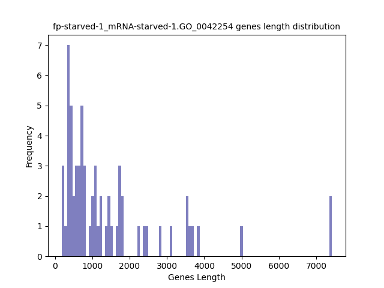

.. raw:: html
    

Log Linear Plots 

Where cutoff is the minimum no. of genes to support a position to be considered in bins. Max gene length is the longest gene considered corresponding to this cutoff. 

.. raw:: html
    

Log Log Plots 

.. raw:: html
    

Linear Regression 

.. raw:: html
    

**Orthologous** 
#############################
**Human**

Histogram of Genes' Length 

.. raw:: html
    

Log Linear Plots 

Where cutoff is the minimum no. of genes to support a position to be considered in bins. Max gene length is the longest gene considered corresponding to this cutoff. 

.. image:: fp-starved-1_mRNA-starved-1.yeastorthuman_50_0.LogLinear.png 
   :width: 400

.. raw:: html
    

Log Log Plots 

.. raw:: html
    

Linear Regression 

.. image:: fp-starved-1_mRNA-starved-1.yeastorthuman_50_0.LR.png 
   :width: 400

.. raw:: html
    

**Mouse**

Histogram of Genes' Length 

.. image:: fp-starved-1_mRNA-starved-1.yeastortmouse.Length.Histogram.png 
   :width: 400 

.. raw:: html
    

Log Linear Plots 

Where cutoff is the minimum no. of genes to support a position to be considered in bins. Max gene length is the longest gene considered corresponding to this cutoff. 

.. image:: fp-starved-1_mRNA-starved-1.yeastortmouse_50_0.LogLinear.png 
   :width: 400

.. raw:: html
    

Log Log Plots 

.. image:: fp-starved-1_mRNA-starved-1.yeastortmouse_50_0.LogLog.png 
   :width: 400

.. raw:: html
    

Linear Regression 

.. raw:: html
    

**Chromosomes** 
###########################

ChrI

Histogram of Genes' Length 

.. raw:: html
    

Log Linear Plots 

Where cutoff is the minimum no. of genes to support a position to be considered in bins. Max gene length is the longest gene considered corresponding to this cutoff. 

.. raw:: html
    

Log Log Plots 

.. image:: fp-starved-1_mRNA-starved-1.yeastchrI_50_0.LogLog.png 
   :width: 400

.. raw:: html
    

Linear Regression 

.. raw:: html
    

ChrII

Histogram of Genes' Length 

.. image:: fp-starved-1_mRNA-starved-1.yeastchrII.Length.Histogram.png 
   :width: 400 

.. raw:: html
    

Log Linear Plots 

Where cutoff is the minimum no. of genes to support a position to be considered in bins. Max gene length is the longest gene considered corresponding to this cutoff. 

.. image:: fp-starved-1_mRNA-starved-1.yeastchrII_50_0.LogLinear.png 
   :width: 400

.. raw:: html
    

Log Log Plots 

.. raw:: html
    

Linear Regression 

.. raw:: html
    

ChrIII

Histogram of Genes' Length 

.. image:: fp-starved-1_mRNA-starved-1.yeastchrIII.Length.Histogram.png 
   :width: 400 

.. raw:: html
    

Log Linear Plots 

Where cutoff is the minimum no. of genes to support a position to be considered in bins. Max gene length is the longest gene considered corresponding to this cutoff. 

.. raw:: html
    

Log Log Plots 

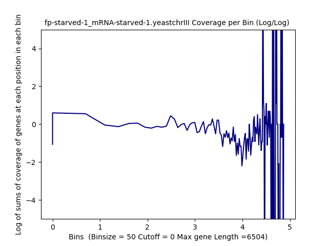

.. raw:: html
    

Linear Regression 

.. image:: fp-starved-1_mRNA-starved-1.yeastchrIII_50_0.LR.png 
   :width: 400

.. raw:: html
    

ChrIV

Histogram of Genes' Length 

.. raw:: html
    

Log Linear Plots 

Where cutoff is the minimum no. of genes to support a position to be considered in bins. Max gene length is the longest gene considered corresponding to this cutoff. 

.. raw:: html
    

Log Log Plots 

.. raw:: html
    

Linear Regression 

.. raw:: html
    

ChrIX

Histogram of Genes' Length 

.. image:: fp-starved-1_mRNA-starved-1.yeastchrIX.Length.Histogram.png 
   :width: 400 

.. raw:: html
    

Log Linear Plots 

Where cutoff is the minimum no. of genes to support a position to be considered in bins. Max gene length is the longest gene considered corresponding to this cutoff. 

.. image:: fp-starved-1_mRNA-starved-1.yeastchrIX_50_0.LogLinear.png 
   :width: 400

.. raw:: html
    

Log Log Plots 

.. image:: fp-starved-1_mRNA-starved-1.yeastchrIX_50_0.LogLog.png 
   :width: 400

.. raw:: html
    

Linear Regression 

.. raw:: html
    

ChrVIII

Histogram of Genes' Length 

.. image:: fp-starved-1_mRNA-starved-1.yeastchrVIII.Length.Histogram.png 
   :width: 400 

.. raw:: html
    

Log Linear Plots 

Where cutoff is the minimum no. of genes to support a position to be considered in bins. Max gene length is the longest gene considered corresponding to this cutoff. 

.. image:: fp-starved-1_mRNA-starved-1.yeastchrVIII_50_0.LogLinear.png 
   :width: 400

.. raw:: html
    

Log Log Plots 

.. raw:: html
    

Linear Regression 

.. image:: fp-starved-1_mRNA-starved-1.yeastchrVIII_50_0.LR.png 
   :width: 400

.. raw:: html
    

ChrVII

Histogram of Genes' Length 

.. image:: fp-starved-1_mRNA-starved-1.yeastchrVII.Length.Histogram.png 
   :width: 400 

.. raw:: html
    

Log Linear Plots 

Where cutoff is the minimum no. of genes to support a position to be considered in bins. Max gene length is the longest gene considered corresponding to this cutoff. 

.. raw:: html
    

Log Log Plots 

.. raw:: html
    

Linear Regression 

.. raw:: html
    

ChrVI

Histogram of Genes' Length 

.. image:: fp-starved-1_mRNA-starved-1.yeastchrVI.Length.Histogram.png 
   :width: 400 

.. raw:: html
    

Log Linear Plots 

Where cutoff is the minimum no. of genes to support a position to be considered in bins. Max gene length is the longest gene considered corresponding to this cutoff. 

.. raw:: html
    

Log Log Plots 

.. raw:: html
    

Linear Regression 

.. image:: fp-starved-1_mRNA-starved-1.yeastchrVI_50_0.LR.png 
   :width: 400

.. raw:: html
    

ChrV

Histogram of Genes' Length 

.. raw:: html
    

Log Linear Plots 

Where cutoff is the minimum no. of genes to support a position to be considered in bins. Max gene length is the longest gene considered corresponding to this cutoff. 

.. raw:: html
    

Log Log Plots 

.. raw:: html
    

Linear Regression 

.. image:: fp-starved-1_mRNA-starved-1.yeastchrV_50_0.LR.png 
   :width: 400

.. raw:: html
    

ChrXIII

Histogram of Genes' Length 

.. image:: fp-starved-1_mRNA-starved-1.yeastchrXIII.Length.Histogram.png 
   :width: 400 

.. raw:: html
    

Log Linear Plots 

Where cutoff is the minimum no. of genes to support a position to be considered in bins. Max gene length is the longest gene considered corresponding to this cutoff. 

.. raw:: html
    

Log Log Plots 

.. image:: fp-starved-1_mRNA-starved-1.yeastchrXIII_50_0.LogLog.png 
   :width: 400

.. raw:: html
    

Linear Regression 

.. image:: fp-starved-1_mRNA-starved-1.yeastchrXIII_50_0.LR.png 
   :width: 400

.. raw:: html
    

ChrXII

Histogram of Genes' Length 

.. image:: fp-starved-1_mRNA-starved-1.yeastchrXII.Length.Histogram.png 
   :width: 400 

.. raw:: html
    

Log Linear Plots 

Where cutoff is the minimum no. of genes to support a position to be considered in bins. Max gene length is the longest gene considered corresponding to this cutoff. 

.. image:: fp-starved-1_mRNA-starved-1.yeastchrXII_50_0.LogLinear.png 
   :width: 400

.. raw:: html
    

Log Log Plots 

.. image:: fp-starved-1_mRNA-starved-1.yeastchrXII_50_0.LogLog.png 
   :width: 400

.. raw:: html
    

Linear Regression 

.. image:: fp-starved-1_mRNA-starved-1.yeastchrXII_50_0.LR.png 
   :width: 400

.. raw:: html
    

ChrXI

Histogram of Genes' Length 

.. image:: fp-starved-1_mRNA-starved-1.yeastchrXI.Length.Histogram.png 
   :width: 400 

.. raw:: html
    

Log Linear Plots 

Where cutoff is the minimum no. of genes to support a position to be considered in bins. Max gene length is the longest gene considered corresponding to this cutoff. 

.. image:: fp-starved-1_mRNA-starved-1.yeastchrXI_50_0.LogLinear.png 
   :width: 400

.. raw:: html
    

Log Log Plots 

.. raw:: html
    

Linear Regression 

.. raw:: html
    

ChrXIV

Histogram of Genes' Length 

.. image:: fp-starved-1_mRNA-starved-1.yeastchrXIV.Length.Histogram.png 
   :width: 400 

.. raw:: html
    

Log Linear Plots 

Where cutoff is the minimum no. of genes to support a position to be considered in bins. Max gene length is the longest gene considered corresponding to this cutoff. 

.. raw:: html
    

Log Log Plots 

.. image:: fp-starved-1_mRNA-starved-1.yeastchrXIV_50_0.LogLog.png 
   :width: 400

.. raw:: html
    

Linear Regression 

.. image:: fp-starved-1_mRNA-starved-1.yeastchrXIV_50_0.LR.png 
   :width: 400

.. raw:: html
    

ChrX

Histogram of Genes' Length 

.. image:: fp-starved-1_mRNA-starved-1.yeastchrX.Length.Histogram.png 
   :width: 400 

.. raw:: html
    

Log Linear Plots 

Where cutoff is the minimum no. of genes to support a position to be considered in bins. Max gene length is the longest gene considered corresponding to this cutoff. 

.. image:: fp-starved-1_mRNA-starved-1.yeastchrX_50_0.LogLinear.png 
   :width: 400

.. raw:: html
    

Log Log Plots 

.. image:: fp-starved-1_mRNA-starved-1.yeastchrX_50_0.LogLog.png 
   :width: 400

.. raw:: html
    

Linear Regression 

.. image:: fp-starved-1_mRNA-starved-1.yeastchrX_50_0.LR.png 
   :width: 400

.. raw:: html
    

ChrXVI

Histogram of Genes' Length 

.. image:: fp-starved-1_mRNA-starved-1.yeastchrXVI.Length.Histogram.png 
   :width: 400 

.. raw:: html
    

Log Linear Plots 

Where cutoff is the minimum no. of genes to support a position to be considered in bins. Max gene length is the longest gene considered corresponding to this cutoff. 

.. raw:: html
    

Log Log Plots 

.. image:: fp-starved-1_mRNA-starved-1.yeastchrXVI_50_0.LogLog.png 
   :width: 400

.. raw:: html
    

Linear Regression 

.. image:: fp-starved-1_mRNA-starved-1.yeastchrXVI_50_0.LR.png 
   :width: 400

.. raw:: html
    

ChrXV

Histogram of Genes' Length 

.. raw:: html
    

Log Linear Plots 

Where cutoff is the minimum no. of genes to support a position to be considered in bins. Max gene length is the longest gene considered corresponding to this cutoff. 

.. image:: fp-starved-1_mRNA-starved-1.yeastchrXV_50_0.LogLinear.png 
   :width: 400

.. raw:: html
    

Log Log Plots 

.. raw:: html
    

Linear Regression 

.. image:: fp-starved-1_mRNA-starved-1.yeastchrXV_50_0.LR.png 
   :width: 400

.. raw:: html
    

