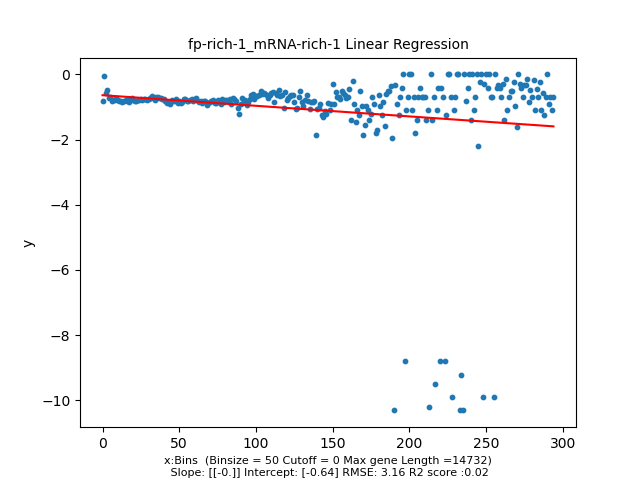

====================================================
**Case Studies**
===================================================

**Dataset 3:GSE13750**
------------------------

fp-rich-1/mRNA-rich-1
**************************

Histogram of Genes' Length 
###############################

.. image:: fp-rich-1_mRNA-rich-1.Length.Histogram.png 
   :width: 400 

.. raw:: html
    

Log Linear Plots 
###################

Where cutoff is the minimum no. of genes to support a position to be considered in bins. Max gene length is the longest gene considered corresponding to this cutoff. 

.. image:: fp-rich-1_mRNA-rich-1_50_1000.LogLinear.png
   :width: 20%

.. raw:: html
    

Log Log Plots 
###################

.. image:: fp-rich-1_mRNA-rich-1_50_0.LogLog.png 
   :width: 20%

.. image:: fp-rich-1_mRNA-rich-1_50_100.LogLog.png  
   :width: 20%  

.. image:: fp-rich-1_mRNA-rich-1_50_200.LogLog.png  
   :width: 20%

.. image:: fp-rich-1_mRNA-rich-1_50_2000.LogLog.png
   :width: 20%

.. raw:: html
    

Linear Regression 
###################

.. image:: fp-rich-1_mRNA-rich-1_50_100.LR.png  
   :width: 20% 

.. image:: fp-rich-1_mRNA-rich-1_50_200.LR.png
   :width: 20%

.. image:: fp-rich-1_mRNA-rich-1_50_2000.LR.png
   :width: 20%

.. raw:: html
    

fp-starved-1/mRNA-starved-1
**************************

Histogram of Genes' Length 
###############################

.. raw:: html
    

Log Linear Plots 
###################

Where cutoff is the minimum no. of genes to support a position to be considered in bins. Max gene length is the longest gene considered corresponding to this cutoff. 

.. image:: fp-starved-1_mRNA-starved-1_50_100.LogLinear.png  
   :width: 20% 

.. image:: fp-starved-1_mRNA-starved-1_50_500.LogLinear.png
   :width: 20%

.. image:: fp-starved-1_mRNA-starved-1_50_1000.LogLinear.png
   :width: 20%

.. image:: fp-starved-1_mRNA-starved-1_50_2000.LogLinear.png
   :width: 20%

.. raw:: html
    

Log Log Plots 
###################

.. image:: fp-starved-1_mRNA-starved-1_50_100.LogLog.png  
   :width: 20%  

.. image:: fp-starved-1_mRNA-starved-1_50_200.LogLog.png  
   :width: 20%

.. image:: fp-starved-1_mRNA-starved-1_50_500.LogLog.png
   :width: 20%

.. image:: fp-starved-1_mRNA-starved-1_50_2000.LogLog.png
   :width: 20%

.. raw:: html
    

Linear Regression 
###################

.. image:: fp-starved-1_mRNA-starved-1_50_200.LR.png
   :width: 20%

.. image:: fp-starved-1_mRNA-starved-1_50_500.LR.png
   :width: 20%

.. image:: fp-starved-1_mRNA-starved-1_50_2000.LR.png
   :width: 20%

.. raw:: html
    

