====================================================
**GSE13750:Chromosomes** 
====================================================

fp-rich-1/mRNA-rich-1
*************************

ChrI
------------

Histogram of Genes' Length 
###############################

.. image:: fp-rich-1_mRNA-rich-1.yeastchrI.Length.Histogram.png 
   :width: 400 

.. raw:: html
    

Log Linear Plots 
###################

Where cutoff is the minimum no. of genes to support a position to be considered in bins. Max gene length is the longest gene considered corresponding to this cutoff. 

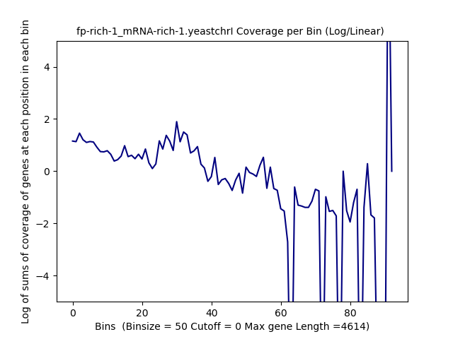

.. raw:: html
    

Log Log Plots 
###################

.. image:: fp-rich-1_mRNA-rich-1.yeastchrI_50_0.LogLog.png 
   :width: 400

.. raw:: html
    

Linear Regression 
###################

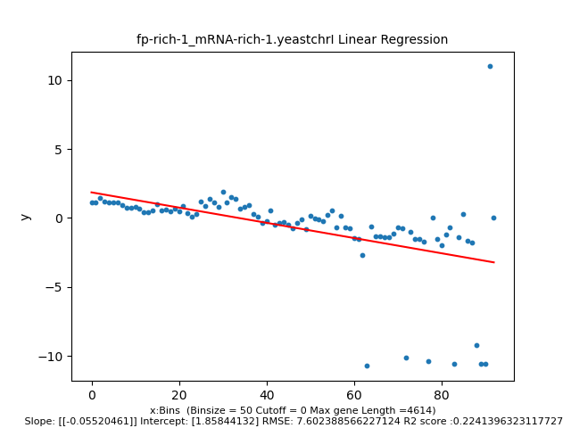

.. raw:: html
    

ChrII
------------

Histogram of Genes' Length 
###############################

.. image:: fp-rich-1_mRNA-rich-1.yeastchrII.Length.Histogram.png 
   :width: 400 

.. raw:: html
    

Log Linear Plots 
###################

Where cutoff is the minimum no. of genes to support a position to be considered in bins. Max gene length is the longest gene considered corresponding to this cutoff. 

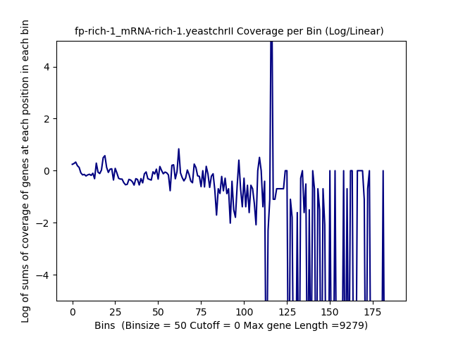

.. raw:: html
    

Log Log Plots 
###################

.. image:: fp-rich-1_mRNA-rich-1.yeastchrII_50_0.LogLog.png 
   :width: 400

.. raw:: html
    

Linear Regression 
###################

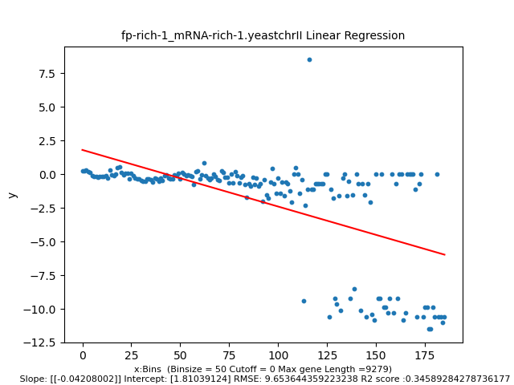

.. raw:: html
    

ChrIII
------------

Histogram of Genes' Length 
###############################

.. raw:: html
    

Log Linear Plots 
###################

Where cutoff is the minimum no. of genes to support a position to be considered in bins. Max gene length is the longest gene considered corresponding to this cutoff. 

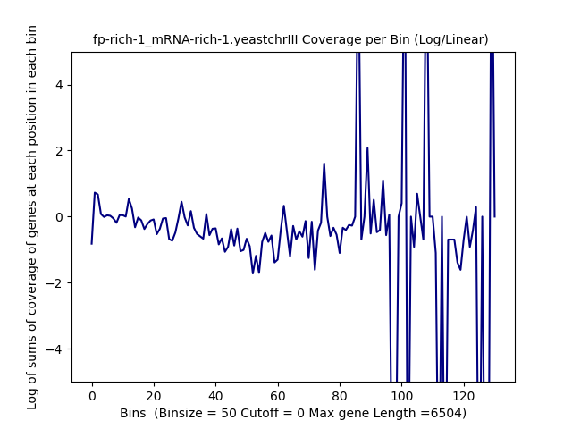

.. raw:: html
    

Log Log Plots 
###################

.. image:: fp-rich-1_mRNA-rich-1.yeastchrIII_50_0.LogLog.png 
   :width: 400

.. raw:: html
    

Linear Regression 
###################

.. image:: fp-rich-1_mRNA-rich-1.yeastchrIII_50_0.LR.png 
   :width: 400

.. raw:: html
    

ChrIV
------------

Histogram of Genes' Length 
###############################

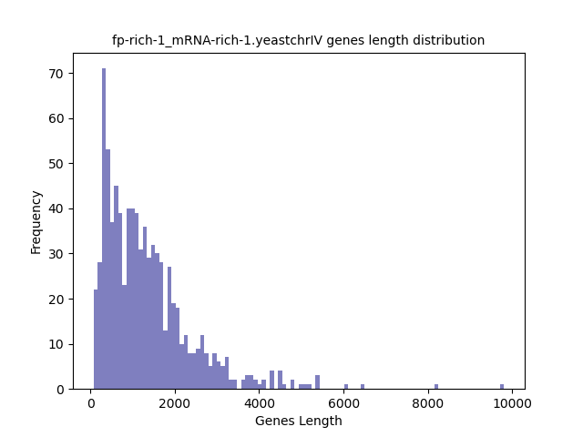

.. raw:: html
    

Log Linear Plots 
###################

Where cutoff is the minimum no. of genes to support a position to be considered in bins. Max gene length is the longest gene considered corresponding to this cutoff. 

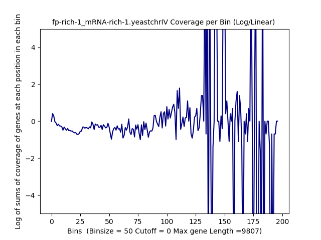

.. raw:: html
    

Log Log Plots 
###################

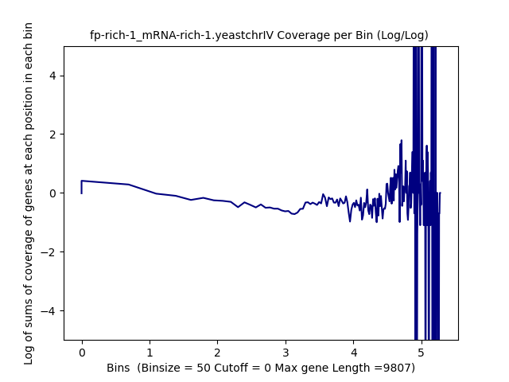

.. raw:: html
    

Linear Regression 
###################

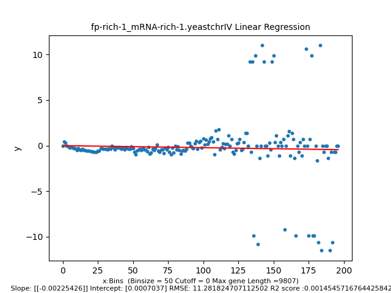

.. raw:: html
    

ChrIX
------------

Histogram of Genes' Length 
###############################

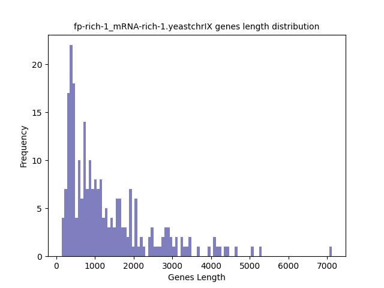

.. raw:: html
    

Log Linear Plots 
###################

Where cutoff is the minimum no. of genes to support a position to be considered in bins. Max gene length is the longest gene considered corresponding to this cutoff. 

.. image:: fp-rich-1_mRNA-rich-1.yeastchrIX_50_0.LogLinear.png 
   :width: 400

.. raw:: html
    

Log Log Plots 
###################

.. image:: fp-rich-1_mRNA-rich-1.yeastchrIX_50_0.LogLog.png 
   :width: 400

.. raw:: html
    

Linear Regression 
###################

.. image:: fp-rich-1_mRNA-rich-1.yeastchrIX_50_0.LR.png 
   :width: 400

.. raw:: html
    

ChrVIII
------------

Histogram of Genes' Length 
###############################

.. image:: fp-rich-1_mRNA-rich-1.yeastchrVIII.Length.Histogram.png 
   :width: 400 

.. raw:: html
    

Log Linear Plots 
###################

Where cutoff is the minimum no. of genes to support a position to be considered in bins. Max gene length is the longest gene considered corresponding to this cutoff. 

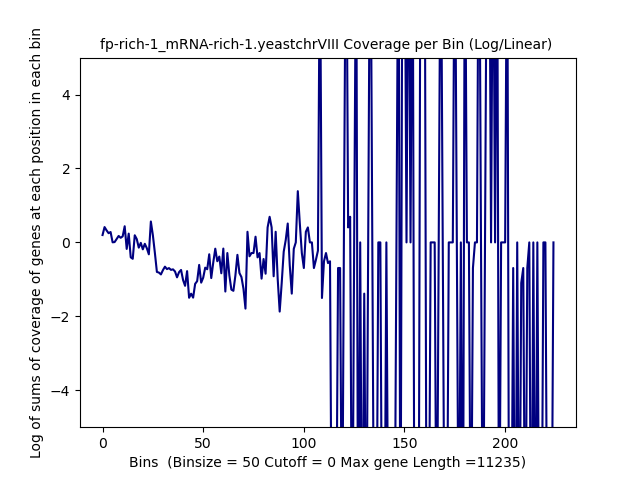

.. raw:: html
    

Log Log Plots 
###################

.. image:: fp-rich-1_mRNA-rich-1.yeastchrVIII_50_0.LogLog.png 
   :width: 400

.. raw:: html
    

Linear Regression 
###################

.. image:: fp-rich-1_mRNA-rich-1.yeastchrVIII_50_0.LR.png 
   :width: 400

.. raw:: html
    

ChrVII
------------

Histogram of Genes' Length 
###############################

.. image:: fp-rich-1_mRNA-rich-1.yeastchrVII.Length.Histogram.png 
   :width: 400 

.. raw:: html
    

Log Linear Plots 
###################

Where cutoff is the minimum no. of genes to support a position to be considered in bins. Max gene length is the longest gene considered corresponding to this cutoff. 

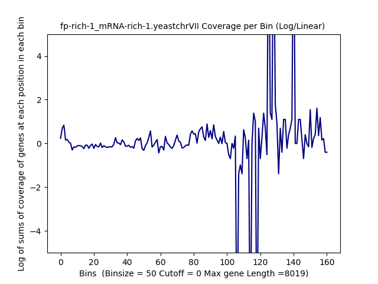

.. raw:: html
    

Log Log Plots 
###################

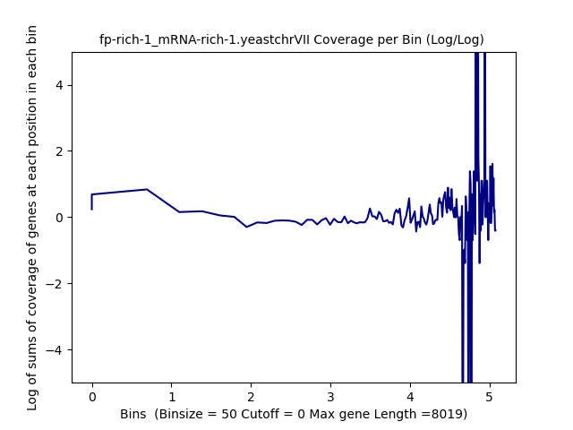

.. raw:: html
    

Linear Regression 
###################

.. image:: fp-rich-1_mRNA-rich-1.yeastchrVII_50_0.LR.png 
   :width: 400

.. raw:: html
    

ChrVI
------------

Histogram of Genes' Length 
###############################

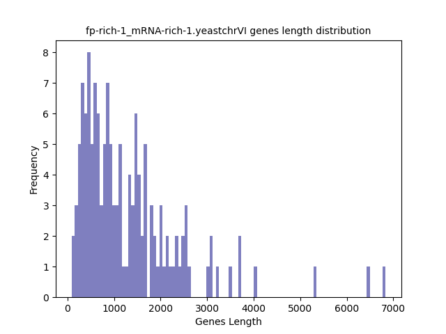

.. raw:: html
    

Log Linear Plots 
###################

Where cutoff is the minimum no. of genes to support a position to be considered in bins. Max gene length is the longest gene considered corresponding to this cutoff. 

.. image:: fp-rich-1_mRNA-rich-1.yeastchrVI_50_0.LogLinear.png 
   :width: 400

.. raw:: html
    

Log Log Plots 
###################

.. image:: fp-rich-1_mRNA-rich-1.yeastchrVI_50_0.LogLog.png 
   :width: 400

.. raw:: html
    

Linear Regression 
###################

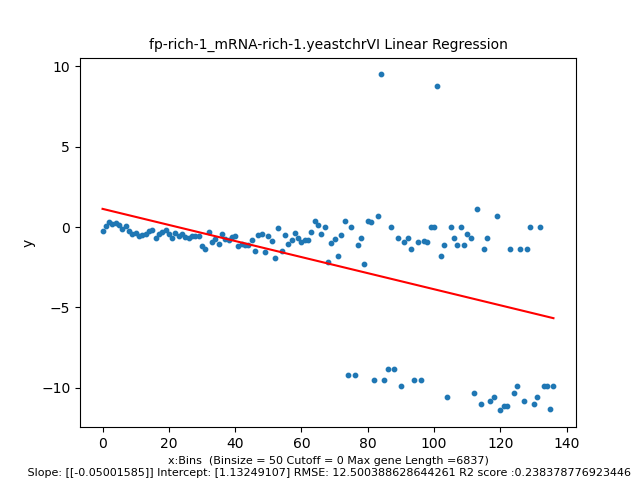

.. raw:: html
    

ChrV
------------

Histogram of Genes' Length 
###############################

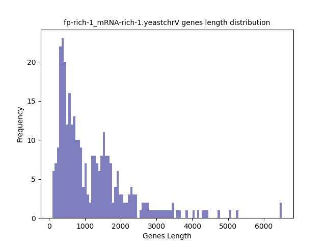

.. raw:: html
    

Log Linear Plots 
###################

Where cutoff is the minimum no. of genes to support a position to be considered in bins. Max gene length is the longest gene considered corresponding to this cutoff. 

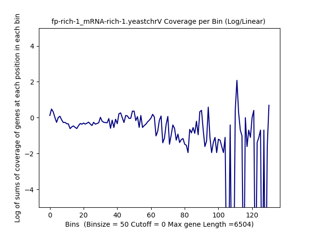

.. raw:: html
    

Log Log Plots 
###################

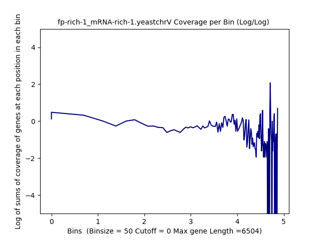

.. raw:: html
    

Linear Regression 
###################

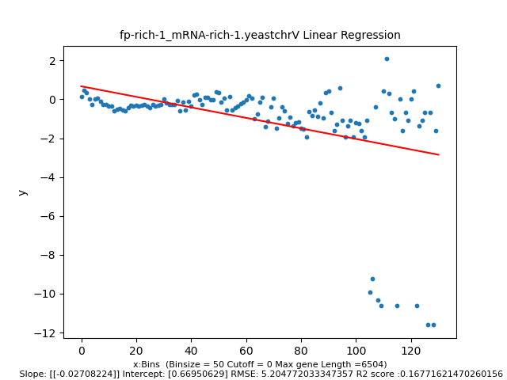

.. raw:: html
    

ChrXIII
------------

Histogram of Genes' Length 
###############################

.. image:: fp-rich-1_mRNA-rich-1.yeastchrXIII.Length.Histogram.png 
   :width: 400 

.. raw:: html
    

Log Linear Plots 
###################

Where cutoff is the minimum no. of genes to support a position to be considered in bins. Max gene length is the longest gene considered corresponding to this cutoff. 

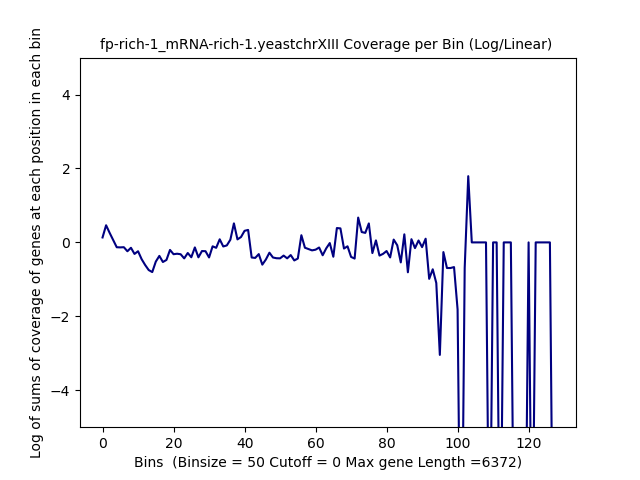

.. raw:: html
    

Log Log Plots 
###################

.. image:: fp-rich-1_mRNA-rich-1.yeastchrXIII_50_0.LogLog.png 
   :width: 400

.. raw:: html
    

Linear Regression 
###################

.. image:: fp-rich-1_mRNA-rich-1.yeastchrXIII_50_0.LR.png 
   :width: 400

.. raw:: html
    

ChrXII
------------

Histogram of Genes' Length 
###############################

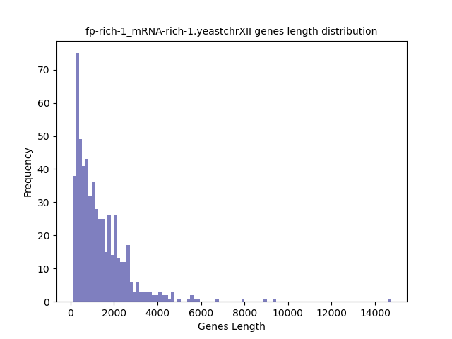

.. raw:: html
    

Log Linear Plots 
###################

Where cutoff is the minimum no. of genes to support a position to be considered in bins. Max gene length is the longest gene considered corresponding to this cutoff. 

.. image:: fp-rich-1_mRNA-rich-1.yeastchrXII_50_0.LogLinear.png 
   :width: 400

.. raw:: html
    

Log Log Plots 
###################

.. image:: fp-rich-1_mRNA-rich-1.yeastchrXII_50_0.LogLog.png 
   :width: 400

.. raw:: html
    

Linear Regression 
###################

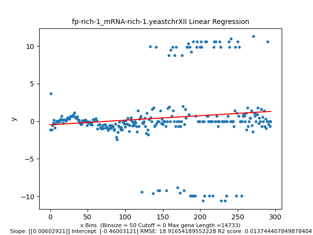

.. raw:: html
    

ChrXI
------------

Histogram of Genes' Length 
###############################

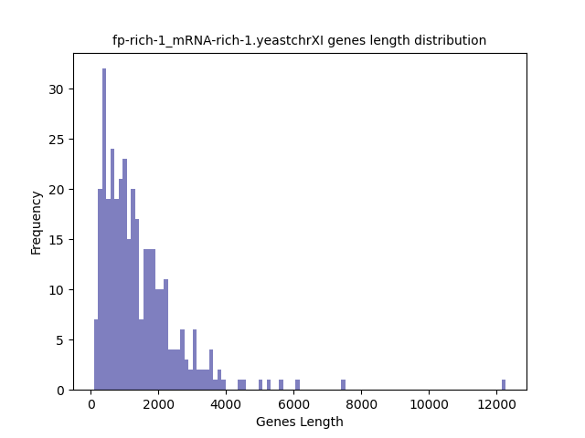

.. raw:: html
    

Log Linear Plots 
###################

Where cutoff is the minimum no. of genes to support a position to be considered in bins. Max gene length is the longest gene considered corresponding to this cutoff. 

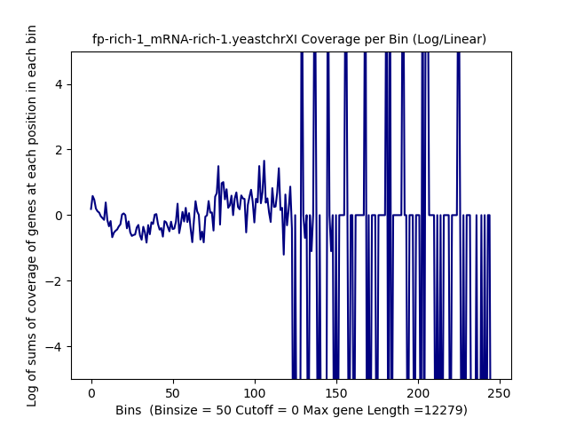

.. raw:: html
    

Log Log Plots 
###################

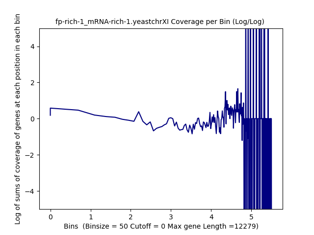

.. raw:: html
    

Linear Regression 
###################

.. image:: fp-rich-1_mRNA-rich-1.yeastchrXI_50_0.LR.png 
   :width: 400

.. raw:: html
    

ChrXIV
------------

Histogram of Genes' Length 
###############################

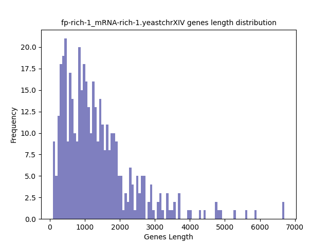

.. raw:: html
    

Log Linear Plots 
###################

Where cutoff is the minimum no. of genes to support a position to be considered in bins. Max gene length is the longest gene considered corresponding to this cutoff. 

.. image:: fp-rich-1_mRNA-rich-1.yeastchrXIV_50_0.LogLinear.png 
   :width: 400

.. raw:: html
    

Log Log Plots 
###################

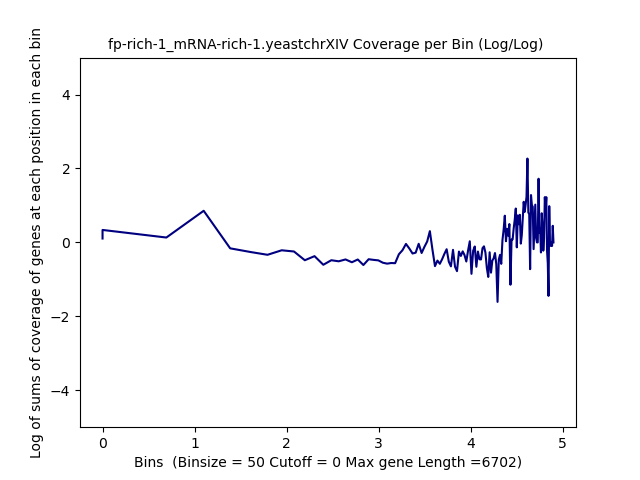

.. raw:: html
    

Linear Regression 
###################

.. image:: fp-rich-1_mRNA-rich-1.yeastchrXIV_50_0.LR.png 
   :width: 400

.. raw:: html
    

ChrX
------------

Histogram of Genes' Length 
###############################

.. image:: fp-rich-1_mRNA-rich-1.yeastchrX.Length.Histogram.png 
   :width: 400 

.. raw:: html
    

Log Linear Plots 
###################

Where cutoff is the minimum no. of genes to support a position to be considered in bins. Max gene length is the longest gene considered corresponding to this cutoff. 

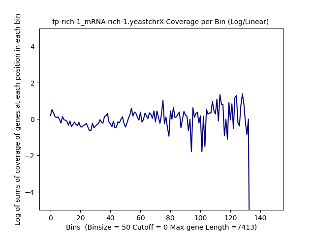

.. raw:: html
    

Log Log Plots 
###################

.. image:: fp-rich-1_mRNA-rich-1.yeastchrX_50_0.LogLog.png 
   :width: 400

.. raw:: html
    

Linear Regression 
###################

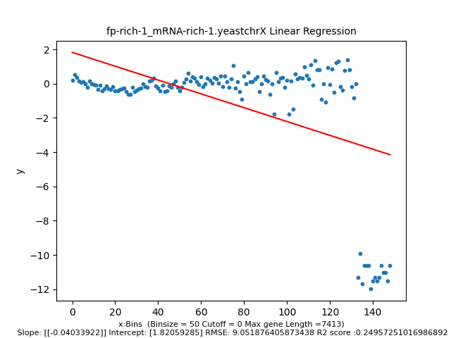

.. raw:: html
    

ChrXVI
------------

Histogram of Genes' Length 
###############################

.. raw:: html
    

Log Linear Plots 
###################

Where cutoff is the minimum no. of genes to support a position to be considered in bins. Max gene length is the longest gene considered corresponding to this cutoff. 

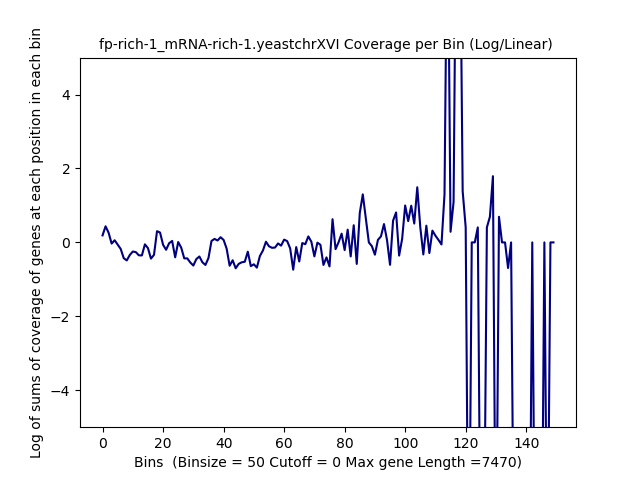

.. raw:: html
    

Log Log Plots 
###################

.. image:: fp-rich-1_mRNA-rich-1.yeastchrXVI_50_0.LogLog.png 
   :width: 400

.. raw:: html
    

Linear Regression 
###################

.. image:: fp-rich-1_mRNA-rich-1.yeastchrXVI_50_0.LR.png 
   :width: 400

.. raw:: html
    

ChrXV
------------

Histogram of Genes' Length 
###############################

.. image:: fp-rich-1_mRNA-rich-1.yeastchrXV.Length.Histogram.png 
   :width: 400 

.. raw:: html
    

Log Linear Plots 
###################

Where cutoff is the minimum no. of genes to support a position to be considered in bins. Max gene length is the longest gene considered corresponding to this cutoff. 

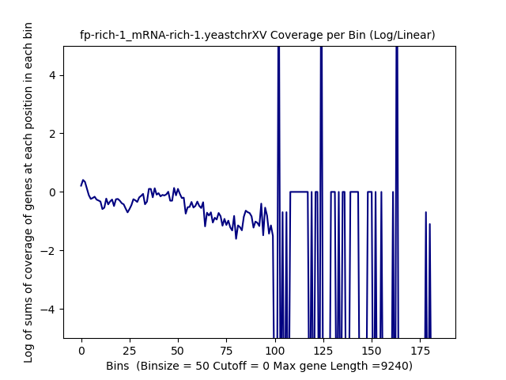

.. raw:: html
    

Log Log Plots 
###################

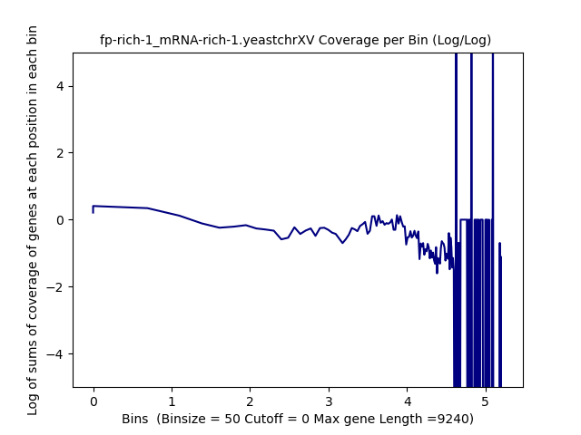

.. raw:: html
    

Linear Regression 
###################

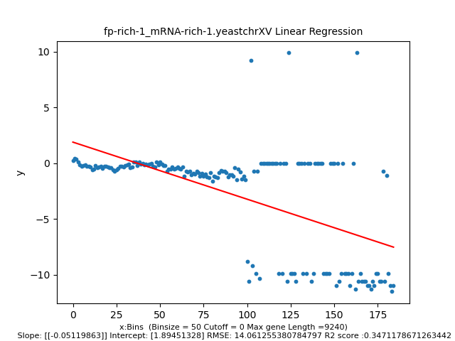

.. raw:: html
    

fp-starved-1/mRNA-starved-1
******************************

ChrI
------------

Histogram of Genes' Length 
###############################

.. image:: fp-starved-1_mRNA-starved-1.yeastchrI.Length.Histogram.png 
   :width: 400 

.. raw:: html
    

Log Linear Plots 
###################

Where cutoff is the minimum no. of genes to support a position to be considered in bins. Max gene length is the longest gene considered corresponding to this cutoff. 

.. image:: fp-starved-1_mRNA-starved-1.yeastchrI_50_0.LogLinear.png 
   :width: 400

.. raw:: html
    

Log Log Plots 
###################

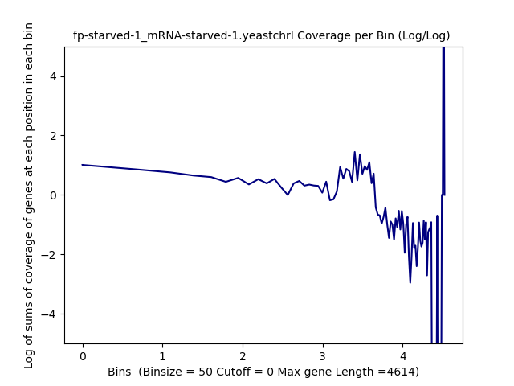

.. raw:: html
    

Linear Regression 
###################

.. image:: fp-starved-1_mRNA-starved-1.yeastchrI_50_0.LR.png 
   :width: 400

.. raw:: html
    

ChrII
------------

Histogram of Genes' Length 
###############################

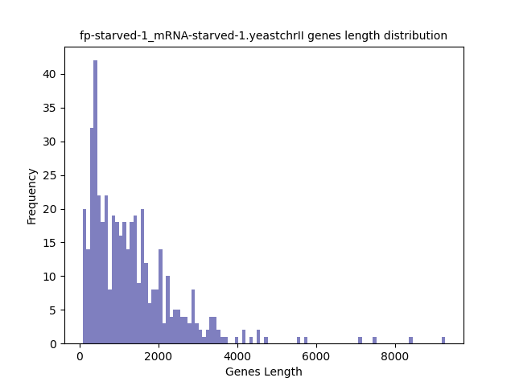

.. raw:: html
    

Log Linear Plots 
###################

Where cutoff is the minimum no. of genes to support a position to be considered in bins. Max gene length is the longest gene considered corresponding to this cutoff. 

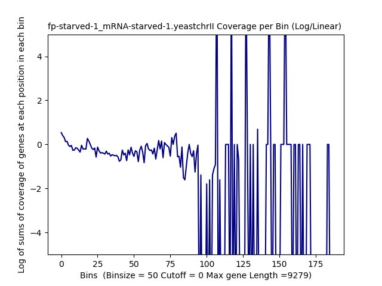

.. raw:: html
    

Log Log Plots 
###################

.. image:: fp-starved-1_mRNA-starved-1.yeastchrII_50_0.LogLog.png 
   :width: 400

.. raw:: html
    

Linear Regression 
###################

.. image:: fp-starved-1_mRNA-starved-1.yeastchrII_50_0.LR.png 
   :width: 400

.. raw:: html
    

ChrIII
------------

Histogram of Genes' Length 
###############################

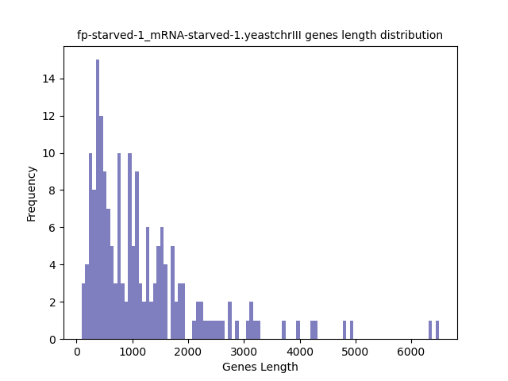

.. raw:: html
    

Log Linear Plots 
###################

Where cutoff is the minimum no. of genes to support a position to be considered in bins. Max gene length is the longest gene considered corresponding to this cutoff. 

.. image:: fp-starved-1_mRNA-starved-1.yeastchrIII_50_0.LogLinear.png 
   :width: 400

.. raw:: html
    

Log Log Plots 
###################

.. image:: fp-starved-1_mRNA-starved-1.yeastchrIII_50_0.LogLog.png 
   :width: 400

.. raw:: html
    

Linear Regression 
###################

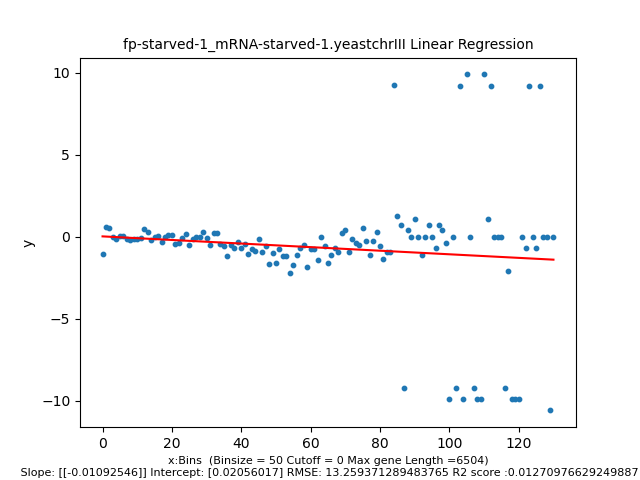

.. raw:: html
    

ChrIV
------------

Histogram of Genes' Length 
###############################

.. image:: fp-starved-1_mRNA-starved-1.yeastchrIV.Length.Histogram.png 
   :width: 400 

.. raw:: html
    

Log Linear Plots 
###################

Where cutoff is the minimum no. of genes to support a position to be considered in bins. Max gene length is the longest gene considered corresponding to this cutoff. 

.. image:: fp-starved-1_mRNA-starved-1.yeastchrIV_50_0.LogLinear.png 
   :width: 400

.. raw:: html
    

Log Log Plots 
###################

.. image:: fp-starved-1_mRNA-starved-1.yeastchrIV_50_0.LogLog.png 
   :width: 400

.. raw:: html
    

Linear Regression 
###################

.. image:: fp-starved-1_mRNA-starved-1.yeastchrIV_50_0.LR.png 
   :width: 400

.. raw:: html
    

ChrIX
------------

Histogram of Genes' Length 
###############################

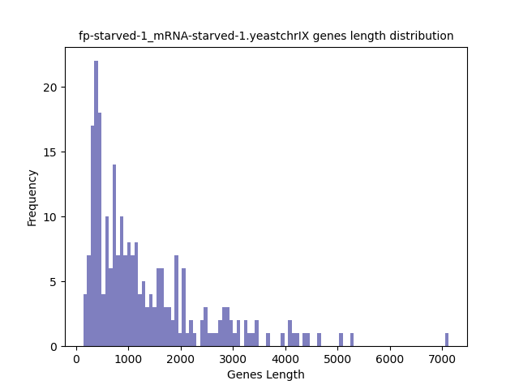

.. raw:: html
    

Log Linear Plots 
###################

Where cutoff is the minimum no. of genes to support a position to be considered in bins. Max gene length is the longest gene considered corresponding to this cutoff. 

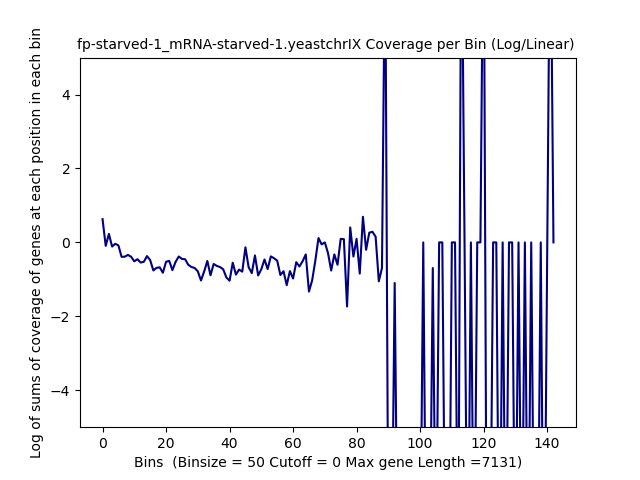

.. raw:: html
    

Log Log Plots 
###################

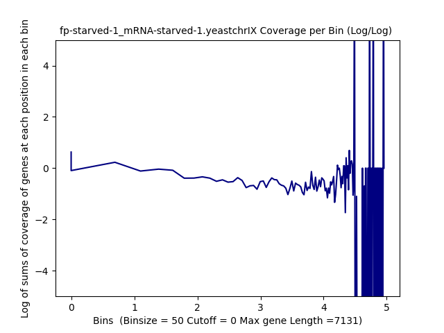

.. raw:: html
    

Linear Regression 
###################

.. image:: fp-starved-1_mRNA-starved-1.yeastchrIX_50_0.LR.png 
   :width: 400

.. raw:: html
    

ChrVIII
------------

Histogram of Genes' Length 
###############################

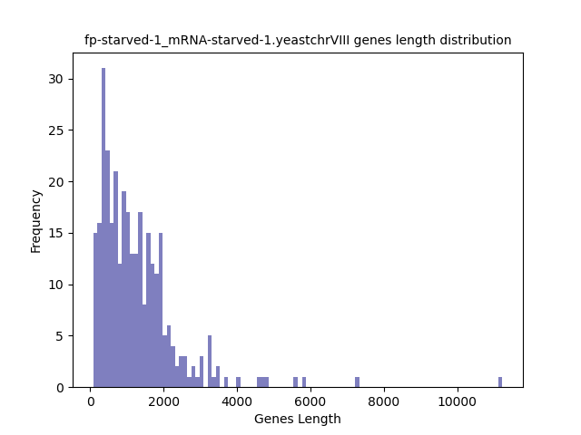

.. raw:: html
    

Log Linear Plots 
###################

Where cutoff is the minimum no. of genes to support a position to be considered in bins. Max gene length is the longest gene considered corresponding to this cutoff. 

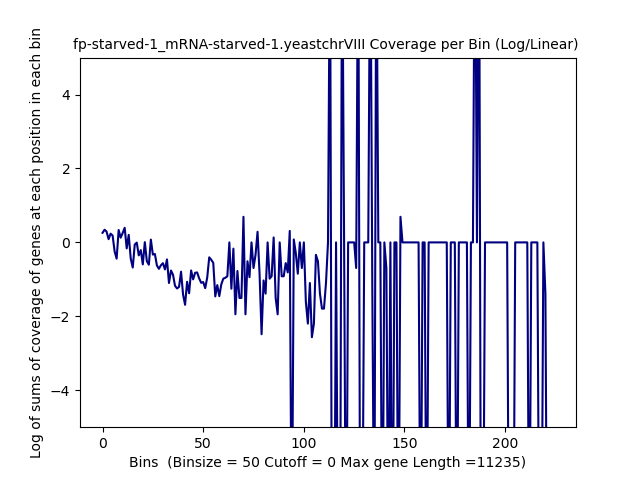

.. raw:: html
    

Log Log Plots 
###################

.. image:: fp-starved-1_mRNA-starved-1.yeastchrVIII_50_0.LogLog.png 
   :width: 400

.. raw:: html
    

Linear Regression 
###################

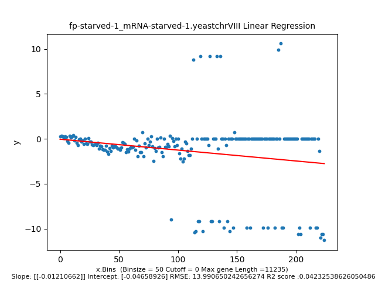

.. raw:: html
    

ChrVII
------------

Histogram of Genes' Length 
###############################

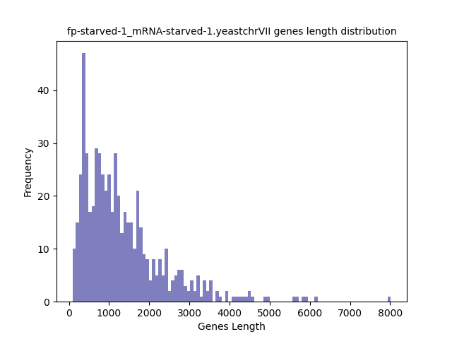

.. raw:: html
    

Log Linear Plots 
###################

Where cutoff is the minimum no. of genes to support a position to be considered in bins. Max gene length is the longest gene considered corresponding to this cutoff. 

.. image:: fp-starved-1_mRNA-starved-1.yeastchrVII_50_0.LogLinear.png 
   :width: 400

.. raw:: html
    

Log Log Plots 
###################

.. image:: fp-starved-1_mRNA-starved-1.yeastchrVII_50_0.LogLog.png 
   :width: 400

.. raw:: html
    

Linear Regression 
###################

.. image:: fp-starved-1_mRNA-starved-1.yeastchrVII_50_0.LR.png 
   :width: 400

.. raw:: html
    

ChrVI
------------

Histogram of Genes' Length 
###############################

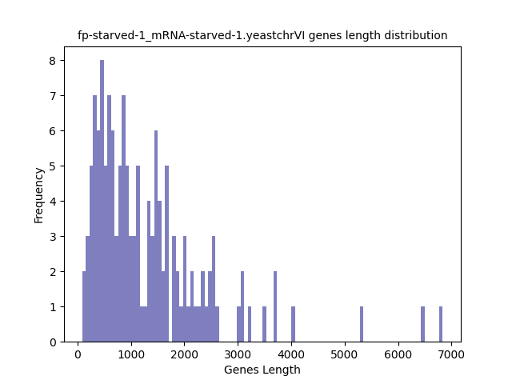

.. raw:: html
    

Log Linear Plots 
###################

Where cutoff is the minimum no. of genes to support a position to be considered in bins. Max gene length is the longest gene considered corresponding to this cutoff. 

.. image:: fp-starved-1_mRNA-starved-1.yeastchrVI_50_0.LogLinear.png 
   :width: 400

.. raw:: html
    

Log Log Plots 
###################

.. image:: fp-starved-1_mRNA-starved-1.yeastchrVI_50_0.LogLog.png 
   :width: 400

.. raw:: html
    

Linear Regression 
###################

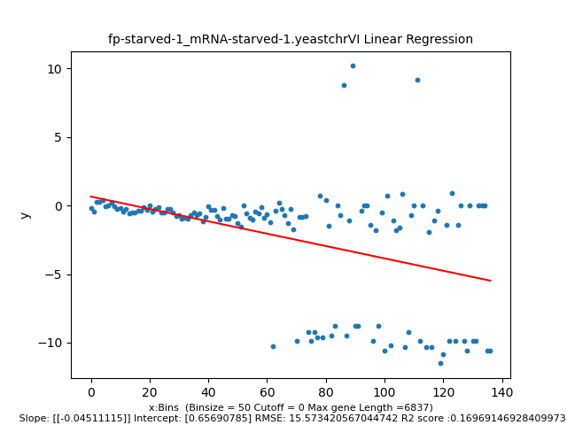

.. raw:: html
    

ChrV
------------

Histogram of Genes' Length 
###############################

.. image:: fp-starved-1_mRNA-starved-1.yeastchrV.Length.Histogram.png 
   :width: 400 

.. raw:: html
    

Log Linear Plots 
###################

Where cutoff is the minimum no. of genes to support a position to be considered in bins. Max gene length is the longest gene considered corresponding to this cutoff. 

.. image:: fp-starved-1_mRNA-starved-1.yeastchrV_50_0.LogLinear.png 
   :width: 400

.. raw:: html
    

Log Log Plots 
###################

.. image:: fp-starved-1_mRNA-starved-1.yeastchrV_50_0.LogLog.png 
   :width: 400

.. raw:: html
    

Linear Regression 
###################

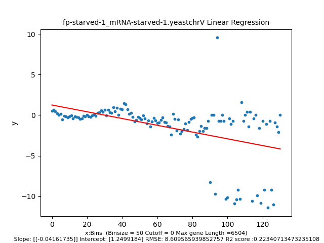

.. raw:: html
    

ChrXIII
------------

Histogram of Genes' Length 
###############################

.. image:: fp-starved-1_mRNA-starved-1.yeastchrXIII.Length.Histogram.png 
   :width: 400 

.. raw:: html
    

Log Linear Plots 
###################

Where cutoff is the minimum no. of genes to support a position to be considered in bins. Max gene length is the longest gene considered corresponding to this cutoff. 

.. image:: fp-starved-1_mRNA-starved-1.yeastchrXIII_50_0.LogLinear.png 
   :width: 400

.. raw:: html
    

Log Log Plots 
###################

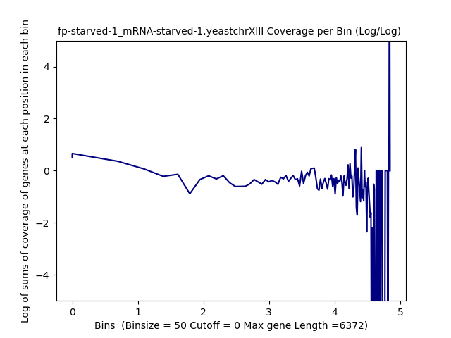

.. raw:: html
    

Linear Regression 
###################

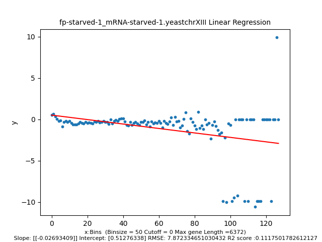

.. raw:: html
    

ChrXII
------------

Histogram of Genes' Length 
###############################

.. raw:: html
    

Log Linear Plots 
###################

Where cutoff is the minimum no. of genes to support a position to be considered in bins. Max gene length is the longest gene considered corresponding to this cutoff. 

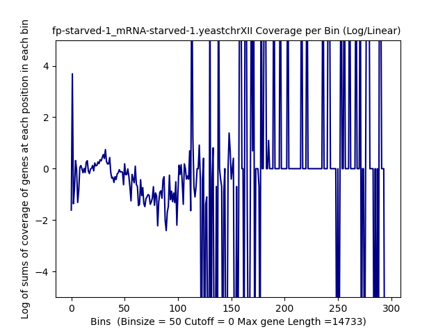

.. raw:: html
    

Log Log Plots 
###################

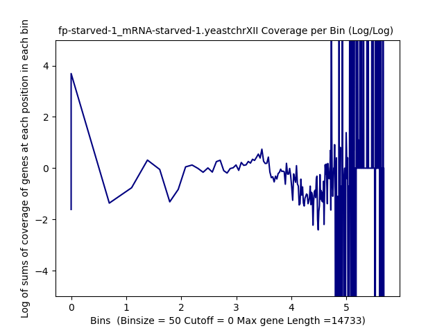

.. raw:: html
    

Linear Regression 
###################

.. image:: fp-starved-1_mRNA-starved-1.yeastchrXII_50_0.LR.png 
   :width: 400

.. raw:: html
    

ChrXI
------------

Histogram of Genes' Length 
###############################

.. raw:: html
    

Log Linear Plots 
###################

Where cutoff is the minimum no. of genes to support a position to be considered in bins. Max gene length is the longest gene considered corresponding to this cutoff. 

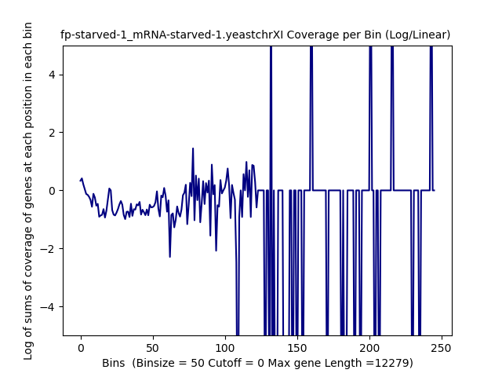

.. raw:: html
    

Log Log Plots 
###################

.. image:: fp-starved-1_mRNA-starved-1.yeastchrXI_50_0.LogLog.png 
   :width: 400

.. raw:: html
    

Linear Regression 
###################

.. image:: fp-starved-1_mRNA-starved-1.yeastchrXI_50_0.LR.png 
   :width: 400

.. raw:: html
    

ChrXIV
------------

Histogram of Genes' Length 
###############################

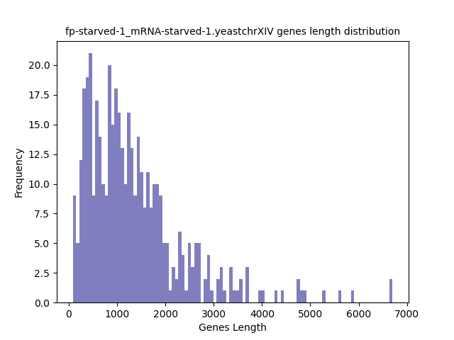

.. raw:: html
    

Log Linear Plots 
###################

Where cutoff is the minimum no. of genes to support a position to be considered in bins. Max gene length is the longest gene considered corresponding to this cutoff. 

.. image:: fp-starved-1_mRNA-starved-1.yeastchrXIV_50_0.LogLinear.png 
   :width: 400

.. raw:: html
    

Log Log Plots 
###################

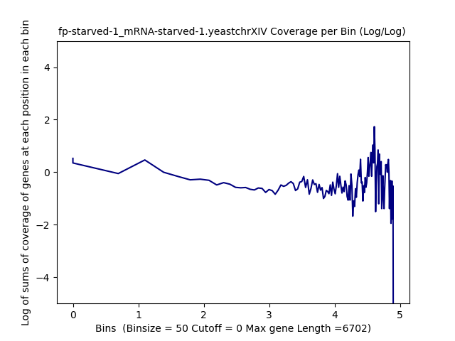

.. raw:: html
    

Linear Regression 
###################

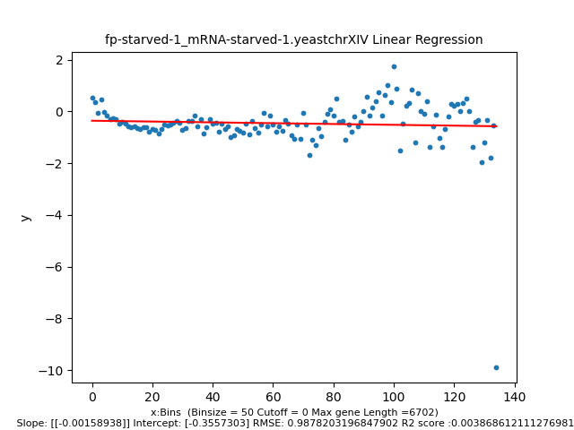

.. raw:: html
    

ChrX
------------

Histogram of Genes' Length 
###############################

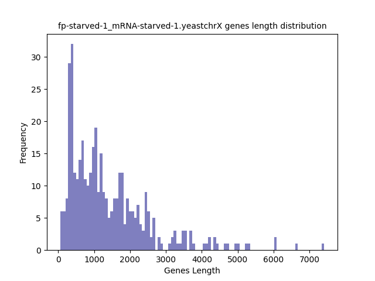

.. raw:: html
    

Log Linear Plots 
###################

Where cutoff is the minimum no. of genes to support a position to be considered in bins. Max gene length is the longest gene considered corresponding to this cutoff. 

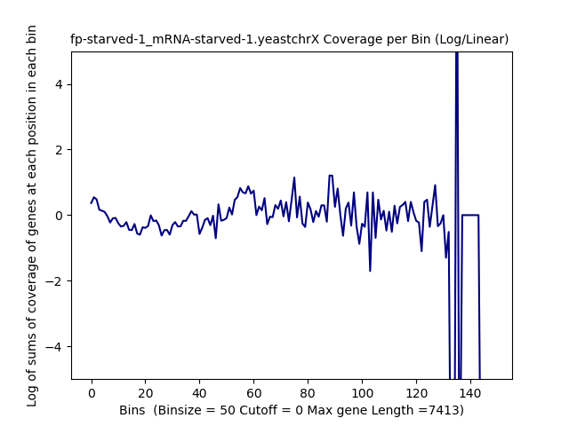

.. raw:: html
    

Log Log Plots 
###################

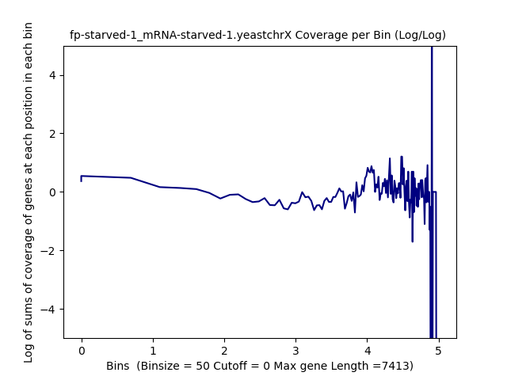

.. raw:: html
    

Linear Regression 
###################

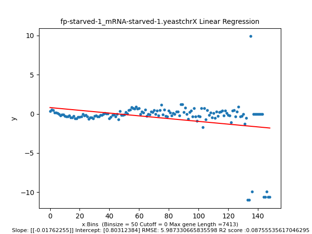

.. raw:: html
    

ChrXVI
------------

Histogram of Genes' Length 
###############################

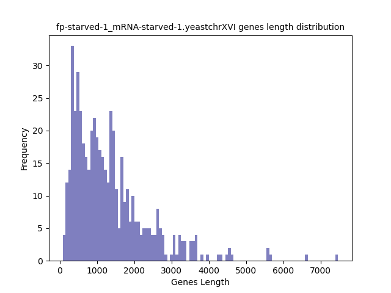

.. raw:: html
    

Log Linear Plots 
###################

Where cutoff is the minimum no. of genes to support a position to be considered in bins. Max gene length is the longest gene considered corresponding to this cutoff. 

.. image:: fp-starved-1_mRNA-starved-1.yeastchrXVI_50_0.LogLinear.png 
   :width: 400

.. raw:: html
    

Log Log Plots 
###################

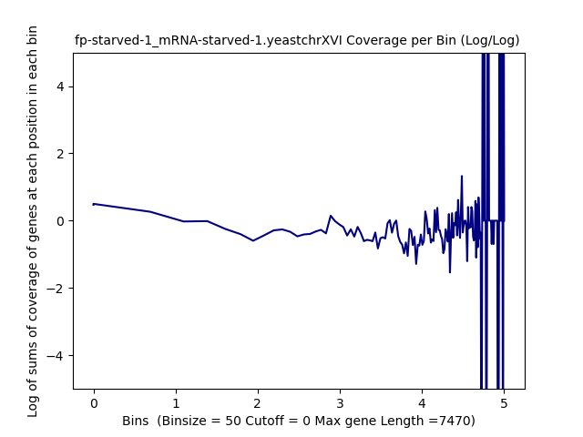

.. raw:: html
    

Linear Regression 
###################

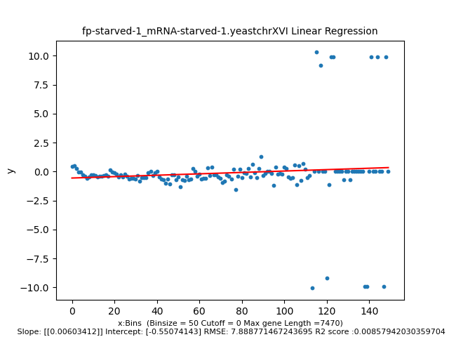

.. raw:: html
    

ChrXV
------------

Histogram of Genes' Length 
###############################

.. image:: fp-starved-1_mRNA-starved-1.yeastchrXV.Length.Histogram.png 
   :width: 400 

.. raw:: html
    

Log Linear Plots 
###################

Where cutoff is the minimum no. of genes to support a position to be considered in bins. Max gene length is the longest gene considered corresponding to this cutoff. 

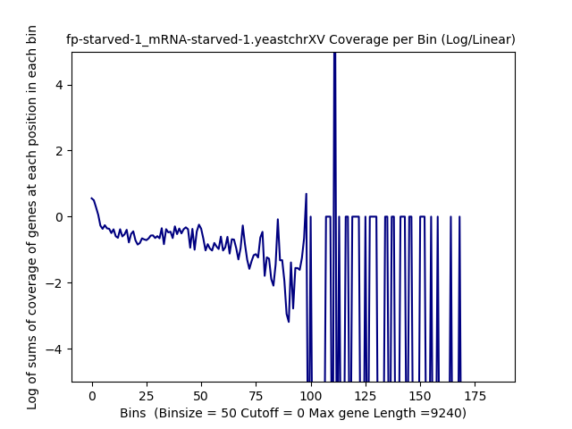

.. raw:: html
    

Log Log Plots 
###################

.. image:: fp-starved-1_mRNA-starved-1.yeastchrXV_50_0.LogLog.png 
   :width: 400

.. raw:: html
    

Linear Regression 
###################

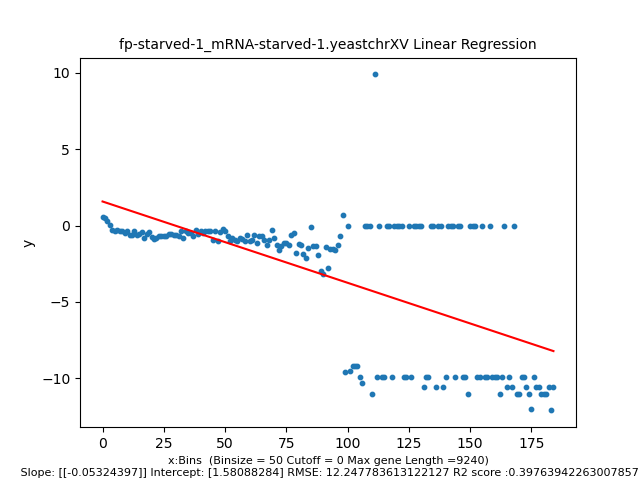

.. raw:: html
    

