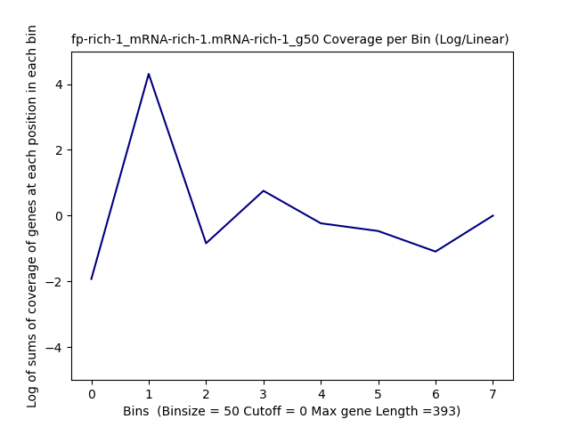
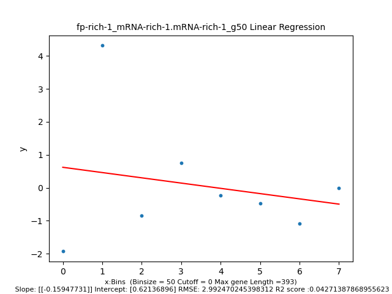
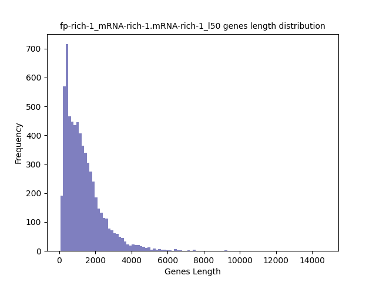
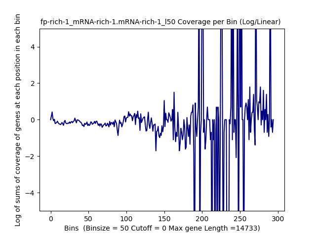
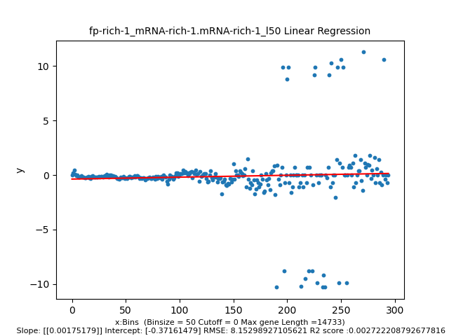
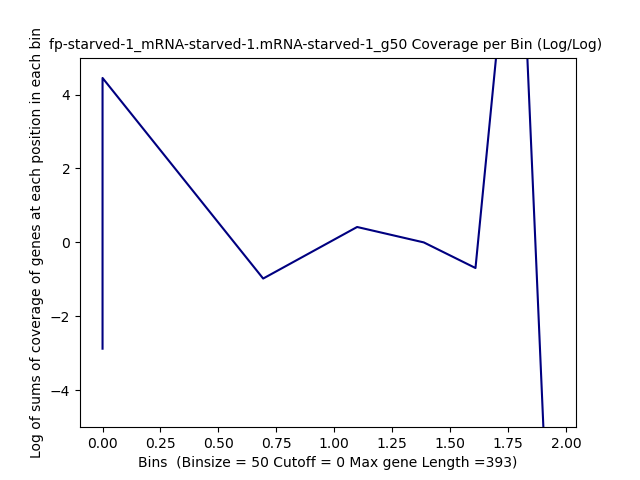
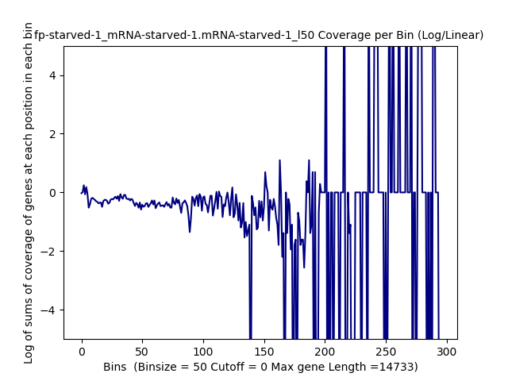

====================================================
**GSE13750:TPM** 
====================================================

fp-rich-1/mRNA-rich-1
************************

TPM >50
------------

Histogram of Genes' Length 
###############################

.. image:: fp-rich-1_mRNA-rich-1.mRNA-rich-1_g50.Length.Histogram.png 
   :width: 400 

.. raw:: html
    

Log Linear Plots 
###################

Where cutoff is the minimum no. of genes to support a position to be considered in bins. Max gene length is the longest gene considered corresponding to this cutoff. 

.. raw:: html
    

Log Log Plots 
###################

.. image:: fp-rich-1_mRNA-rich-1.mRNA-rich-1_g50_50_0.LogLog.png 
   :width: 400

.. raw:: html
    

Linear Regression 
###################

.. raw:: html
    

TPM < 50
------------

Histogram of Genes' Length 
###############################

.. raw:: html
    

Log Linear Plots 
###################

Where cutoff is the minimum no. of genes to support a position to be considered in bins. Max gene length is the longest gene considered corresponding to this cutoff. 

.. raw:: html
    

Log Log Plots 
###################

.. image:: fp-rich-1_mRNA-rich-1.mRNA-rich-1_l50_50_0.LogLog.png 
   :width: 400

.. raw:: html
    

Linear Regression 
###################

.. raw:: html
    

fp-starved-1/mRNA-starved-1
********************************

TPM >50
------------

Histogram of Genes' Length 
###############################

.. image:: fp-starved-1_mRNA-starved-1.mRNA-starved-1_g50.Length.Histogram.png 
   :width: 400 

.. raw:: html
    

Log Linear Plots 
###################

Where cutoff is the minimum no. of genes to support a position to be considered in bins. Max gene length is the longest gene considered corresponding to this cutoff. 

.. image:: fp-starved-1_mRNA-starved-1.mRNA-starved-1_g50_50_0.LogLinear.png 
   :width: 400

.. raw:: html
    

Log Log Plots 
###################

.. raw:: html
    

Linear Regression 
###################

.. image:: fp-starved-1_mRNA-starved-1.mRNA-starved-1_g50_50_0.LR.png 
   :width: 400

.. raw:: html
    

TPM < 50
------------

Histogram of Genes' Length 
###############################

.. image:: fp-starved-1_mRNA-starved-1.mRNA-starved-1_l50.Length.Histogram.png 
   :width: 400 

.. raw:: html
    

Log Linear Plots 
###################

Where cutoff is the minimum no. of genes to support a position to be considered in bins. Max gene length is the longest gene considered corresponding to this cutoff. 

.. raw:: html
    

Log Log Plots 
###################

.. image:: fp-starved-1_mRNA-starved-1.mRNA-starved-1_l50_50_0.LogLog.png 
   :width: 400

.. raw:: html
    

Linear Regression 
###################

.. image:: fp-starved-1_mRNA-starved-1.mRNA-starved-1_l50_50_0.LR.png 
   :width: 400

.. raw:: html
    

