====================================================
**Case Studies**
===================================================

GSE91068
-------------------------------

Histogram of Genes' Length 
###############################

.. raw:: html
    

Log Linear Plots 
###################

Where cutoff is the minimum no. of genes to support a position to be considered in bins. Max gene length is the longest gene considered corresponding to this cutoff. 

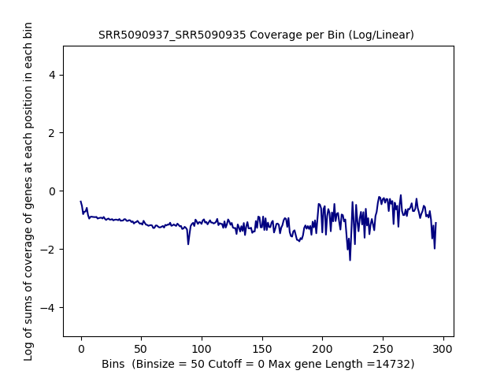

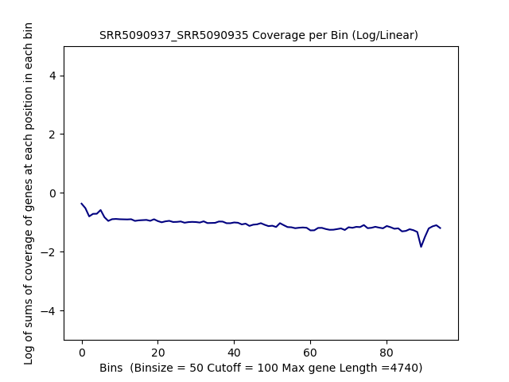

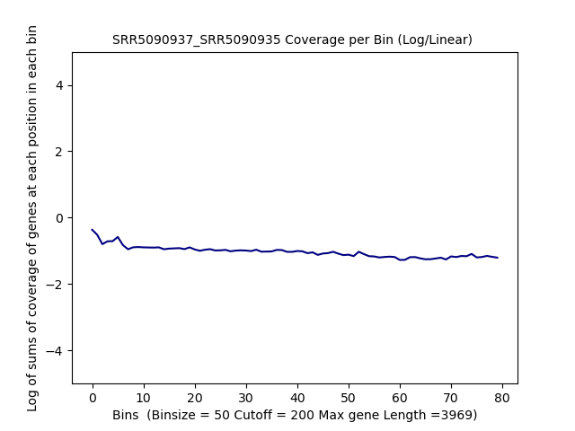

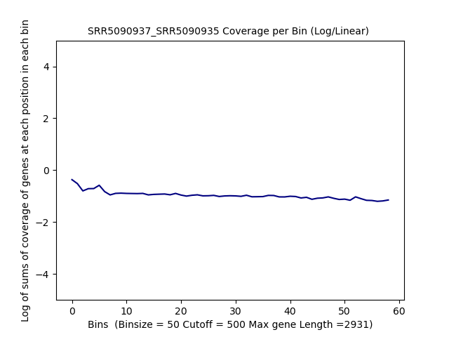

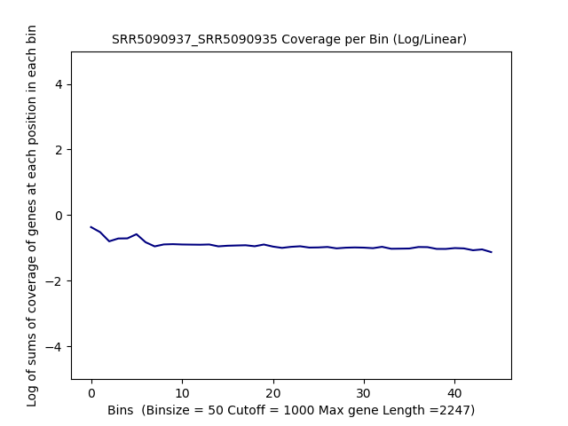
.. raw:: html
    

Log Log Plots 
###################

.. image:: SRR5090937_SRR5090935_50_0.LogLog.png 
   :width: 20%

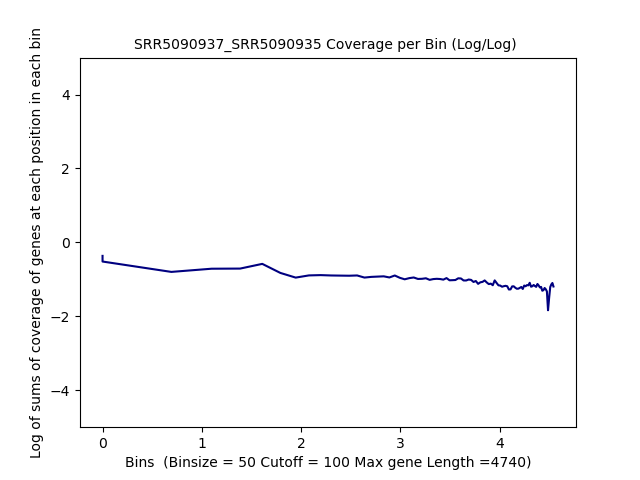

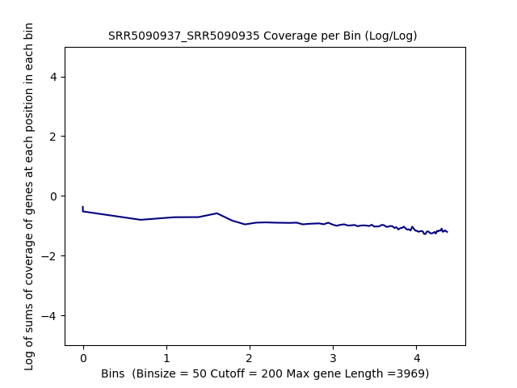

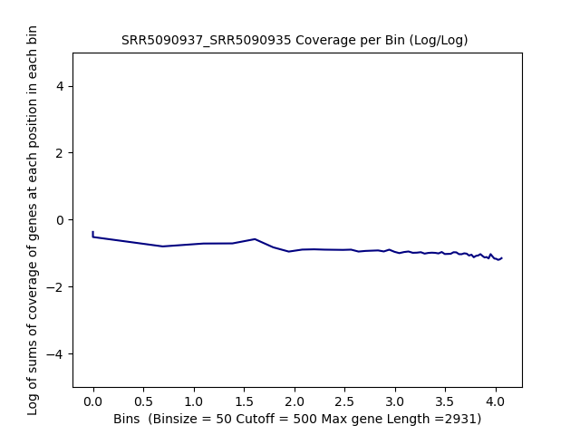

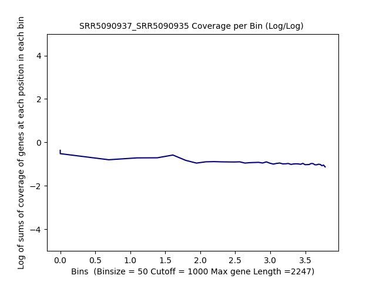

.. raw:: html
    

Linear Regression 
###################

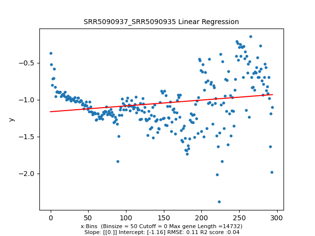

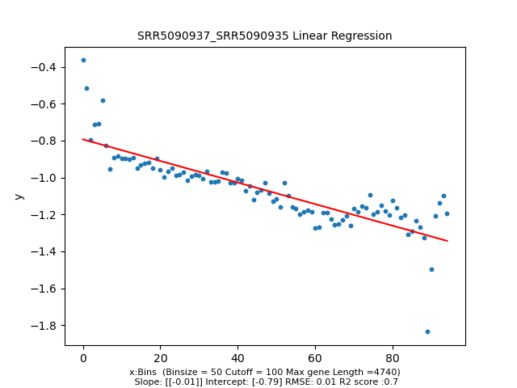

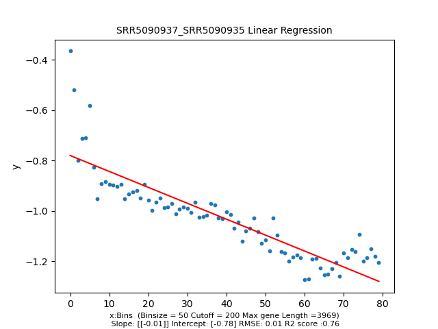

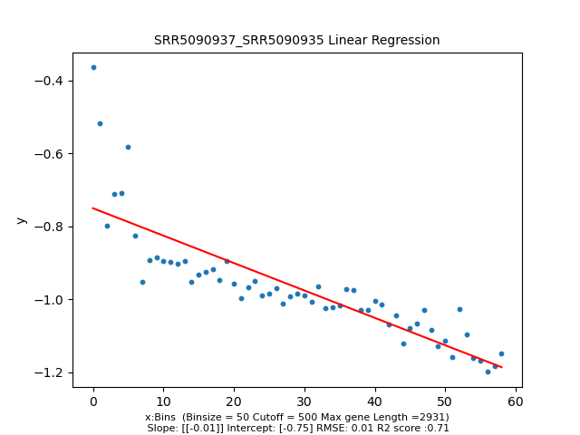

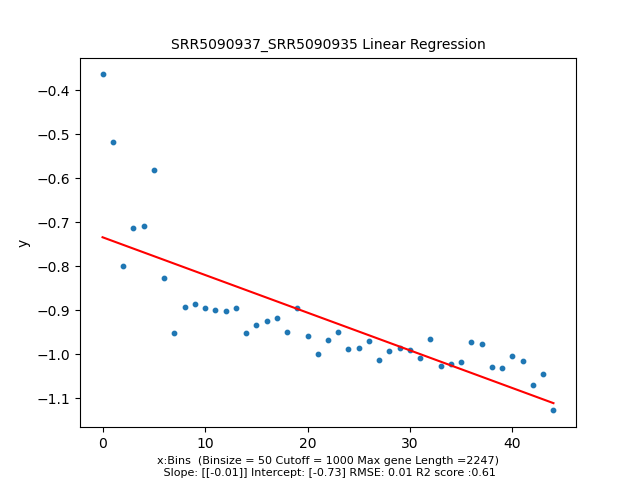

.. raw:: html
    

