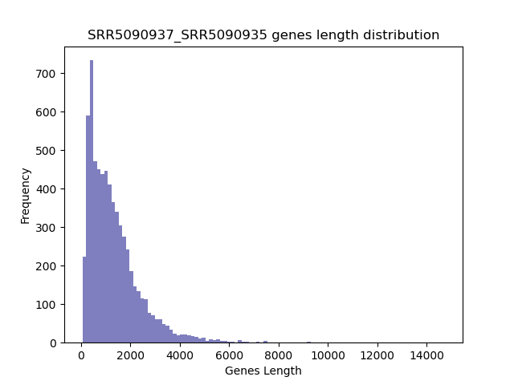

====================================================
**Case Studies**
===================================================

Case Study:GSE91068
-------------------------------

SRR5090937/SRR5090935
************************

Histogram of Genes' Length 
###############################

.. raw:: html
    

Log Linear Plots 
###################

Where cutoff is the minimum no. of genes to support a position to be considered in bins. Max gene length is the longest gene considered corresponding to this cutoff. 

.. image:: SRR5090937_SRR5090935_50_0.LogLinear.png 
   :width: 20%

.. image:: SRR5090937_SRR5090935_50_100.LogLinear.png  
   :width: 20% 

.. image:: SRR5090937_SRR5090935_50_200.LogLinear.png
   :width: 20%

.. image:: SRR5090937_SRR5090935_50_500.LogLinear.png
   :width: 20%

.. raw:: html
    

Log Log Plots 
###################

.. image:: SRR5090937_SRR5090935_50_0.LogLog.png 
   :width: 20%

.. image:: SRR5090937_SRR5090935_50_100.LogLog.png  
   :width: 20%  

.. image:: SRR5090937_SRR5090935_50_1000.LogLog.png
   :width: 20%

.. raw:: html
    

Linear Regression 
###################

.. image:: SRR5090937_SRR5090935_50_200.LR.png
   :width: 20%

.. image:: SRR5090937_SRR5090935_50_500.LR.png
   :width: 20%

.. image:: SRR5090937_SRR5090935_50_1000.LR.png
   :width: 20%

.. raw:: html
    

SRR5090936/SRR5090934
***********************

Histogram of Genes' Length 
###############################

.. image:: SRR5090936_SRR5090934.Length.Histogram.png 
   :width: 400 

.. raw:: html
    

Log Linear Plots 
###################

Where cutoff is the minimum no. of genes to support a position to be considered in bins. Max gene length is the longest gene considered corresponding to this cutoff. 

.. image:: SRR5090936_SRR5090934_50_200.LogLinear.png
   :width: 20%

.. image:: SRR5090936_SRR5090934_50_500.LogLinear.png
   :width: 20%

.. raw:: html
    

Log Log Plots 
###################

.. image:: SRR5090936_SRR5090934_50_0.LogLog.png 
   :width: 20%

.. image:: SRR5090936_SRR5090934_50_100.LogLog.png  
   :width: 20%  

.. image:: SRR5090936_SRR5090934_50_200.LogLog.png  
   :width: 20%

.. image:: SRR5090936_SRR5090934_50_500.LogLog.png
   :width: 20%

.. raw:: html
    

Linear Regression 
###################

.. image:: SRR5090936_SRR5090934_50_1000.LR.png
   :width: 20%

.. raw:: html
    

