====================================================
**GSE91068:GO** 
====================================================

SRR5090937/SRR5090935
*************************

GO0006119
------------
**Oxidative phosphorylation Gene Ontology Term**

Histogram of Genes' Length 
###############################

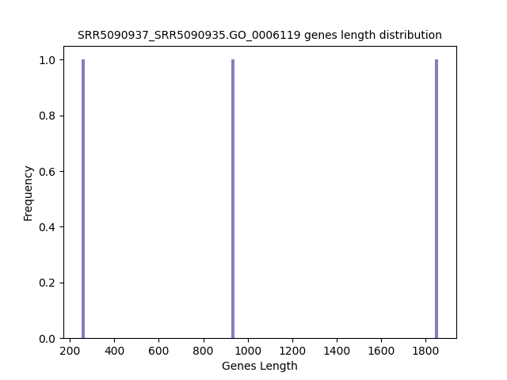

.. raw:: html
    

Log Linear Plots 
###################

Where cutoff is the minimum no. of genes to support a position to be considered in bins. Max gene length is the longest gene considered corresponding to this cutoff. 

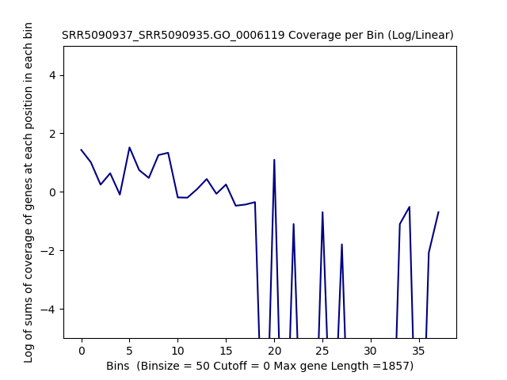

.. raw:: html
    

Log Log Plots 
###################

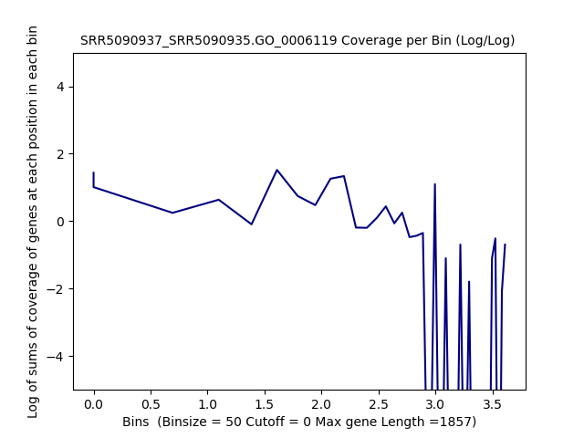

.. raw:: html
    

Linear Regression 
###################

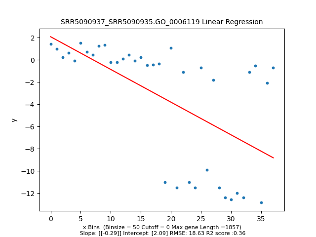

.. raw:: html
    

GO0006406
-------------
**mRNA export from nucleus** 

Histogram of Genes' Length 
###############################

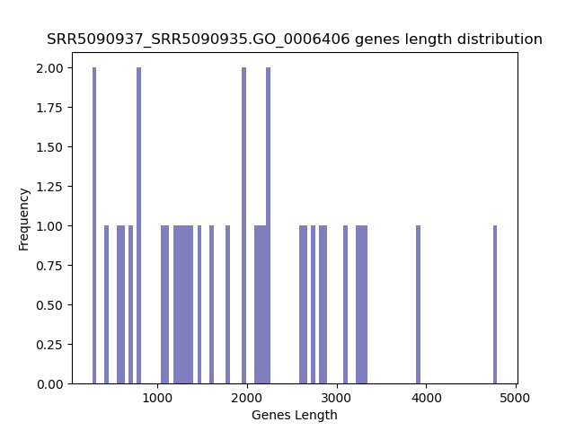

.. raw:: html
    

Log Linear Plots 
###################

Where cutoff is the minimum no. of genes to support a position to be considered in bins. Max gene length is the longest gene considered corresponding to this cutoff. 

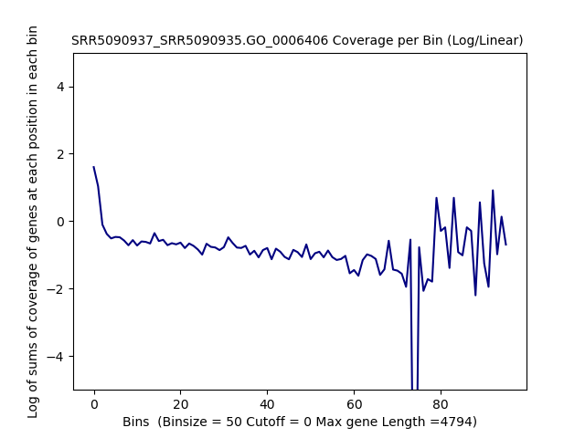

.. raw:: html
    

Log Log Plots 
###################

.. image:: SRR5090937_SRR5090935.GO_0006406_50_0.LogLog.png 
   :width: 400

.. raw:: html
    

Linear Regression 
###################

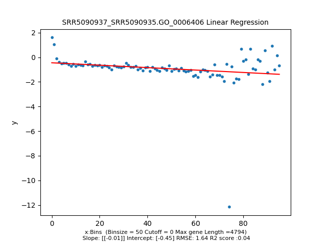

.. raw:: html
    

GO0006412
-------------
**Translation** 

Histogram of Genes' Length 
###############################

.. image:: SRR5090937_SRR5090935.GO_0006412.Length.Histogram.png 
   :width: 400 

.. raw:: html
    

Log Linear Plots 
###################

Where cutoff is the minimum no. of genes to support a position to be considered in bins. Max gene length is the longest gene considered corresponding to this cutoff. 

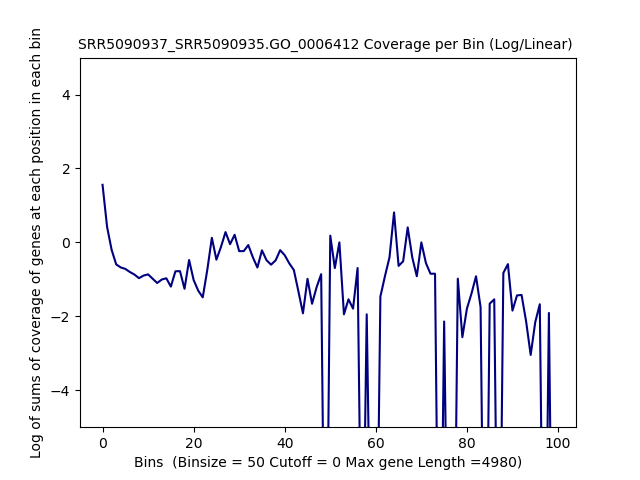

.. raw:: html
    

Log Log Plots 
###################

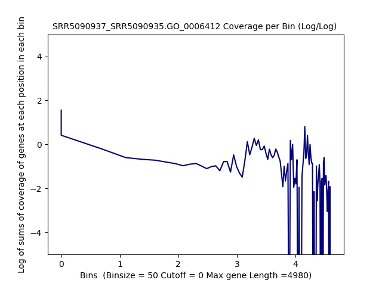

.. raw:: html
    

Linear Regression 
###################

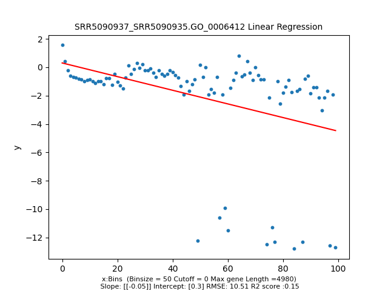

.. raw:: html
    

GO0006950
-------------
**Response to stress** 

Histogram of Genes' Length 
###############################

.. raw:: html
    

Log Linear Plots 
###################

Where cutoff is the minimum no. of genes to support a position to be considered in bins. Max gene length is the longest gene considered corresponding to this cutoff. 

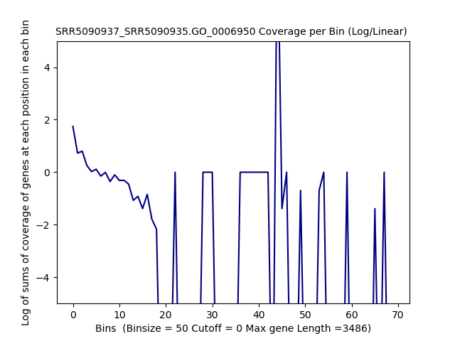

.. raw:: html
    

Log Log Plots 
###################

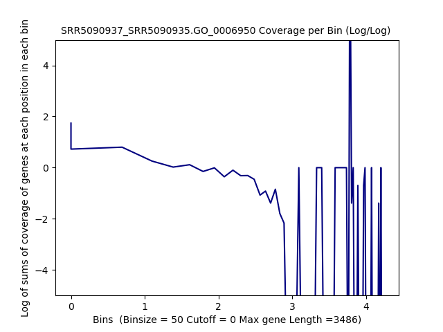

.. raw:: html
    

Linear Regression 
###################

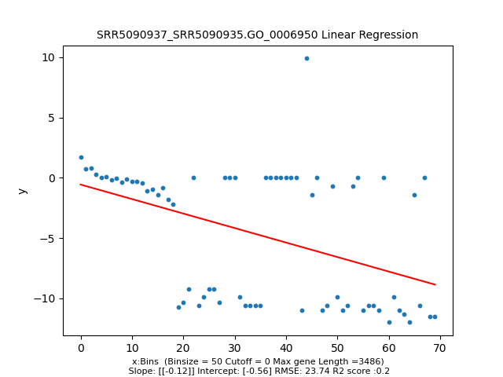

.. raw:: html
    

GO0009651
-------------
**Response to salt stress**

Histogram of Genes' Length 
###############################

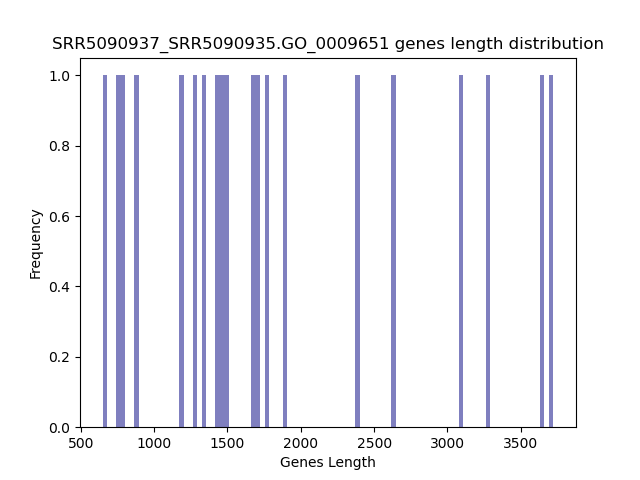

.. raw:: html
    

Log Linear Plots 
###################

Where cutoff is the minimum no. of genes to support a position to be considered in bins. Max gene length is the longest gene considered corresponding to this cutoff. 

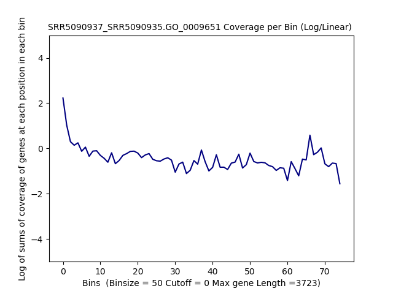

.. raw:: html
    

Log Log Plots 
###################

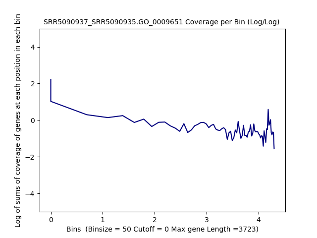

.. raw:: html
    

Linear Regression 
###################

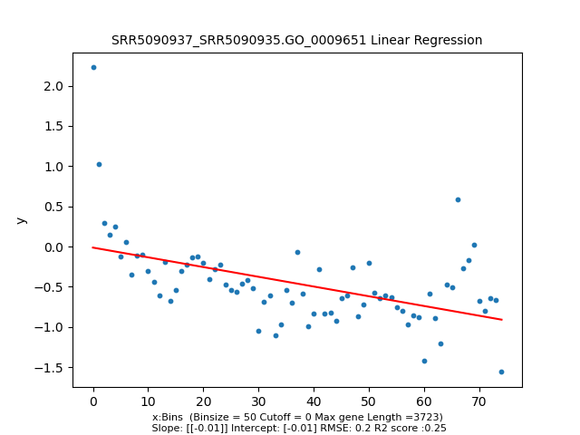

.. raw:: html
    

GO0016458
-------------
**Gene silencing**

Histogram of Genes' Length 
###############################

.. image:: SRR5090937_SRR5090935.GO_0016458.Length.Histogram.png 
   :width: 400 

.. raw:: html
    

Log Linear Plots 
###################

Where cutoff is the minimum no. of genes to support a position to be considered in bins. Max gene length is the longest gene considered corresponding to this cutoff. 

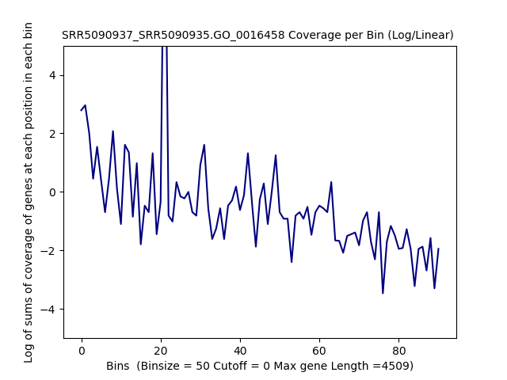

.. raw:: html
    

Log Log Plots 
###################

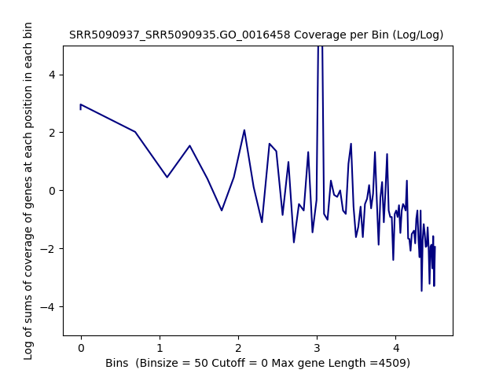

.. raw:: html
    

Linear Regression 
###################

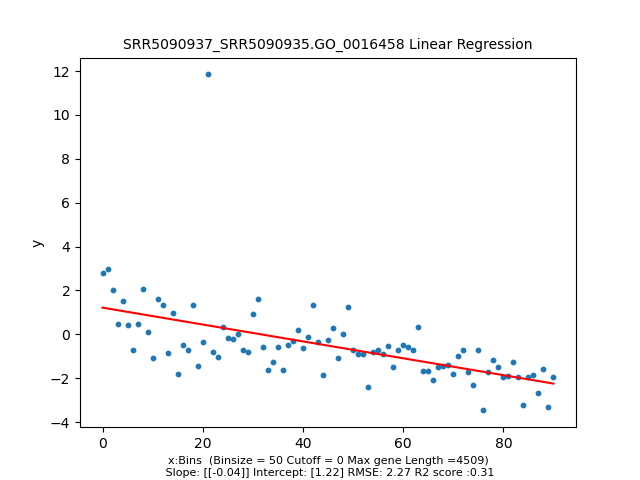

.. raw:: html
    

GO0031047
-------------
**Gene silencing by RNA**

Histogram of Genes' Length 
###############################

.. image:: SRR5090937_SRR5090935.GO_0031047.Length.Histogram.png 
   :width: 400 

.. raw:: html
    

Log Linear Plots 
###################

Where cutoff is the minimum no. of genes to support a position to be considered in bins. Max gene length is the longest gene considered corresponding to this cutoff. 

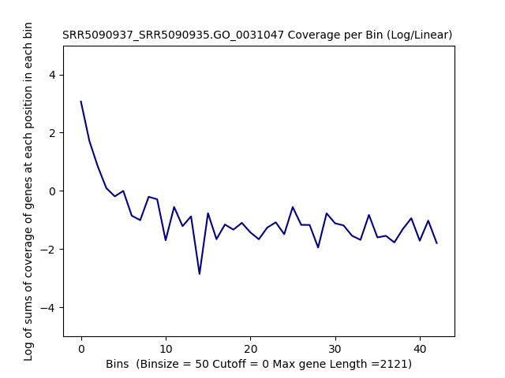

.. raw:: html
    

Log Log Plots 
###################

.. image:: SRR5090937_SRR5090935.GO_0031047_50_0.LogLog.png 
   :width: 400

.. raw:: html
    

Linear Regression 
###################

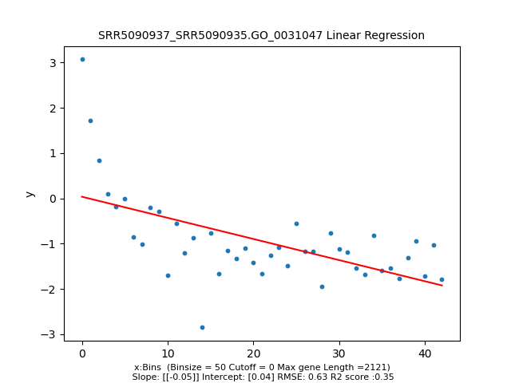

.. raw:: html
    

GO0031990
-------------
**Cellular Response to heat** 

Histogram of Genes' Length 
###############################

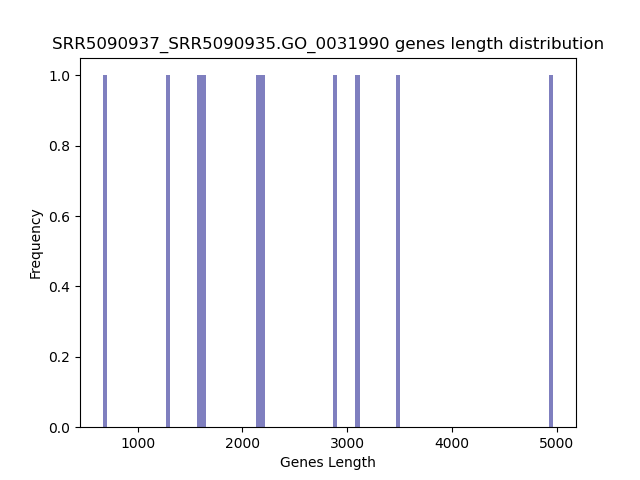

.. raw:: html
    

Log Linear Plots 
###################

Where cutoff is the minimum no. of genes to support a position to be considered in bins. Max gene length is the longest gene considered corresponding to this cutoff. 

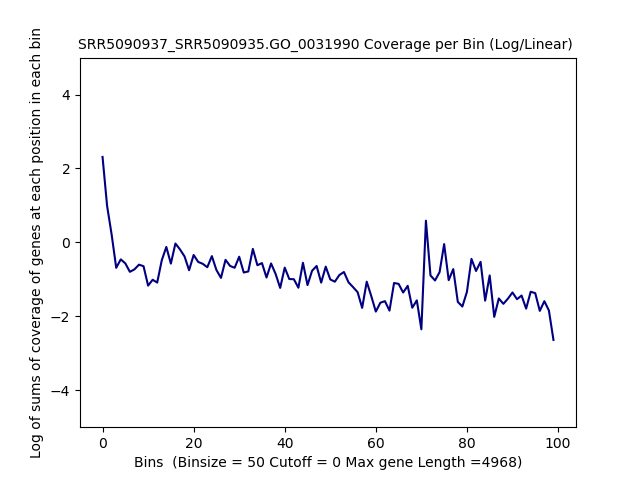

.. raw:: html
    

Log Log Plots 
###################

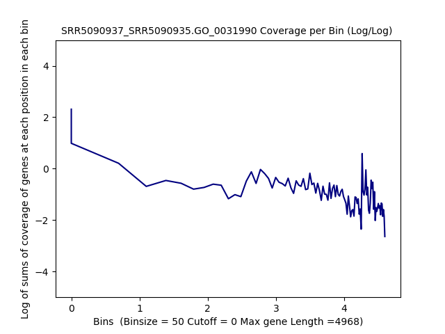

.. raw:: html
    

Linear Regression 
###################

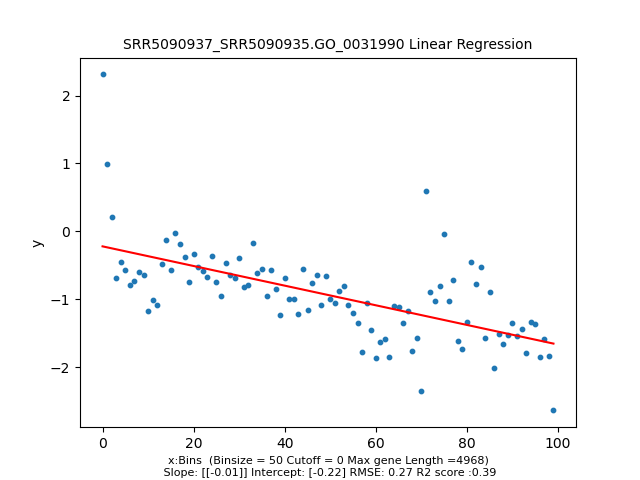

.. raw:: html
    

GO0042254
-------------
**Ribosome biogenesis**

Histogram of Genes' Length 
###############################

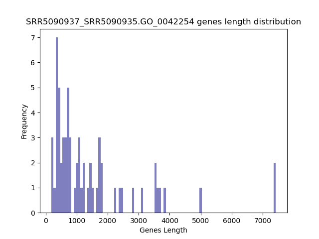

.. raw:: html
    

Log Linear Plots 
###################

Where cutoff is the minimum no. of genes to support a position to be considered in bins. Max gene length is the longest gene considered corresponding to this cutoff. 

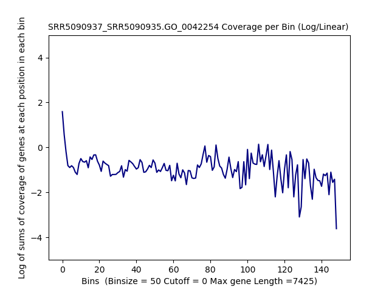

.. raw:: html
    

Log Log Plots 
###################

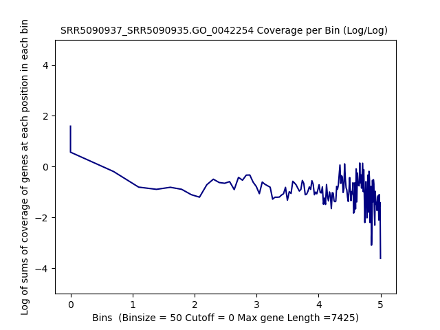

.. raw:: html
    

Linear Regression 
###################

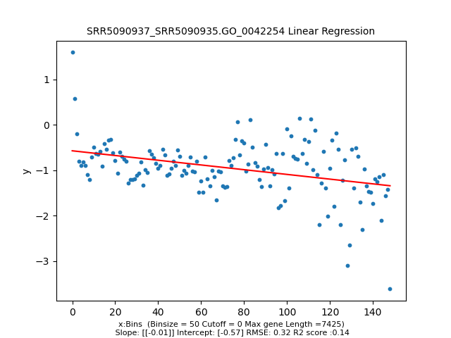

.. raw:: html
    

SRR5090936/SRR5090934
************************

GO0006119
------------
**Oxidative phosphorylation Gene Ontology Term**

Histogram of Genes' Length 
###############################

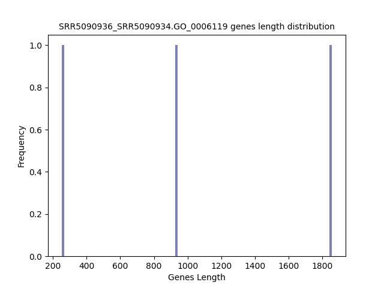

.. raw:: html
    

Log Linear Plots 
###################

Where cutoff is the minimum no. of genes to support a position to be considered in bins. Max gene length is the longest gene considered corresponding to this cutoff. 

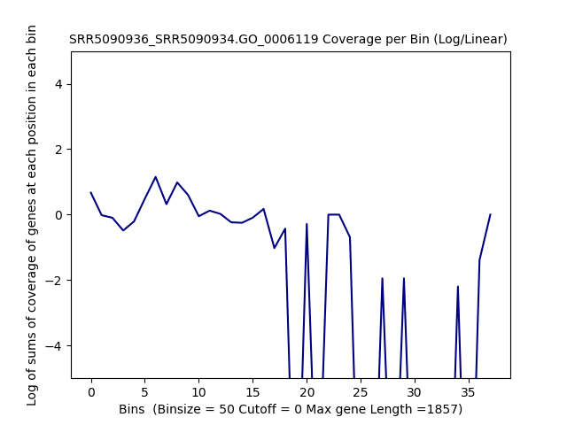

.. raw:: html
    

Log Log Plots 
###################

.. image:: SRR5090936_SRR5090934.GO_0006119_50_0.LogLog.png 
   :width: 400

.. raw:: html
    

Linear Regression 
###################

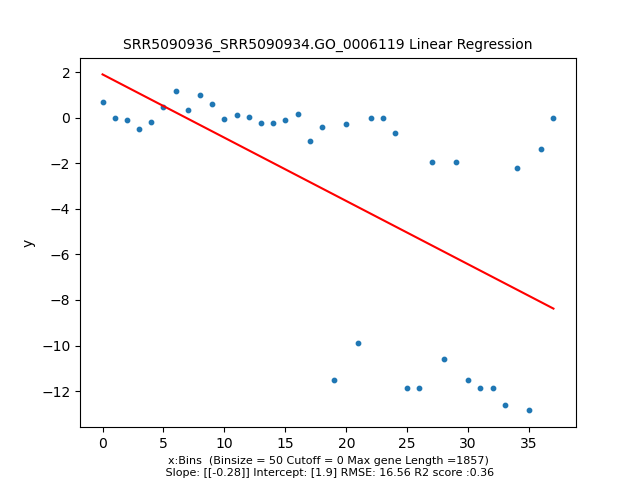

.. raw:: html
    

GO0006406
-------------
**mRNA export from nucleus** 

Histogram of Genes' Length 
###############################

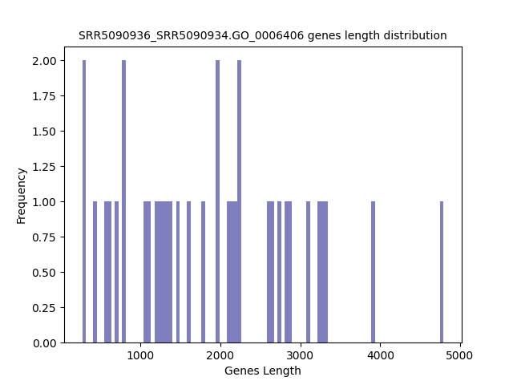

.. raw:: html
    

Log Linear Plots 
###################

Where cutoff is the minimum no. of genes to support a position to be considered in bins. Max gene length is the longest gene considered corresponding to this cutoff. 

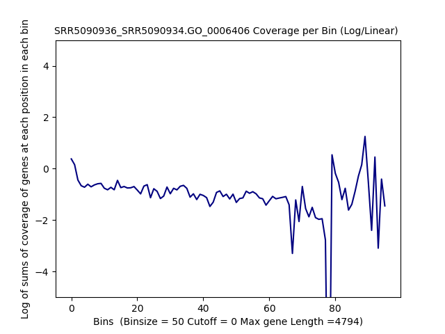

.. raw:: html
    

Log Log Plots 
###################

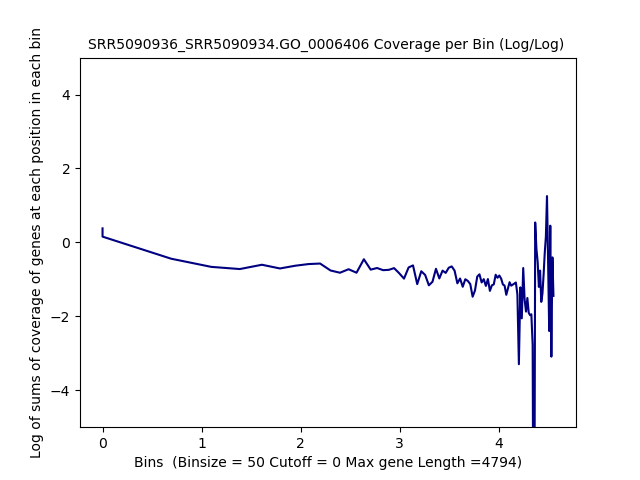

.. raw:: html
    

Linear Regression 
###################

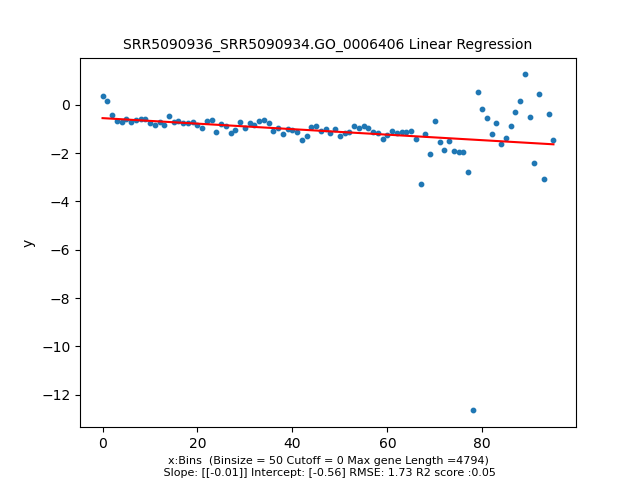

.. raw:: html
    

GO0006412
-------------
**Translation** 

Histogram of Genes' Length 
###############################

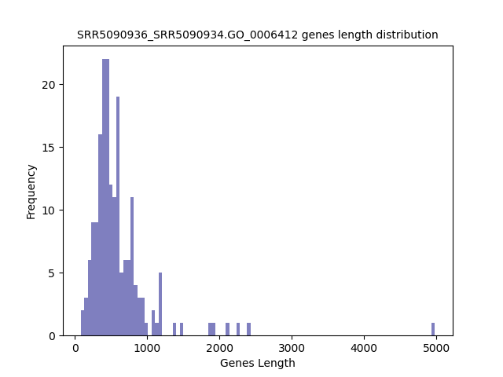

.. raw:: html
    

Log Linear Plots 
###################

Where cutoff is the minimum no. of genes to support a position to be considered in bins. Max gene length is the longest gene considered corresponding to this cutoff. 

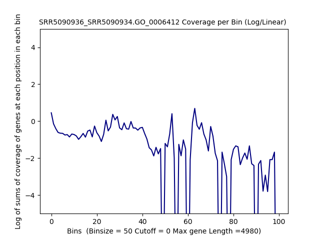

.. raw:: html
    

Log Log Plots 
###################

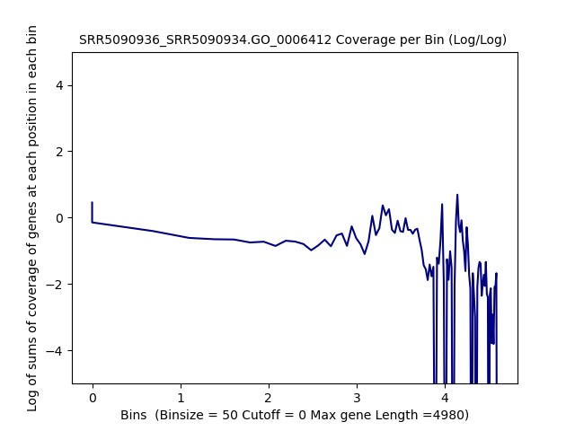

.. raw:: html
    

Linear Regression 
###################

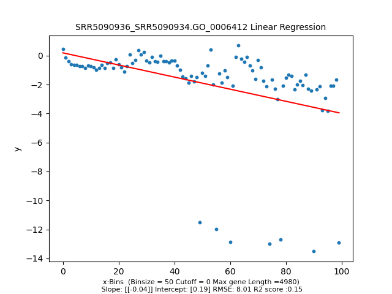

.. raw:: html
    

GO0006950
-------------
**Response to stress** 

Histogram of Genes' Length 
###############################

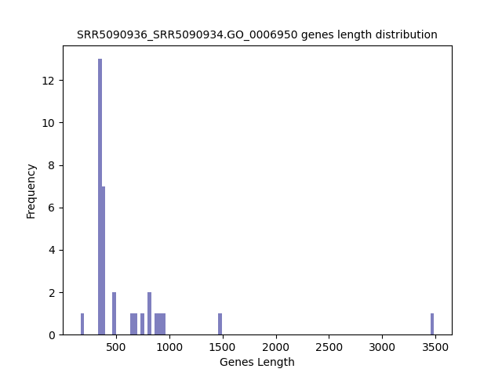

.. raw:: html
    

Log Linear Plots 
###################

Where cutoff is the minimum no. of genes to support a position to be considered in bins. Max gene length is the longest gene considered corresponding to this cutoff. 

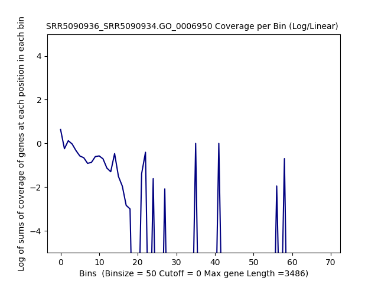

.. raw:: html
    

Log Log Plots 
###################

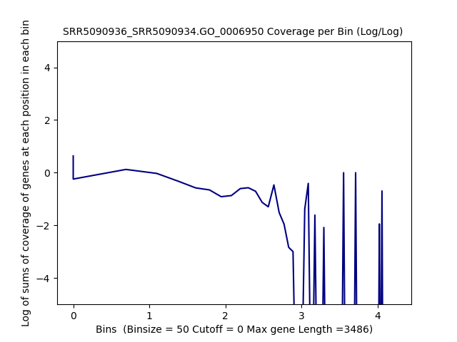

.. raw:: html
    

Linear Regression 
###################

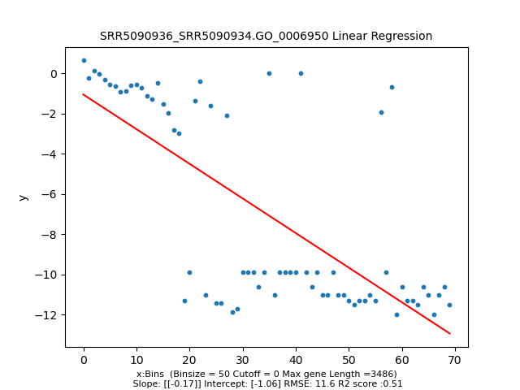

.. raw:: html
    

GO0009651
-------------
**Response to salt stress**

Histogram of Genes' Length 
###############################

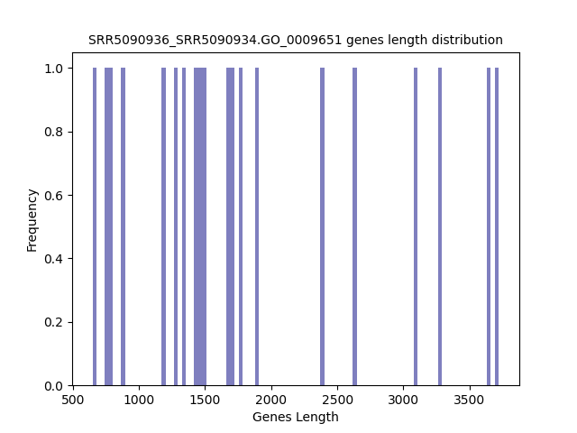

.. raw:: html
    

Log Linear Plots 
###################

Where cutoff is the minimum no. of genes to support a position to be considered in bins. Max gene length is the longest gene considered corresponding to this cutoff. 

.. image:: SRR5090936_SRR5090934.GO_0009651_50_0.LogLinear.png 
   :width: 400

.. raw:: html
    

Log Log Plots 
###################

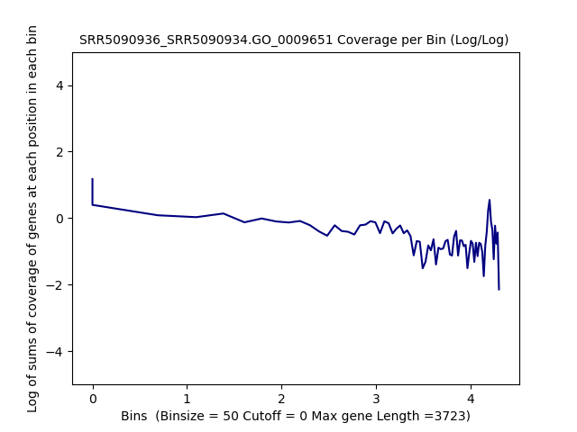

.. raw:: html
    

Linear Regression 
###################

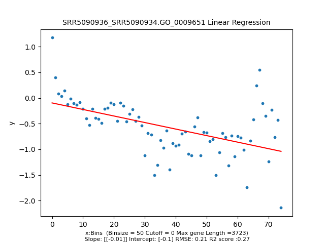

.. raw:: html
    

GO0016458
-------------
**Gene silencing**

Histogram of Genes' Length 
###############################

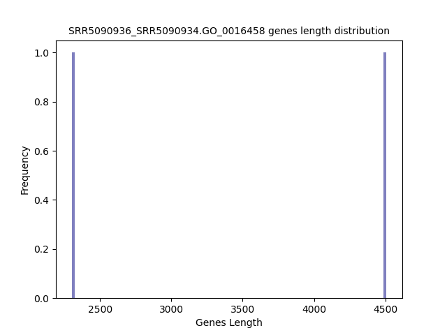

.. raw:: html
    

Log Linear Plots 
###################

Where cutoff is the minimum no. of genes to support a position to be considered in bins. Max gene length is the longest gene considered corresponding to this cutoff. 

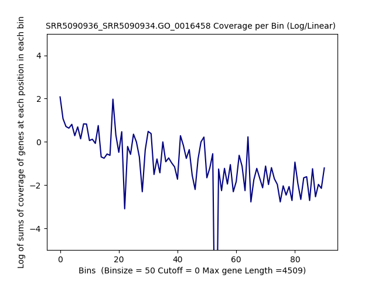

.. raw:: html
    

Log Log Plots 
###################

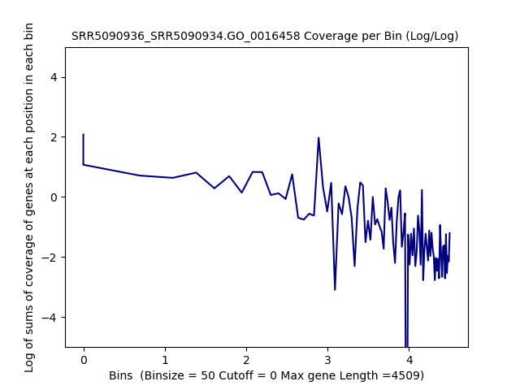

.. raw:: html
    

Linear Regression 
###################

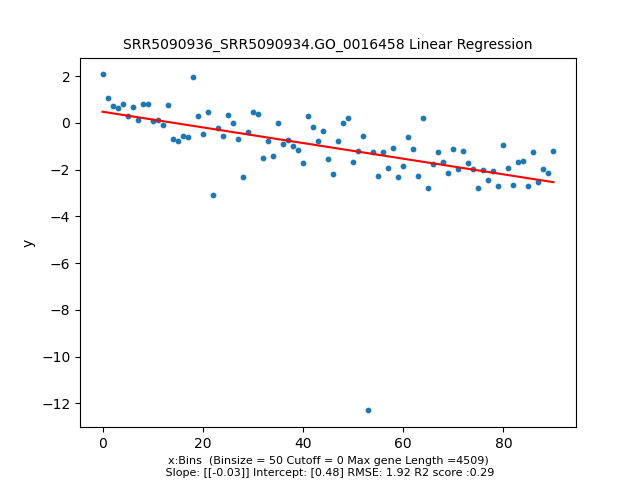

.. raw:: html
    

GO0031047
-------------
**Gene silencing by RNA**

Histogram of Genes' Length 
###############################

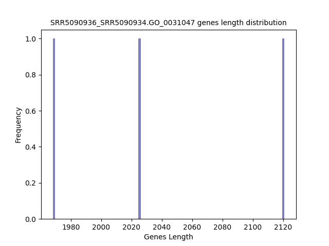

.. raw:: html
    

Log Linear Plots 
###################

Where cutoff is the minimum no. of genes to support a position to be considered in bins. Max gene length is the longest gene considered corresponding to this cutoff. 

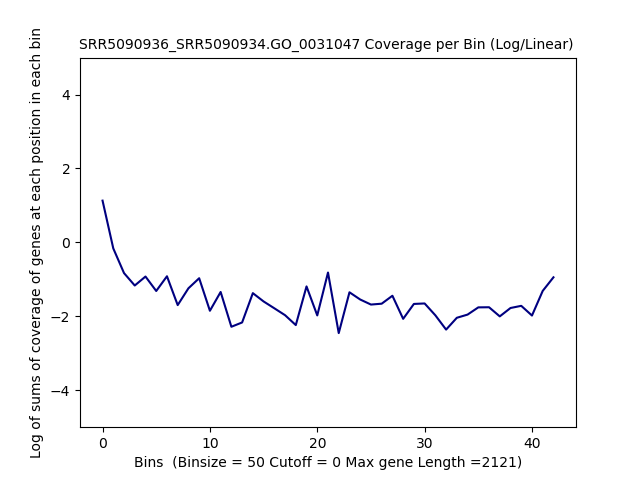

.. raw:: html
    

Log Log Plots 
###################

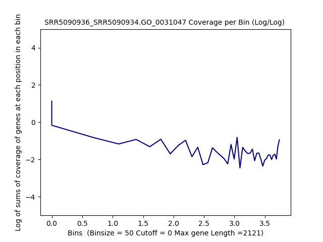

.. raw:: html
    

Linear Regression 
###################

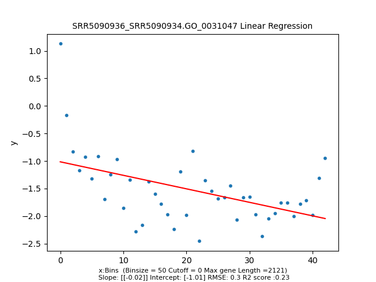

.. raw:: html
    

GO0031990
-------------
**Cellular Response to heat** 

Histogram of Genes' Length 
###############################

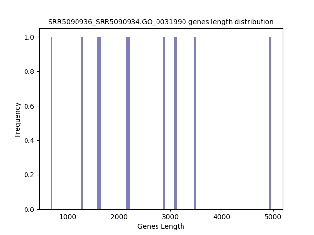

.. raw:: html
    

Log Linear Plots 
###################

Where cutoff is the minimum no. of genes to support a position to be considered in bins. Max gene length is the longest gene considered corresponding to this cutoff. 

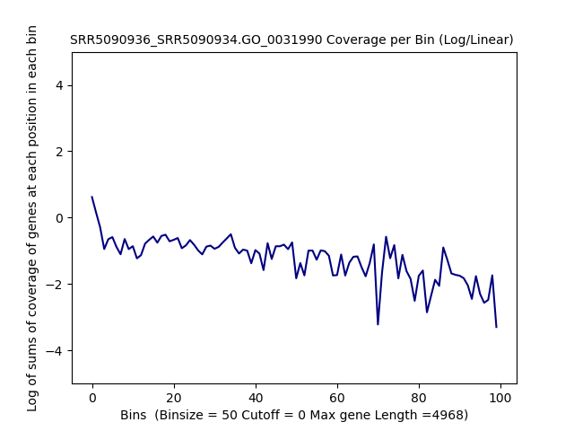

.. raw:: html
    

Log Log Plots 
###################

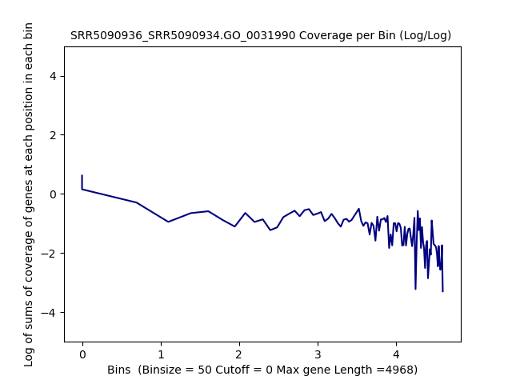

.. raw:: html
    

Linear Regression 
###################

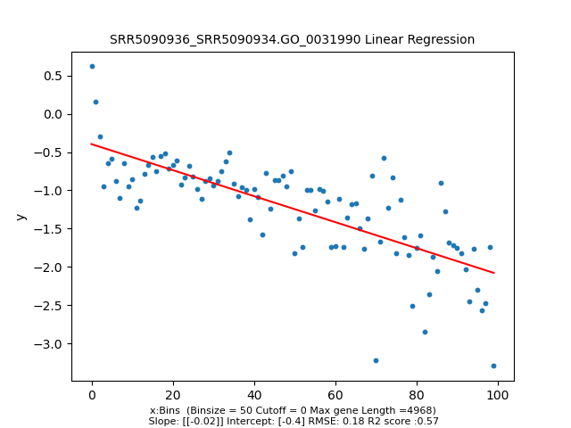

.. raw:: html
    

GO0042254
-------------
**Ribosome biogenesis**

Histogram of Genes' Length 
###############################

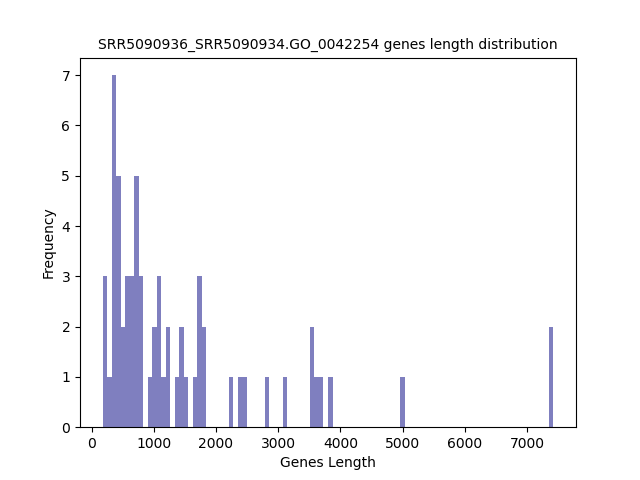

.. raw:: html
    

Log Linear Plots 
###################

Where cutoff is the minimum no. of genes to support a position to be considered in bins. Max gene length is the longest gene considered corresponding to this cutoff. 

.. image:: SRR5090936_SRR5090934.GO_0042254_50_0.LogLinear.png 
   :width: 400

.. raw:: html
    

Log Log Plots 
###################

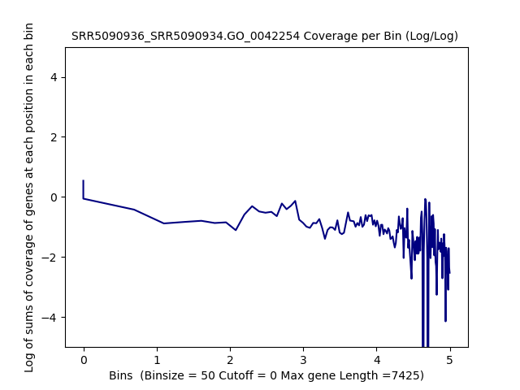

.. raw:: html
    

Linear Regression 
###################

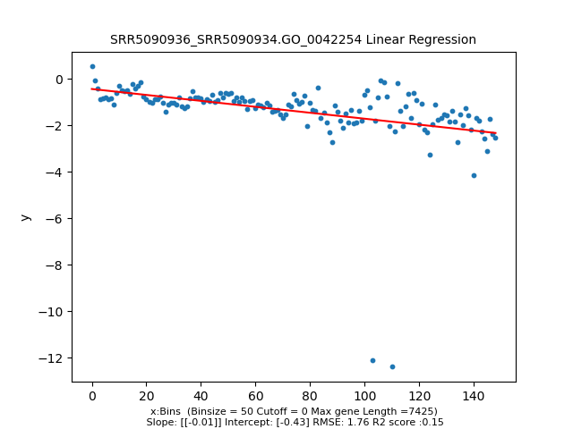

.. raw:: html
    

