====================================================
**GSE91068:Chromosomes** 
====================================================

SRR5090937_SRR5090935
************************

ChrI
------------

Histogram of Genes' Length 
###############################

.. image:: SRR5090937_SRR5090935.yeastchrI.Length.Histogram.png 
   :width: 400 

.. raw:: html
    

Log Linear Plots 
###################

Where cutoff is the minimum no. of genes to support a position to be considered in bins. Max gene length is the longest gene considered corresponding to this cutoff. 

.. image:: SRR5090937_SRR5090935.yeastchrI_50_0.LogLinear.png 
   :width: 400

.. raw:: html
    

Log Log Plots 
###################

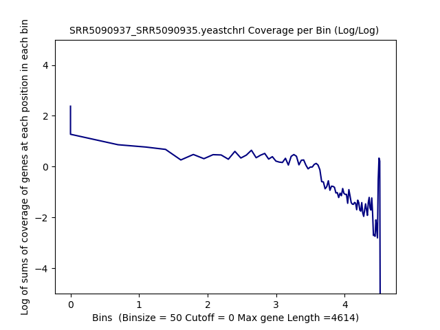

.. raw:: html
    

Linear Regression 
###################

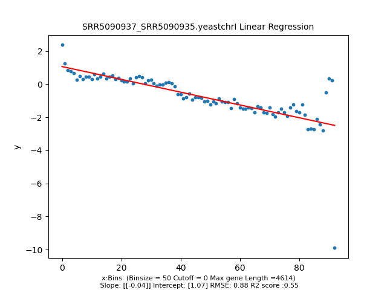

.. raw:: html
    

ChrII
------------

Histogram of Genes' Length 
###############################

.. image:: SRR5090937_SRR5090935.yeastchrII.Length.Histogram.png 
   :width: 400 

.. raw:: html
    

Log Linear Plots 
###################

Where cutoff is the minimum no. of genes to support a position to be considered in bins. Max gene length is the longest gene considered corresponding to this cutoff. 

.. image:: SRR5090937_SRR5090935.yeastchrII_50_0.LogLinear.png 
   :width: 400

.. raw:: html
    

Log Log Plots 
###################

.. image:: SRR5090937_SRR5090935.yeastchrII_50_0.LogLog.png 
   :width: 400

.. raw:: html
    

Linear Regression 
###################

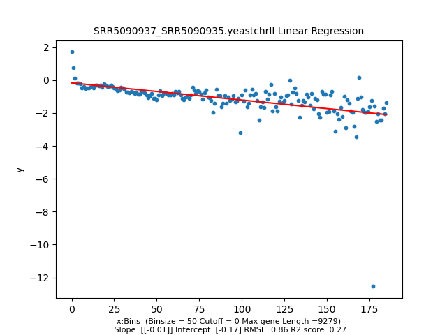

.. raw:: html
    

ChrIII
------------

Histogram of Genes' Length 
###############################

.. image:: SRR5090937_SRR5090935.yeastchrIII.Length.Histogram.png 
   :width: 400 

.. raw:: html
    

Log Linear Plots 
###################

Where cutoff is the minimum no. of genes to support a position to be considered in bins. Max gene length is the longest gene considered corresponding to this cutoff. 

.. image:: SRR5090937_SRR5090935.yeastchrIII_50_0.LogLinear.png 
   :width: 400

.. raw:: html
    

Log Log Plots 
###################

.. image:: SRR5090937_SRR5090935.yeastchrIII_50_0.LogLog.png 
   :width: 400

.. raw:: html
    

Linear Regression 
###################

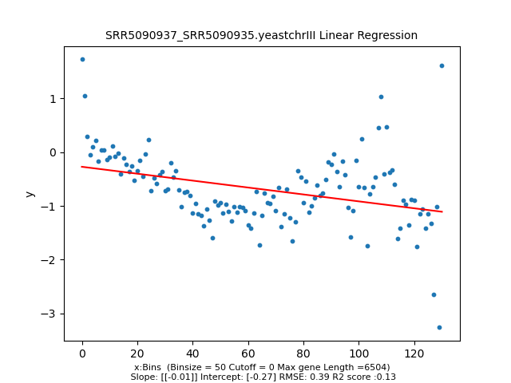

.. raw:: html
    

ChrIV
------------

Histogram of Genes' Length 
###############################

.. raw:: html
    

Log Linear Plots 
###################

Where cutoff is the minimum no. of genes to support a position to be considered in bins. Max gene length is the longest gene considered corresponding to this cutoff. 

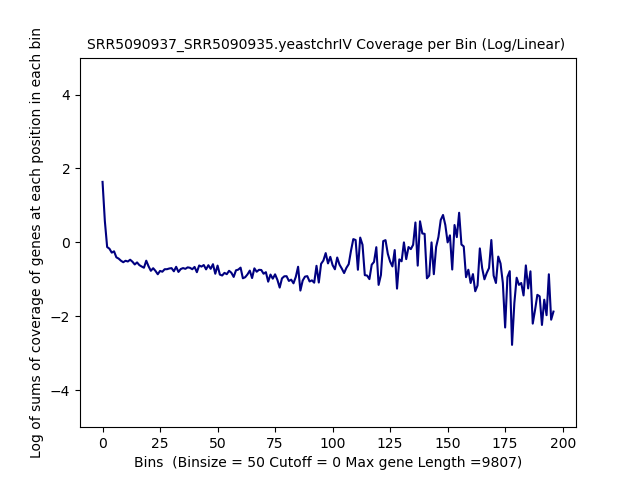

.. raw:: html
    

Log Log Plots 
###################

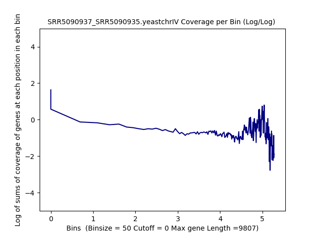

.. raw:: html
    

Linear Regression 
###################

.. image:: SRR5090937_SRR5090935.yeastchrIV_50_0.LR.png 
   :width: 400

.. raw:: html
    

ChrIX
------------

Histogram of Genes' Length 
###############################

.. image:: SRR5090937_SRR5090935.yeastchrIX.Length.Histogram.png 
   :width: 400 

.. raw:: html
    

Log Linear Plots 
###################

Where cutoff is the minimum no. of genes to support a position to be considered in bins. Max gene length is the longest gene considered corresponding to this cutoff. 

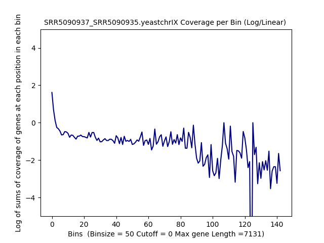

.. raw:: html
    

Log Log Plots 
###################

.. image:: SRR5090937_SRR5090935.yeastchrIX_50_0.LogLog.png 
   :width: 400

.. raw:: html
    

Linear Regression 
###################

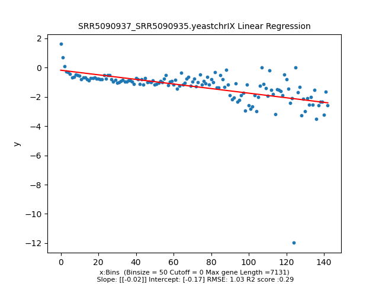

.. raw:: html
    

ChrVIII
------------

Histogram of Genes' Length 
###############################

.. image:: SRR5090937_SRR5090935.yeastchrVIII.Length.Histogram.png 
   :width: 400 

.. raw:: html
    

Log Linear Plots 
###################

Where cutoff is the minimum no. of genes to support a position to be considered in bins. Max gene length is the longest gene considered corresponding to this cutoff. 

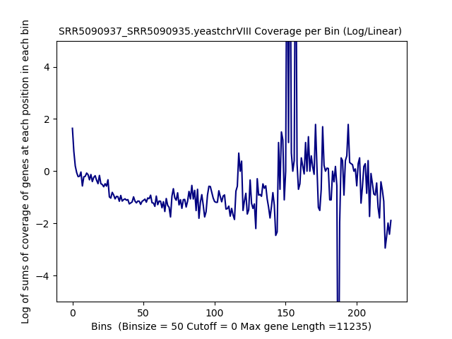

.. raw:: html
    

Log Log Plots 
###################

.. image:: SRR5090937_SRR5090935.yeastchrVIII_50_0.LogLog.png 
   :width: 400

.. raw:: html
    

Linear Regression 
###################

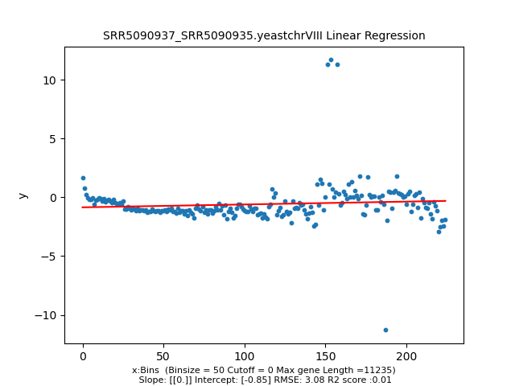

.. raw:: html
    

ChrVII
------------

Histogram of Genes' Length 
###############################

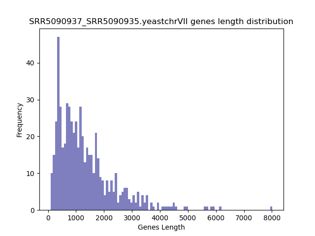

.. raw:: html
    

Log Linear Plots 
###################

Where cutoff is the minimum no. of genes to support a position to be considered in bins. Max gene length is the longest gene considered corresponding to this cutoff. 

.. image:: SRR5090937_SRR5090935.yeastchrVII_50_0.LogLinear.png 
   :width: 400

.. raw:: html
    

Log Log Plots 
###################

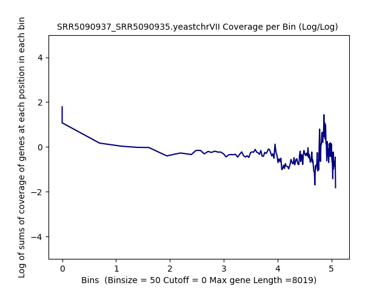

.. raw:: html
    

Linear Regression 
###################

.. image:: SRR5090937_SRR5090935.yeastchrVII_50_0.LR.png 
   :width: 400

.. raw:: html
    

ChrVI
------------

Histogram of Genes' Length 
###############################

.. image:: SRR5090937_SRR5090935.yeastchrVI.Length.Histogram.png 
   :width: 400 

.. raw:: html
    

Log Linear Plots 
###################

Where cutoff is the minimum no. of genes to support a position to be considered in bins. Max gene length is the longest gene considered corresponding to this cutoff. 

.. image:: SRR5090937_SRR5090935.yeastchrVI_50_0.LogLinear.png 
   :width: 400

.. raw:: html
    

Log Log Plots 
###################

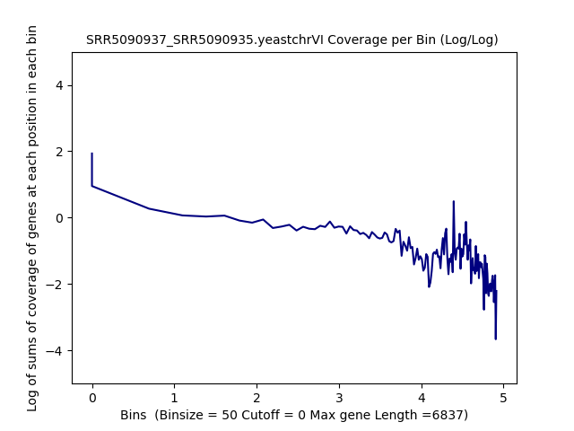

.. raw:: html
    

Linear Regression 
###################

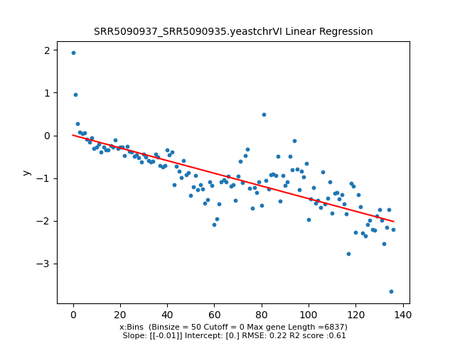

.. raw:: html
    

ChrV
------------

Histogram of Genes' Length 
###############################

.. image:: SRR5090937_SRR5090935.yeastchrV.Length.Histogram.png 
   :width: 400 

.. raw:: html
    

Log Linear Plots 
###################

Where cutoff is the minimum no. of genes to support a position to be considered in bins. Max gene length is the longest gene considered corresponding to this cutoff. 

.. image:: SRR5090937_SRR5090935.yeastchrV_50_0.LogLinear.png 
   :width: 400

.. raw:: html
    

Log Log Plots 
###################

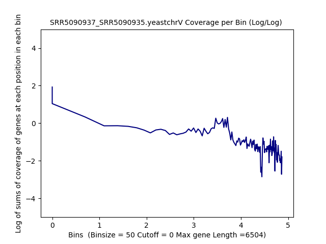

.. raw:: html
    

Linear Regression 
###################

.. image:: SRR5090937_SRR5090935.yeastchrV_50_0.LR.png 
   :width: 400

.. raw:: html
    

ChrXIII
------------

Histogram of Genes' Length 
###############################

.. image:: SRR5090937_SRR5090935.yeastchrXIII.Length.Histogram.png 
   :width: 400 

.. raw:: html
    

Log Linear Plots 
###################

Where cutoff is the minimum no. of genes to support a position to be considered in bins. Max gene length is the longest gene considered corresponding to this cutoff. 

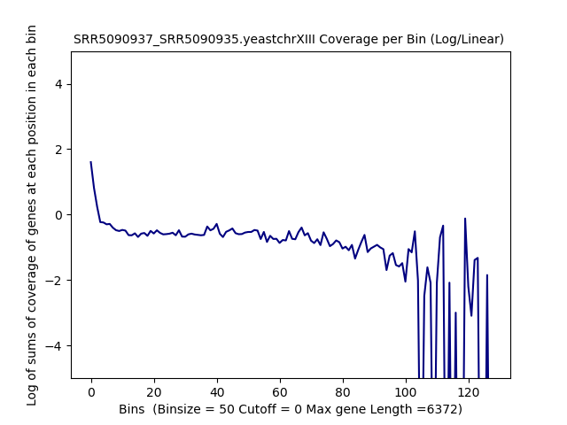

.. raw:: html
    

Log Log Plots 
###################

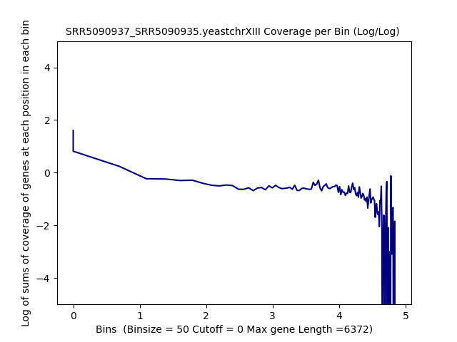

.. raw:: html
    

Linear Regression 
###################

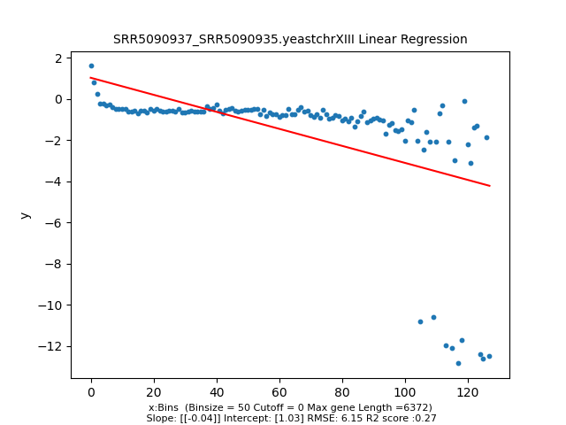

.. raw:: html
    

ChrXII
------------

Histogram of Genes' Length 
###############################

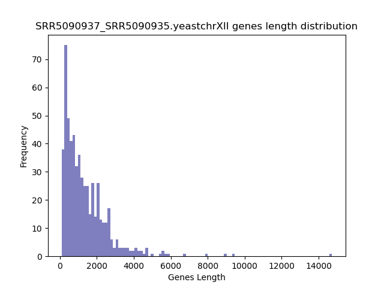

.. raw:: html
    

Log Linear Plots 
###################

Where cutoff is the minimum no. of genes to support a position to be considered in bins. Max gene length is the longest gene considered corresponding to this cutoff. 

.. image:: SRR5090937_SRR5090935.yeastchrXII_50_0.LogLinear.png 
   :width: 400

.. raw:: html
    

Log Log Plots 
###################

.. image:: SRR5090937_SRR5090935.yeastchrXII_50_0.LogLog.png 
   :width: 400

.. raw:: html
    

Linear Regression 
###################

.. image:: SRR5090937_SRR5090935.yeastchrXII_50_0.LR.png 
   :width: 400

.. raw:: html
    

ChrXI
------------

Histogram of Genes' Length 
###############################

.. image:: SRR5090937_SRR5090935.yeastchrXI.Length.Histogram.png 
   :width: 400 

.. raw:: html
    

Log Linear Plots 
###################

Where cutoff is the minimum no. of genes to support a position to be considered in bins. Max gene length is the longest gene considered corresponding to this cutoff. 

.. image:: SRR5090937_SRR5090935.yeastchrXI_50_0.LogLinear.png 
   :width: 400

.. raw:: html
    

Log Log Plots 
###################

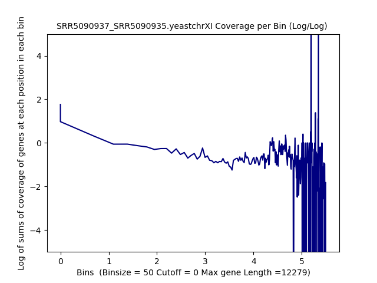

.. raw:: html
    

Linear Regression 
###################

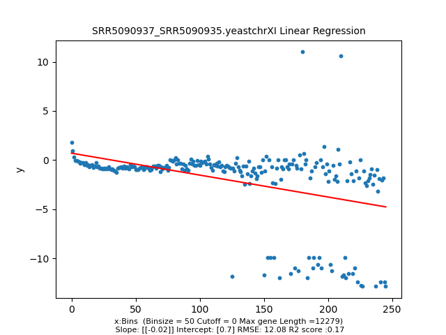

.. raw:: html
    

ChrXIV
------------

Histogram of Genes' Length 
###############################

.. image:: SRR5090937_SRR5090935.yeastchrXIV.Length.Histogram.png 
   :width: 400 

.. raw:: html
    

Log Linear Plots 
###################

Where cutoff is the minimum no. of genes to support a position to be considered in bins. Max gene length is the longest gene considered corresponding to this cutoff. 

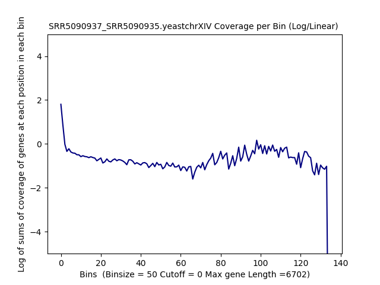

.. raw:: html
    

Log Log Plots 
###################

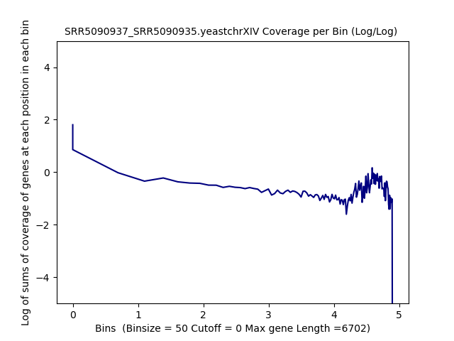

.. raw:: html
    

Linear Regression 
###################

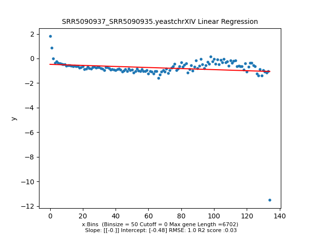

.. raw:: html
    

ChrX
------------

Histogram of Genes' Length 
###############################

.. image:: SRR5090937_SRR5090935.yeastchrX.Length.Histogram.png 
   :width: 400 

.. raw:: html
    

Log Linear Plots 
###################

Where cutoff is the minimum no. of genes to support a position to be considered in bins. Max gene length is the longest gene considered corresponding to this cutoff. 

.. image:: SRR5090937_SRR5090935.yeastchrX_50_0.LogLinear.png 
   :width: 400

.. raw:: html
    

Log Log Plots 
###################

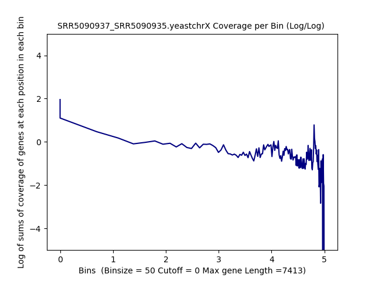

.. raw:: html
    

Linear Regression 
###################

.. image:: SRR5090937_SRR5090935.yeastchrX_50_0.LR.png 
   :width: 400

.. raw:: html
    

ChrXVI
------------

Histogram of Genes' Length 
###############################

.. image:: SRR5090937_SRR5090935.yeastchrXVI.Length.Histogram.png 
   :width: 400 

.. raw:: html
    

Log Linear Plots 
###################

Where cutoff is the minimum no. of genes to support a position to be considered in bins. Max gene length is the longest gene considered corresponding to this cutoff. 

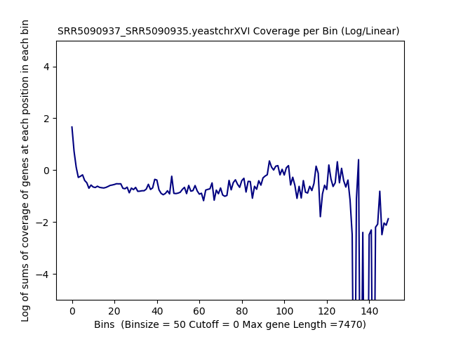

.. raw:: html
    

Log Log Plots 
###################

.. image:: SRR5090937_SRR5090935.yeastchrXVI_50_0.LogLog.png 
   :width: 400

.. raw:: html
    

Linear Regression 
###################

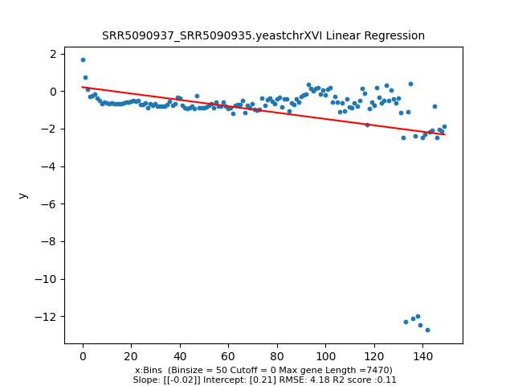

.. raw:: html
    

ChrXV
------------

Histogram of Genes' Length 
###############################

.. image:: SRR5090937_SRR5090935.yeastchrXV.Length.Histogram.png 
   :width: 400 

.. raw:: html
    

Log Linear Plots 
###################

Where cutoff is the minimum no. of genes to support a position to be considered in bins. Max gene length is the longest gene considered corresponding to this cutoff. 

.. image:: SRR5090937_SRR5090935.yeastchrXV_50_0.LogLinear.png 
   :width: 400

.. raw:: html
    

Log Log Plots 
###################

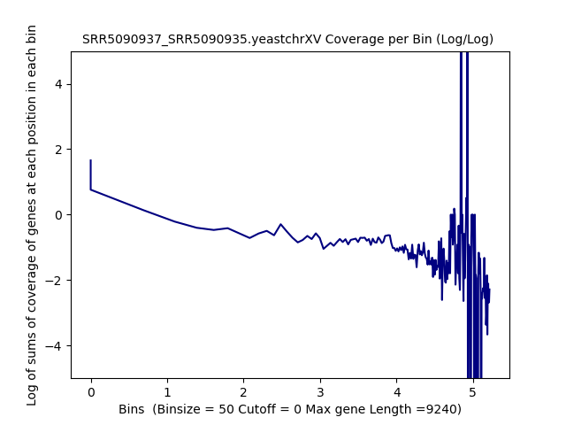

.. raw:: html
    

Linear Regression 
###################

.. image:: SRR5090937_SRR5090935.yeastchrXV_50_0.LR.png 
   :width: 400

.. raw:: html
    

SRR5090936/SRR5090934
*************************

ChrI
------------

Histogram of Genes' Length 
###############################

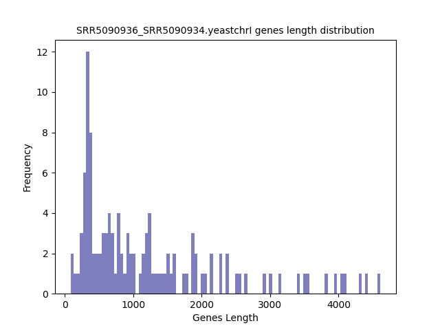

.. raw:: html
    

Log Linear Plots 
###################

Where cutoff is the minimum no. of genes to support a position to be considered in bins. Max gene length is the longest gene considered corresponding to this cutoff. 

.. image:: SRR5090936_SRR5090934.yeastchrI_50_0.LogLinear.png 
   :width: 400

.. raw:: html
    

Log Log Plots 
###################

.. image:: SRR5090936_SRR5090934.yeastchrI_50_0.LogLog.png 
   :width: 400

.. raw:: html
    

Linear Regression 
###################

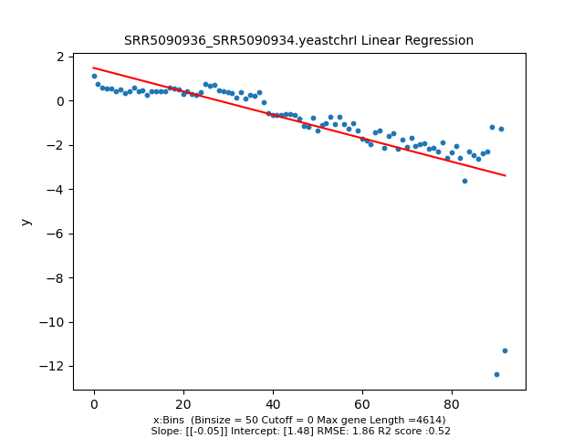

.. raw:: html
    

ChrII
------------

Histogram of Genes' Length 
###############################

.. image:: SRR5090936_SRR5090934.yeastchrII.Length.Histogram.png 
   :width: 400 

.. raw:: html
    

Log Linear Plots 
###################

Where cutoff is the minimum no. of genes to support a position to be considered in bins. Max gene length is the longest gene considered corresponding to this cutoff. 

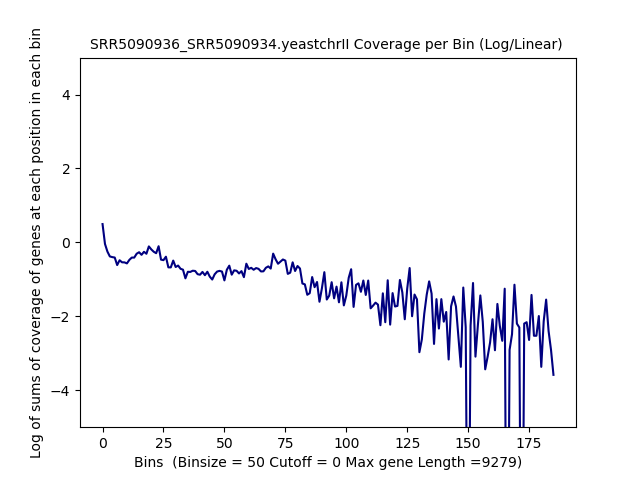

.. raw:: html
    

Log Log Plots 
###################

.. image:: SRR5090936_SRR5090934.yeastchrII_50_0.LogLog.png 
   :width: 400

.. raw:: html
    

Linear Regression 
###################

.. image:: SRR5090936_SRR5090934.yeastchrII_50_0.LR.png 
   :width: 400

.. raw:: html
    

ChrIII
------------

Histogram of Genes' Length 
###############################

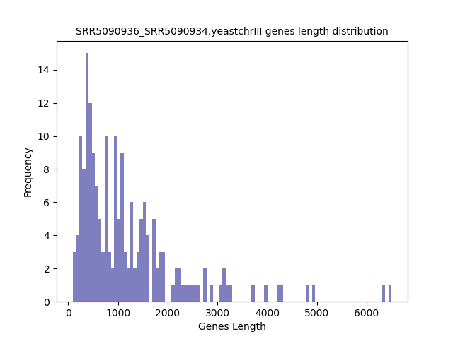

.. raw:: html
    

Log Linear Plots 
###################

Where cutoff is the minimum no. of genes to support a position to be considered in bins. Max gene length is the longest gene considered corresponding to this cutoff. 

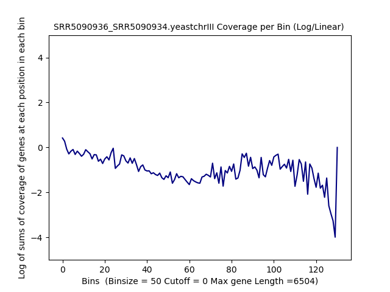

.. raw:: html
    

Log Log Plots 
###################

.. image:: SRR5090936_SRR5090934.yeastchrIII_50_0.LogLog.png 
   :width: 400

.. raw:: html
    

Linear Regression 
###################

.. image:: SRR5090936_SRR5090934.yeastchrIII_50_0.LR.png 
   :width: 400

.. raw:: html
    

ChrIV
------------

Histogram of Genes' Length 
###############################

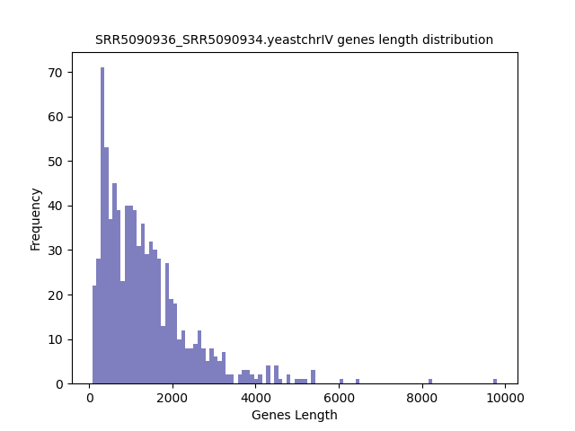

.. raw:: html
    

Log Linear Plots 
###################

Where cutoff is the minimum no. of genes to support a position to be considered in bins. Max gene length is the longest gene considered corresponding to this cutoff. 

.. image:: SRR5090936_SRR5090934.yeastchrIV_50_0.LogLinear.png 
   :width: 400

.. raw:: html
    

Log Log Plots 
###################

.. image:: SRR5090936_SRR5090934.yeastchrIV_50_0.LogLog.png 
   :width: 400

.. raw:: html
    

Linear Regression 
###################

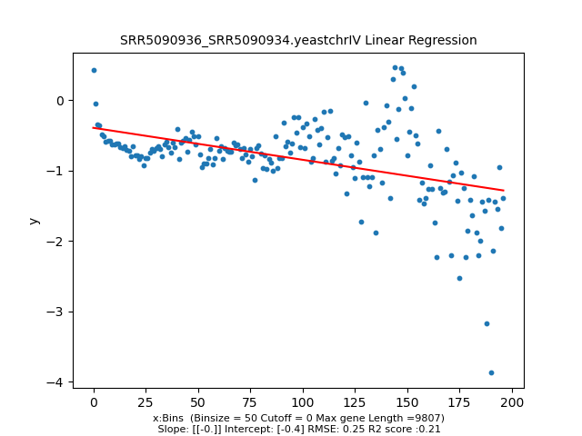

.. raw:: html
    

ChrIX
------------

Histogram of Genes' Length 
###############################

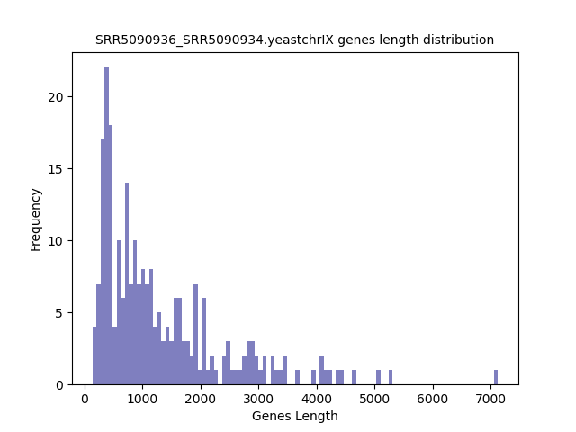

.. raw:: html
    

Log Linear Plots 
###################

Where cutoff is the minimum no. of genes to support a position to be considered in bins. Max gene length is the longest gene considered corresponding to this cutoff. 

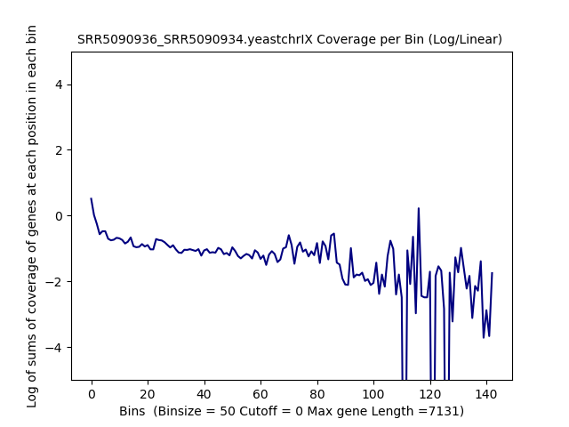

.. raw:: html
    

Log Log Plots 
###################

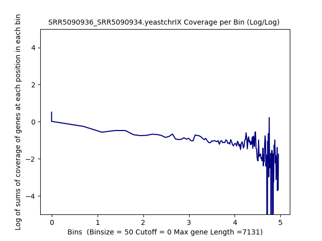

.. raw:: html
    

Linear Regression 
###################

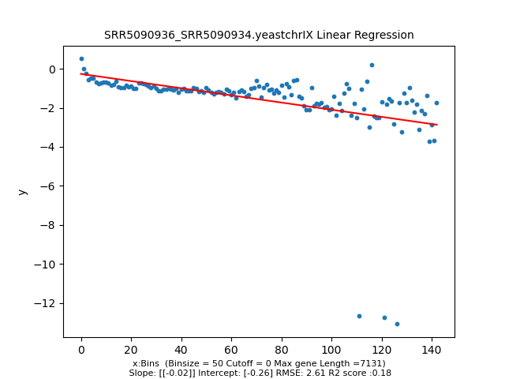

.. raw:: html
    

ChrVIII
------------

Histogram of Genes' Length 
###############################

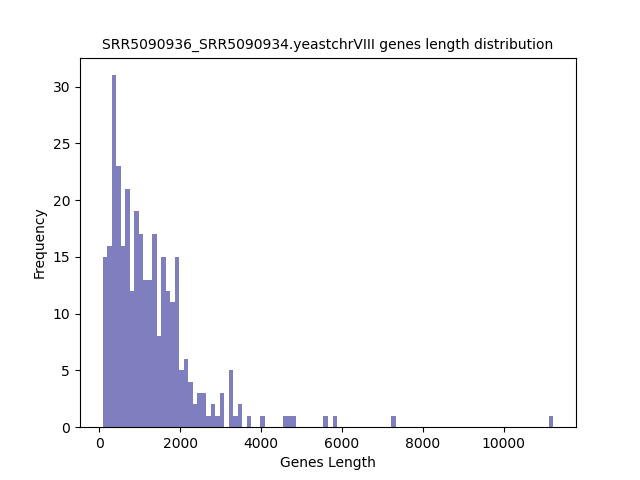

.. raw:: html
    

Log Linear Plots 
###################

Where cutoff is the minimum no. of genes to support a position to be considered in bins. Max gene length is the longest gene considered corresponding to this cutoff. 

.. image:: SRR5090936_SRR5090934.yeastchrVIII_50_0.LogLinear.png 
   :width: 400

.. raw:: html
    

Log Log Plots 
###################

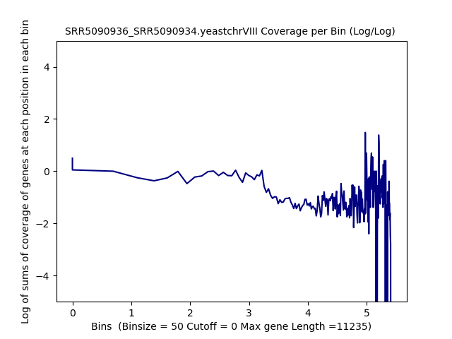

.. raw:: html
    

Linear Regression 
###################

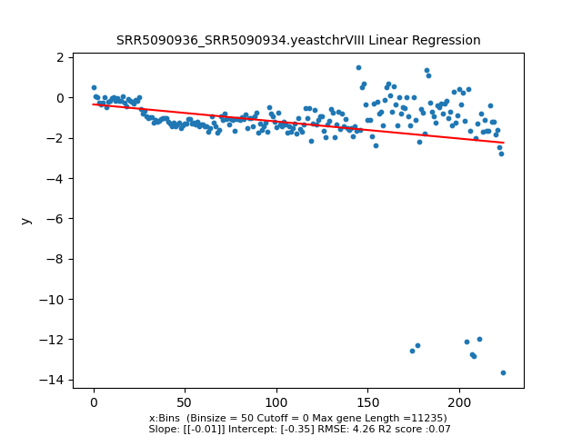

.. raw:: html
    

ChrVII
------------

Histogram of Genes' Length 
###############################

.. raw:: html
    

Log Linear Plots 
###################

Where cutoff is the minimum no. of genes to support a position to be considered in bins. Max gene length is the longest gene considered corresponding to this cutoff. 

.. image:: SRR5090936_SRR5090934.yeastchrVII_50_0.LogLinear.png 
   :width: 400

.. raw:: html
    

Log Log Plots 
###################

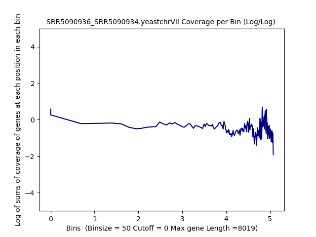

.. raw:: html
    

Linear Regression 
###################

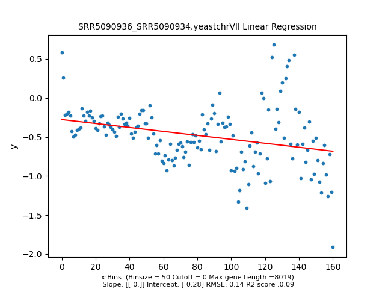

.. raw:: html
    

ChrVI
------------

Histogram of Genes' Length 
###############################

.. image:: SRR5090936_SRR5090934.yeastchrVI.Length.Histogram.png 
   :width: 400 

.. raw:: html
    

Log Linear Plots 
###################

Where cutoff is the minimum no. of genes to support a position to be considered in bins. Max gene length is the longest gene considered corresponding to this cutoff. 

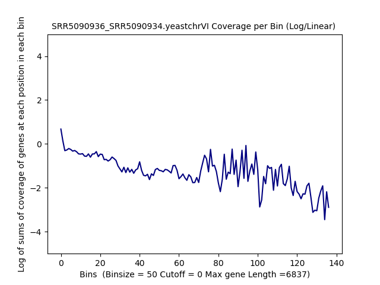

.. raw:: html
    

Log Log Plots 
###################

.. image:: SRR5090936_SRR5090934.yeastchrVI_50_0.LogLog.png 
   :width: 400

.. raw:: html
    

Linear Regression 
###################

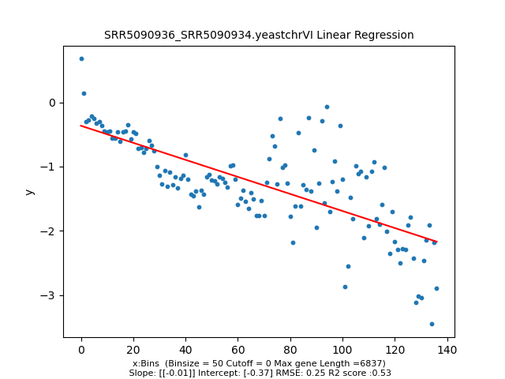

.. raw:: html
    

ChrV
------------

Histogram of Genes' Length 
###############################

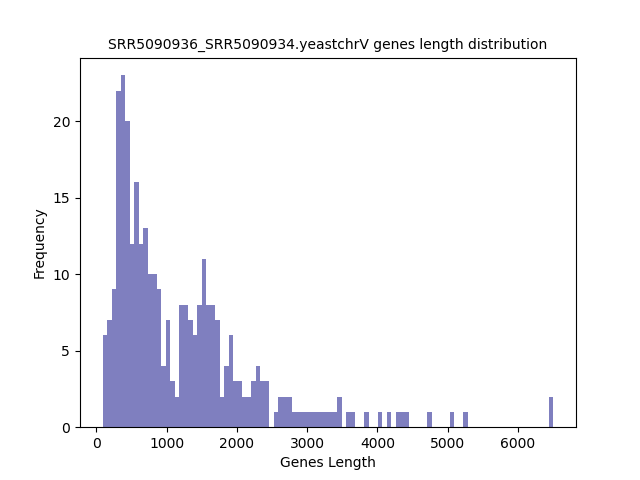

.. raw:: html
    

Log Linear Plots 
###################

Where cutoff is the minimum no. of genes to support a position to be considered in bins. Max gene length is the longest gene considered corresponding to this cutoff. 

.. image:: SRR5090936_SRR5090934.yeastchrV_50_0.LogLinear.png 
   :width: 400

.. raw:: html
    

Log Log Plots 
###################

.. image:: SRR5090936_SRR5090934.yeastchrV_50_0.LogLog.png 
   :width: 400

.. raw:: html
    

Linear Regression 
###################

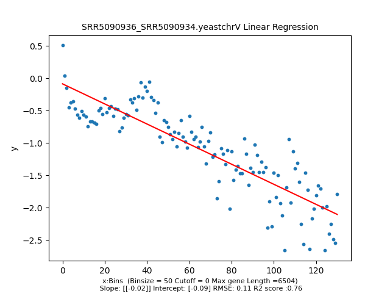

.. raw:: html
    

ChrXIII
------------

Histogram of Genes' Length 
###############################

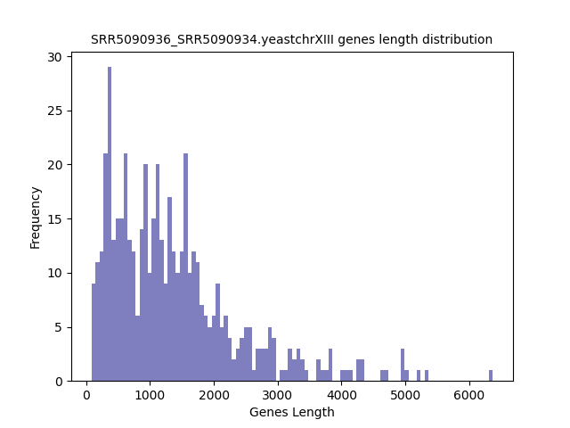

.. raw:: html
    

Log Linear Plots 
###################

Where cutoff is the minimum no. of genes to support a position to be considered in bins. Max gene length is the longest gene considered corresponding to this cutoff. 

.. image:: SRR5090936_SRR5090934.yeastchrXIII_50_0.LogLinear.png 
   :width: 400

.. raw:: html
    

Log Log Plots 
###################

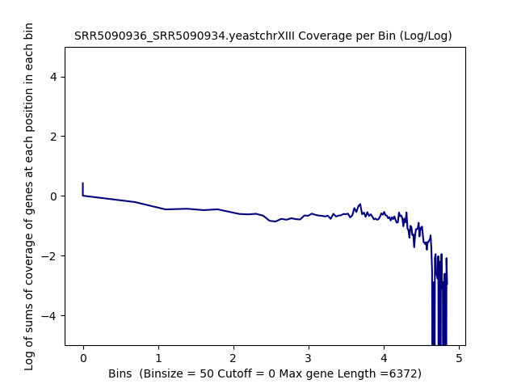

.. raw:: html
    

Linear Regression 
###################

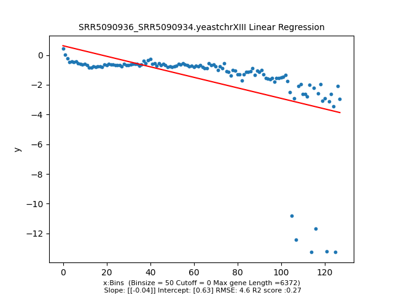

.. raw:: html
    

ChrXII
------------

Histogram of Genes' Length 
###############################

.. image:: SRR5090936_SRR5090934.yeastchrXII.Length.Histogram.png 
   :width: 400 

.. raw:: html
    

Log Linear Plots 
###################

Where cutoff is the minimum no. of genes to support a position to be considered in bins. Max gene length is the longest gene considered corresponding to this cutoff. 

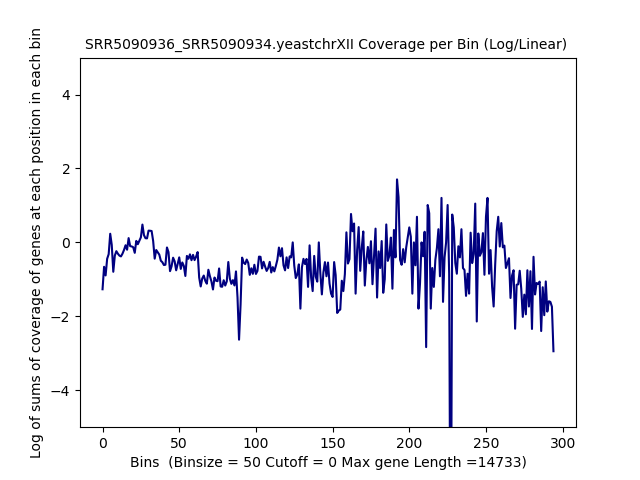

.. raw:: html
    

Log Log Plots 
###################

.. image:: SRR5090936_SRR5090934.yeastchrXII_50_0.LogLog.png 
   :width: 400

.. raw:: html
    

Linear Regression 
###################

.. image:: SRR5090936_SRR5090934.yeastchrXII_50_0.LR.png 
   :width: 400

.. raw:: html
    

ChrXI
------------

Histogram of Genes' Length 
###############################

.. image:: SRR5090936_SRR5090934.yeastchrXI.Length.Histogram.png 
   :width: 400 

.. raw:: html
    

Log Linear Plots 
###################

Where cutoff is the minimum no. of genes to support a position to be considered in bins. Max gene length is the longest gene considered corresponding to this cutoff. 

.. image:: SRR5090936_SRR5090934.yeastchrXI_50_0.LogLinear.png 
   :width: 400

.. raw:: html
    

Log Log Plots 
###################

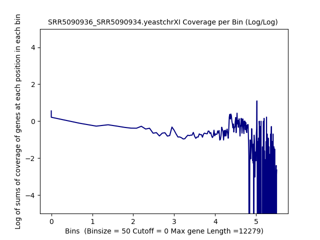

.. raw:: html
    

Linear Regression 
###################

.. image:: SRR5090936_SRR5090934.yeastchrXI_50_0.LR.png 
   :width: 400

.. raw:: html
    

ChrXIV
------------

Histogram of Genes' Length 
###############################

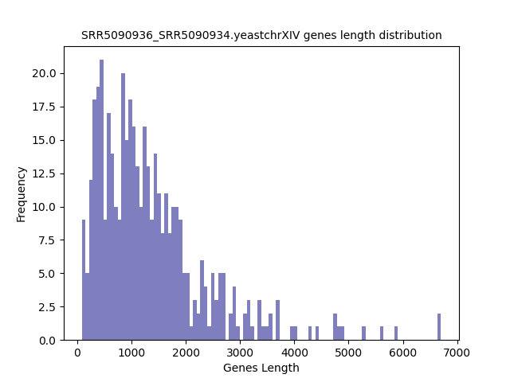

.. raw:: html
    

Log Linear Plots 
###################

Where cutoff is the minimum no. of genes to support a position to be considered in bins. Max gene length is the longest gene considered corresponding to this cutoff. 

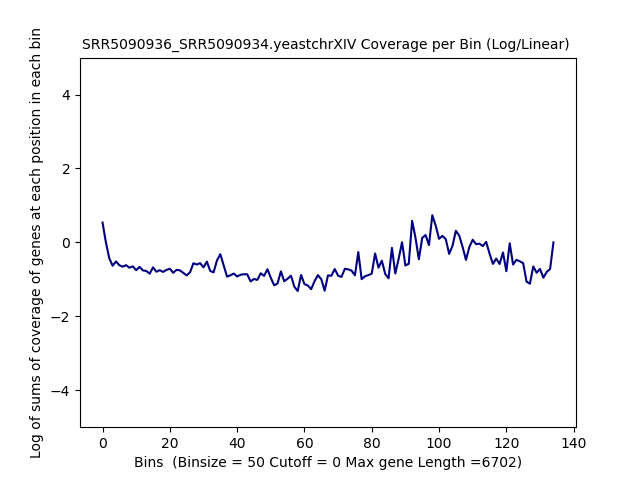

.. raw:: html
    

Log Log Plots 
###################

.. image:: SRR5090936_SRR5090934.yeastchrXIV_50_0.LogLog.png 
   :width: 400

.. raw:: html
    

Linear Regression 
###################

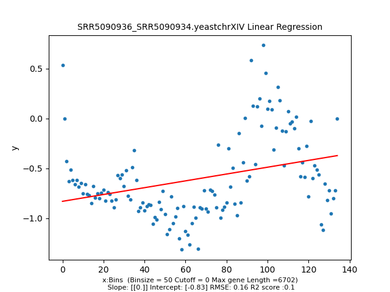

.. raw:: html
    

ChrX
------------

Histogram of Genes' Length 
###############################

.. image:: SRR5090936_SRR5090934.yeastchrX.Length.Histogram.png 
   :width: 400 

.. raw:: html
    

Log Linear Plots 
###################

Where cutoff is the minimum no. of genes to support a position to be considered in bins. Max gene length is the longest gene considered corresponding to this cutoff. 

.. image:: SRR5090936_SRR5090934.yeastchrX_50_0.LogLinear.png 
   :width: 400

.. raw:: html
    

Log Log Plots 
###################

.. image:: SRR5090936_SRR5090934.yeastchrX_50_0.LogLog.png 
   :width: 400

.. raw:: html
    

Linear Regression 
###################

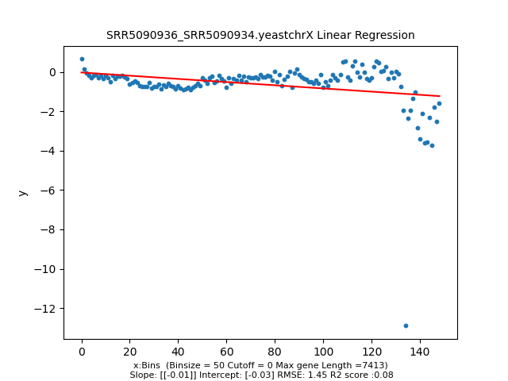

.. raw:: html
    

ChrXVI
------------

Histogram of Genes' Length 
###############################

.. image:: SRR5090936_SRR5090934.yeastchrXVI.Length.Histogram.png 
   :width: 400 

.. raw:: html
    

Log Linear Plots 
###################

Where cutoff is the minimum no. of genes to support a position to be considered in bins. Max gene length is the longest gene considered corresponding to this cutoff. 

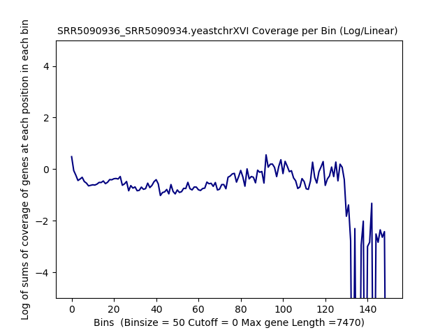

.. raw:: html
    

Log Log Plots 
###################

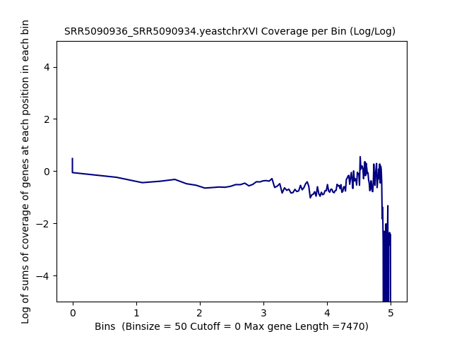

.. raw:: html
    

Linear Regression 
###################

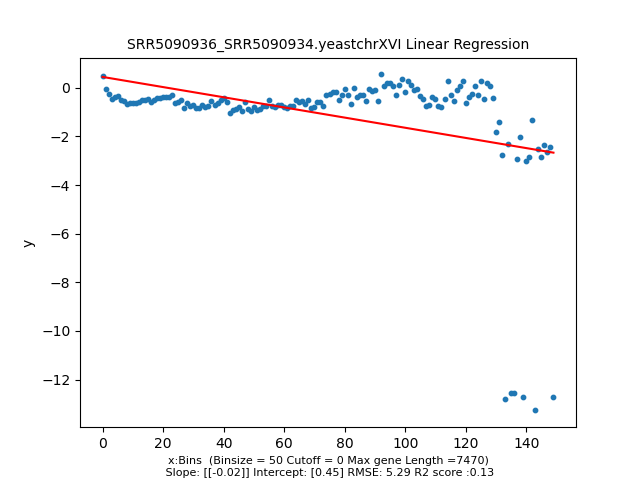

.. raw:: html
    

ChrXV
------------

Histogram of Genes' Length 
###############################

.. image:: SRR5090936_SRR5090934.yeastchrXV.Length.Histogram.png 
   :width: 400 

.. raw:: html
    

Log Linear Plots 
###################

Where cutoff is the minimum no. of genes to support a position to be considered in bins. Max gene length is the longest gene considered corresponding to this cutoff. 

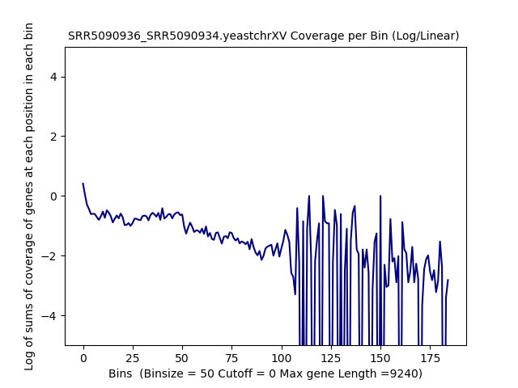

.. raw:: html
    

Log Log Plots 
###################

.. image:: SRR5090936_SRR5090934.yeastchrXV_50_0.LogLog.png 
   :width: 400

.. raw:: html
    

Linear Regression 
###################

.. image:: SRR5090936_SRR5090934.yeastchrXV_50_0.LR.png 
   :width: 400

.. raw:: html
    

