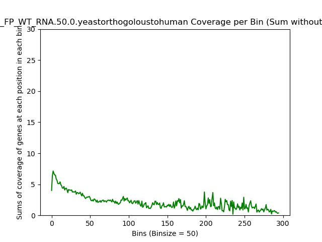
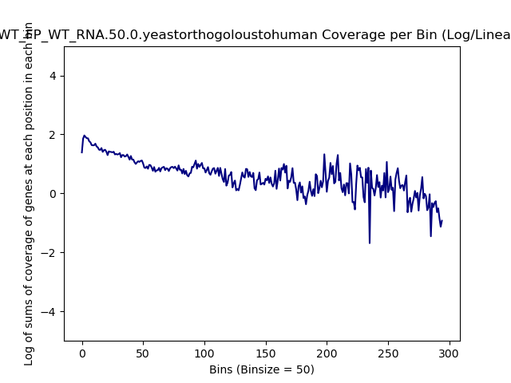
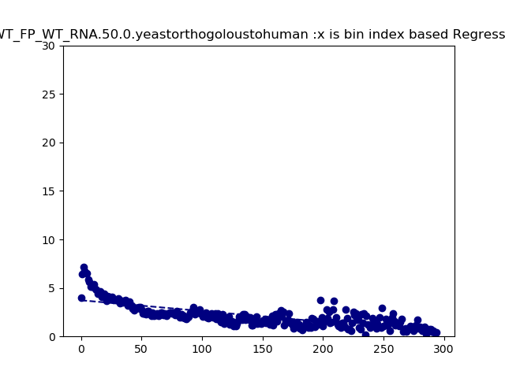
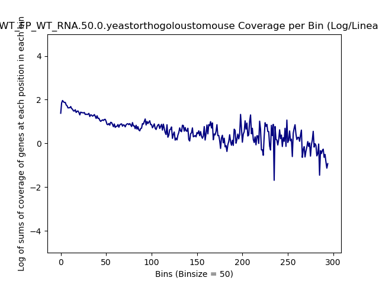
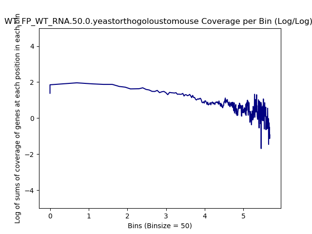
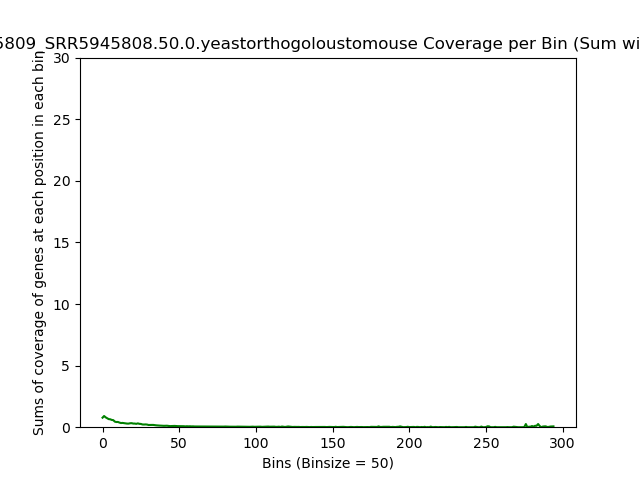
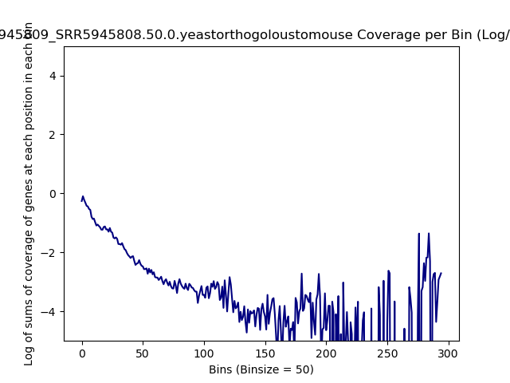
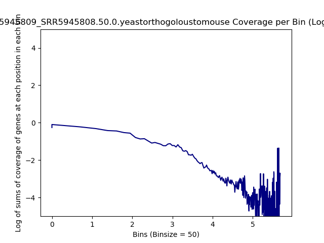
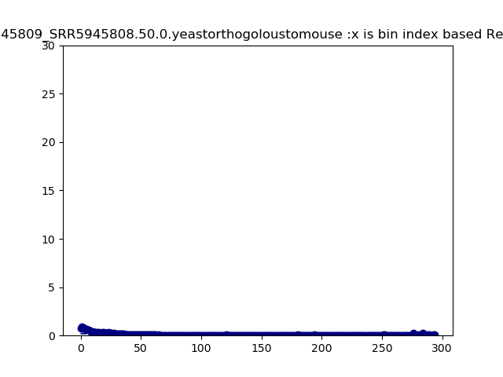

====================================================
**Orthogolous Plots**
====================================================

WT_FP over WT_RNA
######################

Human
--------

.. literalinclude:: WT_FP_WT_RNA.50.0.yeastorthogoloustohuman.summary.txt 

.. raw:: html 
    

.. raw:: html 
    

.. raw:: html 
    

.. raw:: html 
    

.. raw:: html 
    

Mouse
-------

.. literalinclude:: WT_FP_WT_RNA.50.0.yeastorthogoloustomouse.summary.txt

.. raw:: html
    

.. image:: WT_FP_WT_RNA.50.0.yeastorthogoloustomouse.NoLog.png
   :width: 400
   :alt:  WT_FP.WT_FP.50.0.nolog

.. raw:: html
    

.. raw:: html
    

.. raw:: html
    

.. raw:: html
    

SRR5945809 over SRR5945808
#############################

Human
--------

.. literalinclude:: SRR5945809_SRR5945808.50.0.yeastorthogoloustomouse.summary.txt 

.. raw:: html 
    

.. raw:: html 
    

.. raw:: html 
    

.. raw:: html 
    

.. raw:: html 
    

Mouse
-------

.. literalinclude:: WT_FP_WT_RNA.50.0.yeastorthogoloustomouse.summary.txt

.. raw:: html
    

.. image:: WT_FP_WT_RNA.50.0.yeastorthogoloustomouse.NoLog.png
   :width: 400
   :alt:  WT_FP.WT_FP.50.0.nolog

.. raw:: html
    

.. raw:: html
    

.. raw:: html
    

.. raw:: html
    

