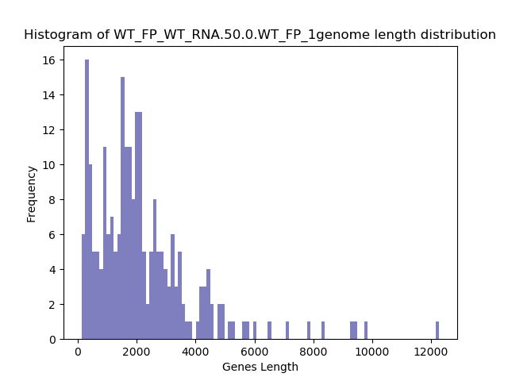
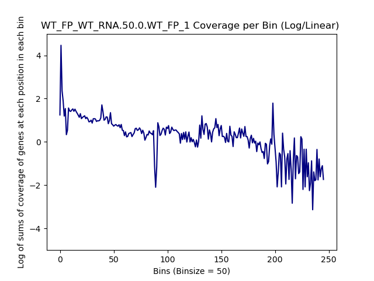
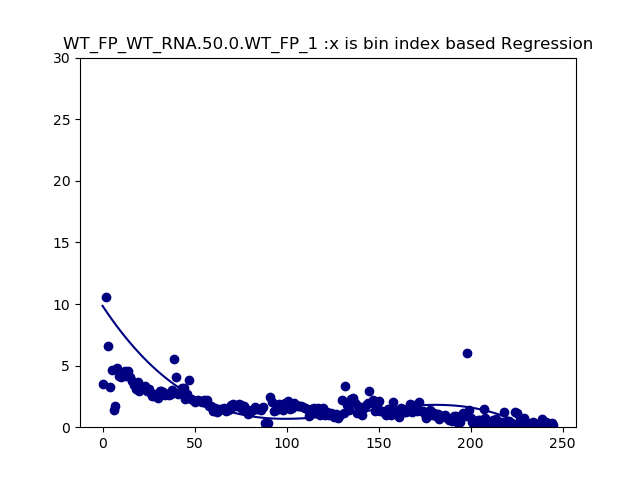
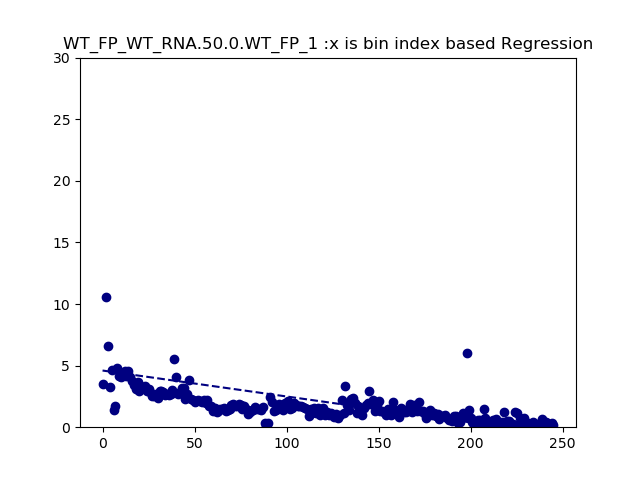

====================================================
**SNPs Plots**
====================================================

WT_FP / WT_RNA One or more SNPs 
-------------------------------------

.. raw:: html
    

.. image:: WT_FP_WT_RNA.50.0.WT_FP_1.NoLog.png
   :width: 400
   :alt:  WT_FP_WT_RNA.50.0.WT_FP_1.nolog
.. raw:: html
    

.. raw:: html
    

.. image:: WT_FP_WT_RNA.50.0.WT_FP_1.LogLog.png
   :width: 400
   :alt:  WT_FP_WT_RNA.50.0.WT_FP_1.loglog
.. raw:: html
    

.. raw:: html
    

.. raw:: html
    

