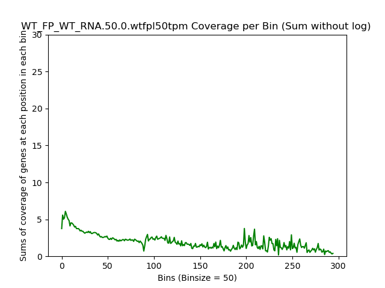
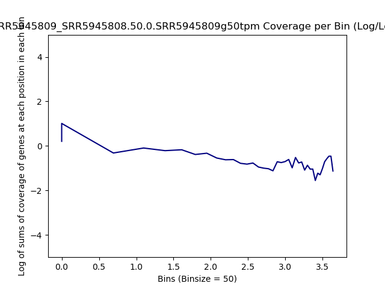

====================================================
**TPM  Plots**
====================================================

WT_FP over WT_RNA
#######################

WT_FP / WT_RNA TPM > 50
-------------------------------------

.. raw:: html
    

.. image:: WT_FP_WT_RNA.50.0.wtfpg50tpm.NoLog.png
   :width: 400
   :alt:  WT_FP_WT_RNA.50.0.wtfpg50tpm.nolog
.. raw:: html
    

.. image:: WT_FP_WT_RNA.50.0.wtfpg50tpm.LogLinear.png
   :width: 400
   :alt:  WT_FP_WT_RNA.50.0.wtfpg50tpm.loglinear
.. raw:: html
    

.. image:: WT_FP_WT_RNA.50.0.wtfpg50tpm.LogLog.png
   :width: 400
   :alt:  WT_FP_WT_RNA.50.0.wtfpg50tpm.loglog
.. raw:: html
    

.. raw:: html
    

.. raw:: html
    

WT_FP / WT_RNA TPM < 50
-------------------------------------

.. image:: WT_FP_WT_RNA.50.0.wtfpl50tpm.Length.Histogram.png
   :width: 400
   :alt:  WT_FP_WT_RNA.50.0.wtfpl50tpm.histogram
.. raw:: html
    

.. raw:: html
    

.. raw:: html
    

.. raw:: html
    

.. raw:: html
    

.. image:: WT_FP_WT_RNA.50.0.wtfpl50tpm.regression.png
   :width: 400
   :alt:  WT_FP_WT_RNA.50.0.wtfpl50tpm.regression
.. raw:: html
    

SRR5945809 over SRR5945808
#######################

SRR5945809 over SRR5945808 TPM > 50
---------------------------------------

.. raw:: html
    

.. raw:: html
    

.. raw:: html
    

.. raw:: html
    

.. raw:: html
    

.. raw:: html
    

SRR5945809 over SRR5945808 TPM < 50
-------------------------------------

.. raw:: html
    

.. raw:: html
    

.. raw:: html
    

.. raw:: html
    

.. raw:: html
    

.. raw:: html
    

