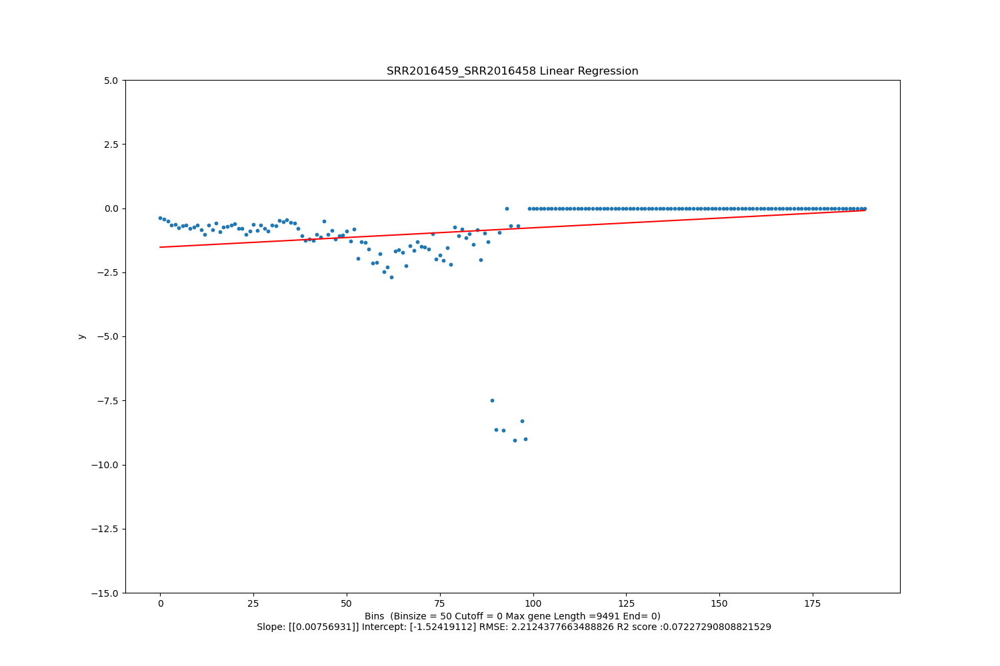
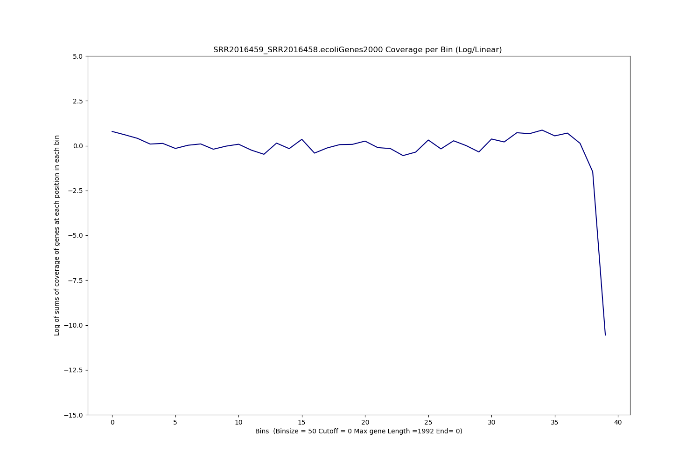
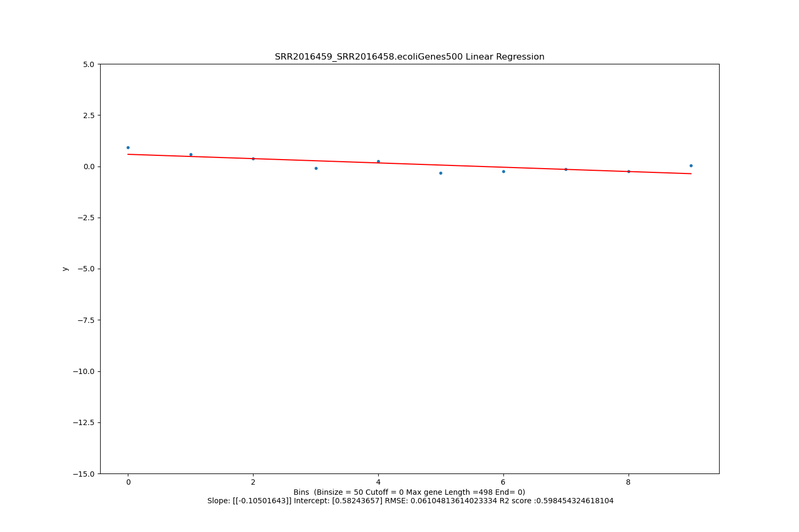

====================================================
**Ecoli 1:GSM1680887/GSM1680886**
====================================================

**Main** 
---------------

**SRR2016459/SRR2016458**

**Histogram of Genes' Length**

.. raw:: html
    

**Stats**

**Confirming adpaters from authors in progress**

+------------+------------+------------------+
| Sample     | mRNA/FP    | Unique Alignment |
+============+============+==================+
| SRR2016458 | mRNA       |                  |
+------------+------------+------------------+
| SRR2016459 | FP         |                  |
+------------+------------+------------------+

**Normal Plots** 

Log Linear Plots
###################

Log Log Plots
###################

Linear Regression Plots
###########################

.. raw:: html
    

**Running on a subset of short genes using --subset or -s** 

Log Linear Plots
###################

.. raw:: html
    

Log Log Plots
###################

.. raw:: html
    

Linear Regression Plots
##########################

.. raw:: html
    

**Filtering based on End --end or -e**

Here I use --end or -e as a cutoff for the last bin used in plotting, if e =0, all bins considered, if e = 10 then the last 10 bins are discarded in plottig. 
This is another way of discarding noise. 

Log Linear Plots
###################

.. raw:: html
    

Log Log Plots
###################

.. raw:: html
    

Linear Regression Plots
#########################

.. raw:: html
    

**Filtering based on cutoff --cutoff or -c** 

Where cutoff is the minimum no. of genes to support a position to be considered in bins. Max gene length is the longest gene considered corresponding to this cutoff.

Log Linear Plots 
###################

.. image:: SRR2016459_SRR2016458_50_500_0.LogLinear.png
   :width: 20%

.. raw:: html
    

Log Log Plots 
###################

.. raw:: html
    

Linear Regression 
###################

.. raw:: html
    

**TPM** 
-------------------------

**TPM > 50**

Histogram of Genes' Length 
###############################

.. image:: SRR2016459_SRR2016458.SRR2016458_g50.Length.Histogram.png 
   :width: 400 

.. raw:: html
    

Log Linear Plots 
###################

.. image:: SRR2016459_SRR2016458.SRR2016458_g50_50_0_0.LogLinear.png 
   :width: 400

.. raw:: html
    

Log Log Plots 
###################

.. image:: SRR2016459_SRR2016458.SRR2016458_g50_50_0_0.LogLog.png 
   :width: 400

.. raw:: html
    

Linear Regression 
###################

.. image:: SRR2016459_SRR2016458.SRR2016458_g50_50_0_0.LR.png 
   :width: 400

.. raw:: html
    

**TPM < 50**

Histogram of Genes' Length 
###############################

.. image:: SRR2016459_SRR2016458.SRR2016458_l50.Length.Histogram.png 
   :width: 400 

.. raw:: html
    

Log Linear Plots 
###################

.. image:: SRR2016459_SRR2016458.SRR2016458_l50_50_0_0.LogLinear.png 
   :width: 400

.. raw:: html
    

Log Log Plots 
###################

.. image:: SRR2016459_SRR2016458.SRR2016458_l50_50_0_0.LogLog.png 
   :width: 400

.. raw:: html
    

Linear Regression 
###################

.. image:: SRR2016459_SRR2016458.SRR2016458_l50_50_0_0.LR.png 
   :width: 400

.. raw:: html
    

**SNPs** 
-----------------------

**Genes with Zero SNPs**

Histogram of Genes' Length 
###############################

.. image:: SRR2016459_SRR2016458.SRR2016458_zerosnps.Length.Histogram.png 
   :width: 400 

.. raw:: html
    

Log Linear Plots 
###################

.. image:: SRR2016459_SRR2016458.SRR2016458_zerosnps_50_0_0.LogLinear.png 
   :width: 400

.. raw:: html
    

Log Log Plots 
###################

.. image:: SRR2016459_SRR2016458.SRR2016458_zerosnps_50_0_0.LogLog.png 
   :width: 400

.. raw:: html
    

Linear Regression 
###################

.. image:: SRR2016459_SRR2016458.SRR2016458_zerosnps_50_0_0.LR.png 
   :width: 400

.. raw:: html
    

**Genes with at least one SNP**

Histogram of Genes' Length 
###############################

.. image:: SRR2016459_SRR2016458.SRR2016458_1snps.Length.Histogram.png 
   :width: 400 

.. raw:: html
    

Log Linear Plots 
###################

.. image:: SRR2016459_SRR2016458.SRR2016458_1snps_50_0_0.LogLinear.png 
   :width: 400

.. raw:: html
    

Log Log Plots 
###################

.. image:: SRR2016459_SRR2016458.SRR2016458_1snps_50_0_0.LogLog.png 
   :width: 400

.. raw:: html
    

Linear Regression 
###################

.. image:: SRR2016459_SRR2016458.SRR2016458_1snps_50_0_0.LR.png 
   :width: 400

.. raw:: html
    

**GO** 
-----------------------

GO0006119
*************

**Oxidative phosphorylation Gene Ontology Term**

Histogram of Genes' Length 
###############################

.. image:: SRR2016459_SRR2016458.GO_0006119.Length.Histogram.png 
   :width: 400 

.. raw:: html
    

Log Linear Plots 
###################

.. image:: SRR2016459_SRR2016458.GO_0006119_50_0_0.LogLinear.png 
   :width: 400

.. raw:: html
    

Log Log Plots 
###################

.. image:: SRR2016459_SRR2016458.GO_0006119_50_0_0.LogLog.png 
   :width: 400

.. raw:: html
    

Linear Regression 
###################

.. image:: SRR2016459_SRR2016458.GO_0006119_50_0_0.LR.png 
   :width: 400

.. raw:: html
    

GO0006406
************* 
**mRNA export from nucleus** 

Histogram of Genes' Length 
###############################

.. image:: SRR2016459_SRR2016458.GO_0006406.Length.Histogram.png 
   :width: 400 

.. raw:: html
    

Log Linear Plots 
###################

.. image:: SRR2016459_SRR2016458.GO_0006406_50_0_0.LogLinear.png 
   :width: 400

.. raw:: html
    

Log Log Plots 
###################

.. image:: SRR2016459_SRR2016458.GO_0006406_50_0_0.LogLog.png 
   :width: 400

.. raw:: html
    

Linear Regression 
###################

.. image:: SRR2016459_SRR2016458.GO_0006406_50_0_0.LR.png 
   :width: 400

.. raw:: html
    

GO0006412
*************

**Translation** 

Histogram of Genes' Length 
###############################

.. image:: SRR2016459_SRR2016458.GO_0006412.Length.Histogram.png 
   :width: 400 

.. raw:: html
    

Log Linear Plots 
###################

.. image:: SRR2016459_SRR2016458.GO_0006412_50_0_0.LogLinear.png 
   :width: 400

.. raw:: html
    

Log Log Plots 
###################

.. image:: SRR2016459_SRR2016458.GO_0006412_50_0_0.LogLog.png 
   :width: 400

.. raw:: html
    

Linear Regression 
###################

.. image:: SRR2016459_SRR2016458.GO_0006412_50_0_0.LR.png 
   :width: 400

.. raw:: html
    

GO0006950
*************

**Response to stress** 

Histogram of Genes' Length 
###############################

.. image:: SRR2016459_SRR2016458.GO_0006950.Length.Histogram.png 
   :width: 400 

.. raw:: html
    

Log Linear Plots 
###################

.. image:: SRR2016459_SRR2016458.GO_0006950_50_0_0.LogLinear.png 
   :width: 400

.. raw:: html
    

Log Log Plots 
###################

.. image:: SRR2016459_SRR2016458.GO_0006950_50_0_0.LogLog.png 
   :width: 400

.. raw:: html
    

Linear Regression 
###################

.. image:: SRR2016459_SRR2016458.GO_0006950_50_0_0.LR.png 
   :width: 400

.. raw:: html
    

GO0009651
*************

**Response to salt stress**

Histogram of Genes' Length 
###############################

.. image:: SRR2016459_SRR2016458.GO_0009651.Length.Histogram.png 
   :width: 400 

.. raw:: html
    

Log Linear Plots 
###################

.. image:: SRR2016459_SRR2016458.GO_0009651_50_0_0.LogLinear.png 
   :width: 400

.. raw:: html
    

Log Log Plots 
###################

.. image:: SRR2016459_SRR2016458.GO_0009651_50_0_0.LogLog.png 
   :width: 400

.. raw:: html
    

Linear Regression 
###################

.. image:: SRR2016459_SRR2016458.GO_0009651_50_0_0.LR.png 
   :width: 400

.. raw:: html
    

GO0016458
*************

**Gene silencing**

Histogram of Genes' Length 
###############################

.. image:: SRR2016459_SRR2016458.GO_0016458.Length.Histogram.png 
   :width: 400 

.. raw:: html
    

Log Linear Plots 
###################

.. image:: SRR2016459_SRR2016458.GO_0016458_50_0_0.LogLinear.png 
   :width: 400

.. raw:: html
    

Log Log Plots 
###################

.. image:: SRR2016459_SRR2016458.GO_0016458_50_0_0.LogLog.png 
   :width: 400

.. raw:: html
    

Linear Regression 
###################

.. image:: SRR2016459_SRR2016458.GO_0016458_50_0_0.LR.png 
   :width: 400

.. raw:: html
    

GO0031047
*************

**Gene silencing by RNA**

Histogram of Genes' Length 
###############################

.. image:: SRR2016459_SRR2016458.GO_0031047.Length.Histogram.png 
   :width: 400 

.. raw:: html
    

Log Linear Plots 
###################

.. image:: SRR2016459_SRR2016458.GO_0031047_50_0_0.LogLinear.png 
   :width: 400

.. raw:: html
    

Log Log Plots 
###################

.. image:: SRR2016459_SRR2016458.GO_0031047_50_0_0.LogLog.png 
   :width: 400

.. raw:: html
    

Linear Regression 
###################

.. image:: SRR2016459_SRR2016458.GO_0031047_50_0_0.LR.png 
   :width: 400

.. raw:: html
    

GO0031990
************

**Cellular Response to heat** 

Histogram of Genes' Length 
###############################

.. image:: SRR2016459_SRR2016458.GO_0031990.Length.Histogram.png 
   :width: 400 

.. raw:: html
    

Log Linear Plots 
###################

.. image:: SRR2016459_SRR2016458.GO_0031990_50_0_0.LogLinear.png 
   :width: 400

.. raw:: html
    

Log Log Plots 
###################

.. image:: SRR2016459_SRR2016458.GO_0031990_50_0_0.LogLog.png 
   :width: 400

.. raw:: html
    

Linear Regression 
###################

.. image:: SRR2016459_SRR2016458.GO_0031990_50_0_0.LR.png 
   :width: 400

.. raw:: html
    

GO0042254
*************

**Ribosome biogenesis**

Histogram of Genes' Length 
###############################

.. image:: SRR2016459_SRR2016458.GO_0042254.Length.Histogram.png 
   :width: 400 

.. raw:: html
    

Log Linear Plots 
###################

.. image:: SRR2016459_SRR2016458.GO_0042254_50_0_0.LogLinear.png 
   :width: 400

.. raw:: html
    

Log Log Plots 
###################

.. image:: SRR2016459_SRR2016458.GO_0042254_50_0_0.LogLog.png 
   :width: 400

.. raw:: html
    

Linear Regression 
###################

.. image:: SRR2016459_SRR2016458.GO_0042254_50_0_0.LR.png 
   :width: 400

.. raw:: html
    

**Orthologous** 
-----------------------------

**Human**

Histogram of Genes' Length 
###############################

.. image:: SRR2016459_SRR2016458.ecoliorthuman.Length.Histogram.png 
   :width: 400 

.. raw:: html
    

Log Linear Plots 
###################

.. image:: SRR2016459_SRR2016458.ecoliorthuman_50_0_0.LogLinear.png 
   :width: 400

.. raw:: html
    

Log Log Plots 
###################

.. image:: SRR2016459_SRR2016458.ecoliorthuman_50_0_0.LogLog.png 
   :width: 400

.. raw:: html
    

Linear Regression 
###################

.. image:: SRR2016459_SRR2016458.ecoliorthuman_50_0_0.LR.png 
   :width: 400

.. raw:: html
    

**Mouse**

Histogram of Genes' Length 
###############################

.. image:: SRR2016459_SRR2016458.ecoliortmouse.Length.Histogram.png 
   :width: 400 

.. raw:: html
    

Log Linear Plots 
###################

.. image:: SRR2016459_SRR2016458.ecoliortmouse_50_0_0.LogLinear.png 
   :width: 400

.. raw:: html
    

Log Log Plots 
###################

.. image:: SRR2016459_SRR2016458.ecoliortmouse_50_0_0.LogLog.png 
   :width: 400

.. raw:: html
    

Linear Regression 
###################

.. image:: SRR2016459_SRR2016458.ecoliortmouse_50_0_0.LR.png 
   :width: 400

.. raw:: html
    

**Chromosomes** 
----------------------------

ChrI

Histogram of Genes' Length 
###############################

.. image:: SRR2016459_SRR2016458.ecolichrI.Length.Histogram.png 
   :width: 400 

.. raw:: html
    

Log Linear Plots 
###################

.. image:: SRR2016459_SRR2016458.ecolichrI_50_0_0.LogLinear.png 
   :width: 400

.. raw:: html
    

Log Log Plots 
###################

.. image:: SRR2016459_SRR2016458.ecolichrI_50_0_0.LogLog.png 
   :width: 400

.. raw:: html
    

Linear Regression 
###################

.. image:: SRR2016459_SRR2016458.ecolichrI_50_0_0.LR.png 
   :width: 400

.. raw:: html
    

ChrII

Histogram of Genes' Length 
###############################

.. image:: SRR2016459_SRR2016458.ecolichrII.Length.Histogram.png 
   :width: 400 

.. raw:: html
    

Log Linear Plots 
###################

.. image:: SRR2016459_SRR2016458.ecolichrII_50_0_0.LogLinear.png 
   :width: 400

.. raw:: html
    

Log Log Plots 
###################

.. image:: SRR2016459_SRR2016458.ecolichrII_50_0_0.LogLog.png 
   :width: 400

.. raw:: html
    

Linear Regression 
###################

.. image:: SRR2016459_SRR2016458.ecolichrII_50_0_0.LR.png 
   :width: 400

.. raw:: html
    

ChrIII

Histogram of Genes' Length 
###############################

.. image:: SRR2016459_SRR2016458.ecolichrIII.Length.Histogram.png 
   :width: 400 

.. raw:: html
    

Log Linear Plots 
###################

.. image:: SRR2016459_SRR2016458.ecolichrIII_50_0_0.LogLinear.png 
   :width: 400

.. raw:: html
    

Log Log Plots 
###################

.. image:: SRR2016459_SRR2016458.ecolichrIII_50_0_0.LogLog.png 
   :width: 400

.. raw:: html
    

Linear Regression 
###################

.. image:: SRR2016459_SRR2016458.ecolichrIII_50_0_0.LR.png 
   :width: 400

.. raw:: html
    

ChrIV

Histogram of Genes' Length 
###############################

.. image:: SRR2016459_SRR2016458.ecolichrIV.Length.Histogram.png 
   :width: 400 

.. raw:: html
    

Log Linear Plots 
###################

.. image:: SRR2016459_SRR2016458.ecolichrIV_50_0_0.LogLinear.png 
   :width: 400

.. raw:: html
    

Log Log Plots 
###################

.. image:: SRR2016459_SRR2016458.ecolichrIV_50_0_0.LogLog.png 
   :width: 400

.. raw:: html
    

Linear Regression 
###################

.. image:: SRR2016459_SRR2016458.ecolichrIV_50_0_0.LR.png 
   :width: 400

.. raw:: html
    

ChrIX

Histogram of Genes' Length 
###############################

.. image:: SRR2016459_SRR2016458.ecolichrIX.Length.Histogram.png 
   :width: 400 

.. raw:: html
    

Log Linear Plots 
###################

.. image:: SRR2016459_SRR2016458.ecolichrIX_50_0_0.LogLinear.png 
   :width: 400

.. raw:: html
    

Log Log Plots 
###################

.. image:: SRR2016459_SRR2016458.ecolichrIX_50_0_0.LogLog.png 
   :width: 400

.. raw:: html
    

Linear Regression 
###################

.. image:: SRR2016459_SRR2016458.ecolichrIX_50_0_0.LR.png 
   :width: 400

.. raw:: html
    

ChrVIII

Histogram of Genes' Length 
###############################

.. image:: SRR2016459_SRR2016458.ecolichrVIII.Length.Histogram.png 
   :width: 400 

.. raw:: html
    

Log Linear Plots 
###################

.. image:: SRR2016459_SRR2016458.ecolichrVIII_50_0_0.LogLinear.png 
   :width: 400

.. raw:: html
    

Log Log Plots 
###################

.. image:: SRR2016459_SRR2016458.ecolichrVIII_50_0_0.LogLog.png 
   :width: 400

.. raw:: html
    

Linear Regression 
###################

.. image:: SRR2016459_SRR2016458.ecolichrVIII_50_0_0.LR.png 
   :width: 400

.. raw:: html
    

ChrVII

Histogram of Genes' Length 
###############################

.. image:: SRR2016459_SRR2016458.ecolichrVII.Length.Histogram.png 
   :width: 400 

.. raw:: html
    

Log Linear Plots 
###################

.. image:: SRR2016459_SRR2016458.ecolichrVII_50_0_0.LogLinear.png 
   :width: 400

.. raw:: html
    

Log Log Plots 
###################

.. image:: SRR2016459_SRR2016458.ecolichrVII_50_0_0.LogLog.png 
   :width: 400

.. raw:: html
    

Linear Regression 
###################

.. image:: SRR2016459_SRR2016458.ecolichrVII_50_0_0.LR.png 
   :width: 400

.. raw:: html
    

ChrVI

Histogram of Genes' Length 
###############################

.. image:: SRR2016459_SRR2016458.ecolichrVI.Length.Histogram.png 
   :width: 400 

.. raw:: html
    

Log Linear Plots 
###################

.. image:: SRR2016459_SRR2016458.ecolichrVI_50_0_0.LogLinear.png 
   :width: 400

.. raw:: html
    

Log Log Plots 
###################

.. image:: SRR2016459_SRR2016458.ecolichrVI_50_0_0.LogLog.png 
   :width: 400

.. raw:: html
    

Linear Regression 
###################

.. image:: SRR2016459_SRR2016458.ecolichrVI_50_0_0.LR.png 
   :width: 400

.. raw:: html
    

ChrV

Histogram of Genes' Length 
###############################

.. image:: SRR2016459_SRR2016458.ecolichrV.Length.Histogram.png 
   :width: 400 

.. raw:: html
    

Log Linear Plots 
###################

.. image:: SRR2016459_SRR2016458.ecolichrV_50_0_0.LogLinear.png 
   :width: 400

.. raw:: html
    

Log Log Plots 
###################

.. image:: SRR2016459_SRR2016458.ecolichrV_50_0_0.LogLog.png 
   :width: 400

.. raw:: html
    

Linear Regression 
###################

.. image:: SRR2016459_SRR2016458.ecolichrV_50_0_0.LR.png 
   :width: 400

.. raw:: html
    

ChrXIII

Histogram of Genes' Length 
###############################

.. image:: SRR2016459_SRR2016458.ecolichrXIII.Length.Histogram.png 
   :width: 400 

.. raw:: html
    

Log Linear Plots 
###################

.. image:: SRR2016459_SRR2016458.ecolichrXIII_50_0_0.LogLinear.png 
   :width: 400

.. raw:: html
    

Log Log Plots 
###################

.. image:: SRR2016459_SRR2016458.ecolichrXIII_50_0_0.LogLog.png 
   :width: 400

.. raw:: html
    

Linear Regression 
###################

.. image:: SRR2016459_SRR2016458.ecolichrXIII_50_0_0.LR.png 
   :width: 400

.. raw:: html
    

ChrXII

Histogram of Genes' Length 
###############################

.. image:: SRR2016459_SRR2016458.ecolichrXII.Length.Histogram.png 
   :width: 400 

.. raw:: html
    

Log Linear Plots 
###################

.. image:: SRR2016459_SRR2016458.ecolichrXII_50_0_0.LogLinear.png 
   :width: 400

.. raw:: html
    

Log Log Plots 
###################

.. image:: SRR2016459_SRR2016458.ecolichrXII_50_0_0.LogLog.png 
   :width: 400

.. raw:: html
    

Linear Regression 
###################

.. image:: SRR2016459_SRR2016458.ecolichrXII_50_0_0.LR.png 
   :width: 400

.. raw:: html
    

ChrXI

Histogram of Genes' Length 
###############################

.. image:: SRR2016459_SRR2016458.ecolichrXI.Length.Histogram.png 
   :width: 400 

.. raw:: html
    

Log Linear Plots 
###################

.. image:: SRR2016459_SRR2016458.ecolichrXI_50_0_0.LogLinear.png 
   :width: 400

.. raw:: html
    

Log Log Plots 
###################

.. image:: SRR2016459_SRR2016458.ecolichrXI_50_0_0.LogLog.png 
   :width: 400

.. raw:: html
    

Linear Regression 
###################

.. image:: SRR2016459_SRR2016458.ecolichrXI_50_0_0.LR.png 
   :width: 400

.. raw:: html
    

ChrXIV

Histogram of Genes' Length 
###############################

.. image:: SRR2016459_SRR2016458.ecolichrXIV.Length.Histogram.png 
   :width: 400 

.. raw:: html
    

Log Linear Plots 
###################

.. image:: SRR2016459_SRR2016458.ecolichrXIV_50_0_0.LogLinear.png 
   :width: 400

.. raw:: html
    

Log Log Plots 
###################

.. image:: SRR2016459_SRR2016458.ecolichrXIV_50_0_0.LogLog.png 
   :width: 400

.. raw:: html
    

Linear Regression 
###################

.. image:: SRR2016459_SRR2016458.ecolichrXIV_50_0_0.LR.png 
   :width: 400

.. raw:: html
    

ChrX

Histogram of Genes' Length 
###############################

.. image:: SRR2016459_SRR2016458.ecolichrX.Length.Histogram.png 
   :width: 400 

.. raw:: html
    

Log Linear Plots 
###################

.. image:: SRR2016459_SRR2016458.ecolichrX_50_0_0.LogLinear.png 
   :width: 400

.. raw:: html
    

Log Log Plots 
###################

.. image:: SRR2016459_SRR2016458.ecolichrX_50_0_0.LogLog.png 
   :width: 400

.. raw:: html
    

Linear Regression 
###################

.. image:: SRR2016459_SRR2016458.ecolichrX_50_0_0.LR.png 
   :width: 400

.. raw:: html
    

ChrXVI

Histogram of Genes' Length 
###############################

.. image:: SRR2016459_SRR2016458.ecolichrXVI.Length.Histogram.png 
   :width: 400 

.. raw:: html
    

Log Linear Plots 
###################

.. image:: SRR2016459_SRR2016458.ecolichrXVI_50_0_0.LogLinear.png 
   :width: 400

.. raw:: html
    

Log Log Plots 
###################

.. image:: SRR2016459_SRR2016458.ecolichrXVI_50_0_0.LogLog.png 
   :width: 400

.. raw:: html
    

Linear Regression 
###################

.. image:: SRR2016459_SRR2016458.ecolichrXVI_50_0_0.LR.png 
   :width: 400

.. raw:: html
    

ChrXV

Histogram of Genes' Length 
###############################

.. image:: SRR2016459_SRR2016458.ecolichrXV.Length.Histogram.png 
   :width: 400 

.. raw:: html
    

Log Linear Plots 
###################

.. image:: SRR2016459_SRR2016458.ecolichrXV_50_0_0.LogLinear.png 
   :width: 400

.. raw:: html
    

Log Log Plots 
###################

.. image:: SRR2016459_SRR2016458.ecolichrXV_50_0_0.LogLog.png 
   :width: 400

.. raw:: html
    

Linear Regression 
###################

.. image:: SRR2016459_SRR2016458.ecolichrXV_50_0_0.LR.png 
   :width: 400

.. raw:: html
    

