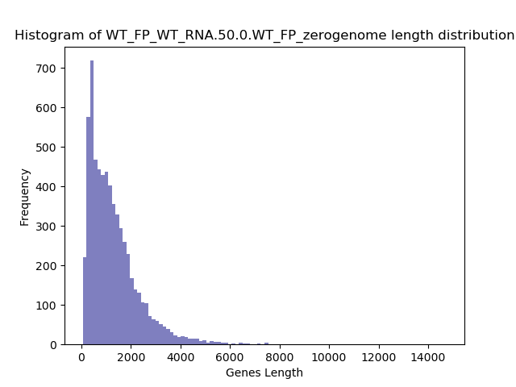
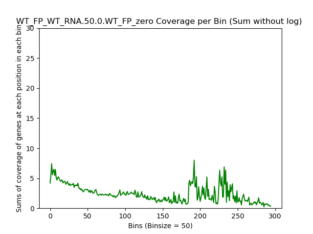
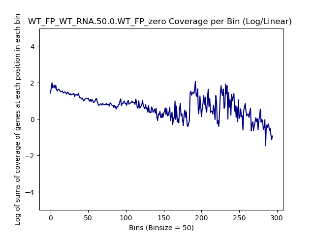
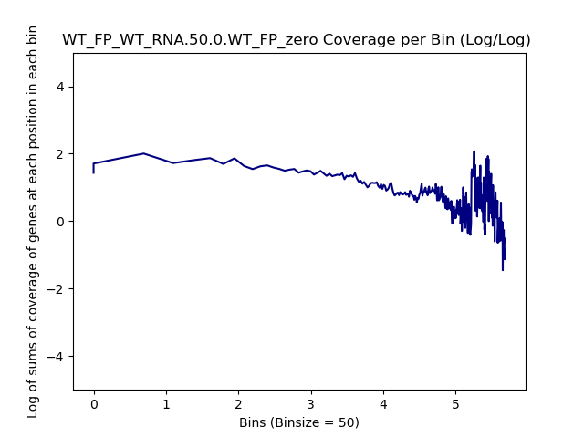
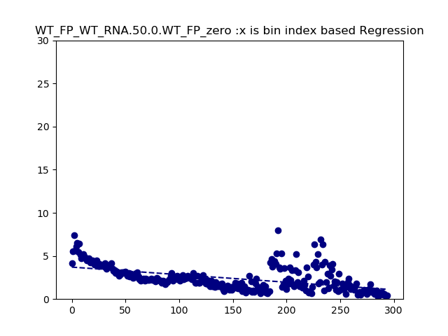

====================================================
**Zero SNPs Plots**
====================================================

WT_FP / WT_RNA Zero SNPs 
-------------------------------------

.. raw:: html
    

.. raw:: html
    

.. raw:: html
    

.. raw:: html
    

.. raw:: html
    

.. raw:: html
    

